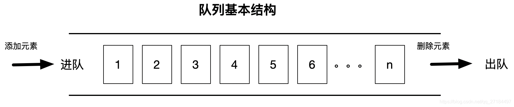

什么是队列？

​      队列是一种特殊的线性表，遵循先入先出、后入后出（FIFO：First In First Out）的基本原则，一般来说，它只允许在表的前端进行删除操作，而在表的后端进行插入操作，但是 java 的某些队列运行在任何地方插入删除；比如我们常用的 `LinkedList `集合，它实现了`Queue `接口，因此，我们可以理解为 `LinkedList `就是一个队列。



在Java的标准库中，队列接口Queue定义了以下几个方法：

- `int size()`：获取队列长度；
- `boolean add(E)/boolean offer(E)`：添加元素到队尾；
- `E remove()/E poll()`：获取队首元素并从队列中删除；
- `E element()/E peek()`：获取队首元素但并不从队列中删除。


对于具体的实现类，有的`Queue`有最大队列长度限制，有的`Queue`没有。注意到添加、删除和获取队列元素总是有两个方法，这是因为在添加或获取元素失败时，这两个方法的行为是不同的。我们用一个表格总结如下：

|                    | throw Exception | 返回false或null    |
| ------------------ | --------------- | ------------------ |
| 添加元素到队尾     | add(E e)        | boolean offer(E e) |
| 取队首元素并删除   | E remove()      | E poll()           |
| 取队首元素但不删除 | E element()     | E peek()           |

注意：不要把`null`添加到队列中，否则`poll()`方法返回`null`时，很难确定是取到了`null`元素还是队列为空。


```java
package com.hanliukui.collection;

import java.util.LinkedList;
import java.util.Queue;

/**
 * @Author hanliukui
 * @Date 2022/5/7 15:32
 * @Description xxx
 */
public class QueueTest {

    public static void main(String[] args) {
        Queue<String> queue = new LinkedList<>();

        System.out.println("添加元素到队尾...");
        // 添加元素到队尾
        queue.add("aaa");
        queue.add("bbb");
        queue.add("ccc");

        // 添加元素到队尾
        queue.offer("ddd");
        queue.offer("eee");
        queue.offer("fff");

        System.out.println("遍历打印...");
        for (String s : queue) {
            System.out.println(s);
        }

        System.out.println("获取队头元素(不删除)...");
        System.out.println(queue.element());
        System.out.println(queue.peek());

        System.out.println("遍历打印...");
        for (String s : queue) {
            System.out.println(s);
        }

        System.out.println("获取队头元素(删除)...");
        System.out.println(queue.remove());
        System.out.println(queue.poll());

        System.out.println("遍历打印...");
        for (String s : queue) {
            System.out.println(s);
        }

    }
}
添加元素到队尾...
遍历打印...
aaa
bbb
ccc
ddd
eee
fff
获取队头元素(不删除)...
aaa
aaa
遍历打印...
aaa
bbb
ccc
ddd
eee
fff
获取队头元素(删除)...
aaa
bbb
遍历打印...
ccc
ddd
eee
fff
```