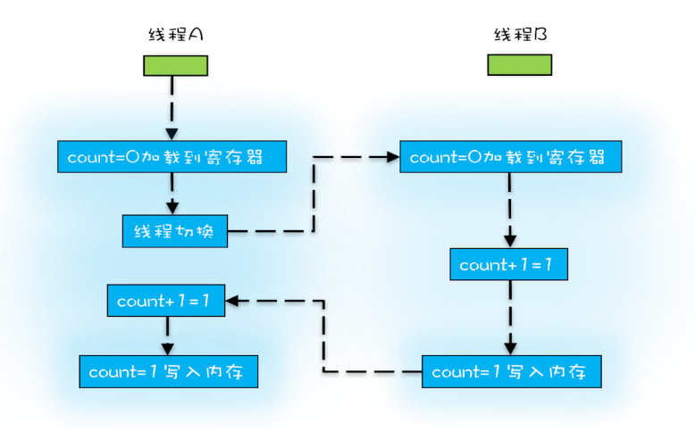
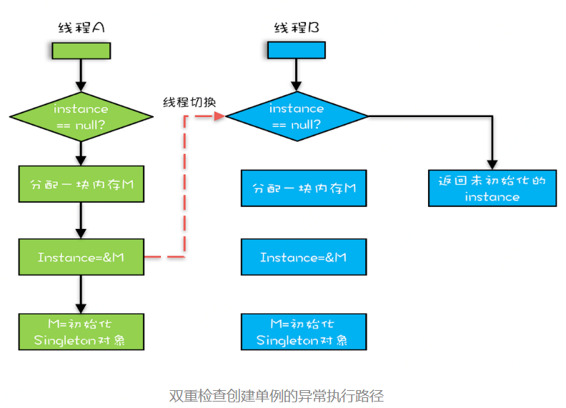

# 可见行、原子性和有序性问题

## 并发背后的故事

程序大部分时间都要访问内存，有些还要访问I/O，根据木桶理论（一直水桶能装多少水取决于它最短的那块木板），程序整体的性能取决于最慢的操作——读写I/O设备，也就是说单方面提高CPU性能是无效的


为了合理的利用CPU的高性能，平衡这三者的速度差异，计算机体系、操作系统、编译程序都作出了贡献，具体体现为：

1. CPU 增加了缓存，以均衡与内存的速度差异
2. 操作系统增加了进程、线程，以分时复用CPU，进而均衡CPU与I/O设备的速度差异
3. 编译程序优化指令执行次序，使得缓存能够得到更加合理地利用

但是，天下没有免费的午餐，并发程序很多诡异问题的根源也在这里


## 源头一：缓存导致的可见性问题

在CPU单核时代，所有的线程都在同一颗CPU上执行，CPU缓存与内存的数据一致性问题容易解决，因为所有的线程都在操作同一个CPU的缓存，一个线程对缓存的写，对另外一个线程来说一定是可见的。

在CPU多核时代，每颗CPU都有自己的缓存，当多个线程在不同的CPU执行时，这些线程操作的是不同的CPU缓存。


## 源头二：线程切换带来的原子性问题


高级编程语言里的一条语句往往需要多条CPU指令完成，例如count +=1，至少需要三条CPU指令。

指令1：首先，需要把变量count从内存加载到CPU的寄存器

指令2：之后，在寄存器上执行+1操作

指令3：最后，将结果写入内存（缓存机制导致可能写入的是CPU缓存而不是内存）

操作系统做线程切换，可以发生在任何一条CPU指令执行完，对于上面的三条指令来说，我们假设 count=0，如果线程A在指令1执行完成后座线程切换，线程A和线程B按照下图的序列进行执行，那么我们会发现两个线程都执行了count+=1 的操作，但是得到结果不是我们想要的2，而是1



CPU能保证的是CPU指令级别的，而不是高级语言的操作符


## 源头三：编译优化带来的有序性问题

在Java领域一个经典的案例是利用双重检查创建单例对象，例如下面的代码，在获取示例 `getInstance()` 的方法中，我们首先判断 instance 是否为 null，如果为null，则 锁定 `Singleton.class` 并再次检查 instance 是否为null，如果还为 null 则创建 Singleton 的一个实例：

```java
public class Singleton{
    static Singleton instance;
    static Singleton getInstance(){
        if(instance==null){
            synchronized(Singleton.class){
                if(instance==null){
                    instance = new Singleton();
                }
            }
        }
        return instance;
    }
} 
```

我们认为的new操作是：

1. 分配一块内存M
2. 在内存M上初始化Singleton对象
3. 然后将M地址赋值给instance变量


但是实际上通过编译优化后的执行路径却是：

1. 分配一块内存M
2. 将M地址赋值给instance变量
3. 最后在内存M上初始化Singleton对象


优化后会导致什么问题呢？我们假设线程A先执行`getInstance()`方法，当执行完指令2时恰好发生列线程切换，切换到了线程B上;

如果此时线程B在执行第一个判断时会发现 `instance==null` 为 false，所以直接返回 instance，而此时的 instance 是没有初始化的，如果我们这个时候访问 instance 的成员变量就可能触发空指针异常。

