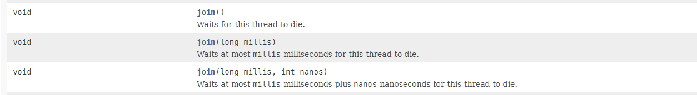

关于join官方的解释是 Waits for this thread to die. 也就是等待一个线程结束。可以通过对另一个线程对象调用join()方法可以等待其执行结束，然后才继续往下执行自身线程。


## join场景


```java
public class Main {

    public static void main(String[] args) {

        Thread t1 = new Thread(() -> {
            for (int i = 0; i < 100; i++) {
                System.out.println(Thread.currentThread().getName()+"线程执行..."+i);
            }
        },"T1");

        t1.start();

        for (int i = 0; i < 100; i++) {
            System.out.println(Thread.currentThread().getName()+"线程执行..."+i);
        }

    }
}
```


```plain
...
T1线程执行...81
T1线程执行...82
main线程执行...50
T1线程执行...83
T1线程执行...84
main线程执行...51
main线程执行...52
T1线程执行...85
T1线程执行...86
main线程执行...53
main线程执行...54
T1线程执行...87
...
```


可以看到正常两个线程是交替执行的。如果我们想线程t1执行完再执行main线程呢，这里就需要使用join了：


```java
public class Main {

    public static void main(String[] args) {

        Thread t1 = new Thread(() -> {
            for (int i = 0; i < 100; i++) {
                System.out.println(Thread.currentThread().getName()+"线程执行..."+i);
            }
        },"T1");

        t1.start();

        // 调用t1的join方法，当前线程等待，等待t1线程执行后再执行当前线程
        try {
            t1.join();
        } catch (InterruptedException e) {
            e.printStackTrace();
        }

        for (int i = 0; i < 100; i++) {
            System.out.println(Thread.currentThread().getName()+"线程执行..."+i);
        }

    }
}
```


执行效果：


```plain
....
T1线程执行...90
T1线程执行...91
T1线程执行...92
T1线程执行...93
T1线程执行...94
T1线程执行...95
T1线程执行...96
T1线程执行...97
T1线程执行...98
T1线程执行...99
main线程执行...0
main线程执行...1
main线程执行...2
main线程执行...3
main线程执行...4
main线程执行...5
main线程执行...6
....
```


此时子线程T1执行完之后才执行main线程。


## Join方法


join方法还支持几个参数：





## join的使用实例


现在有T1、T2、T3三个线程，你怎样保证T2在T1执行完之后执行，T3在T2执行完后执行？
使用join是最简单的方案，实现的代码如下：


```java
/**
 * @author wcc
 * @date 2021/8/21 20:46
 * 现在有T1、T2、T3三个线程，你怎样保证T2在T1执行完后执行，T3在T2执行完后执行？
 */
public class JoinDemo {

    public static void main(String[] args) {

        Thread t1=new Thread(new Runnable() {
            @Override
            public void run() {
                System.out.println("t1 is running...");
            }
        });

        //初始化线程二
        Thread t2=new Thread(new Runnable() {
            @Override
            public void run() {
                try {
                    // 调用t1的join,意味着再t1执行后，才执行此线程
                    t1.join();
                } catch (InterruptedException e) {
                    e.printStackTrace();
                }finally {
                    System.out.println("t2 is running...");
                }
            }
        });

        //初始化线程三
        Thread t3=new Thread(new Runnable() {
            @Override
            public void run() {
                try {
                    // 调用t2的join,意味着再t1执行后，才执行此线程
                    t2.join();
                } catch (InterruptedException e) {
                    e.printStackTrace();
                }finally {
                    System.out.println("t3 is running...");
                }
            }
        });

        t1.start();
        t2.start();
        t3.start();
    }

}
```


执行结果：


```plain
t1 is running...
t2 is running...
t3 is running...
```


在**t2**线程中**t2**本身就是**调用线程**，所谓的调用线程是指调用了**t.join()方法**的线程，而**被调用的对象**指的是调用join方法的线程对象，即**t1。\******所以这三个线程按照\******t1 -> t2 -> t3**的顺序执行了。


## join原理


```java
	/**
     * 等待该线程终止的时间最长为millis毫秒，超时时间为0意味着要一直等下去
     * @param millis 以毫秒为单位的等待时间
     * @throws InterruptedException
     */
    public final synchronized void join(long millis)
    throws InterruptedException {
        //获取启动的时间戳，用于计算当前时间
        long base = System.currentTimeMillis();
        //当前时间
        long now = 0;

        if (millis < 0) { //等待时间不能小于0 否则抛出IllegalArgumentException异常终止程序
            throw new IllegalArgumentException("timeout value is negative");
        }

		//判断是否携带阻塞的超时时间，等于0则表示没有设置超时时间
        //如果超时时间为0 则意味着一直要等待该线程执行完（无限等待）
        if (millis == 0) {
            //需要注意的是，如果当前线程未被启动或者已经终止，则isAlive方法返回false
            //即意味着join方法不会生效
            while (isAlive()) {
                //isAlive()方法：判断当前线程是否处于活动状态
                //活动状态就是线程已经启动并且尚未终止
                wait(0);
            }
        } else { //设置了超时时间
            //需要注意的是，如果当前线程未被启动或者已经终止，则isAlive方法返回false
            //即意味着join方法不会生效
            while (isAlive()) {，
                //计算剩余时间
                long delay = millis - now;
                if (delay <= 0) { //如果剩余等待的时间小于等于0，则终止等待
                    break;
                }
                //等待指定时间
                wait(delay);
                //获取此次循环执行的时间
                now = System.currentTimeMillis() - base;
            }
        }
    }
```


1. 如果想要join方法正常生效，调用join方法的线程对象必须已经调用了start()方法并且未进入终止状态。
2. join方法的本质调用的是Object中的wait方法实现线程的阻塞。
3. Thread.join其实底层是通过wait/notifyall来实现线程的通信达到线程阻塞的目的；当线程执行结束以后，会触发两个事情，第一个是设置native线程对象为null、第二个是通过notifyall方法，让等待在previousThread对象锁上的wait方法被唤醒。