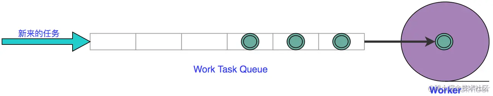
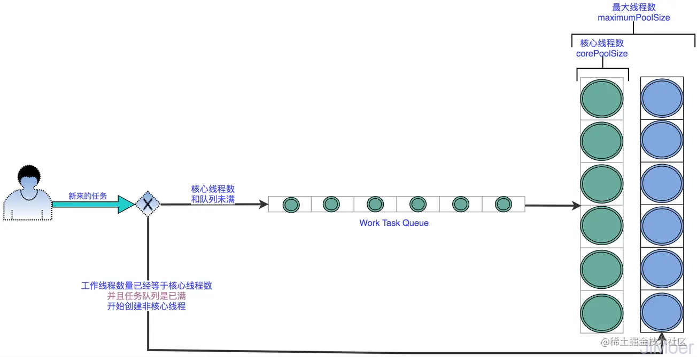

## 线程池是如何一步一步创建的

### 第一版

正常的我们在创建一个线程去执行任务的时候是这样的：

```java
new Thread(r).start();
```


但是这是最基本的方式，我们的项目中有可能很多地方都需要创建一个新的线程。这个使用为了减少重复代码，我们会把这段创建线程的代码放的一个工具类里面，然后对外提供工具方法，使用的时候直接调用此方法即可。

### 第二版

```java
/**
* 先定义接口（任务执行器）
*/
public interface Executor {
    /**
    * 执行任务
    * @param runnable  线程任务
    */
    void execute(Runnable runnable);
}
```


```java
/**
* 实现：直接创建线程。
*/
class ExecutorImpl implements Executor {
    public void execute(Runnable r) {
        new Thread(r).start();
    }
}
```


这种方式**实现了创建线程的代码的复用，但是并没有实现线程资源的复用**，当有 1000 个地方需要线程的时候，会创建 1000 个线程。


### 第三版

为了**实现资源也复用**，增加一个阻塞队列，当来了创建线程的任务的时候，先放到队列里，然后再用一个线程（Worker），来处理任务。这样就完成了线程资源的复用了，全程只有一个线程在来回的复用，一直在处理队列中的任务。 


通过上面的方式，实现了线程资源的复用，并且也起到提交任务和处理任务之间的解耦。


但是只有一个线程处理任务，会有瓶颈的，所以具体需要多少线程来处理任务最好是根据具体的业务场景来确定，这样我们把这个值，设置成一个参数，当创建线程池的时候传入，就叫`corePoolSize`吧。


而且任务队列最好也要有容量，但也应该是根据业务场景来配置容量，而且任务队列还可以定制一些规则，例如：按照一定的规则出队。所以我们把任务队列也配置成参数，在创建线程池的时候传入。参数名称就叫：`workQueue`吧。


当队列中任务满了之后，任务就会被抛弃，但是如果是重要业务任务，还不能抛弃，所以，当队列中任务满了之后，在线程池没有资源处理任务的时候，拒绝策略，我们也根据业务场景来确定，这样也在创建的时候传入一种拒绝策略，参数名称就叫：`rejectedExecutionHandler`。


虽然多了上面的三个参数后效果优化了不少，但是还可以继续优化：


- 并不用上来就创建`corePoolSize`数量的线程，我们可以增加了一个变量`workCount`，来记录已经创建出来了工作线程，这样在初始化的时候只有`workCount<corePoolSize`的时候，我们才创建线程来执行任务，当`workCount > CorePoolSize`的时候，再来了任务，就去进队列。
- 在增加拒绝策略的时候，我定义一个接口：`RejectedExecutionHandler`，然后使用者可以自己去实现这个接口，来完成自己的拒绝策略。
- 增加一个线程工厂的入参：`ThreadFactory`，这样保证每次创建线程的时候不用手动去创建线程了，而是通过`ThreadFactory`来获取线程，并且也可以增加一些线程的标识。


### 第四版

虽然说第三版的线程池已经可以应对日常工作中的情况了，但是还是不够有弹性，所谓的弹性就是指，**在任务提交频繁时应该处理能力提高，任务提交不频繁时处理能力应该降低**。


上面这版线程池就不够弹性。


如果某个时间段，任务提交量剧增，这个时候，`corePoolSize`和队列都满了，再来提交任务就只能走拒绝策略了。


你或许会想到，那我可以增大`corePoolSize`的值，这样就会创建出来更多的线程来处理任务，但是这个任务提交量剧增，只是某个时间段，过了这个时间段之后，创建出来这么多的线程，可以大部分都会是空闲的状态。这样也是浪费资源了。


这样就导致了一个两难的情况，`corePoolSize`的值设置太大了也不好，设置太小了也不好。


这个时候，**为让线程池做到弹性伸缩**，我们可以为他再添加一个参数：`maximumPoolSize`，这个参数代表的意思是最大线程数。


当`corePoolSize`和`workQueue`都满了的时候，新提交的任务仍然可以创建新线程来进行处理，这些超过`corePoolSize`创建出来的线程，被称为**非核心线程**。当`corePoolSize`与非核心线程数量的和等于`maximumPoolSize`再执行拒绝策略。 





通过这样的方式，`corePoolSize`，负责平时情况的线程使用量，`maximumPoolSize`负责提交任务高峰时的，临时扩充容量。


但是目前这样的方式只是考虑到了提交任务量高峰时期的扩充，但这个高峰期只是暂时的，过了这个高峰期，非核心线程一直放着也是浪费资源，所以我们再设定一个非核心线程的空闲活跃时间的参数：`keepAliveTime`，这样当非核心线程数，空闲时间超过这个值就销毁线程，释放资源。 


这一版的线程池，做到了在提交任务高峰时可临时扩容，低谷时又可及时回收非核心线程，从而节省资源。真正的做到了**收放自如**。


通过上面几版线程池的改进，最终改进成了和 Java 中的线程池原理基本相似了。这样也能更透彻的理解创建线程池时要传入的这几个关键参数的意义了。


## 线程池的好处

1. **降低资源消耗。**通过重复利用已创建的线程降低线程创建和销毁造成的消耗。
2. **提高响应速度。**当任务到达时，任务可以不需要等到线程创建就能立即执行。
3. **提高线程的可管理性。**线程是稀缺资源，如果无限制地创建，不仅会消耗系统资源，还会降低系统的稳定性，使用线程池可以进行统一分配、调优和监控。但是，要做到合理利用线程池，必须对其实现原理了如指掌。

## 线程池的原理

### 线程池的处理流程

当向线程池中提交任务之后，线程池是如何处理这个任务的呢？


1. 线程池判断核心线程池的线程是否已用完。如果不是，创建一个新的工作线程来执行任务。如何核心线程都在执行任务，则进入下一流程。
2. 线程池判断工作队列是否已满。如果工作队列未满，则将新提交的任务添加到工作队列里。如果工作队列已经满了，进入到下一流程。
3. 线程池判断线程池线程是否已经达到最大值。如果没有，则创建一个新的工作线程（非核心线程）来执行任务。如果已经满了，交给拒绝策略处理。


### ThreadPoolExecutor执行execute()方法的示意图


ThreadPoolExecutor执行execute方法分下面4种情况。

1. 如果当前运行的线程少于corePoolSize，则创建新线程来执行任务（注意，执行这一步骤需要获取全局锁）。
2. 如果运行的线程等于或多于corePoolSize，则将任务加入BlockingQueue。
3. 如果无法将任务加入BlockingQueue（队列已满），则创建新的线程来处理任务（注意，执行这一步骤需要获取全局锁）。
4. 如果创建新线程将使当前运行的线程超出maximumPoolSize，任务将被拒绝，并调用RejectedExecutionHandler.rejectedExecution()方法。


ThreadPoolExecutor 采取上述步骤的总体设计思路，是为了在执行execute()方法时，尽可能地避免获取全局锁（那将会是一个严重的可伸缩瓶颈）。在ThreadPoolExecutor 完成预热之后（当前运行的线程数大于等于corePoolSize），几乎所有的execute()方法调用都是执行步骤2，而步骤2不需要获取全局锁。

## 线程池的使用

### 线程池的监控

如果在系统中大量使用线程池，则有必要对线程池进行监控，方便在出现问题时，可以根据线程池的使用状况快速定位问题。可以通过线程池提供的参数进行监控，在监控线程池的时候可以使用以下属性。

taskCount：线程池需要执行的任务数量。

completedTaskCount：线程池在运行过程中已完成的任务数量，小于或等于taskCount。

largestPoolSize：线程池里曾经创建过的最大线程数量。通过这个数据可以知道线程池是否曾经满过。如该数值等于线程池的最大大小，则表示线程池曾经满过。

getPoolSize：线程池的线程数量。如果线程池不销毁的话，线程池里的线程不会自动销毁，所以这个大小只增不减。

getActiveCount：获取活动的线程数。


## 下面说几个线程池常见的考察点

### Java 中的线程池的阻塞队列都有哪几种

#### ArrayBlockingQueue 有界队列

`ArrayBlockingQueue` 是有界队列，按照阻塞的先后顺序访问队列，默认情况下不保证线程公平的访问队列，如果要保证公平性，会降低一定的吞吐量。

底层靠`ReentrantLock`来实现的，每一个方法中，都是靠`ReentrantLock`加锁来完成阻塞。


```java
public ArrayBlockingQueue(int capacity) {
    this(capacity, false);
}
public ArrayBlockingQueue(int capacity, boolean fair) {
    if (capacity <= 0)
        throw new IllegalArgumentException();
    this.items = new Object[capacity];
    lock = new ReentrantLock(fair);
    notEmpty = lock.newCondition();
    notFull =  lock.newCondition();
}
```


#### LinkedBlockingQueue 链表阻塞队列

`LinkedBlockingQueue`是基于链表的阻塞队列，按照先进先出的顺序排列，在不设置队列长度的时候默认 Integer.MAX_VALUE。所以认为当不设置队列长度时，LinkedBlockingQueue 为无界队列。

当指定了队列长度后变为有界队列，通常 LinkedBlockingQueue 的吞吐量要高ArrayBlockingQueue;

#### SynchronousQueue

`SynchronousQueue`是一个不存储元素的阻塞队列，每个插入操作必须等到另一个线程调用移除操作，否则插入操作一直处于阻塞状态。

在不允许任务在队列中等待的时候可以使用此队列。

#### DelayQueue

`DelayQueue`是延迟获取元素队列，按照指定时间后获取，为无界阻塞队列。

#### PriorityBlockingQueue

`PriorityBlockingQueue`是优先级排序队列，按照一定的优先级对任务进行排序，默认是小顶堆。

#### LinkedBlockingDeque

`LinkedBlockingDeque`是基于链表的双端阻塞队列。


### Java 提供了哪几个默认的线程池，为什么实际开发中不建议直接使用？


- `**Executors.newCachedThreadPool();**`：阻塞队列采用的 SynchronousQueue，所以是不存储等待任务的，**并且最大线程数的值是 Integer.MAX_VALUE**。所以当任务提交量高峰时，相当于无限制的创建线程。并且空闲时间是 60 秒，QPS 高峰期最终会将服务器资源耗尽，所以真正实际应用中不建议使用。

```java
public static ExecutorService newCachedThreadPool() {
    return new ThreadPoolExecutor(0, Integer.MAX_VALUE,
                                  60L, TimeUnit.SECONDS,
                                  new SynchronousQueue<Runnable>());
}
```


- `**Executors.newFixedThreadPool(int nThreads);**`：可重用固定线程数的线程池，源码如下：

```java
public static ExecutorService newFixedThreadPool(int nThreads, ThreadFactory threadFactory) {
    return new ThreadPoolExecutor(nThreads, nThreads,
                                  0L, TimeUnit.MILLISECONDS,
                                  new LinkedBlockingQueue<Runnable>(),
                                  threadFactory);
}

public static ExecutorService newSingleThreadExecutor() {
    return new FinalizableDelegatedExecutorService
        (new ThreadPoolExecutor(1, 1,
                                0L, TimeUnit.MILLISECONDS,
                                new LinkedBlockingQueue<Runnable>()));
}
```


**核心线程数和最大线程数相等的线程池**，并且阻塞任务队列还是一个无界队列，这样，当处理任务的线程数量达到核心线程数时，再提交的任务都会进行到阻塞队列里，但是阻塞队列是无界的，这样就提交任务高峰期有可能会造成任务一直堆积在队列里，超出内存容量最终导致内存溢出。


- `**Executors.newScheduledThreadPool(int corePoolSize);**`：一个定长线程池，支持定时及周期性任务执行，这个线程池的最大线程数也是 Integer.MAX_VALUE，可以理解为会无限创建线程。存在将资源耗尽的风险，所以一般场景下不建议使用。


```java
public static ScheduledExecutorService newScheduledThreadPool(int corePoolSize) {
    return new ScheduledThreadPoolExecutor(corePoolSize);
}
public ScheduledThreadPoolExecutor(int corePoolSize) {
    super(corePoolSize, Integer.MAX_VALUE, 0, NANOSECONDS,
          new DelayedWorkQueue());
}
```


- `**Executors.newSingleThreadExecutor();**`


这种线程池，会创建一个线程数固定是 1 的线程池，并且任务队列是无界的 LinkedBlockingQueue，存在任务队列无限添加造成 OOM 的风险。


```java
public static ExecutorService newSingleThreadExecutor() {
    return new FinalizableDelegatedExecutorService
        (new ThreadPoolExecutor(1, 1,
                                0L, TimeUnit.MILLISECONDS,
                                new LinkedBlockingQueue<Runnable>()));
}
复制代码
```


- `**Executors.newWorkStealingPool();**`：一个具有抢占式操作的线程池。参数中传入的是一个线程并发的数量，这里和之前就有很明显的区别，前面 4 种线程池都有核心线程数、最大线程数等等，而这就使用了一个并发线程数解决问题。这个线程池不会保证任务的顺序执行，也就是 WorkStealing 的意思，抢占式的工作，哪个线程抢到任务就执行。

```java
public static ExecutorService newWorkStealingPool(int parallelism) {
    return new ForkJoinPool
        (parallelism,
         ForkJoinPool.defaultForkJoinWorkerThreadFactory,
         null, true);
}

复制代码
```


### Java 中的线程池提供了哪几种拒绝策略

- `AbortPolicy`：该策略默认是饱和策略。当不能在处理提交的任务时，直接抛出 RejectedExecutionException，使用者可以自行捕获此异常。

```java
public void rejectedExecution(Runnable r, ThreadPoolExecutor e) {
    throw new RejectedExecutionException("Task " + r.toString() +
                                         " rejected from " +
                                         e.toString());
}
```


- `CallerRunsPolicy`：该策略是在线程池处理不了任务时，交给提交任务的主线程去处理任务，主线程在处理任务的时候，不能在提交任务了，这样线程池就可以有时间去处理堆积的任务了。

```java
public void rejectedExecution(Runnable r, ThreadPoolExecutor e) {
    if (!e.isShutdown()) {
        r.run();
    }
}
```


- `DiscardOldestPolicy`：该策略是，抛弃最老的任务，然后再尝试提交任务，若阻塞队列使用 PriorityBlockingQueue 优先级队列，将会导致优先级最高的任务被抛弃，所以在阻塞队列为 PriorityBlockingQueue 时，不建议使用此策略。

```java
public void rejectedExecution(Runnable r, ThreadPoolExecutor e) {
    if (!e.isShutdown()) {
        e.getQueue().poll();
        e.execute(r);
    }
}
```


- `DiscardPolicy`：这是一个比较任性的策略，当线程池处理不了任务时，直接抛弃，再来了新任务也直接抛弃。

```java
public void rejectedExecution(Runnable r, ThreadPoolExecutor e) {
}
```


- `RejectHandler`：

直接抛拒绝异常。

```java
public void rejectedExecution(Runnable r, java.util.concurrent.ThreadPoolExecutor executor) {
    throw new RejectedExecutionException();
}
```


### Java 中线程池核心线程数与最大线程数该如何配置

#### 推荐线程池设置

可以根据提交的任务不同，将线程池分开。

- 处理 CPU 密集型任务，线程数量应该较少，可为`N(CPU核数)+1`或 `N(CPU核数) * 2`，因为此时线程一定调度到某个 CPU 执行，若任务本身是 CPU 绑定的任务，那么过多的线程只会增加线程切换的开销，而不能提升吞吐量，但可能需要较长队列做缓冲。
- I/O 密集型任务，执行较慢、数量不大的 IO 任务，要考虑更多线程数，而无需太大队列。相比计算型任务，需多一些线程，要结合具体的 I/O 阻塞时长考虑。


但是实际情况下，有些任务是既耗 CPU 资源，又占用 I/O 资源的。所以这个时候可以采用类似美团技术提出方案，实时的监控线程池状态信息，然后对线程池的数据进行调整。


#### 获取线程池属性

在监控线程池的时候可以使用如下几个线程池属性：

- `getTaskCount()`：线程池需要执行的任务数量。
- `completedTaskCount`：线程池在运行过程中已完成的任务数量，小于或等于 taskCount。
- `largestPoolSize`：线程池里曾经创建过的最大线程数量。通过这个数据可以知道线程池是否曾经满过，如该数值等于线程池的最大线程数量，则表示线程池曾经满过。
- `getPoolSize()`：线程池的线程数量，如果线程池不销毁的话，线程池里的线程不会自动销毁，所以这个大小只增不减。
- `getActiveCount()`：获取活动的线程数。


## 参考

1. Java中的线程池用过吧？来说说你是怎么理解线程池吧？https://juejin.cn/post/6960222745653149732?utm_source=gold_browser_extension#heading-13
2. 