# 认识Jackson

Jackson 是当前用的比较广泛的，用来序列化和反序列化 json 的 Java 的开源框架。Jackson 社 区相对比较活跃，更新速度也比较快， 从 Github 中的统计来看，Jackson 是最流行的 json 解析器之一 。 Spring MVC 的默认 json 解析器便是 Jackson。 Jackson 优点很多。 Jackson 所依赖的 jar 包较少 ，简单易用。与其他 Java 的 json 的框架 Gson 等相比， Jackson 解析大的 json 文件速度比较快；Jackson 运行时占用内存比较低，性能比较好；Jackson 有灵活的 API，可以很容易进行扩展和定制。


Jackson 的 1.x 版本的包名是 org.codehaus.jackson ，当升级到 2.x 版本时，包名变为 com.fasterxml.jackson，本文讨论的内容是基于最新的 Jackson 的 2.9.1 版本。


### Jackson 的核心模块由三部分组成。


- jackson-core，核心包，提供基于 "流模式" 解析的相关 API，它包括 JsonPaser 和 JsonGenerator。 Jackson 内部实现正是通过高性能的流模式 API 的 JsonGenerator 和 JsonParser 来生成和解析 json。
- jackson-annotations，注解包，提供标准注解功能；
- jackson-databind ，数据绑定包， 提供基于 "对象绑定" 解析的相关 API （ ObjectMapper ） 和 "树模型" 解析的相关 API （JsonNode）；基于 "对象绑定" 解析的 API 和 "树模型" 解析的 API 依赖基于 "流模式" 解析的 API。


##### 清单 1. 在 pom.xml 的 Jackson 的配置信息


```plain
<dependency> 
<groupId>com.fasterxml.jackson.core</groupId> 
<artifactId>jackson-databind</artifactId> 
<version>2.9.1</version> 
</dependency>
```


jackson-databind 依赖 jackson-core 和 jackson-annotations，当添加 jackson-databind 之后， jackson-core 和 jackson-annotations 也随之添加到 Java 项目工程中。在添加相关依赖包之后，就可以使用 Jackson。


### ObjectMapper 的 使用


Jackson 最常用的 API 就是基于 "对象绑定" 的 ObjectMapper。下面是一个 ObjectMapper 的使用的简单示例。


##### 清单 2 . ObjectMapper 使用示例


```plain
ObjectMapper mapper = new ObjectMapper(); 
Person person = new Person(); 
person.setName("Tom"); 
person.setAge(40); 
String jsonString = mapper.writerWithDefaultPrettyPrinter() 
.writeValueAsString(person); 
Person deserializedPerson = mapper.readValue(jsonString, Person.class);
```


ObjectMapper 通过 writeValue 系列方法 将 java 对 象序列化 为 json，并 将 json 存 储成不同的格式，String（writeValueAsString），Byte Array（writeValueAsString），Writer， File，OutStream 和 DataOutput。


ObjectMapper 通过 readValue 系列方法从不同的数据源像 String ， Byte Array， Reader，File，URL， InputStream 将 json 反序列化为 java 对象。


### 信息配置


在调用 writeValue 或调用 readValue 方法之前，往往需要设置 ObjectMapper 的相关配置信息。这些配置信息应用 java 对象的所有属性上。示例如下：


##### 清单 3 . 配置信息使用示例


```plain
//在反序列化时忽略在 json 中存在但 Java 对象不存在的属性 
mapper.configure(DeserializationFeature.FAIL_ON_UNKNOWN_PROPERTIES,
   false); 
//在序列化时日期格式默认为 yyyy-MM-dd'T'HH:mm:ss.SSSZ 
mapper.configure(SerializationFeature.WRITE_DATES_AS_TIMESTAMPS,false) 
//在序列化时忽略值为 null 的属性 
mapper.setSerializationInclusion(Include.NON_NULL); 
//忽略值为默认值的属性 
mapper.setDefaultPropertyInclusion(Include.NON_DEFAULT);
```


更多配置信息可以查看 Jackson 的 DeserializationFeature，SerializationFeature 和 Include。


### Jackson 的 注解的使用


Jackson 根据它的默认方式序列化和反序列化 java 对象，若根据实际需要，灵活的调整它的默认方式，可以使用 Jackson 的注解。

# 使用ObjectMapper

## 了解ObjectMapper对象


```java
private final static ObjectMapper MAPPER = new ObjectMapper();
```

## 单个对象序列化

### 对象转字符串

```java
String studentStr = MAPPER.writeValueAsString(student); 
```

### 对象转byte数组

```java
byte[] bytes = MAPPER.writeValueAsBytes(student);
```

### 对象转JSON文件

```java
MAPPER.writeValue(new File("D:/test/student.json"), student);
```

## 单个对象反序列化

### 字符串转对象

```java
Student student = MAPPER.readValue(jsonStr, Student.class);
```

### byte数组转对象

```java
Student tFromBytes = MAPPER.readValue(bytes, Student.class);
```

### JSON文件转对象

```java
Student tFromBytes = MAPPER.readValue(new File("E:/test/student.json"), Student.class);
```

## Map序列化

### HashMap转字符串

```java
HashMap<String,Object> map =  new HashMap();
map.put("id","001");
map.put("name","李白");
map.put("age",320);
map.put("isBoy",true);

String mapStr = MAPPER.writeValueAsString(map);
```

## Map反序列化

### 将字符串转Map对象

```java
String str = "{\"name\":\"李白\",\"id\":\"001\",\"age\":320,\"isBoy\":true}";
try {
    HashMap<String, Object> map = MAPPER.readValue(str, new TypeReference<HashMap<String, Object>>() {});
    System.out.println(map);
} catch (JsonProcessingException e) {
    e.printStackTrace();
}
```

## JSON数组的反序列化

### 从 JSON 数组字符串中读取对象数组


```java
private static void strToArray(){
    String str = "[{\"id\":\"001\",\"name\":\"李白\",\"age\":322,\"gender\":1},{\"id\":\"002\",\"name\":\"武则天\",\"age\":330,\"gender\":0},{\"id\":\"003\",\"name\":\"张飞\",\"age\":310,\"gender\":1},{\"id\":\"004\",\"name\":\"赵云\",\"age\":410,\"gender\":1}]";
    try {
        Student[] students = MAPPER.readValue(str, Student[].class);
        Arrays.stream(students).forEach(System.out::println);
    } catch (JsonProcessingException e) {
        e.printStackTrace();
    }
}
```

### 从 JSON 数组字符串中读取对象列表


```java
private static void strToList(){
    String str = "[{\"id\":\"001\",\"name\":\"李白\",\"age\":322,\"gender\":1},{\"id\":\"002\",\"name\":\"武则天\",\"age\":330,\"gender\":0},{\"id\":\"003\",\"name\":\"张飞\",\"age\":310,\"gender\":1},{\"id\":\"004\",\"name\":\"赵云\",\"age\":410,\"gender\":1}]";
    try {
        List<Student> students = MAPPER.readValue(str, new TypeReference<List<Student>>() {});
        students.forEach(System.out::println);
    } catch (JsonProcessingException e) {
        e.printStackTrace();
    }
}
```

## 树模型JsonNode

`ObjectMapper` 对象有一个特殊的方法 `readTree()`，它总是返回一个`JsonNode` 对象。

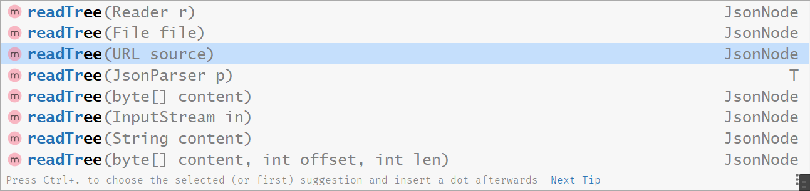

通过 JsonNode 可以直接读取JSON节点值:

```java
JsonNode jsonNode = mapper.readTree(mapJsonStr);
String name = jsonNode.get("name").asText();
int age = jsonNode.get("age").asInt();
String city = jsonNode.get("addr").get("city").asText();
String street = jsonNode.get("addr").get("street").asText();
```

### 对象转JsonNode

```java
Car car = new Car();
car.brand = "Cadillac";
car.doors = 4;

JsonNode carJsonNode = MAPPER.valueToTree(car);
```

### JsonNode 转对象

```java
String carJson = "{ \"brand\" : \"Mercedes\", \"doors\" : 5 }";
JsonNode carJsonNode = MAPPER.readTree(carJson);

Car car = objectMapper.treeToValue(carJsonNode,Car.class);
```

## 常用配置

```java
ObjectMapper mapper = new ObjectMapper();

//序列化结果格式化
mapper.enable(SerializationFeature.INDENT_OUTPUT);

// Date、Calendar等序列化为时间格式的字符串(如果不执行以下设置，就会序列化成时间戳格式);
mapper.disable(SerializationFeature.WRITE_DATES_AS_TIMESTAMPS);

//在序列化时日期格式默认为 yyyy-MM-dd'T'HH:mm:ss.SSSZ 
mapper.configure(SerializationFeature.WRITE_DATES_AS_TIMESTAMPS,false);

//空对象不要抛出异常
mapper.disable(SerializationFeature.FAIL_ON_EMPTY_BEANS);

// 在反序列化时忽略在 json 中存在但 Java 对象不存在的属性,遇到未知属性不要抛出异常：
mapper.disable(DeserializationFeature.FAIL_ON_UNKNOWN_PROPERTIES);

// 反序列化时，空字符串对于的实例属性为null
mapper.enable(DeserializationFeature.ACCEPT_EMPTY_STRING_AS_NULL_OBJECT);

//忽略值为默认值的属性 
mapper.setDefaultPropertyInclusion(Include.NON_DEFAULT);

//允许C和C++样式注释
mapper.configure(JsonParser.Feature.ALLOW_COMMENTS, true);

//允许字段名没有引号（可以进一步减小json体积）
mapper.configure(JsonParser.Feature.ALLOW_UNQUOTED_FIELD_NAMES, true);

//允许单引号
mapper.configure(JsonParser.Feature.ALLOW_SINGLE_QUOTES, true);
```

## 特殊配置：在json对象最外层再包裹一层

先来看看正常情况一个普通的序列化结果：

```json
{
  "id" : 1,
  "text" : "aabbcc",
  "fromUserId" : 456,
  "toUserId" : 0,
  "languageCode" : "zh"
}
```

接下来咱们做两件事，首先，是给上述json对应的实例类添加一个注解，如下图红框：

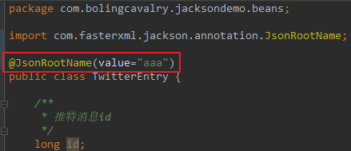

其次，执行以下配置:

```java
mapper.enable(SerializationFeature.WRAP_ROOT_VALUE);
```

然后再次执行序列化，得到的结果如下，可见和之前的序列化结果相比，之前的整个json都变成了一个value，此value对应的key就是注解JsonRootName的value属性：

```json
{
  "aaa" : {
    "id" : 1,
    "text" : "aabbcc",
    "fromUserId" : 456,
    "toUserId" : 0,
    "languageCode" : "zh"
  }
}
```


## 使用 ObjectMapper 读取和编写 Yaml


要引入依赖包：

```xml
<dependency>
  <groupId>com.fasterxml.jackson.dataformat</groupId>
  <artifactId>jackson-dataformat-yaml</artifactId>
  <version>2.11.0</version>
</dependency>
```

### 对象转Yaml格式字符串


```java
    /**
     * 对象转Yaml字符串
     */
    private static void objectToYamlStr(){
        Employee employee = new Employee("张山", 22, "1008611");
        // 将对象转Yaml字符串
        ObjectMapper mapper = new ObjectMapper(new YAMLFactory());
        // 格式化输出
        mapper.enable(SerializationFeature.INDENT_OUTPUT);
        try {
            String yamlEmployeeStr = mapper.writeValueAsString(employee);
            System.out.println(yamlEmployeeStr);
        } catch (JsonProcessingException e) {
            e.printStackTrace();
        }
    }
```


该`yamlEmployeeStr`变量包含`Employee`在执行此代码后序列化为 YAML 数据格式的对象。

执行后打印效果：

```java
name: "张山"
age: 22
phone: "1008611"
```

### Yaml字符串转对象

```java
    /**
     * Yaml字符串转对象
     */
    private static void yamlStrToObject(){
        String str = "name: \"张山\"\n" +
                "age: 22\n" +
                "phone: \"1008611\"";
        ObjectMapper mapper = new ObjectMapper(new YAMLFactory());

        try {
            Employee employee = mapper.readValue(str, Employee.class);
            System.out.println(employee);
        } catch (JsonProcessingException e) {
            e.printStackTrace();
        }
    }
```


### 对象转YAML文件

```java
    /**
     * 对象转Yaml文件
     */
    private static void objectToYamlFile(){
        Employee employee = new Employee("张山", 22, "1008611");

        ObjectMapper mapper = new ObjectMapper(new YAMLFactory());
        try {
            mapper.writeValue(new File("E:/test/emplay.yaml"),employee);
        } catch (IOException e) {
            e.printStackTrace();
        }
    }
```

### Yaml文件转对象

```java
  /**
     * 读取Yaml文件转Employee对象
     */
    private static void yamlFileToObject(){
        ObjectMapper mapper = new ObjectMapper(new YAMLFactory());

        try {
            Employee employee = mapper.readValue(new File("E:/test/emplay.yaml"), Employee.class);
            System.out.println(employee);
        } catch (IOException e) {
            e.printStackTrace();
        }
    }
```

## 参考

https://blog.csdn.net/boling_cavalry/article/details/108192174

https://www.cnblogs.com/guanbin-529/p/11488869.html#_label2


# WRAP_ROOT_VALUE

## 关于root对象（WRAP_ROOT_VALUE）

1. 对于只有id和name两个字段的POJO实例来说，正常的序列化结果如下：

```json
{
 "id":"001",
 "name":"张三"
}
```

1. jackson在序列化时，可以在上述json外面再包裹一层，官方叫做`WRAP_ROOT_VALUE`，本文中叫做root对象，如下所示，整个json的只有一个键值对，key是aaabbbccc，value内部才是POJO实例的id和name字段的值：

```json
{
  "aaabbbccc" : {
    "id" : 2,
    "name" : "food"
  }
}
```

## 使用 WRAP_ROOT_VALUE

### 序列化场景

1. 配置mapper，开启root对象，序列化的的对象是在json对象最外层再包裹一层：

```java
mapper.enable(SerializationFeature.WRAP_ROOT_VALUE);
```


### 反序列化场景

配置mapper,jackson在反序列化时会先解析root对象：

```java
mapper.enable(DeserializationFeature.UNWRAP_ROOT_VALUE);
```


## 代码验证

### 准备两个POJO

不带有 `@JsonRootName` 注解，Person1：

```java
public class Person1 {
    private String name;
    private Integer age;

    public Person1() {
    }

    public Person1(String name, Integer age) {
        this.name = name;
        this.age = age;
    }

    public String getName() {
        return name;
    }

    public void setName(String name) {
        this.name = name;
    }

    public Integer getAge() {
        return age;
    }

    public void setAge(Integer age) {
        this.age = age;
    }
    
    @Override
    public String toString() {
        return "Person1{" +
                "name='" + name + '\'' +
                ", age=" + age +
                '}';
    }
}
```

带有`@JsonRootName` 注解，Person2：

```java
@JsonRootName("ppp")
public class Person2 {

    private String name;
    private Integer age;

    public Person2() {
    }

    public Person2(String name, Integer age) {
        this.name = name;
        this.age = age;
    }

    public String getName() {
        return name;
    }

    public void setName(String name) {
        this.name = name;
    }

    public Integer getAge() {
        return age;
    }

    public void setAge(Integer age) {
        this.age = age;
    }
    
    @Override
    public String toString() {
        return "Person2{" +
                "name='" + name + '\'' +
                ", age=" + age +
                '}';
    }
    
}
```

### 测试序列化


```java
   public static void main(String[] args) throws JsonProcessingException {
        ObjectMapper mapper = new ObjectMapper();
        // 用来美化输出
        mapper.enable(SerializationFeature.INDENT_OUTPUT);

        Person1 person1 = new Person1("张三", 22);
        Person2 person2 = new Person2("李四", 21);


        String person1Str = mapper.writeValueAsString(person1);
        System.out.println("不设置Root时，正常序列化Person1：\n"+person1Str);
        String person2Str = mapper.writeValueAsString(person2);
        System.out.println("不设置Root时，正常序列化Person2：\n"+person2Str);

        // 开启Root
        mapper.enable(SerializationFeature.WRAP_ROOT_VALUE);
        String person1RootStr = mapper.writeValueAsString(person1);
        System.out.println("设置Root时，序列化Person1：\n"+person1RootStr);
        String person2RootStr = mapper.writeValueAsString(person2);
        System.out.println("设置Root时，序列化Person2：\n"+person2RootStr);

    }
```

输出：

```java
不设置Root时，正常序列化Person1：
{
  "name" : "张三",
  "age" : 22
}
不设置Root时，正常序列化Person2：
{
  "name" : "李四",
  "age" : 21
}
设置Root时，序列化Person1：
{
  "Person1" : {
    "name" : "张三",
    "age" : 22
  }
}
设置Root时，序列化Person2：
{
  "ppp" : {
    "name" : "李四",
    "age" : 21
  }
}

Process finished with exit code 0
```

开启 WRAP_ROOT_VALUE 后，最外层会多出一层key，如果有 `@JsonRootName` 注解，key的名称就为注解的value，如“ppp”，如果没有注解，默认是类名，这里是"Person1"。


### 测试反序列化

1. 默认情况下，反序列化时json字符串不能有root对象：

```java
ObjectMapper mapper = new ObjectMapper();
        String strWithoutRoot = "{\n" +
                "    \"name\" : \"李四\",\n" +
                "    \"age\" : 21\n" +
                "  }";
        String strWithRoot = "{\n" +
                "  \"ppp\" : {\n" +
                "    \"name\" : \"李四\",\n" +
                "    \"age\" : 21\n" +
                "  }\n" +
                "}";

        Person2 person21 = mapper.readValue(strWithoutRoot, Person2.class);
        System.out.println(person21);
        Person2 person22 = mapper.readValue(strWithRoot, Person2.class);
        System.out.println(person22);
```

输出：

```java
Person2{name='李四', age=21}
com.fasterxml.jackson.databind.exc.UnrecognizedPropertyException: Unrecognized field "ppp" (class com.hlkui.example.jackson.demo.wraprootvalue.Person2), not marked as ignorable (2 known properties: "name", "age"])
 at [Source: (String)"{
  "ppp" : {
    "name" : "李四",
    "age" : 21
  }
}";......
```

反序列化时jackson并不认识ppp这个key，因为jackson此时并不支持root对象。

小结：默认情况下，反序列化时json字符串不能有root对象；


1. 如果开启了UNWRAP_ROOT_VALUE属性，用于反序列化的json字符串就必须要有root对象了，开启UNWRAP_ROOT_VALUE属性的代码如下：

```java
mapper.enable(DeserializationFeature.UNWRAP_ROOT_VALUE);
```

修改代码：

```java
private static void testDeSerialize2() throws JsonProcessingException {
        ObjectMapper mapper = new ObjectMapper();
        mapper.enable(DeserializationFeature.UNWRAP_ROOT_VALUE);

        String strWithRoot = "{\n" +
                "  \"ppp\" : {\n" +
                "    \"name\" : \"李四\",\n" +
                "    \"age\" : 21\n" +
                "  }\n" +
                "}";

        Person2 person22 = mapper.readValue(strWithRoot, Person2.class);
        System.out.println(person22);
    }
Person2{name='李四', age=21}
```

可见带有root对象的json字符串，可以反序列化成功，root对象的key就是JsonRootName注解的value属性。


值得注意的是，上述json字符串中，root对象的key为ppp，这和Person2的JsonRootName注解的value值是一致的，如果不一致就会反序列化失败。


# 注解的使用


## JsonInclude 注解

JsonInclede 注解仅在序列化操作时有用，用于控制方法、属性等是否应该被序列化；


JsonInclude 注解的值有多种，每种都有不同效果:

```java
ALWAYS // 默认策略，任何情况都执行序列化
NON_NULL // 非null
NON_ABSENT // null的不会序列化，但如果类型是AtomicReference，依然会被序列化
NON_EMPTY   // null、集合数组等没有内容、空字符串等，都不会被序列化
NON_DEFAULT // 如果字段是默认值，就不会被序列化
CUSTOM // 此时要指定valueFilter属性，该属性对应一个类，用来自定义判断被JsonInclude修饰的字段是否序列化
USE_DEFAULTS // 当JsonInclude在类和属性上都有时，优先使用属性上的注解，此时如果在序列化的get方法上使用了JsonInclude，并设置为USE_DEFAULTS，就会使用类注解的设置  
```

### ALWAYS

ALWAYS表示全部序列化，是默认策略，null和空字符串都会序列化：

```java
package com.hlkui.example.jackson.demo.annotation;

import com.fasterxml.jackson.annotation.JsonInclude;
import com.fasterxml.jackson.core.JsonProcessingException;
import com.fasterxml.jackson.databind.ObjectMapper;

public class JsonIncludeAlwaysTest {

    @JsonInclude(JsonInclude.Include.ALWAYS)
    static class Product {
        private String name;
        private Integer price;
        private String color;

        public String getName() {
            return name;
        }

        public void setName(String name) {
            this.name = name;
        }

        public Integer getPrice() {
            return price;
        }

        public void setPrice(Integer price) {
            this.price = price;
        }

        public String getColor() {
            return color;
        }

        public void setColor(String color) {
            this.color = color;
        }

        @Override
        public String toString() {
            return "Product{" +
                    "name='" + name + '\'' +
                    ", price=" + price +
                    ", color='" + color + '\'' +
                    '}';
        }
    }

    public static void main(String[] args) throws JsonProcessingException {
        ObjectMapper mapper = new ObjectMapper();
        Product product = new Product();
        product.setName("牙膏");
        product.setColor("");

        System.out.println(product);
        String s = mapper.writeValueAsString(product);
        System.out.println(s);
    }
}
Product{name='牙膏', price=null, color=''}
{"name":"牙膏","price":null,"color":""}
```

### NON_NULL

值为null就不序列化：

```java
package com.hlkui.example.jackson.demo.annotation;

import com.fasterxml.jackson.annotation.JsonInclude;
import com.fasterxml.jackson.core.JsonProcessingException;
import com.fasterxml.jackson.databind.ObjectMapper;


public class JsonIncludeNotNullTest {

    @JsonInclude(JsonInclude.Include.NON_NULL)
    static class MyOb{
        private String name;
        private String title;
        private Integer age;

        public String getName() {
            return name;
        }

        public void setName(String name) {
            this.name = name;
        }

        public String getTitle() {
            return title;
        }

        public void setTitle(String title) {
            this.title = title;
        }

        public Integer getAge() {
            return age;
        }

        public void setAge(Integer age) {
            this.age = age;
        }

        @Override
        public String toString() {
            return "MyOb{" +
                    "name='" + name + '\'' +
                    ", title='" + title + '\'' +
                    ", age=" + age +
                    '}';
        }
    }

    public static void main(String[] args) throws JsonProcessingException {
        ObjectMapper mapper = new ObjectMapper();
        MyOb ob = new MyOb();
        ob.setName("111");
        ob.setTitle(null);
        ob.setAge(13);
        System.out.println(ob);
        String s = mapper.writeValueAsString(ob);
        System.out.println(s);
    }
}
MyOb{name='111', title='null', age=13}
{"name":"111","age":13}
```

title 属性为空，不进行序列化。


### NON_ABSENT 

设置成NON_NULL时jackson对Optional和AtomicReference的处理，下面的代码中，Optional和AtomicReference的引用都是空，但还是被序列化出来了：

```java
package com.hlkui.example.jackson.demo.annotation;

import com.fasterxml.jackson.annotation.JsonInclude;
import com.fasterxml.jackson.core.JsonProcessingException;
import com.fasterxml.jackson.databind.ObjectMapper;

import java.util.Optional;
import java.util.concurrent.atomic.AtomicReference;

/**
 * @Author hanliukui
 * @Date 2021/10/6 23:25
 * @Description xxx
 */
public class JsonIncludeNonAbsentTest {

    @JsonInclude(JsonInclude.Include.NON_NULL)
    static class MyObA {
        private String title;
        private Optional<String> name;
        private AtomicReference<Integer> age;

        public String getTitle() {
            return title;
        }

        public void setTitle(String title) {
            this.title = title;
        }

        public Optional<String> getName() {
            return name;
        }

        public void setName(Optional<String> name) {
            this.name = name;
        }

        public AtomicReference<Integer> getAge() {
            return age;
        }

        public void setAge(AtomicReference<Integer> age) {
            this.age = age;
        }
    }

    public static void main(String[] args) throws JsonProcessingException {
        ObjectMapper mapper = new ObjectMapper();

        MyObA obA = new MyObA();
        obA.setTitle("111");
        obA.setName(Optional.empty());
        obA.setAge(new AtomicReference<>());

        String s = mapper.writeValueAsString(obA);
        System.out.println(s);
    }
}
{"title":"111","name":{"present":false},"age":null}
```


NON_ABSENT略为复杂，当实例化的对象有Optional或AtomicReference类型的成员变量时，如果Optional 或 AtomicReference 引用的实例为空，用NON_ABSENT能使该字段不做序列化；


要让Jackson支持Optional特性，必须做两件事：

1. 在pom.xml中添加以下依赖：

```xml
<dependency>
    <groupId>com.fasterxml.jackson.datatype</groupId>
    <artifactId>jackson-datatype-jdk8</artifactId>
    <version>2.11.0</version>
</dependency>
```

1. 在代码中执行以下设置：

```java
mapper.registerModule(new Jdk8Module());
```


测试 将NON_NULL改为NON_ABSENT试试：

```java
package com.hlkui.example.jackson.demo.annotation;

import com.fasterxml.jackson.annotation.JsonInclude;
import com.fasterxml.jackson.core.JsonProcessingException;
import com.fasterxml.jackson.databind.ObjectMapper;
import com.fasterxml.jackson.datatype.jdk8.Jdk8Module;

import java.util.Optional;
import java.util.concurrent.atomic.AtomicReference;

/**
 * @Author hanliukui
 * @Date 2021/10/6 23:25
 * @Description xxx
 */
public class JsonIncludeNonAbsentTest2 {

    @JsonInclude(JsonInclude.Include.NON_ABSENT)
    static class MyObA {
        private String title;
        private Optional<String> name;
        private AtomicReference<Integer> age;

        public String getTitle() {
            return title;
        }

        public void setTitle(String title) {
            this.title = title;
        }

        public Optional<String> getName() {
            return name;
        }

        public void setName(Optional<String> name) {
            this.name = name;
        }

        public AtomicReference<Integer> getAge() {
            return age;
        }

        public void setAge(AtomicReference<Integer> age) {
            this.age = age;
        }
    }

    public static void main(String[] args) throws JsonProcessingException {
        ObjectMapper mapper = new ObjectMapper();

        // Optional 于jdk8 中引入
        mapper.registerModule(new Jdk8Module());

        MyObA obA = new MyObA();
        obA.setTitle("111");
        obA.setName(Optional.empty());
        obA.setAge(new AtomicReference<>());

        String s = mapper.writeValueAsString(obA);
        System.out.println(s);
    }
}
{"title":"111"}
```


小结NON_ABSENT的效果：

1. 自身为null的字段不会被序列化；

1. Optional类型的字段，如果引用值为null，该字段不会被序列化；
2. AtomicReference类型的字段，如果引用值为null，该字段不会被序列化；

### NON_EMPTY

 以下情况都不会被序列化：

1. null
2. 空字符串
3. 空集合
4. 空数组
5. Optional类型的，其引用为空
6. AtomicReference类型的，其引用为空


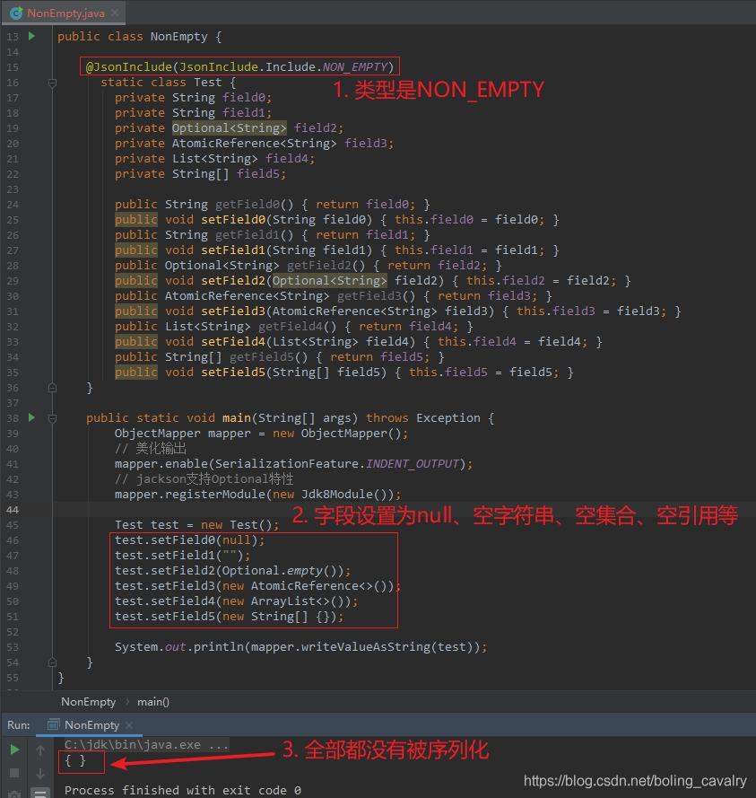


### NON_DEFAULT

对保持默认值的字段不做序列化。

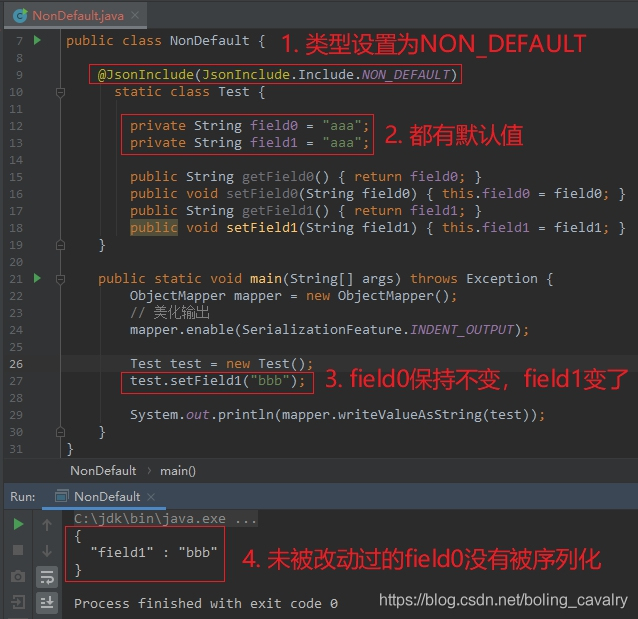


### CUSTOM

相对其他类型，CUSTOM略为复杂，这个值要配合valueFilter属性一起使用；


JsonInclude的value等于CUSTOM时，在序列化的时候会执行CustomFilter的equals方法，该方法的入参就是field0的值，如果equals方法返回true，field0就不会被序列化，如果equals方法返回false时field0才会被序列化

```java
@JsonInclude(value = JsonInclude.Include.CUSTOM, 
                valueFilter = CustomFilter.class)
        private String field0;
```

来看看CustomFilter类的代码，如下所示，只有equals方法，可见：null、非字符串、长度大于2这三种情况都返回true，也就是说这三种情况下都不会被序列化：

```java
static class CustomFilter {
        @Override
        public boolean equals(Object obj) {
            // null，或者不是字符串就返回true，意味着不被序列化
            if(null==obj || !(obj instanceof String)) {
                return true;
            }

            // 长度大于2就返回true，意味着不被序列化
            return ((String) obj).length() > 2;
        }
    }
```

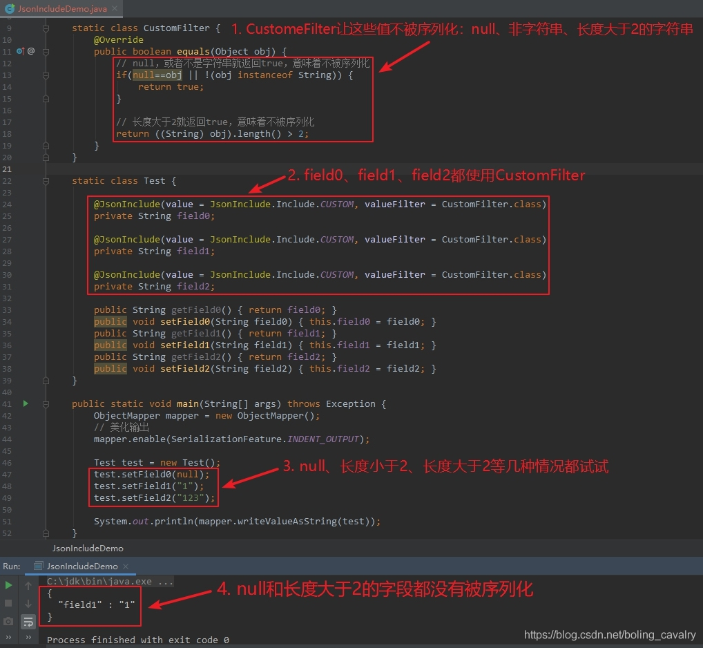


### USE_DEFAULTS

默认使用时：

-  类注解和成员变量注解同时存在时，以成员变量注解为准；
- 如果对应的get方法也使用了JsonInclude注解，并且值是USE_DEFAULTS，此时以类注解为准；


测试1，不使用USE_DEFAULT:

```java
package com.hlkui.example.jackson.demo.annotation;

import com.fasterxml.jackson.annotation.JsonInclude;
import com.fasterxml.jackson.core.JsonProcessingException;
import com.fasterxml.jackson.databind.ObjectMapper;

/**
 * @Author hanliukui
 * @Date 2021/10/6 23:49
 * @Description xxx
 */
public class JsonIncludeUseDefaultTest1 {

    @JsonInclude(JsonInclude.Include.NON_NULL)
    static class MyObD{

        @JsonInclude(JsonInclude.Include.NON_EMPTY)
        private String title;
        private String phone;

        public String getTitle() {
            return title;
        }

        public void setTitle(String title) {
            this.title = title;
        }

        public String getPhone() {
            return phone;
        }

        public void setPhone(String phone) {
            this.phone = phone;
        }
    }

    public static void main(String[] args) throws JsonProcessingException {
        ObjectMapper mapper = new ObjectMapper();

        MyObD obD = new MyObD();
        obD.setPhone("1008611");
        obD.setTitle("");

        String s = mapper.writeValueAsString(obD);
        System.out.println(s);

    }
}
{"phone":"1008611"}
```

可以发现是属性字段上的注解值 NON_EMPTY 生效了。


测试2，在get 方法上使用USE_DEFAULT：

```java
package com.hlkui.example.jackson.demo.annotation;

import com.fasterxml.jackson.annotation.JsonInclude;
import com.fasterxml.jackson.core.JsonProcessingException;
import com.fasterxml.jackson.databind.ObjectMapper;

/**
 * @Author hanliukui
 * @Date 2021/10/6 23:49
 * @Description xxx
 */
public class JsonIncludeUseDefaultTest1 {

    @JsonInclude(JsonInclude.Include.NON_NULL)
    static class MyObD{

        @JsonInclude(JsonInclude.Include.NON_EMPTY)
        private String title;
        private String phone;

        @JsonInclude(JsonInclude.Include.USE_DEFAULTS)
        public String getTitle() {
            return title;
        }

        public void setTitle(String title) {
            this.title = title;
        }

        public String getPhone() {
            return phone;
        }

        public void setPhone(String phone) {
            this.phone = phone;
        }
    }

    public static void main(String[] args) throws JsonProcessingException {
        ObjectMapper mapper = new ObjectMapper();

        MyObD obD = new MyObD();
        obD.setPhone("1008611");
        obD.setTitle("");

        String s = mapper.writeValueAsString(obD);
        System.out.println(s);

    }
}
{"title":"","phone":"1008611"}
```

此时，类上的注解 NON_NULL 生效。


## 常用Field注解

### JsonProperty

1. JsonProperty可以作用在**成员变量和方法上**，作用是在序列化和反序列化操作中指定**json字段的名称和序列化的字段顺序**
2. 属性 value=json字段的名称；index = 序列化结果的字段顺序；
3. 使用 JsonProperty 注解，**没有getter 和 setter 方法的私有变量**也可以被序列化和反序列化。

```java
package com.hlkui.example.jackson.demo.annotation;

import com.fasterxml.jackson.annotation.JsonProperty;
import com.fasterxml.jackson.core.JsonProcessingException;
import com.fasterxml.jackson.databind.ObjectMapper;
import com.fasterxml.jackson.databind.SerializationFeature;

/**
 * @Author hanliukui
 * @Date 2021/10/7 11:12
 * @Description xxx
 */
public class JsonPropertyTest {

    static class JsonPropertyEntry{

        @JsonProperty(value = "f1",index = 3)
        private String field1;

        @JsonProperty(value = "f2",index = 1)
        private String field2;

        public JsonPropertyEntry(){}

        public JsonPropertyEntry(String field1) {
            this.field1 = field1;
        }

        public String getField2() {
            return this.field2;
        }

        public void setField2(String field2){
            this.field2=field2;
        }

        @Override
        public String toString() {
            return "JsonPropertyEntry{" +
                    "field1='" + field1 + '\'' +
                    ", field2='" + field2 + '\'' +
                    '}';
        }
    }

    public static void main(String[] args) throws JsonProcessingException {

        // 1.序列化测试
        ObjectMapper mapper = new ObjectMapper();
        // 美化输出
        mapper.enable(SerializationFeature.INDENT_OUTPUT);

        JsonPropertyEntry entry = new JsonPropertyEntry("111");
        entry.setField2("222");
        String s = mapper.writeValueAsString(entry);
        System.out.println(s);

        // 2. 反序列化测试
        JsonPropertyEntry reEntry = mapper.readValue(s, JsonPropertyEntry.class);
        System.out.println(reEntry);
    }

}
{
  "f2" : "222",
  "f1" : "111"
}
JsonPropertyEntry{field1='111', field2='222'}
```

- field1 是私有字段，因为加了注解@JsonProperty ,也可以被序列化和反序列化；
- field1 设置 index =1，field2 index=3，在序列化结果中，field2 排在前。


### JsonIgnore

1. 作用在成员变量或者方法上；
2. 指定被注解的变量或者方法不参与序列化和反序列化操作；


### JacksonInject

1. 作用在字段上；
2. JacksonInject的作用是在反序列化的时候，将配置好的值注入被JacksonInject注解的字段；

```java
    static class Test {
        private String field0;
        @JacksonInject(value = "defaultField1")
        private String field1;
        @JacksonInject
        private String field2;
    }
```

1. 注入时所需的数据来自哪里呢？如下所示，通过代码配置的，可以指定key对应的注入值，也可以指定类型对应的注入值：

  

```java
        InjectableValues.Std injectableValues = new InjectableValues.Std();
        // 指定key为"defaultField1"对应的注入参数
        injectableValues.addValue("defaultField1","field1 default value");
        // 指定String类型对应的注入参数
        injectableValues.addValue(String.class,"String type default value");
        ObjectMapper mapper = new ObjectMapper();        // 把注入参数的配置设置给mapper
        mapper.setInjectableValues(injectableValues);
```

反序列化结果如下图，可见field1和field2的值都是被注入的：

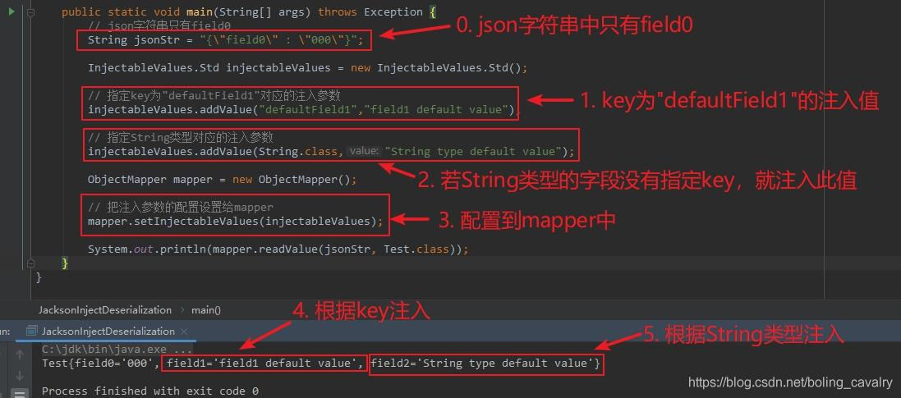


### JsonSerialize

1. JsonSerialize用于序列化场景，被此注解修饰的字段或者get方法会被用于序列化，并且using属性指定了执行序列化操作的类；
2. 执行序列化操作的类，需要继承自JsonSerializer，如下所示，Date2LongSerialize的作用是将Date类型转成long类型：

```java
    static class Date2LongSerialize extends JsonSerializer<Date> {

        @Override
        public void serialize(Date value, JsonGenerator gen, SerializerProvider serializers) throws IOException {
            gen.writeNumber(value.getTime());
        }
    }
```

1. Test类的field0字段是私有的，且没有get和set方法，但是添加了注释JsonDeserialize就能被反序列化了，并且使用Date2LongSerialize类对将json中的long型转成field0所需的Date型：

```java
    static class Test {
        @JsonDeserialize(using = Long2DateDeserialize.class)
        private Date field0;
        @Override
        public String toString() { return "Test{" + "field0='" + field0 + '\'' + '}'; }
    }
```

执行结果如下：

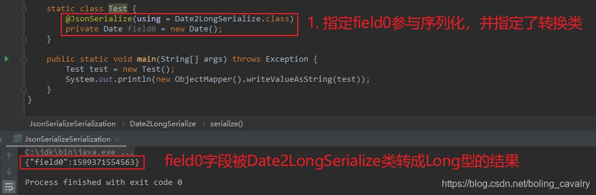


### JsonDeserialize

1. JsonDeserialize用于反序列化场景，被此注解修饰的字段或者set方法会被用于反序列化，并且using属性指定了执行反序列化操作的类；
2. 执行反序列化操作的类需要继承自JsonDeserializer，如下所示，Long2DateDeserialize的作用是将Long类型转成field0字段对应的Date类型：

```java
    static class Long2DateDeserialize extends JsonDeserializer<Date> {

        @Override
        public Date deserialize(JsonParser p, DeserializationContext ctxt) throws IOException, JsonProcessingException {

            if(null!=p && null!=ctxt && p.getLongValue()>0L ) {
                return new Date(p.getLongValue());
            }

            return null;
        }
    }
```

测试反序列化，结果如下：

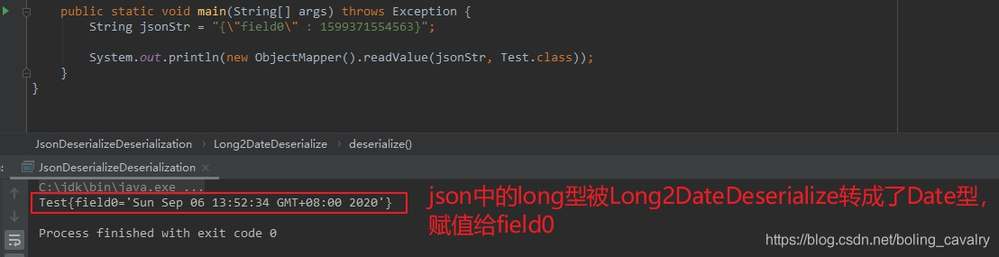


### JsonRawValue

使用该注解的字段或者方法，都会被序列化，但是序列化结果是原始值，例如字符串是不带双引号的：

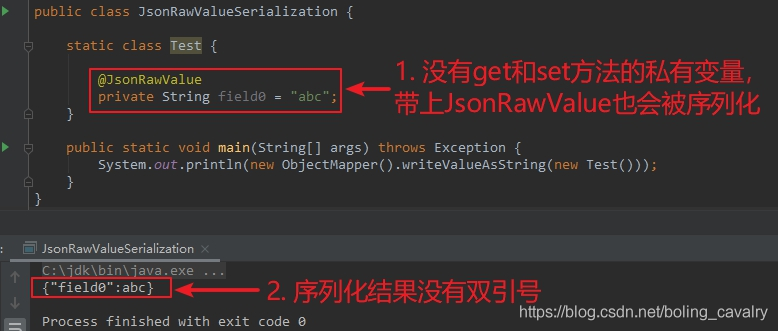


## 常用方法注解

### 本篇概览


- 本文是《jackson 学习》系列的第八篇，继续学习 jackson 强大的注解能力，本篇学习常用的方法注解，并通过实例来加深印象，下图是常用方法注解的简介：
  <!-- 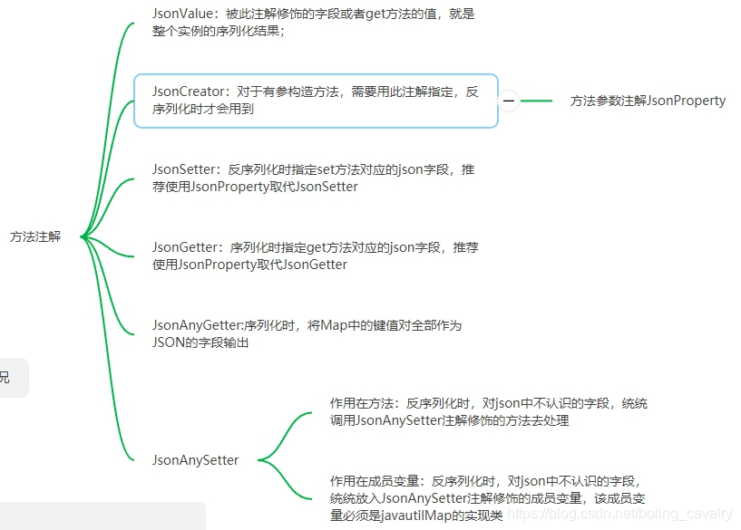 -->


### JsonValue


1. 在序列化时起作用，可以用来注解 get 方法或者成员变量；
2. 一个类中，JsonValue 只允许出现一次；
3. 如果注解的是 get 方法，那么该方法的返回值就是整个实例的序列化结果；
4. 如果注解的是成员变量，那么该成员变量的值就是整个实例的序列化结果；
5. 下面是用来测试的 Pojo 类，JsonValue 注解放在 getField0 方法上，此方法的返回值已经写死了 "abc"：


```java
    static class Test {

        private String field0;

        private String field1;

        @JsonValue
        public String getField0() { return "abc"; }

        public void setField0(String field0) { this.field0 = field0; }
        public String getField1() { return field1; }
        public void setField1(String field1) { this.field1 = field1; }
    }
```


1. Test 类的序列化结果如下，即 getField0 方法的返回值：
   <!-- 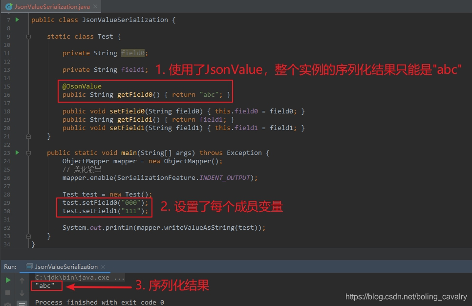 -->


### JsonCreator


1. 在反序列化时，当出现有参构造方法时（可能是多个有参构造方法），需要通过 JsonCreator 注解指定反序列化时用哪个构造方法，并且在入参处还要通过 JsonProperty 指定字段关系：


```java
    static class Test {

        private String field0;
        private String field1;


        public Test(String field0) {
            this.field0 = field0;
        }

        // 通过JsonCreator指定反序列化的时候使用这个构造方法
        // 通过JsonProperty指定字段关系
        @JsonCreator
        public Test(@JsonProperty("field0") String field0,
                    @JsonProperty("field1") String field1) {
            this.field0 = field0;
            this.field1 = field1;
        }

        @Override
        public String toString() {
            return "Test{" +
                    "field0='" + field0 + '\'' +
                    ", field1='" + field1 + '\'' +
                    '}';
        }
    }
```


1. 反序列化结果如下：
   <!-- 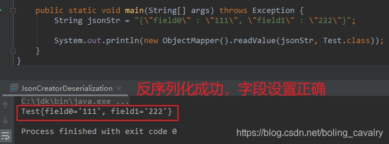 -->


### JsonSetter


1. JsonSetter 注解在 set 方法上，被用来在反序列化时指定 set 方法对应 json 的哪个属性；
2. JsonSetter 源码中，推荐使用 JsonProperty 来取代 JsonSetter：
   <!-- 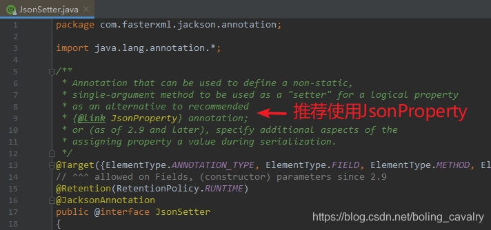 -->
3. 测试代码和结果如下，可见反序列化时，是按照 JsonSetter 的 value 去 json 中查找属性的：
   <!-- 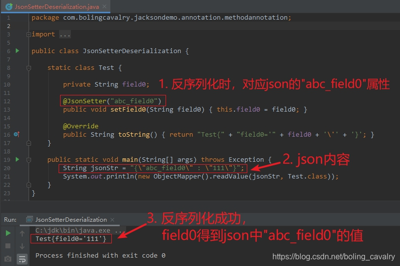 -->


### JsonGetter


1. JsonGetter 只能作为方法注解；
2. 在序列化时，被 JsonGetter 注解的 get 方法，对应的 json 字段名是 JsonGetter 的 value；
3. JsonGetter 源码中，推荐使用 JsonProperty 来取代 JsonGetter：
   <!-- 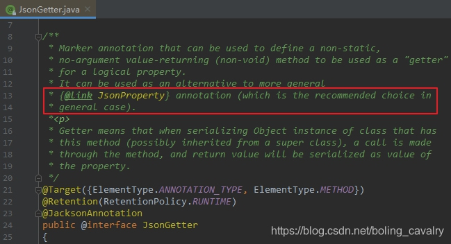 -->
4. 测试代码和结果如下，可见序列化时 JsonGetter 的 value 会被作为 json 字段名：
   <!-- 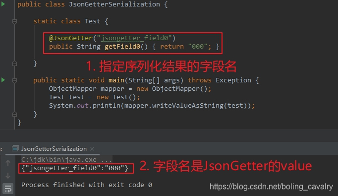 -->


### JsonAnyGetter


1. JsonAnyGetter 的作用有些特别：在序列化时，用 Map 对象的键值对转成 json 的字段和值；
2. 理解 JsonAnyGetter 最好的办法，是对比使用前后序列化结果的变化，先来看以下这段代码，是没有 JsonAnyGetter 注解的，Test 有两个成员变量，其中 map 字段是 HashMap 类型的：


```java
package com.bolingcavalry.jacksondemo.annotation.methodannotation;

import com.fasterxml.jackson.annotation.JsonAnyGetter;
import com.fasterxml.jackson.databind.ObjectMapper;
import com.fasterxml.jackson.databind.SerializationFeature;

import java.util.HashMap;
import java.util.Map;

public class JsonAnySetterSerialization {

    static class Test {
        private String field0;
        private Map<String, Object> map;

        public String getField0() { return field0; }
        public void setField0(String field0) { this.field0 = field0; }
        public void setMap(Map<String, Object> map) { this.map = map; }
        public Map<String, Object> getMap() { return map; }
    }

    public static void main(String[] args) throws Exception {
        ObjectMapper mapper = new ObjectMapper();
        // 美化输出
        mapper.enable(SerializationFeature.INDENT_OUTPUT);

        // 新增一个HashMap，里面放入两个元素
        Map<String, Object> map = new HashMap<>();
        map.put("aaa", "value_aaa");
        map.put("bbb", "value_bbb");

        Test test = new Test();
        test.setField0("000");

        // map赋值给test.map
        test.setMap(map);

        System.out.println(mapper.writeValueAsString(test));
    }
}
```


1. 上述代码的执行结果如下，其实很好理解，就是 field0 和 map 两个字段而已：


```json
{
  "field0" : "000",
  "map" : {
    "aaa" : "value_aaa",
    "bbb" : "value_bbb"
  }
}
```


1. 接下来，对上述代码做一处改动，如下图红框所示，给 getMap 方法增加 JsonAnyGetter 注解：
   <!-- 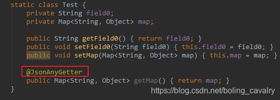 -->
2. 修改后的执行结果如下，原来的 map 字段没有了，map 内部的所有键值对都成了 json 的字段：


```json
{
  "field0" : "000",
  "aaa" : "value_aaa",
  "bbb" : "value_bbb"
}
```


1. 至此，可以品味出 JsonAnyGetter 的作用了：序列化时，将 Map 中的键值对全部作为 JSON 的字段输出；


### JsonAnySetter


1. 弄懂了前面的 JsonAnyGetter，对于 JsonAnySetter 的作用想必您也能大致猜到：反序列化时，对 json 中不认识的字段，统统调用 JsonAnySetter 注解修饰的方法去处理；
2. 测试的代码如下，Test 类的 setValue 方法被 JsonAnySetter 注解，在反序列化时，json 中的 aaa 和 bbb 字段，都会交给 setValue 方法处理，也就是放入 map 中：


```java
package com.bolingcavalry.jacksondemo.annotation.methodannotation;

import com.fasterxml.jackson.annotation.JsonAnySetter;
import com.fasterxml.jackson.annotation.JsonCreator;
import com.fasterxml.jackson.annotation.JsonProperty;
import com.fasterxml.jackson.databind.ObjectMapper;

import java.util.HashMap;
import java.util.Map;

public class JsonAnySetterDeserialization {

    static class Test {

        private String field0;
        
        private Map<String, Object> map = new HashMap<>();

        @JsonAnySetter
        public void setValue(String key, Object value) {
            map.put(key, value);
        }

        @Override
        public String toString() {
            return "Test{" +
                    "field0='" + field0 + '\'' +
                    ", map=" + map +
                    '}';
        }
    }

    public static void main(String[] args) throws Exception {
        String jsonStr = "{\n" +
                "  \"field0\" : \"000\",\n" +
                "  \"aaa\" : \"value_aaa\",\n" +
                "  \"bbb\" : \"value_bbb\"\n" +
                "}";

        System.out.println(new ObjectMapper().readValue(jsonStr, Test.class));
    }
}
```


1. 执行结果如下，可见 aaa、bbb 都被放入了 map 中：


```plain
Test{field0='null', map={aaa=value_aaa, field0=000, bbb=value_bbb}}
```


1. 另外 JsonAnySetter 还可以作用在成员变量上，上面的代码中，去掉 setValue 方法，在成员变量 map 上增加 JsonAnySetter 注解，修改后如下，执行结果也是一模一样的：


```java
    static class Test {

        private String field0;

        @JsonAnySetter
        private Map<String, Object> map = new HashMap<>();

        @Override
        public String toString() {
            return "Test{" +
                    "field0='" + field0 + '\'' +
                    ", map=" + map +
                    '}';
        }
    }
```


1. 注意，JsonAnySetter 作用在成员变量上时，该成员变量必须是 java.util.Map 的实现类；