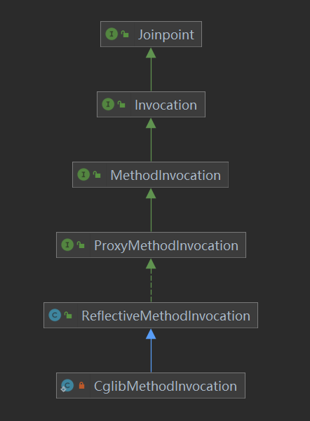
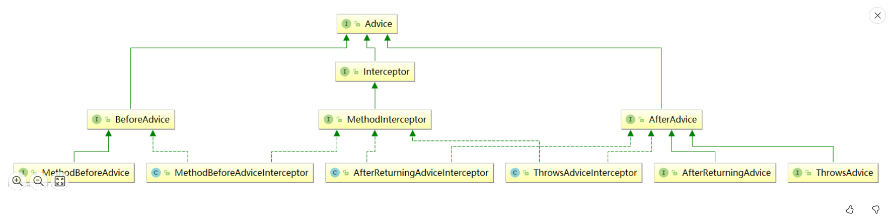
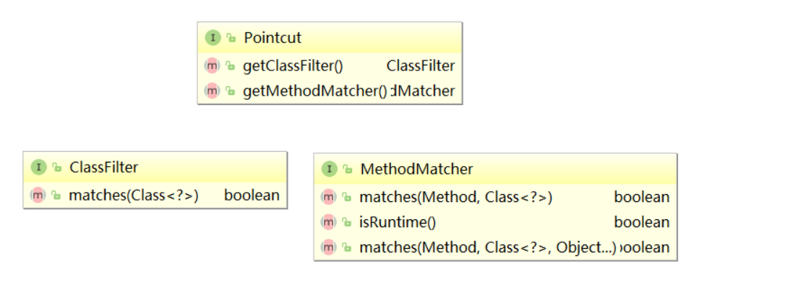
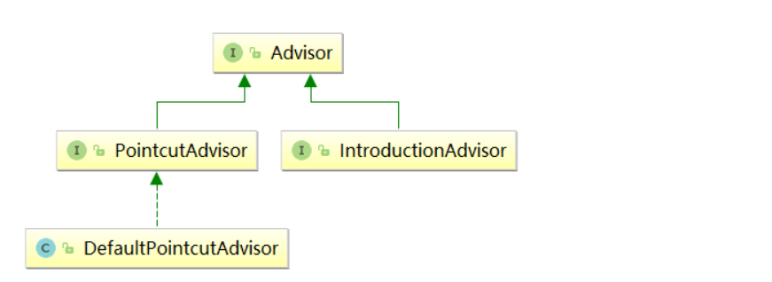

## AOP相关类

连接点JoinPoint相关类

通知Advice相关类

切入点Pointcut相关类

切面Advisor相关类

## 连接点 JoinPoint 相关类

### JointPoint接口

这个接口表示一个通用的运行时连接点（在AOP术语中）

```java
package org.aopalliance.intercept;
public interface Joinpoint {
    /**
     * 转到拦截器链中的下一个拦截器
     */
    Object proceed() throws Throwable;
    /**
     * 返回保存当前连接点静态部分【的对象】，这里一般指被代理的目标对象
     */
    Object getThis();
    /**
     * 返回此静态连接点  一般就为当前的Method(至少目前的唯一实现是MethodInvocation,所以连接点得静态部分肯定就是本方法)
     */
    AccessibleObject getStaticPart();
}
```

子类及相关实现如下：




### Invocation接口

此接口表示程序中的调用，调用是一个连接点，可以被拦截器拦截。

```java
package org.aopalliance.intercept;
/**
 * 此接口表示程序中的调用
 * 调用是一个连接点，可以被拦截器拦截。
 */
public interface Invocation extends Joinpoint {
    /**
     * 将参数作为数组对象获取，可以更改此数组中的元素值以更改参数。
     * 通常用来获取调用目标方法的参数
     */
    Object[] getArguments();
}
```


### MethodInvocation接口

用来表示连接点中方法的调用，可以获取调用过程中的目标方法。

```java
package org.aopalliance.intercept;
import java.lang.reflect.Method;
/**
 * 方法调用的描述，在方法调用时提供给拦截器。
 * 方法调用是一个连接点，可以被方法拦截器拦截。
 */
public interface MethodInvocation extends Invocation {
    /**
     * 返回正在被调用得方法~~~  返回的是当前Method对象。
     * 此时，效果同父类的AccessibleObject getStaticPart() 这个方法
     */
    Method getMethod();
}
```

### ProxyMethodInvocation接口

表示代理方法的调用

```java
public interface ProxyMethodInvocation extends MethodInvocation {
    /**
     * 获取被调用的代理对象
     */
    Object getProxy();
    /**
     * 克隆一个方法调用器MethodInvocation
     */
    MethodInvocation invocableClone();
    /**
     * 克隆一个方法调用器MethodInvocation，并为方法调用器指定参数
     */
    MethodInvocation invocableClone(Object... arguments);
    /**
     * 设置要用于此链中任何通知的后续调用的参数。
     */
    void setArguments(Object... arguments);
    /**
     * 添加一些扩展用户属性，这些属性不在AOP框架内使用。它们只是作为调用对象的一部分保留，用于特殊的拦截器。
     */
    void setUserAttribute(String key, @Nullable Object value);
    /**
     * 根据key获取对应的用户属性
     */
    @Nullable
    Object getUserAttribute(String key);
}
```

通俗点理解：连接点表示方法的调用过程，内部包含了方法调用过程中的所有信息，比如被调用的方法、目标、代理对象、执行拦截器链等信息。

上面定义都是一些接口，最终有2个实现。

### ReflectiveMethodInvocation

当代理对象是采用jdk动态代理创建的，通过代理对象来访问目标对象的方法的时，最终过程是由ReflectiveMethodInvocation来处理的，内部会通过递归调用方法拦截器，最终会调用到目标方法。

### CglibMethodInvocation

功能和上面的类似，当代理对象是采用cglib创建的，通过代理对象来访问目标对象的方法的时，最终过程是由CglibMethodInvocation来处理的，内部会通过递归调用方法拦截器，最终会调用到目标方法。


## Advice通知相关的类



### Advice 接口

通知的底层接口

```java
package org.aopalliance.aop;
public interface Advice {
}
```

### BeforeAdvice 接口

方法前置通知，内部空的

```java
package org.springframework.aop;
public interface BeforeAdvice extends Advice {
}
```

### Interceptor 接口

此接口表示通用拦截器

```java
package org.aopalliance.intercept;
public interface Interceptor extends Advice {
}
```

### MethodInterceptor 接口

方法拦截器，所有的通知均需要转换为 MethodInterceptor 类型的，最终多个 MethodInterceptor 组成一个方法拦截器连。

```java
package org.aopalliance.intercept;
@FunctionalInterface
public interface MethodInterceptor extends Interceptor {
    /**
     * 拦截目标方法的执行，可以在这个方法内部实现需要增强的逻辑，以及主动调用目标方法
     */
    Object invoke(MethodInvocation invocation) throws Throwable;
}
```

### AfterAdvice 接口

后置通知的公共标记接口

```java
package org.springframework.aop;
public interface AfterAdvice extends Advice {
}
```

### MethodBeforeAdvice 接口

方法执行前通知，需要在目标方法执行前执行一些逻辑的，可以通过这个实现。

通俗点说：需要在目标方法执行之前增强一些逻辑，可以通过这个接口来实现。before 方法：在调用给定方法之前回调。

```java
package org.springframework.aop;
public interface MethodBeforeAdvice extends BeforeAdvice {
    /**
     * 调用目标方法之前会先调用这个before方法
     * method：需要执行的目标方法
     * args：目标方法的参数
     * target：目标对象
     */
    void before(Method method, Object[] args, @Nullable Object target) throws Throwable;
}
```

如同

```java
public Object invoke(){
    调用MethodBeforeAdvice#before方法
    return 调用目标方法;
}
```

### AfterReturningAdvice 接口

方法执行后通知，需要在目标方法执行之后执行增强一些逻辑的，可以通过这个实现。

**不过需要注意一点：目标方法正常执行后，才会回调这个接口，当目标方法有异常，那么这通知会被跳过。**

```java
package org.springframework.aop;
public interface AfterReturningAdvice extends AfterAdvice {
    /**
     * 目标方法执行之后会回调这个方法
     * method：需要执行的目标方法
     * args：目标方法的参数
     * target：目标对象
     */
    void afterReturning(@Nullable Object returnValue, Method method, Object[] args, @Nullable Object target) throws Throwable;
}

```

如同

```
public Object invoke(){
    Object retVal = 调用目标方法;
    调用AfterReturningAdvice#afterReturning方法
    return retVal;
}

```

### ThrowsAdvice 接口

```java
package org.springframework.aop;
public interface ThrowsAdvice extends AfterAdvice {
}

```

此接口上没有任何方法，因为方法由反射调用，实现类必须实现以下形式的方法，前 3 个参数是可选的，最后一个参数为需要匹配的异常的类型。

```java
void afterThrowing([Method, args, target], ThrowableSubclass);
```

有效方法的一些例子如下：

```java
public void afterThrowing(Exception ex)
public void afterThrowing(RemoteException)
public void afterThrowing(Method method, Object[] args, Object target, Exception ex)
public void afterThrowing(Method method, Object[] args, Object target, ServletException ex)
```

### 通知包装器

负责将各种非MethodInterceptor类型的通知(Advice)包装为MethodInterceptor类型。

刚才有说过：Aop中所有的Advice最终都会转换为MethodInterceptor类型的，组成一个方法调用链，然后执行

3个包装器类

- MethodBeforeAdviceInterceptor
- AfterReturningAdviceInterceptor
- ThrowsAdviceInterceptor


#### MethodBeforeAdviceInterceptor 类

这个类实现了`MethodInterceptor`接口，负责将`MethodBeforeAdvice`方法前置通知包装为`MethodInterceptor`类型，创建这个类型的对象的时候需要传递一个`MethodBeforeAdvice`类型的参数，重点是`invoke`方法

```java
package org.springframework.aop.framework.adapter;
@SuppressWarnings("serial")
public class MethodBeforeAdviceInterceptor implements MethodInterceptor, BeforeAdvice, Serializable {
    private final MethodBeforeAdvice advice;
    public MethodBeforeAdviceInterceptor(MethodBeforeAdvice advice) {
        Assert.notNull(advice, "Advice must not be null");
        this.advice = advice;
    }
    @Override
    public Object invoke(MethodInvocation mi) throws Throwable {
        //负责调用前置通知的方法
        this.advice.before(mi.getMethod(), mi.getArguments(), mi.getThis());
        //继续执行方法调用链
        return mi.proceed();
    }
}
```

#### AfterReturningAdviceInterceptor 类

这个类实现了`MethodInterceptor`接口，负责将`AfterReturningAdvice`方法后置通知包装为`MethodInterceptor`类型，创建这个类型的对象的时候需要传递一个`AfterReturningAdvice`类型的参数，重点是`invoke`方法

```java
public class AfterReturningAdviceInterceptor implements MethodInterceptor, AfterAdvice, Serializable {
    private final AfterReturningAdvice advice;
    public AfterReturningAdviceInterceptor(AfterReturningAdvice advice) {
        Assert.notNull(advice, "Advice must not be null");
        this.advice = advice;
    }
    @Override
    public Object invoke(MethodInvocation mi) throws Throwable {
        //先执行方法调用链,可以获取目标方法的执行结果
        Object retVal = mi.proceed();
        //执行后置通知
        this.advice.afterReturning(retVal, mi.getMethod(), mi.getArguments(), mi.getThis());
        //返回结果
        return retVal;
    }
}
```


#### ThrowsAdviceInterceptor 类

这个类实现了`MethodInterceptor`接口，负责将`ThrowsAdvice`异常通知包装为`MethodInterceptor`类型，创建这个类型的对象的时候需要传递一个`Object`类型的参数，通常这个参数是`ThrowsAdvice`类型的，重点是`invoke`方法

```java
package org.springframework.aop.framework.adapter;
public class ThrowsAdviceInterceptor implements MethodInterceptor, AfterAdvice {
    private static final String AFTER_THROWING = "afterThrowing";
    private final Object throwsAdvice;
    //创建ThrowsAdviceInterceptor
    public ThrowsAdviceInterceptor(Object throwsAdvice) {
        Assert.notNull(throwsAdvice, "Advice must not be null");
        this.throwsAdvice = throwsAdvice;
        //获取异常通知中定义的所有方法（public、默认的、protected、private）
        Method[] methods = throwsAdvice.getClass().getMethods();
        //轮询methods
        for (Method method : methods) {
            //方法名称为afterThrowing && 方法参数为1或者4
            if (method.getName().equals(AFTER_THROWING) &&
                    (method.getParameterCount() == 1 || method.getParameterCount() == 4)) {
                //获取方法的最后一个参数类型
                Class<?> throwableParam = method.getParameterTypes()[method.getParameterCount() - 1];
                //判断方法参数类型是不是Throwable类型的
                if (Throwable.class.isAssignableFrom(throwableParam)) {
                    // 缓存异常处理方法到map中（异常类型->异常处理方法）
                    this.exceptionHandlerMap.put(throwableParam, method);
                }
            }
        }
        //如果exceptionHandlerMap，抛出异常，所以最少要有一个异常处理方法
        if (this.exceptionHandlerMap.isEmpty()) {
            throw new IllegalArgumentException(
                    "At least one handler method must be found in class [" + throwsAdvice.getClass() + "]");
        }
    }
    /**
     * 获取异常通知中自定义的处理异常方法的数量
     */
    public int getHandlerMethodCount() {
        return this.exceptionHandlerMap.size();
    }
    @Override
    public Object invoke(MethodInvocation mi) throws Throwable {
        try {
            //调用通知链
            return mi.proceed();
        }
        catch (Throwable ex) {
            //获取异常通知中自定义的处理异常的方法
            Method handlerMethod = getExceptionHandler(ex);
            //当处理的方法不为空
            if (handlerMethod != null) {
                //调用异常处理方法
                invokeHandlerMethod(mi, ex, handlerMethod);
            }
            //继续向外抛出异常
            throw ex; //@1
        }
    }
    /**
     * 获取throwsAdvice中处理exception参数指定的异常的方法
     */
    @Nullable
    private Method getExceptionHandler(Throwable exception) {
        //获取异常类型
        Class<?> exceptionClass = exception.getClass();
        //从缓存中获取异常类型对应的方法
        Method handler = this.exceptionHandlerMap.get(exceptionClass);
        //来一个循环，查询处理方法，循环条件：方法为空 && 异常类型!=Throwable
        while (handler == null && exceptionClass != Throwable.class) {
            //获取异常的父类型
            exceptionClass = exceptionClass.getSuperclass();
            //从缓存中查找异常对应的处理方法
            handler = this.exceptionHandlerMap.get(exceptionClass);
        }
        //将查找结果返回
        return handler;
    }
    //通过反射调用异常通知中的异常方法
    private void invokeHandlerMethod(MethodInvocation mi, Throwable ex, Method method) throws Throwable {
        //构建方法请求参数
        Object[] handlerArgs;
        //若只有1个参数，参数为：异常对象
        if (method.getParameterCount() == 1) {
            handlerArgs = new Object[] {ex};
        }
        else {
            //4个参数（方法、方法请求参数、目标对象、异常对象）
            handlerArgs = new Object[] {mi.getMethod(), mi.getArguments(), mi.getThis(), ex};
        }
        try {
            //通过反射调用异常通知中的方法
            method.invoke(this.throwsAdvice, handlerArgs);
        }
        catch (InvocationTargetException targetEx) {
            throw targetEx.getTargetException();
        }
    }
}

```

从上面可以看出，异常通知，自定义处理异常的方法有几个特点

1.  方法名称必须为`afterThrowing`
2.  方法参数必须 1 个或 4 个，最后一个参数是`Throwable`类型或其子类型
3.  可以在异常处理中记录一些异常信息，这个还是比较有用的，但是注意一点目标方法抛出的异常最后还是会向外继续抛出`@1`


## 切入点 (PointCut) 相关类

通知（Advice）用来指定需要增强的逻辑，但是哪些类的哪些方法中需要使用这些通知呢？这个就是通过切入点来配置的。



### PointCut 接口

```java
package org.springframework.aop;
public interface Pointcut {
    /**
     * 类过滤器, 可以知道哪些类需要拦截
     */
    ClassFilter getClassFilter();
    /**
     * 方法匹配器, 可以知道哪些方法需要拦截
     */
    MethodMatcher getMethodMatcher();
    /**
     * 匹配所有对象的 Pointcut，内部的2个过滤器默认都会返回true
     */
    Pointcut TRUE = TruePointcut.INSTANCE;
}

```

### ClassFilter 接口

类过滤器。

```java
@FunctionalInterface
public interface ClassFilter {
    /**
     * 用来判断目标类型是否匹配
     */
    boolean matches(Class<?> clazz);
}

```

### MethodMatcher 接口

方法过滤器。

```java
public interface MethodMatcher {
    /**
     * 执行静态检查给定方法是否匹配
     * @param method 目标方法
     * @param targetClass 目标对象类型
     */
    boolean matches(Method method, Class<?> targetClass);
    /**
     * 是否是动态匹配，即是否每次执行目标方法的时候都去验证一下
     */
    boolean isRuntime();
    /**
     * 动态匹配验证的方法，比第一个matches方法多了一个参数args，这个参数是调用目标方法传入的参数
     */
    boolean matches(Method method, Class<?> targetClass, Object... args);
    /**
     * 匹配所有方法，这个内部的2个matches方法任何时候都返回true
     */
    MethodMatcher TRUE = TrueMethodMatcher.INSTANCE;
}

```

为什么需要 2 个 maches 方法？什么是动态匹配？

比如下面一个类

```java
public class UserService{
    public void work(String userName){
        System.out.print(userName+",开始工作了!");
    }
}
```

work 方法表示当前用户的工作方法，内部可以实现一些工作的逻辑。

我们希望通过 aop 对这个类进行增强，调用这个方法的时候，当传入的用户名是`路人的粉丝的`的时候，需要先进行问候，其他用户的时候，无需问候，将这个问题的代码可以放在 MethodBeforeAdvice 中实现，这种情况就是当参数满足一定的条件了，才会使用这个通知，不满足的时候，通知无效，此时就可以使用上面的动态匹配来实现，MethodMatcher 类中 3 个参数的 matches 方法可以用来对目标方法的参数做校验。

来看一下`MethodMatcher`过滤的整个过程：

1. 调用matches(Method method, Class<?> targetClass)方法，验证方法是否匹配
2. isRuntime方法是否为true，如果为false，则以第一步的结果为准，否则继续向下
3. 调用matches(Method method, Class<?> targetClass, Object... args)方法继续验证，这个方法多了一个参数，可以对目标方法传入的参数进行校验。


通过上面的过程，大家可以看出来，如果`isRuntime`为 false 的时候，只需要对方法名称进行校验，当目标方法调用多次的时候，实际上第一步的验证结果是一样的，所以如果`isRuntime`为 false 的情况，可以将验证结果放在缓存中，提升效率，而 spring 内部就是这么做的，`isRuntime`为 false 的时候，需要每次都进行校验，效率会低一些，不过对性能的影响基本上可以忽略。


顾问 (Advisor)
------------

通知定义了需要做什么，切入点定义了在哪些类的哪些方法中执行通知，那么需要将他们 2 个组合起来才有效啊。

顾问（Advisor）就是做这个事情的。

在 spring aop 中，你可以将 advisor 理解为切面，切面中通常有 2 个关键信息：

- 需要增强的目标方法列表，这个通过切入点 (Pointcut) 来指定
- 需要在目标方法中增强的逻辑，这个通过 (Advice) 通知来指定



### Advisor 接口

```java
package org.springframework.aop;
import org.aopalliance.aop.Advice;
/**
 * 包含AOP通知（在joinpoint处执行的操作）和确定通知适用性的过滤器（如切入点[PointCut]）的基本接口。
 * 这个接口不是供Spring用户使用的，而是为了支持不同类型的建议的通用性。
 */
public interface Advisor {
    /**
     * 返回引用的通知
     */
    Advice getAdvice();
}

```

上面这个接口通常不会直接使用，这个接口有 2 个子接口，通常我们会和这 2 个子接口来打交道，下面看一下这 2 个子接口。

### PointcutAdvisor 接口

通过名字就能看出来，这个和 Pointcut 有关，内部有个方法用来获取`Pointcut`，AOP 使用到的大部分 Advisor 都属于这种类型的。

在目标方法中实现各种增强功能基本上都是通过 PointcutAdvisor 来实现的。

```java
package org.springframework.aop;
/**
 * 切入点类型的Advisor
 */
public interface PointcutAdvisor extends Advisor {
    /**
     * 获取顾问中使用的切入点
     */
    Pointcut getPointcut();
}

```

### DefaultPointcutAdvisor 类

PointcutAdvisor 的默认实现，这是最常用的 Advisor 实现，它可以用于任何 Pointcut 和 Advice 类型，代码相当简单，里面定义了 2 个属性：pointcut 和 advisor，由使用者指定。


