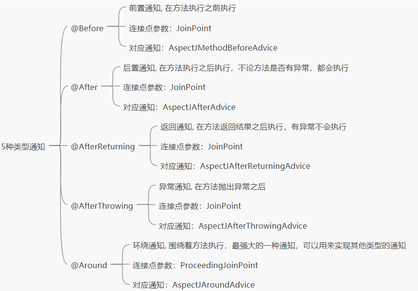

# Spring AOP中5种通知详解


> 原文地址 [itsoku.com](http://itsoku.com/course/11/117)


@Aspect 中有 5 种通知
----------------

1.  @Before：前置通知, 在方法执行之前执行
2.  @Aroud：环绕通知, 围绕着方法执行
3.  @After：后置通知, 在方法执行之后执行
4.  @AfterReturning：返回通知, 在方法返回结果之后执行
5.  @AfterThrowing：异常通知, 在方法抛出异常之后

这几种通知用起来都比较简单，都是通过注解的方式，将这些注解标注在 @Aspect 类的方法上，这些方法就会对目标方法进行拦截，下面我们一个个来看一下。

@Before：前置通知
------------

### 介绍

定义一个前置通知

```
@Aspect
public class BeforeAspect {
    @Before("execution(* com.javacode2018.aop.demo10.test1.Service1.*(..))")
    public void before(JoinPoint joinPoint) {
        System.out.println("我是前置通知!");
    }
}

```

1.  类上需要使用`@Aspect`标注
2.  任意方法上使用`@Before`标注，将这个方法作为前置通知，目标方法被调用之前，会自动回调这个方法
3.  被`@Before`标注的方法参数可以为空，或者为`JoinPoint`类型，当为`JoinPoint`类型时，必须为第一个参数
4.  被`@Before`标注的方法名称可以随意命名，符合 java 规范就可以，其他通知也类似

`@Before`中 value 的值为切入点表达式，也可以采用引用的方式指定切入点，如：

```
package com.javacode2018.aop.demo10.test1;
import org.aspectj.lang.JoinPoint;
import org.aspectj.lang.annotation.Aspect;
import org.aspectj.lang.annotation.Before;
import org.aspectj.lang.annotation.Pointcut;
@Aspect
public class BeforeAspect {
    @Pointcut("execution(* com.javacode2018.aop.demo10.test1.Service1.*(..))")
    public void pc() {
    }
    @Before("com.javacode2018.aop.demo10.test1.BeforeAspect.pc()")
    public void before(JoinPoint joinPoint) {
        System.out.println("我是前置通知!");
    }
}

```

此时，before 方法上面的切入引用了 pc 方法上面的`@Pointcut`的值

### 案例

来个普通的 service

```
package com.javacode2018.aop.demo10.test1;
public class Service1 {
    public String say(String name) {
        return "你好：" + name;
    }
    public String work(String name) {
        return "开始工作了：" + name;
    }
}

```

给上面的类定义一个前置通知，`Service1`中的所有方法执行执行，输出一段文字`我是前置通知!`

```
package com.javacode2018.aop.demo10.test1;
import org.aspectj.lang.JoinPoint;
import org.aspectj.lang.annotation.Aspect;
import org.aspectj.lang.annotation.Before;
import org.aspectj.lang.annotation.Pointcut;
@Aspect
public class BeforeAspect1 {
    @Pointcut("execution(* com.javacode2018.aop.demo10.test1.Service1.*(..))")
    public void pc() {
    }
    @Before("com.javacode2018.aop.demo10.test1.BeforeAspect1.pc()")
    public void before(JoinPoint joinPoint) {
        System.out.println("我是前置通知!");
    }
}

```

测试代码

```
package com.javacode2018.aop.demo10;
import com.javacode2018.aop.demo10.test1.BeforeAspect1;
import com.javacode2018.aop.demo10.test1.Service1;
import org.junit.Test;
import org.springframework.aop.aspectj.annotation.AspectJProxyFactory;
public class AopTest10 {
    @Test
    public void test1() {
        Service1 target = new Service1();
        Class<BeforeAspect1> aspectClass = BeforeAspect1.class;
        AspectJProxyFactory proxyFactory = new AspectJProxyFactory();
        proxyFactory.setTarget(target);
        proxyFactory.addAspect(aspectClass);
        Service1 proxy = proxyFactory.getProxy();
        System.out.println(proxy.say("路人"));
        System.out.println(proxy.work("路人"));
    }
}

```

运行输出

```
我是前置通知!
你好：路人
我是前置通知!
开始工作了：路人

```

### 对应的通知类

@Before 通知最后会被解析为下面这个通知类

```
org.springframework.aop.aspectj.AspectJMethodBeforeAdvice
```

通知中获取被调方法信息
-----------

通知中如果想获取被调用方法的信息，分 2 种情况

1.  非环绕通知，可以将`org.aspectj.lang.JoinPoint`作为通知方法的第 1 个参数，通过这个参数获取被调用方法的信息
2.  如果是环绕通知，可以将`org.aspectj.lang.ProceedingJoinPoint`作为方法的第 1 个参数，通过这个参数获取被调用方法的信息

### JoinPoint：连接点信息

```
org.aspectj.lang.JoinPoint
```

提供访问当前被通知方法的目标对象、代理对象、方法参数等数据：

```
package org.aspectj.lang;  
import org.aspectj.lang.reflect.SourceLocation;
public interface JoinPoint {  
    String toString();         //连接点所在位置的相关信息  
    String toShortString();     //连接点所在位置的简短相关信息  
    String toLongString();     //连接点所在位置的全部相关信息  
    Object getThis();         //返回AOP代理对象
    Object getTarget();       //返回目标对象  
    Object[] getArgs();       //返回被通知方法参数列表，也就是目前调用目标方法传入的参数  
    Signature getSignature();  //返回当前连接点签名，这个可以用来获取目标方法的详细信息，如方法Method对象等
    SourceLocation getSourceLocation();//返回连接点方法所在类文件中的位置  
    String getKind();        //连接点类型  
    StaticPart getStaticPart(); //返回连接点静态部分  
}

```

### ProceedingJoinPoint：环绕通知连接点信息

用于环绕通知，内部主要关注 2 个方法，一个有参的，一个无参的，用来继续执行拦截器链上的下一个通知。

```
package org.aspectj.lang;
import org.aspectj.runtime.internal.AroundClosure;
public interface ProceedingJoinPoint extends JoinPoint {
    /**
     * 继续执行下一个通知或者目标方法的调用
     */
    public Object proceed() throws Throwable;
    /**
     * 继续执行下一个通知或者目标方法的调用
     */
    public Object proceed(Object[] args) throws Throwable;
}

```

### Signature：连接点签名信息

注意`JoinPoint#getSignature()`这个方法，用来获取连接点的签名信息，这个比较重要

```
Signature getSignature();
```

通常情况，spring 中的 aop 都是用来对方法进行拦截，所以通常情况下连接点都是一个具体的方法，`Signature`有个子接口

```
org.aspectj.lang.reflect.MethodSignature
```

`JoinPoint#getSignature()`都可以转换转换为`MethodSignature`类型，然后可以通过这个接口提供的一些方法来获取被调用的方法的详细信息。

下面对上面的前置通知的案例改造一下，获取被调用方法的详细信息，新建一个 Aspect 类：`BeforeAspect2`

```
package com.javacode2018.aop.demo10.test2;
import org.aspectj.lang.JoinPoint;
import org.aspectj.lang.Signature;
import org.aspectj.lang.annotation.Aspect;
import org.aspectj.lang.annotation.Before;
import org.aspectj.lang.annotation.Pointcut;
import org.aspectj.lang.reflect.MethodSignature;
import java.lang.reflect.Method;
@Aspect
public class BeforeAspect2 {
    @Pointcut("execution(* com.javacode2018.aop.demo10.test1.Service1.*(..))")
    public void pc() {
    }
    @Before("com.javacode2018.aop.demo10.test2.BeforeAspect2.pc()")
    public void before(JoinPoint joinPoint) {
        //获取连接点签名
        Signature signature = joinPoint.getSignature();
        //将其转换为方法签名
        MethodSignature methodSignature = (MethodSignature) signature;
        //通过方法签名获取被调用的目标方法
        Method method = methodSignature.getMethod();
        //输出方法信息
        System.out.println(method);
    }
}

```

测试用例

```
@Test
public void test2() {
    Service1 target = new Service1();
    Class<BeforeAspect2> aspectClass = BeforeAspect2.class;
    AspectJProxyFactory proxyFactory = new AspectJProxyFactory();
    proxyFactory.setTarget(target);
    proxyFactory.addAspect(aspectClass);
    Service1 proxy = proxyFactory.getProxy();
    System.out.println(proxy.say("路人"));
    System.out.println(proxy.work("路人"));
}

```

运行输出

```
public java.lang.String com.javacode2018.aop.demo10.test1.Service1.say(java.lang.String)
你好：路人
public java.lang.String com.javacode2018.aop.demo10.test1.Service1.work(java.lang.String)
开始工作了：路人

```

@Around：环绕通知
------------

### 介绍

环绕通知会包裹目标目标方法的执行，可以在通知内部调用`ProceedingJoinPoint.process`方法继续执行下一个拦截器。

用起来和 @Before 类似，但是有 2 点不一样

1.  若需要获取目标方法的信息，需要将 ProceedingJoinPoint 作为第一个参数
2.  通常使用 Object 类型作为方法的返回值，返回值也可以为 void

### 特点

环绕通知比较特殊，其他 4 种类型的通知都可以用环绕通知来实现。

### 案例

通过环绕通知来统计方法的耗时。

```
package com.javacode2018.aop.demo10.test3;
import org.aspectj.lang.ProceedingJoinPoint;
import org.aspectj.lang.Signature;
import org.aspectj.lang.annotation.Around;
import org.aspectj.lang.annotation.Aspect;
import org.aspectj.lang.annotation.Pointcut;
import org.aspectj.lang.reflect.MethodSignature;
import java.lang.reflect.Method;
@Aspect
public class AroundAspect3 {
    @Pointcut("execution(* com.javacode2018.aop.demo10.test1.Service1.*(..))")
    public void pc() {
    }
    @Around("com.javacode2018.aop.demo10.test3.AroundAspect3.pc()")
    public Object around(ProceedingJoinPoint joinPoint) throws Throwable {
        //获取连接点签名
        Signature signature = joinPoint.getSignature();
        //将其转换为方法签名
        MethodSignature methodSignature = (MethodSignature) signature;
        //通过方法签名获取被调用的目标方法
        Method method = methodSignature.getMethod();
        long startTime = System.nanoTime();
        //调用proceed方法，继续调用下一个通知
        Object returnVal = joinPoint.proceed();
        long endTime = System.nanoTime();
        long costTime = endTime - startTime;
        //输出方法信息
        System.out.println(String.format("%s，耗时(纳秒)：%s", method.toString(), costTime));
        //返回方法的返回值
        return returnVal;
    }
}

```

测试用例

```
@Test
public void test3() {
    Service1 target = new Service1();
    Class<AroundAspect3> aspectClass = AroundAspect3.class;
    AspectJProxyFactory proxyFactory = new AspectJProxyFactory();
    proxyFactory.setTarget(target);
    proxyFactory.addAspect(aspectClass);
    Service1 proxy = proxyFactory.getProxy();
    System.out.println(proxy.say("路人"));
    System.out.println(proxy.work("路人"));
}

```

运行输出

```
public java.lang.String com.javacode2018.aop.demo10.test1.Service1.say(java.lang.String)，耗时(纳秒)：19000500
你好：路人
public java.lang.String com.javacode2018.aop.demo10.test1.Service1.work(java.lang.String)，耗时(纳秒)：59600
开始工作了：路人

```

### 对应的通知类

@Around 通知最后会被解析为下面这个通知类

```
org.springframework.aop.aspectj.AspectJAroundAdvice
```

@After：后置通知
-----------

### 介绍

后置通知，在方法执行之后执行，用法和前置通知类似。

### 特点

*   **不管目标方法是否有异常，后置通知都会执行**
*   这种通知无法获取方法返回值
*   可以使用`JoinPoint`作为方法的第一个参数，用来获取连接点的信息

### 案例

在`Service1`中任意方法执行完毕之后，输出一行日志。

```
package com.javacode2018.aop.demo10.test4;
import org.aspectj.lang.JoinPoint;
import org.aspectj.lang.annotation.After;
import org.aspectj.lang.annotation.Aspect;
import org.aspectj.lang.annotation.Pointcut;
import org.aspectj.lang.reflect.MethodSignature;
@Aspect
public class AfterAspect4 {
    @Pointcut("execution(* com.javacode2018.aop.demo10.test1.Service1.*(..))")
    public void pc() {
    }
    @After("com.javacode2018.aop.demo10.test4.AfterAspect4.pc()")
    public void after(JoinPoint joinPoint) throws Throwable {
        MethodSignature methodSignature = (MethodSignature) joinPoint.getSignature();
        System.out.println(String.format("%s,执行完毕!", methodSignature.getMethod()));
    }
}

```

测试案例

```
@Test
public void test4() {
    Service1 target = new Service1();
    Class<AfterAspect4> aspectClass = AfterAspect4.class;
    AspectJProxyFactory proxyFactory = new AspectJProxyFactory();
    proxyFactory.setTarget(target);
    proxyFactory.addAspect(aspectClass);
    Service1 proxy = proxyFactory.getProxy();
    System.out.println(proxy.say("路人"));
    System.out.println(proxy.work("路人"));
}

```

运行输出

```
public java.lang.String com.javacode2018.aop.demo10.test1.Service1.say(java.lang.String),执行完毕!
你好：路人
public java.lang.String com.javacode2018.aop.demo10.test1.Service1.work(java.lang.String),执行完毕!
开始工作了：路人

```

### 对应的通知类

@After 通知最后会被解析为下面这个通知类

```
org.springframework.aop.aspectj.AspectJAfterAdvice
```

这个类中有`invoke`方法，这个方法内部会调用被通知的方法，其内部采用`try..finally`的方式实现的，所以不管目标方法是否有异常，通知一定会被执行。

```
@Override
public Object invoke(MethodInvocation mi) throws Throwable {
    try {
        //继续执行下一个拦截器
        return mi.proceed();
    }
    finally {
        //内部通过反射调用被@After标注的方法
        invokeAdviceMethod(getJoinPointMatch(), null, null);
    }
}

```

@AfterReturning：返回通知
--------------------

### 用法

返回通知，在方法返回结果之后执行。

### 特点

*   可以获取到方法的返回值
*   当目标方法返回异常的时候，这个通知不会被调用，这点和 @After 通知是有区别的

### 案例

后置通知中打印出方法及返回值信息。

```
package com.javacode2018.aop.demo10.test5;
import org.aspectj.lang.JoinPoint;
import org.aspectj.lang.annotation.AfterReturning;
import org.aspectj.lang.annotation.Aspect;
import org.aspectj.lang.annotation.Pointcut;
import org.aspectj.lang.reflect.MethodSignature;
@Aspect
public class AfterReturningAspect5 {
    @Pointcut("execution(* com.javacode2018.aop.demo10.test1.Service1.*(..))")
    public void pc() {
    }
    @AfterReturning(value = "com.javacode2018.aop.demo10.test5.AfterReturningAspect5.pc()", returning = "retVal")
    public void afterReturning(JoinPoint joinPoint, Object retVal) throws Throwable {
        MethodSignature methodSignature = (MethodSignature) joinPoint.getSignature();
        System.out.println(String.format("%s返回值：%s", methodSignature.getMethod(), retVal));
    }
}

```

> 注意`@AfterReturning`注解，用到了 2 个参数
>
> *   value：用来指定切入点
> *   returning：用来指定返回值对应方法的参数名称，返回值对应方法的第二个参数，名称为 retVal

### 对应的通知类

@AfterReturning 通知最后会被解析为下面这个通知类

```
org.springframework.aop.aspectj.AspectJAfterReturningAdvice
```

@AfterThrowing：异常通知
-------------------

### 用法

在方法抛出异常之后会回调`@AfterThrowing`标注的方法。

@AfterThrowing 标注的方法可以指定异常的类型，当被调用的方法触发该异常及其子类型的异常之后，会触发异常方法的回调。也可以不指定异常类型，此时会匹配所有异常。

#### 未指定异常类型

> 未指定异常类型，可以匹配所有异常类型，如下

```
@AfterThrowing(value = "切入点")
public void afterThrowing()

```

#### 指定异常类型

> 通过`@AfterThrowing`的`throwing`指定参数异常参数名称，我们用方法的第二个参数用来接收异常，第二个参数名称为 e，下面的代码，当目标方法发生`IllegalArgumentException`异常及其子类型异常时，下面的方法会被回调。

```
@AfterThrowing(value = "com.javacode2018.aop.demo10.test6.AfterThrowingAspect6.pc()", throwing = "e")
public void afterThrowing(JoinPoint joinPoint, IllegalArgumentException e)

```

### 特点

*   不论异常是否被异常通知捕获，异常还会继续向外抛出。

### 案例

Service1 中加了 login 方法，用户名不是`路人甲java`时抛出异常。

```
package com.javacode2018.aop.demo10.test1;
public class Service1 {
    public String say(String name) {
        return "你好：" + name;
    }
    public String work(String name) {
        return "开始工作了：" + name;
    }
    public boolean login(String name) {
        if (!"路人甲java".equals(name)) {
            throw new IllegalArgumentException("非法访问!");
        }
        return true;
    }
}

```

来个异常通知

```
package com.javacode2018.aop.demo10.test6;
import org.aspectj.lang.JoinPoint;
import org.aspectj.lang.annotation.AfterReturning;
import org.aspectj.lang.annotation.AfterThrowing;
import org.aspectj.lang.annotation.Aspect;
import org.aspectj.lang.annotation.Pointcut;
import org.aspectj.lang.reflect.MethodSignature;
@Aspect
public class AfterThrowingAspect6 {
    @Pointcut("execution(* com.javacode2018.aop.demo10.test1.Service1.*(..))")
    public void pc() {
    }
    @AfterThrowing(value = "com.javacode2018.aop.demo10.test6.AfterThrowingAspect6.pc()", throwing = "e")
    public void afterThrowing(JoinPoint joinPoint, IllegalArgumentException e) {
        MethodSignature methodSignature = (MethodSignature) joinPoint.getSignature();
        System.out.println(String.format("%s发生异常,异常信息：%s", methodSignature.getMethod(), e.getMessage()));
    }
}

```

测试用例

```
@Test
public void test6() {
    Service1 target = new Service1();
    Class<AfterThrowingAspect6> aspectClass = AfterThrowingAspect6.class;
    AspectJProxyFactory proxyFactory = new AspectJProxyFactory();
    proxyFactory.setTarget(target);
    proxyFactory.addAspect(aspectClass);
    Service1 proxy = proxyFactory.getProxy();
    proxy.login("路人");
}

```

运行输出

```
public boolean com.javacode2018.aop.demo10.test1.Service1.login(java.lang.String)发生异常,异常信息：非法访问!
java.lang.IllegalArgumentException: 非法访问!
    at com.javacode2018.aop.demo10.test1.Service1.login(Service1.java:14)
    at com.javacode2018.aop.demo10.test1.Service1$$FastClassBySpringCGLIB$$ea03ccbe.invoke(<generated>)
    at org.springframework.cglib.proxy.MethodProxy.invoke(MethodProxy.java:218)
    at org.springframework.aop.framework.CglibAopProxy$CglibMethodInvocation.invokeJoinpoint(CglibAopProxy.java:769)

```

### 对应的通知类

@AfterThrowing 通知最后会被解析为下面这个通知类

```
org.springframework.aop.aspectj.AspectJAfterThrowingAdvice
```

来看一下这个类的`invoke`方法，这个方法是关键

```
@Override
public Object invoke(MethodInvocation mi) throws Throwable {
    try {
        //继续调用下一个拦截器链
        return mi.proceed();
    }
    catch (Throwable ex) {
        //判断ex和需要不糊的异常是否匹配
        if (shouldInvokeOnThrowing(ex)) {
            //通过反射调用@AfterThrowing标注的方法
            invokeAdviceMethod(getJoinPointMatch(), null, ex);
        }
        //继续向外抛出异常
        throw ex;
    }
}

```

几种通知对比
------

<table><thead><tr><th>通知类型</th><th>执行时间点</th><th>可获取返回值</th><th>目标方法异常时是否会执行</th></tr></thead><tbody><tr><td>@Before</td><td>方法执行之前</td><td>否</td><td>是</td></tr><tr><td>@Around</td><td>环绕方法执行</td><td>是</td><td>自己控制</td></tr><tr><td>@After</td><td>方法执行后</td><td>否</td><td>是</td></tr><tr><td>@AfterReturning</td><td>方法执行后</td><td>是</td><td>否</td></tr><tr><td>@AfterThrowing</td><td>方法发生异常后</td><td>否</td><td>是</td></tr></tbody></table>

