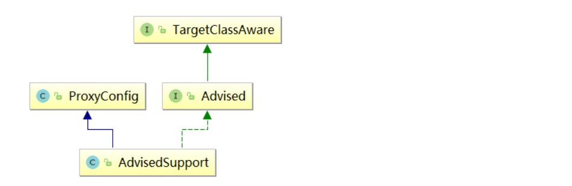
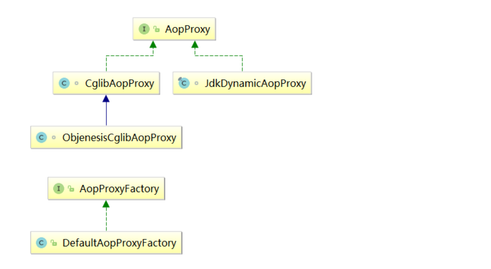
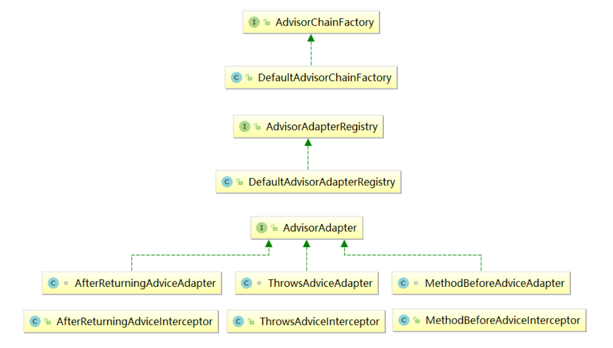
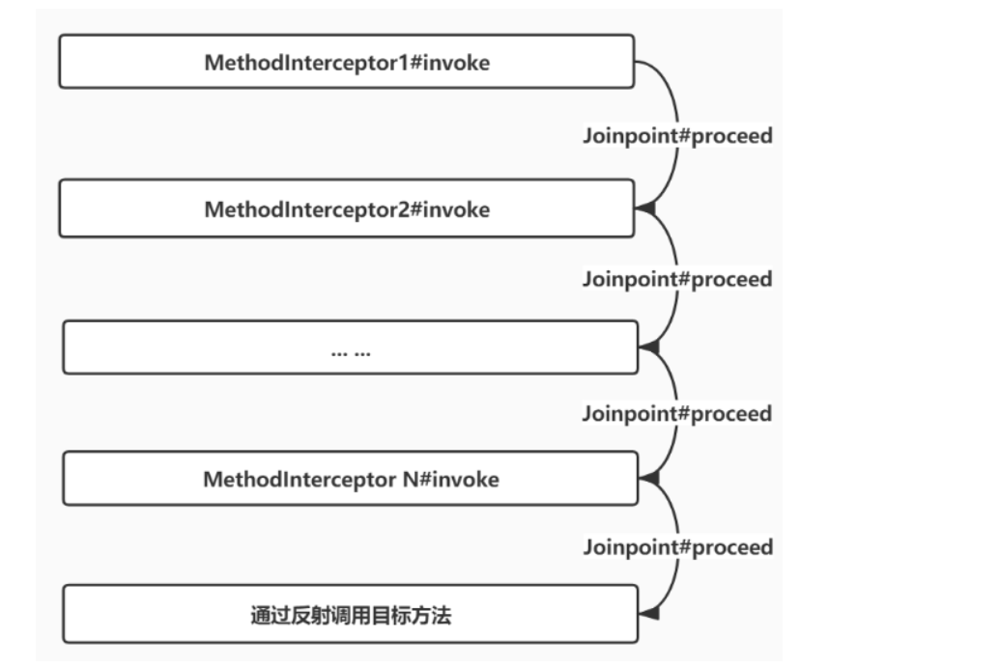

# 代理创建源码解析

## 创建代理的三大步骤

1. 创建代理所需参数配置
2. 根据代理参数获取AopProxy对象
3. 通过AopProxy获取代理对象

```java
//1.创建代理所需参数配置（如：采用什么方式的代理、通知列表等）
AdvisedSupport advisedSupport = new AdvisedSupport();
//如：添加一个前置通知
advisedSupport.addAdvice(new MethodBeforeAdvice() {
    @Override
    public void before(Method method, Object[] args, @Nullable Object target) throws Throwable {
        String userName = (String) args[0];
        //如果不是路人的时候，抛出非法访问异常
        if (!"路人".equals(userName)) {
            throw new RuntimeException(String.format("[%s]非法访问!", userName));
        }
    }
});
//设置被代理的目标对象
FundsService target = new FundsService();
advisedSupport.setTarget(target);
//2.根据配置信息获取AopProxy对象，AopProxy用来负责创建最终的代理对象
// AopProxy接口有2个实现类（JDK动态代理、cglib代理）
// 具体最终会使用哪种方式，需要根据AdvisedSupport中指定的参数来判断
// 创建AopProxy使用了简单工厂模式
AopProxyFactory aopProxyFactory = new DefaultAopProxyFactory();
//通过AopProxy工厂获取AopProxy对象
AopProxy aopProxy = aopProxyFactory.createAopProxy(advisedSupport);
//3.通过AopProxy创建代理对象
Object proxy = aopProxy.getProxy();

```

## 创建代理所需参数配置

创建代理所需参数配置主要是通过`AdvisedSupport`这个类来做的，看一下类图




### TargetClassAware 接口

比较简单的一个接口，定义了一个方法，用来获取目标对象类型。

所谓目标对象：就是被代理对象，比如上面的`fundsService`对象。

```java
package org.springframework.aop;
public interface TargetClassAware {
    @Nullable
    Class<?> getTargetClass();
}
```

### ProxyConfig 类

这个类比较关键了，代理配置类，内部包含了创建代理时需要配置的各种参数。

```java
package org.springframework.aop.framework;
/**
 * 对外提供统一的代理参数配置类，以确保所有代理创建程序具有一致的属性
 */
public class ProxyConfig implements Serializable {
    // 标记是否直接对目标类进行代理，而不是通过接口产生代理
    private boolean proxyTargetClass = false;
    // 标记是否对代理进行优化。启动优化通常意味着在代理对象被创建后，增强的修改将不会生效，因此默认值为false。
    // 如果exposeProxy设置为true，即使optimize为true也会被忽略。
    private boolean optimize = false;
    // 标记是否需要阻止通过该配置创建的代理对象转换为Advised类型，默认值为false，表示代理对象可以被转换为Advised类型
    boolean opaque = false;
    // 标记代理对象是否应该被aop框架通过AopContext以ThreadLocal的形式暴露出去。
    // 当一个代理对象需要调用它自己的另外一个代理方法时，这个属性将非常有用。默认是是false，以避免不必要的拦截。
    boolean exposeProxy = false;
    // 标记该配置是否需要被冻结，如果被冻结，将不可以修改增强的配置。
    // 当我们不希望调用方修改转换成Advised对象之后的代理对象时，这个配置将非常有用。
    private boolean frozen = false;
    //省略了属性的get set方法
}

```


### Advised 接口

这个接口中定义了操作 Aop 代理配置的各种方法（比如指定被代理的目标对象、添加通知、添加顾问等等）。

所有由 spring aop 创建的代理对象默认都会实现这个接口。

```java
public interface Advised extends TargetClassAware {
    /**
     * 返回配置是否已冻结，被冻结之后，无法修改已创建好的代理对象中的通知
     */
    boolean isFrozen();
    /**
     * 是否对目标类直接创建代理，而不是对接口创建代理，通俗点讲：如果是通过cglib创建代理，此方法返回true，否则返回false
     */
    boolean isProxyTargetClass();
    /**
     * 获取配置中需要代理的接口列表
     */
    Class<?>[] getProxiedInterfaces();
    /**
     * 判断某个接口是否被代理
     */
    boolean isInterfaceProxied(Class<?> intf);
    /**
     * 设置被代理的目标源，创建代理的时候，通常需要传入被代理的对象，最终被代理的对象会被包装为TargetSource类型的
     */
    void setTargetSource(TargetSource targetSource);
    /**
     * 返回被代理的目标源
     */
    TargetSource getTargetSource();
    /**
     * 设置是否需要将代理暴露在ThreadLocal中，这样可以在线程中获取到被代理对象，这个配置挺有用的，稍后会举例说明使用场景
     */
    void setExposeProxy(boolean exposeProxy);
    /**
     * 返回exposeProxy
     */
    boolean isExposeProxy();
    /**
     * 设置此代理配置是否经过预筛选，以便它只包含适用的顾问(匹配此代理的目标类)。
     * 默认设置是“假”。如果已经对advisor进行了预先筛选，则将其设置为“true”
     * 这意味着在为代理调用构建实际的advisor链时可以跳过ClassFilter检查。
     */
    void setPreFiltered(boolean preFiltered);
    /**
     * 返回preFiltered
     */
    boolean isPreFiltered();
    /**
     * 返回代理配置中干掉所有Advisor列表
     */
    Advisor[] getAdvisors();
    /**
     * 添加一个Advisor
     */
    void addAdvisor(Advisor advisor) throws AopConfigException;
    /**
     * 指定的位置添加一个Advisor
     */
    void addAdvisor(int pos, Advisor advisor) throws AopConfigException;
    /**
     * 移除一个Advisor
     */
    boolean removeAdvisor(Advisor advisor);
    /**
     * 移除指定位置的Advisor
     */
    void removeAdvisor(int index) throws AopConfigException;
    /**
     * 查找某个Advisor的位置
     */
    int indexOf(Advisor advisor);
    /**
     * 对advisor列表中的a替换为b
     */
    boolean replaceAdvisor(Advisor a, Advisor b) throws AopConfigException;
    /**
     * 添加一个通知
     */
    void addAdvice(Advice advice) throws AopConfigException;
    /**
     * 向指定的位置添加一个通知
     */
    void addAdvice(int pos, Advice advice) throws AopConfigException;
    /**
     * 移除一个通知
     */
    boolean removeAdvice(Advice advice);
    /**
     * 获取通知的位置
     */
    int indexOf(Advice advice);
    /**
     * 将代理配置转换为字符串，这个方便排错和调试使用的
     */
    String toProxyConfigString();
}

```

### AdvisedSupport 类

这个类是个重点，AOP 代理配置管理器的基类，继承了`ProxyConfig`并且实现了`Advised`接口，创建 aop 代理之前，所有需要配置的信息都是通过这个类来操作的。

比如：设置是否为目标类创建代理、设置目标对象、配置通知列表等等。

```java
package org.springframework.aop.framework;
public class AdvisedSupport extends ProxyConfig implements Advised {
    public static final TargetSource EMPTY_TARGET_SOURCE = EmptyTargetSource.INSTANCE;
    TargetSource targetSource = EMPTY_TARGET_SOURCE;
    /** 建议器是否已经针对特定的目标类进行筛选 */
    private boolean preFiltered = false;
    /** 调用链工厂，用来获取目标方法的调用链 */
    AdvisorChainFactory advisorChainFactory = new DefaultAdvisorChainFactory();
    /** 方法调用链缓存：以方法为键，以顾问链表为值的缓存。 */
    private transient Map<MethodCacheKey, List<Object>> methodCache;
    //代理对象需要实现的接口列表。保存在列表中以保持注册的顺序，以创建具有指定接口顺序的JDK代理。
    private List<Class<?>> interfaces = new ArrayList<>();
    //配置的顾问列表。所有添加的Advise对象都会被包装为Advisor对象
    private List<Advisor> advisors = new ArrayList<>();
    //数组更新了对advisor列表的更改，这更容易在内部操作。
    private Advisor[] advisorArray = new Advisor[0];
    //无参构造方法
    public AdvisedSupport() {
        this.methodCache = new ConcurrentHashMap<>(32);
    }
    //有参构造方法，参数为：代理需要实现的接口列表
    public AdvisedSupport(Class<?>... interfaces) {
        this();
        setInterfaces(interfaces);
    }
    //设置需要被代理的目标对象，目标对象会被包装为TargetSource格式的对象
    public void setTarget(Object target) {
        setTargetSource(new SingletonTargetSource(target));
    }
    //设置被代理的目标源
    @Override
    public void setTargetSource(@Nullable TargetSource targetSource) {
        this.targetSource = (targetSource != null ? targetSource : EMPTY_TARGET_SOURCE);
    }
    //获取被代理的目标源
    @Override
    public TargetSource getTargetSource() {
        return this.targetSource;
    }
    //设置被代理的目标类
    public void setTargetClass(@Nullable Class<?> targetClass) {
        this.targetSource = EmptyTargetSource.forClass(targetClass);
    }
    //获取被代理的目标类型
    @Override
    @Nullable
    public Class<?> getTargetClass() {
        return this.targetSource.getTargetClass();
    }
    /** 
     * 设置此代理配置是否经过预筛选，这个什么意思呢：通过目标方法调用代理的时候，
     * 需要通过匹配的方式获取这个方法上的调用链列表，查找过程需要2个步骤：
     * 第一步：类是否匹配，第二步：方法是否匹配，当这个属性为true的时候，会直接跳过第一步，这个懂了不
     */
    @Override
    public void setPreFiltered(boolean preFiltered) {
        this.preFiltered = preFiltered;
    }
    // 返回preFiltered
    @Override
    public boolean isPreFiltered() {
        return this.preFiltered;
    }
    /**
     * 设置顾问链工厂，当调用目标方法的时候，需要获取这个方法上匹配的Advisor列表，
     * 获取目标方法上匹配的Advisor列表的功能就是AdvisorChainFactory来负责的
     */
    public void setAdvisorChainFactory(AdvisorChainFactory advisorChainFactory) {
        Assert.notNull(advisorChainFactory, "AdvisorChainFactory must not be null");
        this.advisorChainFactory = advisorChainFactory;
    }
    // 返回顾问链工厂对象
    public AdvisorChainFactory getAdvisorChainFactory() {
        return this.advisorChainFactory;
    }
    //设置代理对象需要实现的接口
    public void setInterfaces(Class<?>... interfaces) {
        Assert.notNull(interfaces, "Interfaces must not be null");
        this.interfaces.clear();
        for (Class<?> ifc : interfaces) {
            addInterface(ifc);
        }
    }
    //为代理对象添加需要实现的接口
    public void addInterface(Class<?> intf) {
        Assert.notNull(intf, "Interface must not be null");
        if (!intf.isInterface()) {
            throw new IllegalArgumentException("[" + intf.getName() + "] is not an interface");
        }
        if (!this.interfaces.contains(intf)) {
            this.interfaces.add(intf);
            adviceChanged();
        }
    }
    //移除代理对象需要实现的接口
    public boolean removeInterface(Class<?> intf) {
        return this.interfaces.remove(intf);
    }
    //获取代理对象需要实现的接口列表
    @Override
    public Class<?>[] getProxiedInterfaces() {
        return ClassUtils.toClassArray(this.interfaces);
    }
    //判断代理对象是否需要实现某个接口
    @Override
    public boolean isInterfaceProxied(Class<?> intf) {
        for (Class<?> proxyIntf : this.interfaces) {
            if (intf.isAssignableFrom(proxyIntf)) {
                return true;
            }
        }
        return false;
    }
    //获取配置的所有顾问列表
    @Override
    public final Advisor[] getAdvisors() {
        return this.advisorArray;
    }
    //添加顾问
    @Override
    public void addAdvisor(Advisor advisor) {
        int pos = this.advisors.size();
        addAdvisor(pos, advisor);
    }
    //指定的位置添加顾问
    @Override
    public void addAdvisor(int pos, Advisor advisor) throws AopConfigException {
        //这块先忽略，以后讲解
        if (advisor instanceof IntroductionAdvisor) {
            validateIntroductionAdvisor((IntroductionAdvisor) advisor);
        }
        addAdvisorInternal(pos, advisor);
    }
    //移除指定的顾问
    @Override
    public boolean removeAdvisor(Advisor advisor) {
        int index = indexOf(advisor);
        if (index == -1) {
            return false;
        }
        else {
            removeAdvisor(index);
            return true;
        }
    }
    //移除指定位置的顾问
    @Override
    public void removeAdvisor(int index) throws AopConfigException {
        //当配置如果是冻结状态，是不允许对顾问进行修改的，否则会抛出异常
        if (isFrozen()) {
            throw new AopConfigException("Cannot remove Advisor: Configuration is frozen.");
        }
        if (index < 0 || index > this.advisors.size() - 1) {
            throw new AopConfigException("Advisor index " + index + " is out of bounds: " +
                    "This configuration only has " + this.advisors.size() + " advisors.");
        }
        //移除advisors中的顾问
        Advisor advisor = this.advisors.remove(index);
        if (advisor instanceof IntroductionAdvisor) {
            IntroductionAdvisor ia = (IntroductionAdvisor) advisor;
            // We need to remove introduction interfaces.
            for (Class<?> ifc : ia.getInterfaces()) {
                removeInterface(ifc);
            }
        }
        //更新advisorArray
        updateAdvisorArray();
        //通知已改变，内部会清除方法调用链缓存信息。
        adviceChanged();
    }
    @Override
    public int indexOf(Advisor advisor) {
        Assert.notNull(advisor, "Advisor must not be null");
        return this.advisors.indexOf(advisor);
    }
    @Override
    public boolean replaceAdvisor(Advisor a, Advisor b) throws AopConfigException {
        Assert.notNull(a, "Advisor a must not be null");
        Assert.notNull(b, "Advisor b must not be null");
        int index = indexOf(a);
        if (index == -1) {
            return false;
        }
        removeAdvisor(index);
        addAdvisor(index, b);
        return true;
    }
    //批量添加顾问
    public void addAdvisors(Advisor... advisors) {
        addAdvisors(Arrays.asList(advisors));
    }
    //批量添加顾问
    public void addAdvisors(Collection<Advisor> advisors) {
        //配置如果是冻结状态，会抛出异常
        if (isFrozen()) {
            throw new AopConfigException("Cannot add advisor: Configuration is frozen.");
        }
        if (!CollectionUtils.isEmpty(advisors)) {
            for (Advisor advisor : advisors) {
                if (advisor instanceof IntroductionAdvisor) {
                    validateIntroductionAdvisor((IntroductionAdvisor) advisor);
                }
                Assert.notNull(advisor, "Advisor must not be null");
                this.advisors.add(advisor);
            }
            updateAdvisorArray();
            adviceChanged();
        }
    }
    //此方法先忽略，用来为目标类引入接口的
    private void validateIntroductionAdvisor(IntroductionAdvisor advisor) {
        advisor.validateInterfaces();
        // If the advisor passed validation, we can make the change.
        Class<?>[] ifcs = advisor.getInterfaces();
        for (Class<?> ifc : ifcs) {
            addInterface(ifc);
        }
    }
    //指定的位置添加顾问
    private void addAdvisorInternal(int pos, Advisor advisor) throws AopConfigException {
        Assert.notNull(advisor, "Advisor must not be null");
        if (isFrozen()) {
            throw new AopConfigException("Cannot add advisor: Configuration is frozen.");
        }
        if (pos > this.advisors.size()) {
            throw new IllegalArgumentException(
                    "Illegal position " + pos + " in advisor list with size " + this.advisors.size());
        }
        this.advisors.add(pos, advisor);
        updateAdvisorArray();
        adviceChanged();
    }
    //将advisorArray和advisors保持一致
    protected final void updateAdvisorArray() {
        this.advisorArray = this.advisors.toArray(new Advisor[0]);
    }
    //获取顾问列表
    protected final List<Advisor> getAdvisorsInternal() {
        return this.advisors;
    }
    //添加通知
    @Override
    public void addAdvice(Advice advice) throws AopConfigException {
        int pos = this.advisors.size();
        addAdvice(pos, advice);
    }
    //指定的位置添加通知
    @Override
    public void addAdvice(int pos, Advice advice) throws AopConfigException {
        //此处会将advice通知包装为DefaultPointcutAdvisor类型的Advisor
        addAdvisor(pos, new DefaultPointcutAdvisor(advice));
    }
    //移除通知
    @Override
    public boolean removeAdvice(Advice advice) throws AopConfigException {
        int index = indexOf(advice);
        if (index == -1) {
            return false;
        }
        else {
            removeAdvisor(index);
            return true;
        }
    }
    //获取通知的位置
    @Override
    public int indexOf(Advice advice) {
        Assert.notNull(advice, "Advice must not be null");
        for (int i = 0; i < this.advisors.size(); i++) {
            Advisor advisor = this.advisors.get(i);
            if (advisor.getAdvice() == advice) {
                return i;
            }
        }
        return -1;
    }
    //是否包含某个通知
    public boolean adviceIncluded(@Nullable Advice advice) {
        if (advice != null) {
            for (Advisor advisor : this.advisors) {
                if (advisor.getAdvice() == advice) {
                    return true;
                }
            }
        }
        return false;
    }
    //获取当前配置中某种类型通知的数量
    public int countAdvicesOfType(@Nullable Class<?> adviceClass) {
        int count = 0;
        if (adviceClass != null) {
            for (Advisor advisor : this.advisors) {
                if (adviceClass.isInstance(advisor.getAdvice())) {
                    count++;
                }
            }
        }
        return count;
    }
    //基于当前配置，获取给定方法的方法调用链列表（即org.aopalliance.intercept.MethodInterceptor对象列表）
    public List<Object> getInterceptorsAndDynamicInterceptionAdvice(Method method, @Nullable Class<?> targetClass) {
        MethodCacheKey cacheKey = new MethodCacheKey(method);
        //先从缓存中获取
        List<Object> cached = this.methodCache.get(cacheKey);
        //缓存中没有时，从advisorChainFactory中获取
        if (cached == null) {
            cached = this.advisorChainFactory.getInterceptorsAndDynamicInterceptionAdvice(
                    this, method, targetClass);
            this.methodCache.put(cacheKey, cached);
        }
        return cached;
    }
    //通知更改时调用，会清空当前方法调用链缓存
    protected void adviceChanged() {
        this.methodCache.clear();
    }
    //将other中的配置信息复制到当前对象中
    protected void copyConfigurationFrom(AdvisedSupport other) {
        copyConfigurationFrom(other, other.targetSource, new ArrayList<>(other.advisors));
    }
    //将other中的配置信息复制到当前对象中
    protected void copyConfigurationFrom(AdvisedSupport other, TargetSource targetSource, List<Advisor> advisors) {
        copyFrom(other);
        this.targetSource = targetSource;
        this.advisorChainFactory = other.advisorChainFactory;
        this.interfaces = new ArrayList<>(other.interfaces);
        for (Advisor advisor : advisors) {
            if (advisor instanceof IntroductionAdvisor) {
                validateIntroductionAdvisor((IntroductionAdvisor) advisor);
            }
            Assert.notNull(advisor, "Advisor must not be null");
            this.advisors.add(advisor);
        }
        updateAdvisorArray();
        adviceChanged();
    }
    //构建此AdvisedSupport的仅配置副本，替换TargetSource。
    AdvisedSupport getConfigurationOnlyCopy() {
        AdvisedSupport copy = new AdvisedSupport();
        copy.copyFrom(this);
        copy.targetSource = EmptyTargetSource.forClass(getTargetClass(), getTargetSource().isStatic());
        copy.advisorChainFactory = this.advisorChainFactory;
        copy.interfaces = this.interfaces;
        copy.advisors = this.advisors;
        copy.updateAdvisorArray();
        return copy;
    }
}

```


## 根据配置获取 AopProxy

这个阶段对应的代码：

```
// 创建AopProxy使用了简单工厂模式
AopProxyFactory aopProxyFactory = new DefaultAopProxyFactory();
//通过AopProxy工厂获取AopProxy对象
AopProxy aopProxy = aopProxyFactory.createAopProxy(advisedSupport);

```

此阶段会根据 AdvisedSupport 中配置信息，判断具体是采用 cglib 的方式还是采用 jdk 动态代理的方式获取代理对象，先看一下涉及到的一些类。



### AopProxy 接口

这个接口定义了一个方法，用来创建最终的代理对象，这个接口有 2 个实现类

*   CglibAopProxy：采用 cglib 的方式创建代理对象
*   JkdDynamicAopProxy：采用 jdk 动态代理的方式创建代理对象

```java
package org.springframework.aop.framework;
public interface AopProxy {
    /**
     * 创建一个新的代理对象
     */
    Object getProxy();
    /**
     * 创建一个新的代理对象
     */
    Object getProxy(@Nullable ClassLoader classLoader);
}

```

AopProxy 的 2 个实现类，实现了上面定义的 2 个方法，稍后在代理的创建阶段详细介绍。

### AopProxyFactory 接口

通过名称就可以看出来，是一个工厂，负责创建 AopProxy，使用的是简单工厂模式。

接口中定义了一个方法，会根据 Aop 的配置信息 AdvisedSupport 来获取 AopProxy 对象，主要是判断采用 cglib 的方式还是采用 jdk 动态代理的方式。

```java
package org.springframework.aop.framework;
public interface AopProxyFactory {
    /**
     * 根据aop配置信息获取AopProxy对象
     */
    AopProxy createAopProxy(AdvisedSupport config) throws AopConfigException;
}

```

### DefaultAopProxyFactory 类

AopProxyFactory 接口的默认实现，代码比较简单，我们来细看一下

```java
package org.springframework.aop.framework;
/**
 * 默认AopProxyFactory实现，创建CGLIB代理或JDK动态代理。
 * 对于给定的AdvisedSupport实例，以下条件为真，则创建一个CGLIB代理:
 * optimize = true
 * proxyTargetClass = true
 * 未指定代理接口
 * 通常，指定proxyTargetClass来强制执行CGLIB代理，或者指定一个或多个接口来使用JDK动态代理。
 */
public class DefaultAopProxyFactory implements AopProxyFactory, Serializable {
    @Override
    public AopProxy createAopProxy(AdvisedSupport config) throws AopConfigException {
        // optimize==true || proxyTargetClass 为true || 配置中没有需要代理的接口
        if (config.isOptimize() || config.isProxyTargetClass() || hasNoUserSuppliedProxyInterfaces(config)) {
            //获取需要被代理的类
            Class<?> targetClass = config.getTargetClass();
            if (targetClass == null) {
                throw new AopConfigException("TargetSource cannot determine target class: " +
                        "Either an interface or a target is required for proxy creation.");
            }
            //如果被代理的类为接口 或者 被代理的类是jdk动态代理创建代理类，则采用JdkDynamicAopProxy的方式，否则采用cglib代理的方式
            if (targetClass.isInterface() || Proxy.isProxyClass(targetClass)) {
                //采用jdk动态代理的方式
                return new JdkDynamicAopProxy(config);
            }
            //采用cglib代理的方式
            return new ObjenesisCglibAopProxy(config);
        }
        else {
            //采用jdk动态代理的方式
            return new JdkDynamicAopProxy(config);
        }
    }
    /**
     * 确定所提供的AdvisedSupport是否只指定了SpringProxy接口(或者根本没有指定代理接口)
     */
    private boolean hasNoUserSuppliedProxyInterfaces(AdvisedSupport config) {
        Class<?>[] ifcs = config.getProxiedInterfaces();
        return (ifcs.length == 0 || (ifcs.length == 1 && SpringProxy.class.isAssignableFrom(ifcs[0])));
    }
}

```


## 代理创建阶段

到目前为止我们已经根据 aop 配置信息得到了 AopProxy 对象了，下面就可以调用 AopProxy.getProxy 方法获取代理对象了。

AopProxy.createAopProxy 方法返回的结果有 2 种情况

*   JdkDynamicAopProxy：以 jdk 动态代理的方式创建代理
*   ObjenesisCglibAopProxy：以 cglib 的方式创建动态代理

项目详解这 2 个类的源码 。

### JdkDynamicAopProxy 类

**作用：采用 jdk 动态代理的方式创建代理对象，并处理代理对象的所有方法调用。**

```java
final class JdkDynamicAopProxy implements AopProxy, InvocationHandler, Serializable {
    //代理的配置信息
    private final AdvisedSupport advised;
    //需要被代理的接口中是否定义了equals方法
    private boolean equalsDefined;
    //需要被代理的接口中是否定义了hashCode方法
    private boolean hashCodeDefined;
    //通过AdvisedSupport创建实例
    public JdkDynamicAopProxy(AdvisedSupport config) throws AopConfigException {
        Assert.notNull(config, "AdvisedSupport must not be null");
        if (config.getAdvisors().length == 0 && config.getTargetSource() == AdvisedSupport.EMPTY_TARGET_SOURCE) {
            throw new AopConfigException("No advisors and no TargetSource specified");
        }
        this.advised = config;
    }
    //生成一个代理对象
    @Override
    public Object getProxy() {
        return getProxy(ClassUtils.getDefaultClassLoader());
    }
    //生成一个代理对象
    @Override
    public Object getProxy(@Nullable ClassLoader classLoader) {
        if (logger.isTraceEnabled()) {
            logger.trace("Creating JDK dynamic proxy: " + this.advised.getTargetSource());
        }
        //@0：根据advised的信息获取代理需要被代理的所有接口列表
        Class<?>[] proxiedInterfaces = AopProxyUtils.completeProxiedInterfaces(this.advised, true); 
        //查找被代理的接口中是否定义了equals、hashCode方法
        findDefinedEqualsAndHashCodeMethods(proxiedInterfaces);
        /**
         * 这个大家应该很熟悉吧，通过jdk动态代理创建代理对象，注意最后一个参数是this
         * 表示当前类，当前类是InvocationHandler类型的，当调用代理对象的任何方法的时候
         * 都会被被当前类的 invoke 方法处理
         */
        return Proxy.newProxyInstance(classLoader, proxiedInterfaces, this);
    }
    //判断需要代理的接口中是否定义了这几个方法（equals、hashCode）
    private void findDefinedEqualsAndHashCodeMethods(Class<?>[] proxiedInterfaces) {
        for (Class<?> proxiedInterface : proxiedInterfaces) {
            //获取接口中定义的方法
            Method[] methods = proxiedInterface.getDeclaredMethods();
            for (Method method : methods) {
                //是否是equals方法
                if (AopUtils.isEqualsMethod(method)) {
                    this.equalsDefined = true;
                }
                //是否是hashCode方法
                if (AopUtils.isHashCodeMethod(method)) {
                    this.hashCodeDefined = true;
                }
                //如果发现这2个方法都定义了，结束循环查找
                if (this.equalsDefined && this.hashCodeDefined) {
                    return;
                }
            }
        }
    }
    // 这个方法比较关键了，当在程序中调用代理对象的任何方法，最终都会被下面这个invoke方法处理
    public Object invoke(Object proxy, Method method, Object[] args) throws Throwable {
        //旧的代理对象
        Object oldProxy = null;
        //用来标记是否需要将代理对象暴露在ThreadLocal中
        boolean setProxyContext = false;
        //获取目标源
        TargetSource targetSource = this.advised.targetSource;
        //目标对象
        Object target = null;
        //下面进入代理方法的处理阶段
        try {
            // 处理equals方法：被代理的接口中没有定义equals方法 && 当前调用是equals方法
            if (!this.equalsDefined && AopUtils.isEqualsMethod(method)) {
                // 直接调用当前类中的equals方法
                return equals(args[0]);
            }
            // 处理hashCode方法：被代理的接口中没有定义hashCode方法 && 当前调用是hashCode方法
            else if (!this.hashCodeDefined && AopUtils.isHashCodeMethod(method)) {
                // 直接调用当前类中的hashCode方法
                return hashCode();
            }
            /**
             * 方法来源于 DecoratingProxy 接口，这个接口中定义了一个方法
             * 用来获取原始的被代理的目标类，主要是用在嵌套代理的情况下（所谓嵌套代理：代理对象又被作为目标对象进行了代理）
             */
            else if (method.getDeclaringClass() == DecoratingProxy.class) {
                // 调用AopProxyUtils工具类的方法，内部通过循环遍历的方式，找到最原始的被代理的目标类
                return AopProxyUtils.ultimateTargetClass(this.advised);
            }
            // 方法来源于 Advised 接口，代理对象默认情况下会实现 Advised 接口，可以通过代理对象来动态向代理对象中添加通知等
            else if (!this.advised.opaque && method.getDeclaringClass().isInterface() &&
                    method.getDeclaringClass().isAssignableFrom(Advised.class)) {
                // this.advised是AdvisedSupport类型的，AdvisedSupport实现了Advised接口中的所有方法
                // 所以最终通过通过反射方式交给this.advised来响应当前调用
                return AopUtils.invokeJoinpointUsingReflection(this.advised, method, args);
            }
            // 用来记录方法返回值
            Object retVal;
            //是否需要在threadLocal中暴露代理对象
            if (this.advised.exposeProxy) {
                // 将代理对象暴露在上线文中，即暴露在threadLocal中，那么在当前线程中可以通过静态方法
                // AopContext#currentProxy获取当前被暴露的代理对象，这个是非常有用的，稍后用案例来讲解，瞬间就会明白
                oldProxy = AopContext.setCurrentProxy(proxy);
                // 将setProxyContext标记为true
                setProxyContext = true;
            }
            // 通过目标源获取目标对象
            target = targetSource.getTarget();
            // 获取目标对象类型
            Class<?> targetClass = (target != null ? target.getClass() : null);
            // @1：获取当前方法的拦截器链
            List<Object> chain = this.advised.getInterceptorsAndDynamicInterceptionAdvice(method, targetClass); 
            // 拦截器链为空的情况下，表示这个方法上面没有找到任何增强的通知，那么会直接通过反射直接调用目标对象
            if (chain.isEmpty()) {
                // 获取方法请求的参数（有时候方法中有可变参数，所谓可变参数就是带有省略号(...)这种格式的参数，传入的参数类型和这种类型不一样的时候，会通过下面的adaptArgumentsIfNecessary方法进行转换）
                Object[] argsToUse = AopProxyUtils.adaptArgumentsIfNecessary(method, args);
                //通过反射直接调用目标方法
                retVal = AopUtils.invokeJoinpointUsingReflection(target, method, argsToUse);
            }
            else {
                // 创建一个方法调用器（包含了代理对象、目标对象、调用的方法、参数、目标类型、方法拦截器链）
                MethodInvocation invocation =
                        new ReflectiveMethodInvocation(proxy, target, method, args, targetClass, chain);
                // @3：通过拦截器链一个个调用最终到目标方法的调用
                retVal = invocation.proceed();
            }
            // 下面会根据方法返回值的类型，做一些处理，比如方法返回的类型为自己，则最后需要将返回值置为代理对象
            Class<?> returnType = method.getReturnType();
            if (retVal != null && retVal == target &&
                    returnType != Object.class && returnType.isInstance(proxy) &&
                    !RawTargetAccess.class.isAssignableFrom(method.getDeclaringClass())) {
                // 将返回值设置为代理对象
                retVal = proxy;
            }
            // 方法的返回值类型returnType为原始类型（即int、byte、double等这种类型的） && retVal为null，
            // 此时如果将null转换为原始类型会报错，所以此处直接抛出异常
            else if (retVal == null && returnType != Void.TYPE && returnType.isPrimitive()) {
                throw new AopInvocationException(
                        "Null return value from advice does not match primitive return type for: " + method);
            }
            // 返回方法调用结果
            return retVal;
        }
        finally {
            // 目标对象不为null && 目标源不是静态的
            //所谓静态的，你可以理解为是否是单例的
            // isStatic为true，表示目标对象是单例的，同一个代理对象中所有方法共享一个目标对象
            // isStatic为false的时候，通常每次调用代理的方法，target对象是不一样的，所以方法调用万之后需要进行释放，可能有些资源清理，连接的关闭等操作
            if (target != null && !targetSource.isStatic()) {
                // 必须释放来自TargetSource中的目标对象
                targetSource.releaseTarget(target);
            }
            // setProxyContext为ture
            if (setProxyContext) {
                // 需要将旧的代理再放回到上线文中
                AopContext.setCurrentProxy(oldProxy);
            }
        }
    }
}

```

**@0：completeProxiedInterfaces 方法**

`@0`处的代码如下，根据代理配置信息，获取需要被代理的所有接口

```
Class<?>[] proxiedInterfaces = AopProxyUtils.completeProxiedInterfaces(this.advised, true);
```

`AopProxyUtils.completeProxiedInterfaces`方法源码如下

```java
static Class<?>[] completeProxiedInterfaces(AdvisedSupport advised, boolean decoratingProxy) {
    //获取代理配置中需要被代理的接口
    Class<?>[] specifiedInterfaces = advised.getProxiedInterfaces();
    // 需要被代理的接口数量为0
    if (specifiedInterfaces.length == 0) {
        // 获取需要被代理的目标类型
        Class<?> targetClass = advised.getTargetClass();
        //目标类型不为空
        if (targetClass != null) {
            //目标类型为接口
            if (targetClass.isInterface()) {
                //将其添加到需要代理的接口中
                advised.setInterfaces(targetClass);
            }
            // 目标类型为jdk动态代理创建的代理对象
            else if (Proxy.isProxyClass(targetClass)) {
                // 获取目标类型上的所有接口，将其添加到需要被代理的接口中
                advised.setInterfaces(targetClass.getInterfaces());
            }
            //再次获取代理配置中需要被代理的接口
            specifiedInterfaces = advised.getProxiedInterfaces();
        }
    }
    //判断SpringProxy接口是否已经在被代理的接口中
    boolean addSpringProxy = !advised.isInterfaceProxied(SpringProxy.class);
    //判断Advised接口是否已经在被代理的接口中
    boolean addAdvised = !advised.isOpaque() && !advised.isInterfaceProxied(Advised.class);
    //判断DecoratingProxy接口是否已经在被代理的接口中
    boolean addDecoratingProxy = (decoratingProxy && !advised.isInterfaceProxied(DecoratingProxy.class));
    //一个计数器，会根据上面三个boolean值做递增
    int nonUserIfcCount = 0;
    if (addSpringProxy) {
        nonUserIfcCount++;
    }
    if (addAdvised) {
        nonUserIfcCount++;
    }
    if (addDecoratingProxy) {
        nonUserIfcCount++;
    }
   // 下面就是构建所有需要被代理的接口
    Class<?>[] proxiedInterfaces = new Class<?>[specifiedInterfaces.length + nonUserIfcCount];
    System.arraycopy(specifiedInterfaces, 0, proxiedInterfaces, 0, specifiedInterfaces.length);
    int index = specifiedInterfaces.length;
    if (addSpringProxy) {
        proxiedInterfaces[index] = SpringProxy.class;
        index++;
    }
    if (addAdvised) {
        proxiedInterfaces[index] = Advised.class;
        index++;
    }
    if (addDecoratingProxy) {
        proxiedInterfaces[index] = DecoratingProxy.class;
    }
    return proxiedInterfaces;
}

```

上面的方法执行完毕之后，会得到一个被代理的接口列表，默认情况下会得到下面的一个列表

```
[开发者硬编码指定的需要被代理的接口列表,SpringProxy,Advised,DecoratingProxy]
```

最终创建出来的代理对象，默认会实现上面列的所有接口，后面 3 个接口是 aop 中自动给我们加上的。


**@1：getInterceptorsAndDynamicInterceptionAdvice**

这个方法位于`AdvisedSupport`中，根据方法和目标类型获取方法上面匹配的拦截器链

```java
public List<Object> getInterceptorsAndDynamicInterceptionAdvice(Method method, @Nullable Class<?> targetClass) {
    //会先尝试从还中获取，如果获取不到，会从advisorChainFactory中获取，然后将其丢到缓存中
    MethodCacheKey cacheKey = new MethodCacheKey(method);
    List<Object> cached = this.methodCache.get(cacheKey);
    if (cached == null) {
        cached = this.advisorChainFactory.getInterceptorsAndDynamicInterceptionAdvice(
            this, method, targetClass);
        this.methodCache.put(cacheKey, cached);
    }
    return cached;
}

```

**从 advisorChainFactory 中获取拦截器链稍后细说，我们把这个阶段叫做连接器链的获取阶段。**

**@3：ReflectiveMethodInvocation.proceed()**

这个是一次会调用拦截器链，最终会调用到目标方法，获得目标方法的返回值，里面的细节见后面的`代理方法调用处理阶段`

**JdkDynamicAopProxy 小结**

1.  被创建的代理对象默认会实现`SpringProxy,Advised,DecoratingProxy 3个接口`
2.  `SpringProxy`这个接口中没有任何方法，只是起一个标记作用，用来标记代理对象是使用 spring aop 创建的
3.  代理对象默认都会实现`Advised`接口，所以可以通过这个接口动态变更代理对象中的通知
4.  `DecoratingProxy`接口中定义了一个方法`getDecoratedClass`，用来获取被代理的原始目标对象的类型


### CglibAopProxy 类

`ObjenesisCglibAopProxy`，这个继承了`CglibAopProxy`，大部分逻辑都在`CglibAopProxy`中

**作用：采用 cglib 代理的方式创建代理对象，并处理代理对象的所有方法调用。**

以`getProxy`方法为入口，通过方法一个个来解说。

#### getProxy 方法

```java
public Object getProxy(@Nullable ClassLoader classLoader) {
    // 获取被代理的类
    Class<?> rootClass = this.advised.getTargetClass();
    // 代理对象的父类（cglib是采用继承的方式是创建代理对象的，所以将被代理的类作为代理对象的父类）
    Class<?> proxySuperClass = rootClass;
    // 判断被代理的类是不是cglib创建的类，如果是cblib创建的类，会将其父类作为被代理的类
    if (rootClass.getName().contains(ClassUtils.CGLIB_CLASS_SEPARATOR)) {
        proxySuperClass = rootClass.getSuperclass();
        //添加需要被代理的接口
        Class<?>[] additionalInterfaces = rootClass.getInterfaces();
        for (Class<?> additionalInterface : additionalInterfaces) {
            this.advised.addInterface(additionalInterface);
        }
    }
    // 开始cglib创建代理，这个大家对cglib比较熟悉的一看就懂
    Enhancer enhancer = createEnhancer();
    // 设置被代理的父类
    enhancer.setSuperclass(proxySuperClass);
    // 设置被代理的接口[开发者硬编码指定的需要被代理的接口列表,SpringProxy,Advised]，这个比jdk动态代理的方式少了一个DecoratingProxy接口
    enhancer.setInterfaces(AopProxyUtils.completeProxiedInterfaces(this.advised));
    // 设置代理类类名生成策略
    enhancer.setNamingPolicy(SpringNamingPolicy.INSTANCE);
    // 设置字节码的生成策略
    enhancer.setStrategy(new ClassLoaderAwareGeneratorStrategy(classLoader));
    // @1：获取Callback列表，这个稍后详解
    Callback[] callbacks = getCallbacks(rootClass);
    Class<?>[] types = new Class<?>[callbacks.length];
    for (int x = 0; x < types.length; x++) {
        types[x] = callbacks[x].getClass();
    }
    // @2：设置CallbackFilter，CallbackFilter内部会判断被代理对象中的方法最终会被callbacks列表中的那个Callback来处理
    enhancer.setCallbackFilter(new ProxyCallbackFilter(
        this.advised.getConfigurationOnlyCopy(), this.fixedInterceptorMap, this.fixedInterceptorOffset));
    enhancer.setCallbackTypes(types);
    // 获取代理对象（内部会先创建代理类，然后会根据代理类生成一个代理对象）
    return createProxyClassAndInstance(enhancer, callbacks);
}

```

上面方法中有 2 个点比较难，需要说明，分别是`@1：getCallbacks方法`和`@2:创建ProxyCallbackFilter对象`

##### @1：getCallbacks 方法

通过被代理的类来获取`Callback`列表，`Callback`是用来处理代理对象的方法调用的，代理对象中可能有很多方法，每个方法可能采用不同的处理方式，所以会有多个`Callback`

```java
private Callback[] getCallbacks(Class<?> rootClass) throws Exception {
    // 是否需要将代理暴露在threadLocal中
    boolean exposeProxy = this.advised.isExposeProxy();
    // 配置是否是冻结的
    boolean isFrozen = this.advised.isFrozen();
    // 被代理的目标对象是否是动态的（是否是单例的）
    boolean isStatic = this.advised.getTargetSource().isStatic();
    // 当方法上有需要执行的拦截器的时候，会用这个来处理
    Callback aopInterceptor = new DynamicAdvisedInterceptor(this.advised);
    // 当方法上没有需要执行的拦截器的时候，会使用targetInterceptor来处理，内部会通过反射直接调用目标对象的方法
    Callback targetInterceptor;
    /**
     * 这块根据是否需要暴露代理到threadLocal中以及目标对象是否是动态的，会创建不同的Callback
     * isStatic为true的时候，同一个代理的不同方法可能都是新的目标对象，所以当代理方法执行完毕之后，需要对目标对象进行释放
     */
    if (exposeProxy) {
        targetInterceptor = (isStatic ?
                             new StaticUnadvisedExposedInterceptor(this.advised.getTargetSource().getTarget()) :
                             new DynamicUnadvisedExposedInterceptor(this.advised.getTargetSource()));
    }
    else {
        targetInterceptor = (isStatic ?
                             new StaticUnadvisedInterceptor(this.advised.getTargetSource().getTarget()) :
                             new DynamicUnadvisedInterceptor(this.advised.getTargetSource()));
    }
    // targetDispatcher会直接调用目标方法
    Callback targetDispatcher = (isStatic ?
                                 new StaticDispatcher(this.advised.getTargetSource().getTarget()) : new SerializableNoOp());
    Callback[] mainCallbacks = new Callback[] {
        aopInterceptor,  // 处理匹配到拦截器的方法
        targetInterceptor,  // 处理未匹配到拦截器的方法
        new SerializableNoOp(), 
        targetDispatcher,  // 处理未匹配到拦截器的方法，和targetInterceptor有何不同呢？目标方法如果返回值的结果是目标对象类型的，会使用 targetInterceptor 处理，内部会返回代理对象
        this.advisedDispatcher, // 处理Advised接口中定义的方法
        new EqualsInterceptor(this.advised), // 处理equals方法
        new HashCodeInterceptor(this.advised) // 处理hashCode方法
    };
    Callback[] callbacks;
    // 如果被代理的对象是单例的 && 配置是冻结的，此时会进行优化，怎么优化呢？
    // 配置冻结的情况下，生成好的代理中通知是无法修改的，所以可以提前将每个方法对应的拦截器链找到给缓存起来
    // 调用方法的时候，就直接从缓存中可以拿到方法对应的缓存信息，效率会高一些
    if (isStatic && isFrozen) {
        Method[] methods = rootClass.getMethods();
        Callback[] fixedCallbacks = new Callback[methods.length];
        this.fixedInterceptorMap = new HashMap<>(methods.length);
        // 获取每个方法的调用链，然后给缓存在fixedInterceptorMap中
        for (int x = 0; x < methods.length; x++) {
            Method method = methods[x];
            List<Object> chain = this.advised.getInterceptorsAndDynamicInterceptionAdvice(method, rootClass);
            fixedCallbacks[x] = new FixedChainStaticTargetInterceptor(
                chain, this.advised.getTargetSource().getTarget(), this.advised.getTargetClass());
            this.fixedInterceptorMap.put(method, x);
        }
        callbacks = new Callback[mainCallbacks.length + fixedCallbacks.length];
        System.arraycopy(mainCallbacks, 0, callbacks, 0, mainCallbacks.length);
        System.arraycopy(fixedCallbacks, 0, callbacks, mainCallbacks.length, fixedCallbacks.length);
        this.fixedInterceptorOffset = mainCallbacks.length;
    }
    else {
        callbacks = mainCallbacks;
    }
    return callbacks;
}

```

##### @2: 创建 ProxyCallbackFilter 对象

```
enhancer.setCallbackFilter(new ProxyCallbackFilter(
        this.advised.getConfigurationOnlyCopy(), this.fixedInterceptorMap, this.fixedInterceptorOffset));

```

这块重点在于`ProxyCallbackFilter`中的`accept`方法，这个方法会根据目标放，获取目标对方最后会让 callbacks 列表中的哪个 Callback 处理，大家可以看一下源码，比较简单。

上面`getCallbacks`方法中涉及到了 5 个类如下

*   DynamicAdvisedInterceptor
    
*   StaticUnadvisedExposedInterceptor
    
*   StaticUnadvisedInterceptor
    
*   DynamicUnadvisedInterceptor
    
*   StaticDispatcher
    

后面 4 个比较简单，大家可以去看一下源码，主要来看第一个类，基本上代理对象中的大部分自定义的方法都会进入到这个类的`intercept`方法中进行处理，代码如下

##### DynamicAdvisedInterceptor 类

```java
private static class DynamicAdvisedInterceptor implements MethodInterceptor, Serializable {
    //代理配置信息
    private final AdvisedSupport advised;
    //构造器，需要一个AdvisedSupport
    public DynamicAdvisedInterceptor(AdvisedSupport advised) {
        this.advised = advised;
    }
    //这个方法是关键，用来处理代理对象中方法的调用
    public Object intercept(Object proxy, Method method, Object[] args, MethodProxy methodProxy) throws Throwable {
        //被暴露在threadLocal中旧的代理对象
        Object oldProxy = null;
        //用来标记代理对象是否被暴露在threadLocal中
        boolean setProxyContext = false;
        //目标对象
        Object target = null;
        //目标源
        TargetSource targetSource = this.advised.getTargetSource();
        try {
            //代理配置中是否需要将代理暴露在threadLocal中
            if (this.advised.exposeProxy) {
                //将代理对象暴露出去
                oldProxy = AopContext.setCurrentProxy(proxy);
                //将setProxyContext置为true
                setProxyContext = true;
            }
            //获取目标对象（即被代理的对象）
            target = targetSource.getTarget();
            Class<?> targetClass = (target != null ? target.getClass() : null);
            //@1：获取当前方法的拦截器链
            List<Object> chain = this.advised.getInterceptorsAndDynamicInterceptionAdvice(method, targetClass);
            //记录方法返回值
            Object retVal;
            //拦截器链不为空 && 方法是public类型的
            if (chain.isEmpty() && Modifier.isPublic(method.getModifiers())) {
                //获取方法调用参数
                Object[] argsToUse = AopProxyUtils.adaptArgumentsIfNecessary(method, args);
                // 直接调用目标对象的方法
                retVal = methodProxy.invoke(target, argsToUse);
            }
            else {
                // 创建一个方法调用器（包含了代理对象、目标对象、调用的方法、参数、目标类型、方法拦截器链）
                // @2：并执行方法调用器的processd()方法，此方法会一次执行方法调用链，最终会调用目标方法，获取返回结果
                retVal = new CglibMethodInvocation(proxy, target, method, args, targetClass, chain, methodProxy).proceed();
            }
            // 处理方法返回结果：会根据方法返回值的类型，做一些处理，比如方法返回的类型为自己，则最后需要将返回值置为代理对象
            retVal = processReturnType(proxy, target, method, retVal);
            return retVal;
        }
        finally {
            // 目标对象不为null && 目标源不是静态的
            //所谓静态的，你可以理解为是否是单例的
            // isStatic为true，表示目标对象是单例的，同一个代理对象中所有方法共享一个目标对象
            // isStatic为false的时候，通常每次调用代理的方法，target对象是不一样的，所以方法调用万之后需要进行释放，可能有些资源清理，连接的关闭等操作
            if (target != null && !targetSource.isStatic()) {
                targetSource.releaseTarget(target);
            }
            // setProxyContext为ture
            if (setProxyContext) {
                // 需要将旧的代理再放回到上线文中
                AopContext.setCurrentProxy(oldProxy);
            }
        }
    }
}

```

上面代码中 2 个重点：`@1`和`@2`

@1：获取当前方法的拦截器链，这个在 JdkDynamicAopProxy 的也有，稍后说。

@2：调用`CglibMethodInvocation.proceed()`，内部会一次调用方法拦截器链，最终会调用目标方法，获取目标方法返回值，这个稍后放在代理方法处理阶段详解。

下面来看一下方法拦截器链的获取。

#### 方法拦截器链的获取

我们在创建代理的时候，增强的代码通常都放在 Advise 通知中，但是最终调用方法的时候，这些通知都会被转换为 MethodInterceptor 来执行，调用方法的过程中，需要先获取方法上匹配的所有 MethodInterceptor ，然后依次执行，最终会调用到目标方法。

获取方法对应的拦截器链，对应下面这段代码

```java
// org.springframework.aop.framework.AdvisedSupport#getInterceptorsAndDynamicInterceptionAdvice
AdvisorChainFactory advisorChainFactory = new DefaultAdvisorChainFactory();
public List<Object> getInterceptorsAndDynamicInterceptionAdvice(Method method, @Nullable Class<?> targetClass) {
    MethodCacheKey cacheKey = new MethodCacheKey(method);
    List<Object> cached = this.methodCache.get(cacheKey);
    if (cached == null) {
        cached = this.advisorChainFactory.getInterceptorsAndDynamicInterceptionAdvice(
            this, method, targetClass);
        this.methodCache.put(cacheKey, cached);
    }
    return cached;
}

```

会调用`DefaultAdvisorChainFactory#getInterceptorsAndDynamicInterceptionAdvice方法`获取方法上匹配的拦截器链。

涉及到的类



#### AdvisorChainFactory 接口

拦截器链工厂接口，定义了一个方法，用来获取方法匹配的拦截器链列表

```java
package org.springframework.aop.framework;
public interface AdvisorChainFactory {
    /**
     * 获取方法匹配的拦截器链列表
     * @param config：代理配置信息，里面包含了创建代理的所有信息，如：Advisor列表，此方法会从Advisor列表中找到和mehod匹配的
     * @param targetClass：目标类
     */
    List<Object> getInterceptorsAndDynamicInterceptionAdvice(Advised config, Method method, @Nullable Class<?> targetClass);
}

```

#### DefaultAdvisorChainFactory 类

AdvisorChainFactory 接口的默认实现。

```java
public class DefaultAdvisorChainFactory implements AdvisorChainFactory, Serializable {
    @Override
    public List<Object> getInterceptorsAndDynamicInterceptionAdvice(
            Advised config, Method method, @Nullable Class<?> targetClass) {
        // 获取Advisor适配器注册器，前面我们有提到过一个知识点：所有的Advisor最终都会转换为MethodInterceptor类型的，
        // 然后注册方法调用链去执行，AdvisorAdapterRegistry就是搞这个事情的,
        // 其内部会将非MethodInterceptor类型通知通过适配器转换为MethodInterceptor类型
        AdvisorAdapterRegistry registry = GlobalAdvisorAdapterRegistry.getInstance();
        //获取配置中的Advisor列表
        Advisor[] advisors = config.getAdvisors();
        List<Object> interceptorList = new ArrayList<>(advisors.length);
        //获取被调用方法所在类实际的类型
        Class<?> actualClass = (targetClass != null ? targetClass : method.getDeclaringClass());
        Boolean hasIntroductions = null;
        //遍历Advisor列表，找到和actualClass和方法匹配的所有方法拦截器（MethodInterceptor）链列表
        for (Advisor advisor : advisors) {
            //判断是否是PointcutAdvisor类型的，这种类型的匹配分为2个阶段，先看类是否匹配，然后再看方法是否匹配
            if (advisor instanceof PointcutAdvisor) {
                PointcutAdvisor pointcutAdvisor = (PointcutAdvisor) advisor;
                // 如果isPreFiltered为ture，表示类以及匹配过，不需要看类是否匹配了
                if (config.isPreFiltered() || pointcutAdvisor.getPointcut().getClassFilter().matches(actualClass)) {
                    MethodMatcher mm = pointcutAdvisor.getPointcut().getMethodMatcher();
                    boolean match;
                    if (mm instanceof IntroductionAwareMethodMatcher) {
                        if (hasIntroductions == null) {
                            hasIntroductions = hasMatchingIntroductions(advisors, actualClass);
                        }
                        match = ((IntroductionAwareMethodMatcher) mm).matches(method, actualClass, hasIntroductions);
                    }
                    else {
                        //方法是否匹配
                        match = mm.matches(method, actualClass);
                    }
                    //方法匹配
                    if (match) {
                        // 通过AdvisorAdapterRegistry的getInterceptors将advisor转换为MethodInterceptor列表
                        MethodInterceptor[] interceptors = registry.getInterceptors(advisor);
                        //方法是否动态匹配
                        if (mm.isRuntime()) {
                            //轮询连接器，将其包装为InterceptorAndDynamicMethodMatcher对象，后续方法调用的时候可以做动态匹配
                            for (MethodInterceptor interceptor : interceptors) {
                                interceptorList.add(new InterceptorAndDynamicMethodMatcher(interceptor, mm));
                            }
                        }
                        else {
                            interceptorList.addAll(Arrays.asList(interceptors));
                        }
                    }
                }
            }
            else if (advisor instanceof IntroductionAdvisor) {
                IntroductionAdvisor ia = (IntroductionAdvisor) advisor;
                if (config.isPreFiltered() || ia.getClassFilter().matches(actualClass)) {
                    Interceptor[] interceptors = registry.getInterceptors(advisor);
                    interceptorList.addAll(Arrays.asList(interceptors));
                }
            }
            else {
                Interceptor[] interceptors = registry.getInterceptors(advisor);
                interceptorList.addAll(Arrays.asList(interceptors));
            }
        }
        return interceptorList;
    }
}

```

下面来看 AdvisorAdapterRegistry 这个接口。

#### AdvisorAdapterRegistry 接口

`AdvisorAdapter` 注册器，`AdvisorAdapter` 可以将 `Advisor` 中的 `Advice` 适配为 `MethodInterceptor`

```java
package org.springframework.aop.framework.adapter;
public interface AdvisorAdapterRegistry {
    //将一个通知（Advice）包装为Advisor对象
    Advisor wrap(Object advice) throws UnknownAdviceTypeException;
    
    //根据Advisor获取方法MethodInterceptor列表
    MethodInterceptor[] getInterceptors(Advisor advisor) throws UnknownAdviceTypeException;
    
    //注册AdvisorAdapter，AdvisorAdapter可以将Advisor中的Advice适配为MethodInterceptor
    void registerAdvisorAdapter(AdvisorAdapter adapter);
    
}

```


#### DefaultAdvisorAdapterRegistry 类

`AdvisorAdapterRegistry` 的默认实现，目前里面做的事情主要是将负责将前置通知，异常通知，后置通知转换为 MethodInterceptor 类型的，源码比较简单，大家看一下就懂了。

```java
public class DefaultAdvisorAdapterRegistry implements AdvisorAdapterRegistry, Serializable {
    //AdvisorAdapter转换器列表，AdvisorAdapter负责将Advisor中的Advice转换为MethodInterceptor类型的
    private final List<AdvisorAdapter> adapters = new ArrayList<>(3);
    //默认会注册3个AdvisorAdapter，这3个负责将前置通知，异常通知，后置通知转换为MethodInterceptor类型的
    public DefaultAdvisorAdapterRegistry() {
        registerAdvisorAdapter(new MethodBeforeAdviceAdapter());
        registerAdvisorAdapter(new AfterReturningAdviceAdapter());
        registerAdvisorAdapter(new ThrowsAdviceAdapter());
    }
    @Override
    public Advisor wrap(Object adviceObject) throws UnknownAdviceTypeException {
        if (adviceObject instanceof Advisor) {
            return (Advisor) adviceObject;
        }
        if (!(adviceObject instanceof Advice)) {
            throw new UnknownAdviceTypeException(adviceObject);
        }
        Advice advice = (Advice) adviceObject;
        if (advice instanceof MethodInterceptor) {
            // So well-known it doesn't even need an adapter.
            return new DefaultPointcutAdvisor(advice);
        }
        //轮询adapters
        for (AdvisorAdapter adapter : this.adapters) {
            //adapter是否支持适配advice这个通知
            if (adapter.supportsAdvice(advice)) {
                return new DefaultPointcutAdvisor(advice);
            }
        }
        throw new UnknownAdviceTypeException(advice);
    }
    //将Advisor对象转换为MethodInterceptor列表，不过通常情况下一个advisor会返回一个MethodInterceptor
    @Override
    public MethodInterceptor[] getInterceptors(Advisor advisor) throws UnknownAdviceTypeException {
        List<MethodInterceptor> interceptors = new ArrayList<>(3);
        Advice advice = advisor.getAdvice();
        if (advice instanceof MethodInterceptor) {
            interceptors.add((MethodInterceptor) advice);
        }
        //轮询adapters
        for (AdvisorAdapter adapter : this.adapters) {
            //先看一下adapter是否支持适配advice这个通知
            if (adapter.supportsAdvice(advice)) {
                //如果匹配，这调用适配器的getInterceptor方法将advisor转换为MethodInterceptor
                interceptors.add(adapter.getInterceptor(advisor));
            }
        }
        if (interceptors.isEmpty()) {
            throw new UnknownAdviceTypeException(advisor.getAdvice());
        }
        return interceptors.toArray(new MethodInterceptor[0]);
    }
    @Override
    public void registerAdvisorAdapter(AdvisorAdapter adapter) {
        this.adapters.add(adapter);
    }
}

```

##### AdvisorAdapter 接口

```java
package org.springframework.aop.framework.adapter;
public interface AdvisorAdapter {
    //判断这个适配器支持advice这个通知么
    boolean supportsAdvice(Advice advice);
    //获取advisor对应的MethodInterceptor
    MethodInterceptor getInterceptor(Advisor advisor);
}

```

##### MethodBeforeAdviceAdapter 类

适配`MethodBeforeAdvice`前置通知，负责将`MethodBeforeAdvice`类型的通知转换为`MethodBeforeAdviceInterceptor`类型的

```java
class MethodBeforeAdviceAdapter implements AdvisorAdapter, Serializable {
    @Override
    public boolean supportsAdvice(Advice advice) {
        return (advice instanceof MethodBeforeAdvice);
    }
    @Override
    public MethodInterceptor getInterceptor(Advisor advisor) {
        MethodBeforeAdvice advice = (MethodBeforeAdvice) advisor.getAdvice();
        return new MethodBeforeAdviceInterceptor(advice);
    }
}

```

##### MethodBeforeAdviceInterceptor 类

将`MethodBeforeAdvice`通知适配为`MethodInterceptor`类型的，代码很简单，大家一看就懂。

```java
package org.springframework.aop.framework.adapter;
public class MethodBeforeAdviceInterceptor implements MethodInterceptor, BeforeAdvice, Serializable {
    private final MethodBeforeAdvice advice;
    public MethodBeforeAdviceInterceptor(MethodBeforeAdvice advice) {
        Assert.notNull(advice, "Advice must not be null");
        this.advice = advice;
    }
    @Override
    public Object invoke(MethodInvocation mi) throws Throwable {
        //先调用前置通知
        this.advice.before(mi.getMethod(), mi.getArguments(), mi.getThis());
        //然后继续处理连接器连，内部会调用目标方法
        return mi.proceed();
    }
}

```

##### AfterReturningAdviceAdapter 类

适配`AfterReturningAdvice`后置通知，负责将`AfterReturningAdvice`类型的通知转换为`AfterReturningAdviceInterceptor`类型的

```java
class AfterReturningAdviceAdapter implements AdvisorAdapter, Serializable {
    @Override
    public boolean supportsAdvice(Advice advice) {
        return (advice instanceof AfterReturningAdvice);
    }
    @Override
    public MethodInterceptor getInterceptor(Advisor advisor) {
        AfterReturningAdvice advice = (AfterReturningAdvice) advisor.getAdvice();
        return new AfterReturningAdviceInterceptor(advice);
    }
}

```

##### AfterReturningAdviceInterceptor 类

将`AfterReturningAdvice`通知适配为`MethodInterceptor`类型的，代码很简单，大家一看就懂。

```java
public class AfterReturningAdviceInterceptor implements MethodInterceptor, AfterAdvice, Serializable {
    private final AfterReturningAdvice advice;
    public AfterReturningAdviceInterceptor(AfterReturningAdvice advice) {
        Assert.notNull(advice, "Advice must not be null");
        this.advice = advice;
    }
    @Override
    public Object invoke(MethodInvocation mi) throws Throwable {
        //先调用拦截器链，内部会调用目标方法
        Object retVal = mi.proceed();
        //然后执行后置通知
        this.advice.afterReturning(retVal, mi.getMethod(), mi.getArguments(), mi.getThis());
        //返回结果
        return retVal;
    }
}

```

##### ThrowsAdviceAdapter 类

适配`ThrowsAdvice`前置通知，负责将`MethodBeforeAdvice`类型的通知转换为`MethodBeforeAdviceInterceptor`类型的

```java
class ThrowsAdviceAdapter implements AdvisorAdapter, Serializable {
    @Override
    public boolean supportsAdvice(Advice advice) {
        return (advice instanceof ThrowsAdvice);
    }
    @Override
    public MethodInterceptor getInterceptor(Advisor advisor) {
        return new ThrowsAdviceInterceptor(advisor.getAdvice());
    }
}

```

##### MethodBeforeAdviceInterceptor 类

将`ThrowsAdvice`通知适配为`MethodInterceptor`类型的，代码很简单，大家一看就懂。

```java
package org.springframework.aop.framework.adapter;
public class ThrowsAdviceInterceptor implements MethodInterceptor, AfterAdvice {
    private static final String AFTER_THROWING = "afterThrowing";
    private final Object throwsAdvice;
    //创建ThrowsAdviceInterceptor
    public ThrowsAdviceInterceptor(Object throwsAdvice) {
        Assert.notNull(throwsAdvice, "Advice must not be null");
        this.throwsAdvice = throwsAdvice;
        //获取异常通知中定义的所有方法（public、默认的、protected、private）
        Method[] methods = throwsAdvice.getClass().getMethods();
        //轮询methods
        for (Method method : methods) {
            //方法名称为afterThrowing && 方法参数为1或者4
            if (method.getName().equals(AFTER_THROWING) &&
                    (method.getParameterCount() == 1 || method.getParameterCount() == 4)) {
                //获取方法的最后一个参数类型
                Class<?> throwableParam = method.getParameterTypes()[method.getParameterCount() - 1];
                //判断方法参数类型是不是Throwable类型的
                if (Throwable.class.isAssignableFrom(throwableParam)) {
                    // 缓存异常处理方法到map中（异常类型->异常处理方法）
                    this.exceptionHandlerMap.put(throwableParam, method);
                }
            }
        }
        //如果exceptionHandlerMap，抛出异常，所以最少要有一个异常处理方法
        if (this.exceptionHandlerMap.isEmpty()) {
            throw new IllegalArgumentException(
                    "At least one handler method must be found in class [" + throwsAdvice.getClass() + "]");
        }
    }
    /**
     * 获取异常通知中自定义的处理异常方法的数量
     */
    public int getHandlerMethodCount() {
        return this.exceptionHandlerMap.size();
    }
    @Override
    public Object invoke(MethodInvocation mi) throws Throwable {
        try {
            //调用通知链
            return mi.proceed();
        }
        catch (Throwable ex) {
            //获取异常通知中自定义的处理异常的方法
            Method handlerMethod = getExceptionHandler(ex);
            //当处理的方法不为空
            if (handlerMethod != null) {
                //调用异常处理方法
                invokeHandlerMethod(mi, ex, handlerMethod);
            }
            //继续向外抛出异常
            throw ex; //@1
        }
    }
    /**
     * 获取throwsAdvice中处理exception参数指定的异常的方法
     */
    @Nullable
    private Method getExceptionHandler(Throwable exception) {
        //获取异常类型
        Class<?> exceptionClass = exception.getClass();
        //从缓存中获取异常类型对应的方法
        Method handler = this.exceptionHandlerMap.get(exceptionClass);
        //来一个循环，查询处理方法，循环条件：方法为空 && 异常类型!=Throwable
        while (handler == null && exceptionClass != Throwable.class) {
            //获取异常的父类型
            exceptionClass = exceptionClass.getSuperclass();
            //从缓存中查找异常对应的处理方法
            handler = this.exceptionHandlerMap.get(exceptionClass);
        }
        //将查找结果返回
        return handler;
    }
    //通过反射调用异常通知中的异常方法
    private void invokeHandlerMethod(MethodInvocation mi, Throwable ex, Method method) throws Throwable {
        //构建方法请求参数
        Object[] handlerArgs;
        //若只有1个参数，参数为：异常对象
        if (method.getParameterCount() == 1) {
            handlerArgs = new Object[] {ex};
        }
        else {
            //4个参数（方法、方法请求参数、目标对象、异常对象）
            handlerArgs = new Object[] {mi.getMethod(), mi.getArguments(), mi.getThis(), ex};
        }
        try {
            //通过反射调用异常通知中的方法
            method.invoke(this.throwsAdvice, handlerArgs);
        }
        catch (InvocationTargetException targetEx) {
            throw targetEx.getTargetException();
        }
    }
}

```


## 代理方法的调用过程（拦截器链的执行）

### 拦截器链执行过程

到目前，已经获取到代理对象，接着会开始使用这个代理对象，在代理对象上执行一些方法调用，此时会依次调用此方法上的所有 MethodInterceptor，最终会调用到目标上对应的方法，执行过程如下图:



jdk 动态代理方式创建代理最终会调用`ReflectiveMethodInvocation#proceed`方法。

cglib 方式创建的代理最终会调用`CglibAopProxy.CglibMethodInvocation#proceed`方法。

下面来看一下这个两个类的代码。

### ReflectiveMethodInvocation 类

```java
package org.springframework.aop.framework;
public class ReflectiveMethodInvocation implements ProxyMethodInvocation, Cloneable {
    //生成的代理对象
    protected final Object proxy;
    //被代理的目标对象
    protected final Object target;
    //被调用的方法
    protected final Method method;
    //调用方法传入参数
    protected Object[] arguments;
    //目标对象类型
    private final Class<?> targetClass;
    /**
     * 当期被调用的方法上匹配的 MethodInterceptor and InterceptorAndDynamicMethodMatcher 列表
     * 即方法调用链列表
     */
    protected final List<?> interceptorsAndDynamicMethodMatchers;
    //当前正在调用的连接器索引
    private int currentInterceptorIndex = -1;
    //构造器
    protected ReflectiveMethodInvocation(
            Object proxy, @Nullable Object target, Method method, @Nullable Object[] arguments,
            @Nullable Class<?> targetClass, List<Object> interceptorsAndDynamicMethodMatchers) {
        this.proxy = proxy;
        this.target = target;
        this.targetClass = targetClass;
        //获取桥接方法，关于什么是桥接方法，比较简单，百度一下，这里不做说明
        this.method = BridgeMethodResolver.findBridgedMethod(method);
        this.arguments = AopProxyUtils.adaptArgumentsIfNecessary(method, arguments);
        this.interceptorsAndDynamicMethodMatchers = interceptorsAndDynamicMethodMatchers;
    }
    //这里是重点，用来处理被调用的方法，会递归进行调用，所有的拦截器都执行完毕之后，会通过反射调用目标方法
    public Object proceed() throws Throwable {
        // 拦截器都执行完毕之后，通过反射调用目标对象中的方法
        if (this.currentInterceptorIndex == this.interceptorsAndDynamicMethodMatchers.size() - 1) {
            return invokeJoinpoint();
        }
        //获取++this.currentInterceptorIndex指定的拦截器
        Object interceptorOrInterceptionAdvice =
                this.interceptorsAndDynamicMethodMatchers.get(++this.currentInterceptorIndex);
        //判断拦截器是否是InterceptorAndDynamicMethodMatcher，这种表示是动态拦截器，
        // 所谓动态拦截器就是要根据方法的参数的值来判断拦截器是否需要执行
        if (interceptorOrInterceptionAdvice instanceof InterceptorAndDynamicMethodMatcher) {
            InterceptorAndDynamicMethodMatcher dm =
                    (InterceptorAndDynamicMethodMatcher) interceptorOrInterceptionAdvice;
            Class<?> targetClass = (this.targetClass != null ? this.targetClass : this.method.getDeclaringClass());
            //判断动态拦截器是否需要执行
            if (dm.methodMatcher.matches(this.method, targetClass, this.arguments)) {
                //执行当前拦截器的调用
                return dm.interceptor.invoke(this);
            }
            else {
                //如果不匹配，直接递归进入下一个拦截器的调用
                return proceed();
            }
        }
        else {
            //执行拦截器的调用
            return ((MethodInterceptor) interceptorOrInterceptionAdvice).invoke(this);
        }
    }
    //通过反射调用目标方法
    @Nullable
    protected Object invokeJoinpoint() throws Throwable {
        return AopUtils.invokeJoinpointUsingReflection(this.target, this.method, this.arguments);
    }
}

```


## ProxyFactory 简化代理的创建

上面代理的整个创建过程和使用过程还是挺复杂的，spring 在`AdvisedSupport`类的基础上又添加 2 个子类

*   ProxyCreatorSupport
*   ProxyFactory

通过这 2 个子类，将步骤稍微简化了一些，这 2 个类的代码比较简单，上面的如果理解了，看这 2 个类的代码会非常的轻松，源码这里就不细说了。

`ProxyCreatorSupport`用来对代理的创建提供支持，内部添加了`AopProxyFactory`对象的引用，将代理的创建过程给简化了。

```
AopProxyFactory aopProxyFactory;
```

`ProxyFactory`类继承了`ProxyCreatorSupport`，让创建代理的过程更简单了，如果采用硬编码的方式，通常我们会使用`ProxyFactory`来创建代理对象，代码只需要下面几行了

```java
//通过spring提供的代理创建工厂来创建代理
ProxyFactory proxyFactory = new ProxyFactory();
//ProxyFactory继承了AdvisedSupport类，所以可以直接可以通过ProxyFactory来设置创建代理需要的参数
//为工厂指定目标对象
proxyFactory.setTarget(target);
//添加顾问
proxyFactory.addAdvisor(advisor);
//调用proxyFactory.getProxy();创建代理
Object proxy = proxyFactory.getProxy();

```