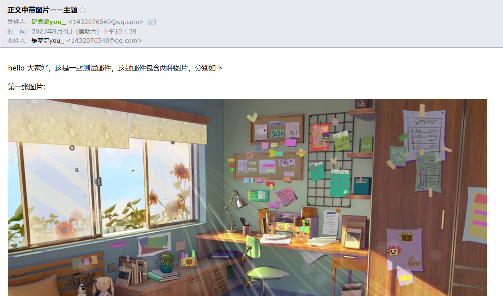

源码位置：

https://gitee.com/ablehan/spring-boot-demo


## 邮箱配置（以QQ邮箱为例）

`SMTP` 协议全称为 `Simple Mail Transfer Protocol`，译作**简单邮件传输协议**，它定义了邮件客户端软件与 `SMTP` 服务器之间，以及 `SMTP` 服务器与 `SMTP` 服务器之间的通信规则。


也就是说 `aaa@qq.com` 用户先将邮件投递到腾讯的 `SMTP` 服务器这个过程就使用了 `SMTP` 协议，然后腾讯的 `SMTP` 服务器将邮件投递到网易的 `SMTP` 服务器这个过程也依然使用了 `SMTP` 协议，`**SMTP**` **服务器就是用来收邮件**。


而 `POP3` 协议全称为 `Post Office Protocol` ，译作**邮局协议**，它定义了邮件客户端与 `POP3` 服务器之间的通信规则，那么该协议在什么场景下会用到呢？

当邮件到达网易的 `SMTP` 服务器之后， `111@163.com` 用户需要登录服务器查看邮件，这个时候就该协议就用上了：邮件服务商都会为每一个用户提供专门的邮件存储空间，`SMTP` 服务器收到邮件之后，就将邮件保存到相应用户的邮件存储空间中，如果用户要读取邮件，就需要通过邮件服务商的 `POP3` 邮件服务器来完成。


所以在使用Springboot发送邮件之前，要开启POP3和SMTP协议，需要获得邮件服务器的授权码，这里以qq邮箱为例，展示获取授权码的过程：


点击开启，会有一个密保验证：


验证通过后，以下就是你的授权码：


## 项目创建

引入邮件发送与Springboot整合的依赖

```xml
        <dependency>
            <groupId>org.springframework.boot</groupId>
            <artifactId>spring-boot-starter-mail</artifactId>
        </dependency>
```

配置邮件基本信息：

```yaml
spring:
  mail:
    # 默认的邮件编码为UTF-8
    default-encoding: utf-8
    #配置SMTP服务器地址
    host: smtp.qq.com
    #端口号465或587
    port: 587
    # 邮箱账号
    username: xxxxxxxxx@qq.com
    # 配置密码，注意不是真正的密码，而是刚刚申请到的授权码
    password: xxxxxxxxxxxxxx
    # 配置SSL 加密工厂
    properties:
      mail:
        smtp:
          socketFactoryClass: javax.net.ssl.SSLSocketFactory
        #表示开启 DEBUG 模式，这样，邮件发送过程的日志会在控制台打印出来，方便排查错误
        debug: true
```

常见邮件服务器地址：

126邮箱SMTP服务器地址:smtp.126.com,端口号:465或者994

2163邮箱SMTP服务器地址:smtp.163.com,端口号:465或者994

yeah邮箱SMTP服务器地址:smtp.yeah.net,端口号:465或者994

qq邮箱SMTP服务器地址：smtp.qq.com,端口号465或587


配置好这些后，springboot会自动帮我们配置好相关的邮件发送类


## 普通邮件发送


编写测试类：

```java
    @Autowired
    private JavaMailSender mailSender;

    /**
     * 发送普通邮件
     */
    @Test
    void sentSimpleMail(){
        // 构建一个邮件对象
        SimpleMailMessage message = new SimpleMailMessage();
        // 设置邮件主题
        message.setSubject("这是一封测试邮件");
        // 设置邮件发送者，这个跟application.yml中设置的要一致
        message.setFrom("***@qq.com");
        // 设置邮件接收者，可以有多个接收者，中间用逗号隔开，以下类似
        // message.setTo("10*****16@qq.com","12****32*qq.com");
        message.setTo("***@qq.com");
        // 设置邮件抄送人，可以有多个抄送人
//        message.setCc("***qq.com");
        // 设置隐秘抄送人，可以有多个
//        message.setBcc("***@qq.com");
        // 设置邮件发送日期
        message.setSentDate(new Date());
        // 设置邮件的正文
        message.setText("这是测试邮件的正文");
        // 发送邮件
        mailSender.send(message);
    }
```


抄送：将邮件同时送给收信人以外的人，用户所写的邮件抄送一份给别人,对方可以看见该用户的E-mail发送给了谁。
密送：将邮件同时送给收信人以外的人，用户所写的邮件抄送一份给别人,但是对方不能查看到这封邮件同时还发送给了哪些人。


效果：


## 发送带附件的邮件

如果发送带有附件的Email，关键是创建multipart 类型的消息——Email 由多个部分组成，其中一部分是Email体，其他部分是附件。


对于发送附件这样的需求来说， SimpleMailMessage 过于简单了。为了发送multipart 类型的Email，需要创建一个 MIME (Multipurpose Internet Mail Extensions) 的消息，可以使用 邮件发送器的 createMimeMessage() 获取。


`javax.mail.internet.MimeMessage` 本身的API比较笨重，Spring 提供了 MimeMessageHelper 来帮助我们对邮件进行配置。MimeMessageHelper 是一个邮件配置的辅助工具类，创建时候的 true 表示构建一个 multipart message 类型的邮件，有了 MimeMessageHelper 之后，我们针对邮件的配置都是由 MimeMessageHelper 来代劳。然后通过addAttachment()方法添加附件。


```java
    @Autowired
    private JavaMailSender mailSender;
    /**
     * 测试发送带附件的邮件
     */
    @Test
    public void sendAttachFileMail() throws MessagingException {
        
        MimeMessage mimeMessage = mailSender.createMimeMessage();
        // 构建消息helper，第二个参数值true表示构建一个可以带附件的multipart邮件对象
        MimeMessageHelper helper = new MimeMessageHelper(mimeMessage,true);

        helper.setSubject("测试发送附件Email——主题");
        helper.setFrom("1432076549@qq.com");
        helper.setTo("1432076549@qq.com");
        helper.setSentDate(new Date());
        helper.setText("测试发送附件Email——这里是正文信息");
        // 第一个参数是自定义的名称，后缀需要加上，第二个参数是文件的位置
        helper.addAttachment("Go语言.pdf",new File("E:\\Go语言.pdf"));
        mailSender.send(mimeMessage);
    }
```

邮件发送的效果：


## 发送富文本内容的Email

发送富文本的Email与发送普通简单文本的Email没有太大区别。关键是将消息的文本设置为HTML，将HTML字符串传给 helper.setText() 方法，并将第二个参数设置为true,表明正文是HTML格式：

```java
 /**
     *  发送富文本内容的Email
     */
    @Test
    public void sendRichTextMail() throws MessagingException {
        MimeMessage mimeMessage = mailSender.createMimeMessage();
        // true表示构建一个可以带附件的邮件对象
        MimeMessageHelper helper = new MimeMessageHelper(mimeMessage,true);

        helper.setSubject("测试发送富文本Email——主题");
        helper.setFrom("1432076549@qq.com");
        helper.setTo("1432076549@qq.com");
        helper.setSentDate(new Date());
        helper.setText("<h2>注意！</h2>"+
                "<div style='color:red'>测试发送富文本Email——这里是正文信息</div>",
                true);

        mailSender.send(mimeMessage);
    }
```

发送效果：


## 发送带图片资源的邮件

图片资源和附件有什么区别呢？图片资源是放在邮件正文中的。


在正文中添加 img 标签，src 指向占位参数，使用 helper.addInline() 来指定图片：

```java
    /**
     * 正文中带图片的邮件
     * @throws MessagingException
     */
    @Test
    public void sendImgResMail() throws MessagingException {
        MimeMessage mimeMessage = mailSender.createMimeMessage();
        MimeMessageHelper helper = new MimeMessageHelper(mimeMessage, true);
        helper.setSubject("正文中带图片——主题");
        helper.setFrom("1432076549@qq.com");
        helper.setTo("1432076549@qq.com");
        helper.setSentDate(new Date());
        // src='cid:p01' 占位符写法 ，第二个参数true表示这是一个html文本
        helper.setText("<p>hello 大家好，这是一封测试邮件，这封邮件包含两种图片，分别如下</p>" +
                "<p>第一张图片：</p>" +
                "<p>第二张图片：</p>",true);
        // 第一个参数指的是html中占位符的名字，第二个参数就是文件的位置
        helper.addInline("p01",new File("E:\\38E53AA4F68CF1FE7A000EA0B4FF00D9.jpg"));
        helper.addInline("p02",new File("E:\\EA8734D9E31A78E876882FFCF93A5396.jpg"));
        mailSender.send(mimeMessage);
    }
```

发送效果：



## 使用 Thymeleaf 作邮件模板

推荐在 Spring Boot 中使用 Thymeleaf 来构建邮件模板。因为 Thymeleaf 的自动化配置提供了一个 TemplateEngine，通过 TemplateEngine 可以方便的将 Thymeleaf 模板渲染为 HTML ，同时，Thymeleaf 的自动化配置在这里是继续有效的 。


首先，引入 Thymeleaf 依赖：

```xml
        <dependency>
            <groupId>org.springframework.boot</groupId>
            <artifactId>spring-boot-starter-thymeleaf</artifactId>
        </dependency>
```

创建模板。在resource 下创建tempales 文件夹，创建文件 email-template.html

```java
<!DOCTYPE html>
<html lang="en" xmlns:th="http://www.thymeleaf.org">
<head>
    <meta charset="UTF-8">
    <title>邮件模板</title>
</head>
<body>
    <h4 th:tetx="${title}"></h4>
    <p style="color: red" th:text="${text}"></p>
</body>
</html>
```

编写邮件发送测试类：

```java
    @Autowired
    private JavaMailSender mailSender;

    @Autowired
    private TemplateEngine templateEngine;
    
	@Test
    public void sendThymeleafMail() throws MessagingException {
        MimeMessage mimeMessage = mailSender.createMimeMessage();
        MimeMessageHelper helper = new MimeMessageHelper(mimeMessage, true);
        helper.setSubject("测试发送Thymeleaf模板Email");
        helper.setFrom("1432076549@qq.com");
        helper.setTo("1432076549@qq.com");
        helper.setSentDate(new Date());
        // 这里引入的是Template的Context
        Context context = new Context();
        // 设置模板中的变量
        context.setVariable("title", "工资调整通知！");
        context.setVariable("text","下月工作工资增加40%");
        // 第一个参数为模板的名称
        String process = templateEngine.process("email-template.html", context);
        // 第二个参数true表示这是一个html文本
        helper.setText(process,true);
        mailSender.send(mimeMessage);
    }
```

发送效果：


[
](https://gitee.com/ablehan/spring-boot-demo)