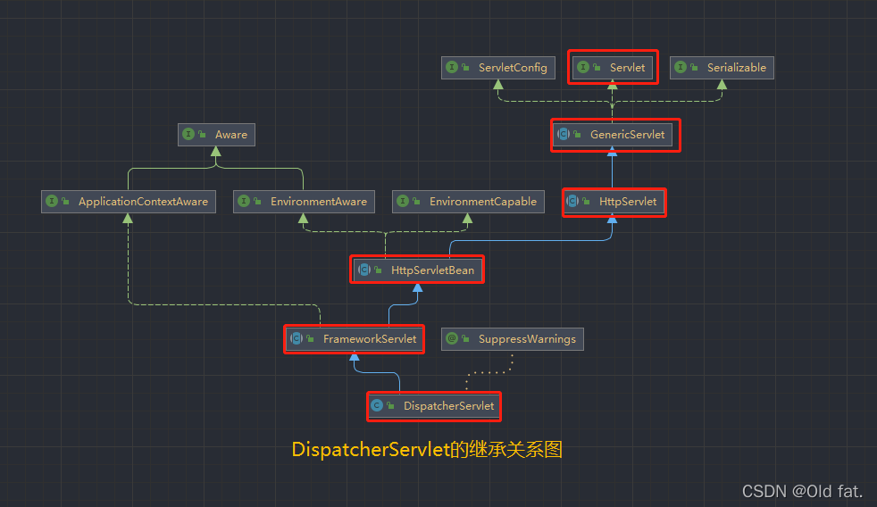
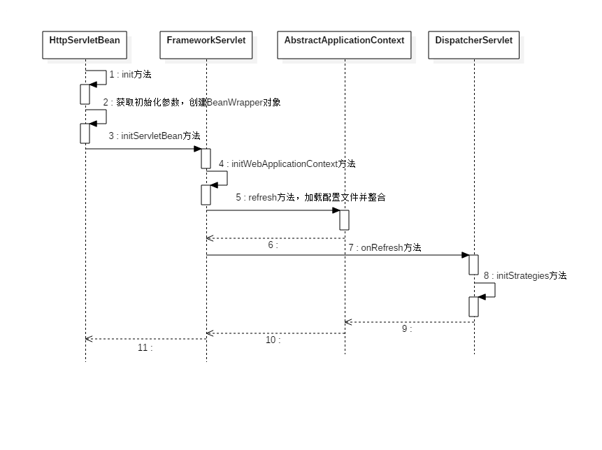

# DispatcherServlet的初始化过程

## DispatcherServlet 的继承关系图



## DispatcherServlet 具体的初始化步骤



`DispatcherServlet` 本质上还是一个 Servlet，所以初始化的时候还是遵循着 Servlet 的初始化过程，Servlet 在初始化的过程中，容器将调用 servlet 的 `init(ServletConfig config)` 方法初始化这个对象，`DispatcherServlet` 的初始化实际上就是调用 Servlet 的 `init(ServletConfig config)` 方法

在 GenericServlet 中 对 `init (ServletConfig config)` 方法进行了实现，并在 `init (ServletConfig config)` 方法中调用了 `init()` 方法，而在 GenericServlet 中并没有对 `init()` 方法有具体的代码实现，而在 `HttpServletBean` 类中对 `init()` 方法进行了重写

```java
// GenericServlet 
/**
 * 实现了Servlet接口中的方法，并调用了 init() 方法
 */
public void init(ServletConfig config) throws ServletException {
    this.config = config;
    this.init();
}

```

而在 `HttpServletBean` 中 调用 `init()` 方法, 其中最主要的是，在 `init()` 方法中，又调用了 `initServletBean()` 方法，该方法是由 `HttpServletBean` 定义，但是 `HttpServletBean` 并没有对 `initServletBean()` 方法进行代码实现，而是由它的子类 `FrameworkServlet` 进行重写实现

```java
// HttpServletBean：init() 方法
@Override
public final void init() throws ServletException {

    PropertyValues pvs = new ServletConfigPropertyValues(getServletConfig(), this.requiredProperties);
    if (!pvs.isEmpty()) {
        try {
            BeanWrapper bw = PropertyAccessorFactory.forBeanPropertyAccess(this);
            ResourceLoader resourceLoader = new ServletContextResourceLoader(getServletContext());
            bw.registerCustomEditor(Resource.class, new ResourceEditor(resourceLoader, getEnvironment()));
            initBeanWrapper(bw);
            bw.setPropertyValues(pvs, true);
        }
        catch (BeansException ex) {
            if (logger.isErrorEnabled()) {
                logger.error("Failed to set bean properties on servlet '" + getServletName() + "'", ex);
            }
            throw ex;
        }
    }

    // 在 HttpServletBean 中的 init() 方法中调用了 initServletBean(); 方法
    initServletBean();
}

```

`FrameworkServlet` 重写并调用 `initServletBean()`，在 `initServletBean()` 方法中进行了创建并初始化 `WebApplicationContext`（上下文），并刷新（`onRefresh(WebApplication wac)` 方法），在 `FrameworkServlet` 中没有对 `onRefresh(WebApplication wac)` 方法进行具体的代码实现，而是由 `DispatcherServlet` 进行重写并调用 `onRefresh(WebApplication wac)` 方法，在方法中调用了具体的初始化方法 调用了 `initStrategies(context)` 方法，初始化策略，即初始化 `DispatcherServlet` 的各个组件

```java
// FrameworkServlet ：initServletBean() 方法
@Override
protected final void initServletBean() throws ServletException {
    getServletContext().log("Initializing Spring " + getClass().getSimpleName() + " '" + getServletName() + "'");
    if (logger.isInfoEnabled()) {
        logger.info("Initializing Servlet '" + getServletName() + "'");
    }
    long startTime = System.currentTimeMillis();

    try {
        //通过调用 initWebApplicationContext();来初始化并获取 WebApplicationContext对象
        this.webApplicationContext = initWebApplicationContext();
        initFrameworkServlet();
    }
    catch (ServletException | RuntimeException ex) {
        logger.error("Context initialization failed", ex);
        throw ex;
    }

    if (logger.isDebugEnabled()) {
        String value = this.enableLoggingRequestDetails ?
            "shown which may lead to unsafe logging of potentially sensitive data" :
        "masked to prevent unsafe logging of potentially sensitive data";
        logger.debug("enableLoggingRequestDetails='" + this.enableLoggingRequestDetails +
                     "': request parameters and headers will be " + value);
    }

    if (logger.isInfoEnabled()) {
        logger.info("Completed initialization in " + (System.currentTimeMillis() - startTime) + " ms");
    }
}

```

- 创建并初始化 `WebApplicationContext` 是在 `initWebApplicationContext()` 方法中完成的

- 调用 `onRefresh(WebApplication wac)` 方法是在 `initWebApplicationContext()` 中

```java
// FrameworkServlet ：initWebApplicationContext() 方法
protected WebApplicationContext initWebApplicationContext() {
    WebApplicationContext rootContext =
        WebApplicationContextUtils.getWebApplicationContext(getServletContext());
    WebApplicationContext wac = null;

    if (this.webApplicationContext != null) {
        wac = this.webApplicationContext;
        if (wac instanceof ConfigurableWebApplicationContext) {
            ConfigurableWebApplicationContext cwac = (ConfigurableWebApplicationContext) wac;
            if (!cwac.isActive()) {
                if (cwac.getParent() == null) {
                    cwac.setParent(rootContext);
                }
                configureAndRefreshWebApplicationContext(cwac);
            }
        }
    }
    if (wac == null) {
        wac = findWebApplicationContext();
    }
    if (wac == null) {
        //创建一个 WebApplicationContext 对象，并将它赋给 wac
        wac = createWebApplicationContext(rootContext);
    }

    if (!this.refreshEventReceived) {
        synchronized (this.onRefreshMonitor) {
            //调用 刷新的方法，该方法具体是在 DispatcherServlet中实现
            onRefresh(wac);
        }
    }

    if (this.publishContext) {
        String attrName = getServletContextAttributeName();
        getServletContext().setAttribute(attrName, wac);
    }

    return wac;
}

```

通过 `DispatcherServlet` 调用 `init(ServletConfig config)` 方法，到最后调用到 `initStrategies(context)` 方法（初始化策略，是 `DispatcherServlet` 具体的初始化代码，里面对 `DispatcherServlet` 各种组件进行了初始化）

```java
// DispatcherServlet ：onRefresh(ApplicationContext context) 方法
@Override
protected void onRefresh(ApplicationContext context) {
    //调用了初始化策略方法
    initStrategies(context);
}

```

```java
// DispatcherServlet ：initStrategies(context) 方法
/**
 * 进行具体的初始化过程
 */
protected void initStrategies(ApplicationContext context) {
    initMultipartResolver(context);
    initLocaleResolver(context);
    initThemeResolver(context);
    initHandlerMappings(context);
    initHandlerAdapters(context);
    initHandlerExceptionResolvers(context);
    initRequestToViewNameTranslator(context);
    initViewResolvers(context);
    initFlashMapManager(context);
}

```

以上就是 `DispatcherServlet` 的初始化的一个大致的过程。