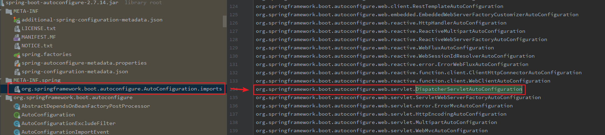

# Spring MVC框架如何与Web应用集成原理

## 传统的Spring MVC项目手动配置

在Spring Boot框架未出现之前，要开发一个基于Spring MVC框架的项目，通常需要在Java web项目的描述符文件web.xml中添加如下配置：

```xml
<!-- 初始化Spring IoC容器 -->
<listener>
    <listener-class>org.springframework.web.context.ContextLoaderListener</listener-class>
</listener>

<!-- 手动配置DispatcherServlet  -->
<servlet>
    <servlet-name>SpringMVC</servlet-name>
    <servlet-class>org.springframework.web.servlet.DispatcherServlet</servlet-class>
    <init-param>
        <param-name>contextConfigLocation</param-name>
        <param-value>classpath*:/spring*.xml</param-value>
    </init-param>
</servlet>

<!-- 配置DispatcherServlet拦截路径，让所有Web请求都经过DispatcherServlet -->
<servlet-mapping>
    <servlet-name>SpringMVC</servlet-name>
    <url-pattern>/</url-pattern>
</servlet-mapping>
```

添加如上配置之后，就能实现将Spring MVC框架整合到Web项目中了，那这是怎么做到的呢？下面一一解答下。

首先，`org.springframework.web.context.ContextLoaderListener`实现了接口`javax.servlet.ServletContextListener`，这样就能确保Web应用在启动后回调该接口。

```java
// javax.servlet.ServletContextListener
public interface ServletContextListener extends EventListener {
	// Web应用在启动之后会调用该方法，通过传递的事件参数获取到ServletContext上下文环境
    public void contextInitialized(ServletContextEvent sce);

	// Web应用在停止后会回调该方法
    public void contextDestroyed(ServletContextEvent sce);
}
```

在`org.springframework.web.context.ContextLoaderListener`中实现了`contextInitialized()`方法，并且在方法实现中触发了对Spring IoC容器的初始化，并且将`ServletContext`上下文保存到了IoC容器中。

```java
// ContextLoaderListener
@Override
public void contextInitialized(ServletContextEvent event) {
    // 触发对Spring IoC容器的初始化
    initWebApplicationContext(event.getServletContext());
}

// AbstractRefreshableWebApplicationContext
@Override
public void setServletContext(@Nullable ServletContext servletContext) {
    // 在IoC容器中保存了ServletContext上下文
    this.servletContext = servletContext;
}
```

既然Spring IoC容器已经和ServletContext建立了联系，那当Web请求被DispatcherServlet拦截之后就可以基于Spring IoC容器环境进行处理了，实际上这样就建立了一个从Serlvet到Spring MVC框架的桥梁。

### Spring Boot自动初始化DispatcherServlet

如下解读基于Spring Boot 2.7.14版本进行。

经过对Spring Boot的源码解读和梳理后知道，在Spring Boot框架中DispatcherServlet的自动装配是通过注解`@DispatcherServletAutoConfiguration`实现的。 具体流程如下：

首先，在Spring Boot的核心注解`@EnableAutoConfiguration`中引入了一个类`AutoConfigurationImportSelector`，Spring Boot在启动时会触发该类中如下方法的调用。

```java
// AutoConfigurationImportSelector.getCandidateConfigurations()
// 该方法是在Spring Boot启动时调用的，具体来说是在刷新Spring IoC容器的时候触发的
// 在该方法中实现加载自动配置类，具体来说，是加载2个配置文件中的自动配置类
// 其一，加载各种starter组件jar中"META-INF/spring.factories"文件指定的自动配置类
// 其二，加载Sring Boot自己的自动配置类，这些类在文件"META-INF/spring/org.springframework.boot.autoconfigure.AutoConfiguration.imports"中指定
protected List<String> getCandidateConfigurations(AnnotationMetadata metadata, AnnotationAttributes attributes) {
    // 首先加载各类starter组件jar包中"META-INF/spring.factories"文件指定的自动配置类
    List<String> configurations = new ArrayList<>(
            SpringFactoriesLoader.loadFactoryNames(getSpringFactoriesLoaderFactoryClass(), getBeanClassLoader()));
    // 再加载文件"META-INF/spring/org.springframework.boot.autoconfigure.AutoConfiguration.imports"中指定的自动配置类
    ImportCandidates.load(AutoConfiguration.class, getBeanClassLoader()).forEach(configurations::add);
    return configurations;
}
```

其次，在加载Spring Boot的“META-INF/spring/org.springframework.boot.autoconfigure.AutoConfiguration.imports”自动配置类的时候，就会加载到`org.springframework.boot.autoconfigure.web.servlet.DispatcherServletAutoConfiguration`。 



在`DispatcherServletAutoConfiguration`的源码中可以很清晰地看到正是在该配置类中实现了对`dispatcherServlet`的注入。

```java
@AutoConfigureOrder(Ordered.HIGHEST_PRECEDENCE)
@AutoConfiguration(after = ServletWebServerFactoryAutoConfiguration.class)
@ConditionalOnWebApplication(type = Type.SERVLET)
@ConditionalOnClass(DispatcherServlet.class)
public class DispatcherServletAutoConfiguration {
    @Configuration(proxyBeanMethods = false)
    @Conditional(DefaultDispatcherServletCondition.class)
    @ConditionalOnClass(ServletRegistration.class)
    @EnableConfigurationProperties(WebMvcProperties.class)
    protected static class DispatcherServletConfiguration {

        // 实际上是在DispatcherServletAutoConfiguration的内部静态类DispatcherServletConfiguration中完成了对"dispatcherServlet"的注入
        @Bean(name = DEFAULT_DISPATCHER_SERVLET_BEAN_NAME)
        public DispatcherServlet dispatcherServlet(WebMvcProperties webMvcProperties) {
            DispatcherServlet dispatcherServlet = new DispatcherServlet();
            dispatcherServlet.setDispatchOptionsRequest(webMvcProperties.isDispatchOptionsRequest());
            dispatcherServlet.setDispatchTraceRequest(webMvcProperties.isDispatchTraceRequest());
            dispatcherServlet.setThrowExceptionIfNoHandlerFound(webMvcProperties.isThrowExceptionIfNoHandlerFound());
            dispatcherServlet.setPublishEvents(webMvcProperties.isPublishRequestHandledEvents());
            dispatcherServlet.setEnableLoggingRequestDetails(webMvcProperties.isLogRequestDetails());
            return dispatcherServlet;
        }

        // 省略了其他代码
        // ...
    }
}
```

虽然解答了`DispatcherServlet`的自动注入问题，但是还没有解答Spring IoC容器是如何与ServletContext上下文建立联系的。 经过对Spring Boot启动流程的源码解读知道，其实建立Spring IoC容器与ServletContext的关系是在`ServletWebServerApplicationContext.onRefresh()`方法中实现的。

```javascript
// 在刷新Spring IoC容器的过程中会调用该方法
@Override
protected void onRefresh() {
    super.onRefresh();
    try {
        createWebServer();
    }
    catch (Throwable ex) {
        throw new ApplicationContextException("Unable to start web server", ex);
    }
}

private void createWebServer() {
    // 在这里会完成对Servlet容器的创建，并且与ServletContext上下文进行关联
}
```

所以，Spring Boot通过自动装配机制完成了对Spring MVC的`DispatcherServlet`注入，并且还创建了嵌入式的Servlet容器，并以Deamon线程方式运行在后台。

