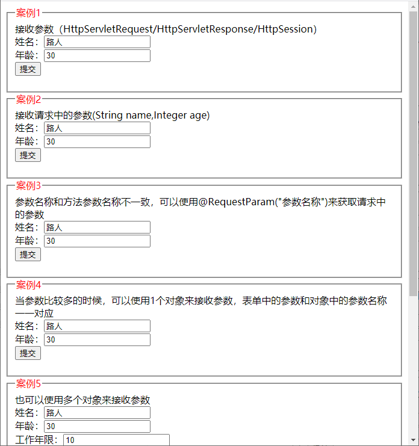

# SpringMVC 系列第 4 篇：接受参数有多少种方式

原文地址 [mp.weixin.qq.com](https://mp.weixin.qq.com/s?__biz=MzA5MTkxMDQ4MQ==&mid=2648940460&idx=1&sn=0639074b3761c98b832058ce49b74bf1&chksm=88620792bf158e84b1dbc3963d91c7971f23e0456ffe97c6fed86bb534d33c243568c0c45915&scene=178&cur_album_id=1873497824336658435#rd)

## 接收 Servlet 中的参数 HttpServletRequest、HttpServletResponse、HttpSession

比如我们想在方法中用到 servlet 中的对象：HttpServletRequest、HttpServletResponse、HttpSession，那么可以直接在方法的参数中声明这些对象即可，SpringMVC 会自动将这些参数传递进来，用到哪个就声明哪个

```java
@RequestMapping("/receiveparam/test1.do")
public ModelAndView test1(HttpServletRequest request,
                          HttpServletResponse response,
                          HttpSession session) {
    String name = request.getParameter("name");
    String age = request.getParameter("age");
    String msg = String.format("name:%s,age:%s", name, age);
    System.out.println(msg);

    ModelAndView modelAndView = new ModelAndView();
    modelAndView.setViewName("/WEB-INF/view/result.jsp");
    modelAndView.addObject("msg", msg);
    return modelAndView;
}
```

对应的表单

```html
<form method="post" action="receiveparam/test2.do">
  姓名：<input name="name" value="" /><br />
  年龄：<input name="age" value="" /><br />
  <input type="submit" value="提交" />
</form>
```

## 解决乱码问题

如果大家直接创建一个 springmvc 项目运行上面的案例，会发现 name 为中文的时候，会是乱码，这里需要在 web.xml 中添加下面配置，解决乱码问题

```xml
<filter>
  <filter-name>characterEncodingFilter</filter-name>
  <filter-class>org.springframework.web.filter.CharacterEncodingFilter</filter-class>
  <init-param>
    <param-name>encoding</param-name>
    <param-value>UTF-8</param-value>
  </init-param>
  <init-param>

    <param-name>forceRequestEncoding</param-name>
    <param-value>true</param-value>
  </init-param>
  <init-param>
    <param-name>forceResponseEncoding</param-name>
    <param-value>true</param-value>
  </init-param>
</filter>
<filter-mapping>
  <filter-name>characterEncodingFilter</filter-name>
  <url-pattern>/*</url-pattern>
</ filter-mapping>
```

上面这段配置主要是添加了一个过滤器，这个过滤器会处理所有请求，相当于对所有请求会执行下面操作，而 encoding 我们设置的是 `UTF-8`

```java
request.setCharacterEncoding("utf-8");
response.setCharacterEncoding("utf-8");
```

## 通过方法形参名称接收参数

表单

```html
<form method="post" action="receiveparam/test2.do">
  姓名：<input name="name" value="" /><br />
  年龄：<input name="age" value="" /><br />
  <input type="submit" value="提交" />
</form>
```

控制器方法

```java
/**
 * springmvc调用这个方法之前，会根据方法参数名称，请求中获取参数的值，将其传入
 * 过程：
 * 1、将request.getParameter("name")传递给方法的第1个参数name
 * 2、将Integer.valueOf(request.getParameter("age"))传递给方法的第2个参数age
 *
 * @param name
 * @param age
 * @return
 */
@RequestMapping("/receiveparam/test2.do")
public ModelAndView test2(String name, Integer age) {
    String msg = String.format("name:%s,age:%s", name, age);
    System.out.println(msg);

    ModelAndView modelAndView = new ModelAndView();
    modelAndView.setViewName("/WEB-INF/view/result.jsp");
    modelAndView.addObject("msg", msg);
    return modelAndView;
}
```

这种情况下，form 表单中的参数名称和控制器方法中的参数名称一样，会按照名称一一对应进行赋值。

## 通过 @RequestParam 接收参数

如果方法的参数名称和表单中的参数名称不一致的时候，可以通过 @RequestParam 注解的 value 属性来指定表单中参数的名称。

比如下面表单的 2 个名称分别为：pname 和 page

```html
<form method="post" action="receiveparam/test2.do">
  姓名：<input name="pname" value="" /><br />
  年龄：<input name="page" value="" /><br />
  <input type="submit" value="提交" />
</form>
```

对应的方法如下，2 个形参的参数名称分别为 name 和 age，和表单中的名称不一致了，那么可以在方法的参数前面加上 @RequestParam 注解，注解的 value 为表单中元素的名称，参数 name 希望接受表单中 pname 的值，那么就需要在 name 这个参数前面加上 `@RequestParam("pname")`，方法的第 2 个参数也一样，加上了 `@RequestParam("page")`

```java
/**
 * 如果方法的参数名称和表单中的参数名称不一致的时候，可以通过 @RequestParam注解的value属性来指定表单中参数的名称
 * 比如：@RequestParam("pname") String name 接收 request.getParameter("pname") 的值
 * 1、将request.getParameter("pname")传递给方法的第1个参数name
 * 2、将Integer.valueOf(request.getParameter("page"))传递给方法的第2个参数age
 *
 * @param name
 * @param age
 * @return
 */
@RequestMapping("/receiveparam/test3.do")
public ModelAndView test3(@RequestParam("pname") String name,
                          @RequestParam("page") Integer age) {
    String msg = String.format("name:%s,age:%s", name, age);
    System.out.println(msg);

    ModelAndView modelAndView = new ModelAndView();
    modelAndView.setViewName("/WEB-INF/view/result.jsp");
    modelAndView.addObject("msg", msg);
    return modelAndView;
}
```

`@RequestParam`用来将请求的参数和方法的参数进行绑定，这个注解还有几个属性，也比较常用，大家熟悉下

```java
public @interface RequestParam {
    //参数名称
    @AliasFor("name")
    String value() default "";

    //同value属性
    @AliasFor("value")
    String name() default "";

    //参数是不是必须的，默认为true，如果请求中没有这个参数，springmvc会报错
    boolean required() default true;

    //默认值
    String defaultValue() default ValueConstants.DEFAULT_NONE;
}
```

## 通过 1 个对象接收参数

通常方法不要超过 5 个，当 http 请求的参数多的时候，我们可以使用一个对象来接收，对象中的参数名称和 http 请求中的参数名称一致。

比如有下面表单

```html
<form method="post" action="receiveparam/test2.do">
  姓名：<input name="name" value="" /><br />
  年龄：<input name="age" value="" /><br />
  <input type="submit" value="提交" />
</form>
```

我们可以定义一个 UserInfoDto 类来接收表单中的参数，这个类中有 2 个属性名称和上面表单中的属性名称一样。

```java
public class UserInfoDto {
    //姓名
    private String name;
    //年龄
    private Integer age;

    //省略了get、set方法

    @Override
    public String toString() {
        return "UserModel{" +
        " + name + '\'' +
        ", age=" + age +
        '}';
    }
}
```

对应控制器的代码如下

```java
/**
 * 传递对象信息，参数比较多的时候，可以通过对象来传递信息
 * 比如表单中2个参数（name、age）
 * 那么可以定义一个类 UserInfoDto(2个属性：name、age) 来接收表单提交的参数
 * 控制器的方法参数为：(UserInfoDto userInfoDto)
 * springmvc调用这个方法的时候，会自动将UserModel创建好，并且将请求中的参数按名称设置到 UserInfoDto 的属性中，然后传递进来
 * 相当于会执行下面代码：
 * UserInfoDto user = new UserInfoDto();
 * user.setName(request.getParameter("name"));
 * user.setAge(Integer.valueOf(request.getParameter("age")));
 * 然后将user对象传给当前方法的第一个参数
 *
 * @param userInfoDto
 * @return
 */
@RequestMapping(value="/receiveparam/test4.do")
public ModelAndView test4(UserInfoDto userInfoDto){
    String msg = String.format("userDto：%s", userInfoDto);
    System.out.println(msg);
    ModelAndView modelAndView = new ModelAndView();
    modelAndView.setViewName("/WEB-INF/view/result.jsp");
    modelAndView.addObject("msg", msg);
    return modelAndView;
}
```

## 通过多个对象接收参数

上面我们将 form 表单有一个对象来接收，实际上也可以用多个对象来接收。

表单如下

```html
<form method="post" action="receiveparam/test2.do">
  姓名：<input name="name" value="路人" /> <br />
  年龄：<input name="age" value="30" /><br />

  工作年限：<input name="workYears" value="10" /> <br />
  年龄：<input name="workAddress" value="上海市" /><br />
  <input type="submit" value="提交" />
</form>
```

表单中有 4 个元素，我们用 2 个对象来接收，前面 2 个元素用 UserInfoDto 对象来接收，后面 2 个对象用 WorkInfoDto 对象来接收，我们需要定义 2 个类：UserInfoDto 和 WorkInfoDto

```java
/**
 * 用户基本信息
 */
public class UserInfoDto {
    //姓名
    private String name;
    //年龄
    private Integer age;

    //省略了get、set方法

    @Override
    public String toString() {
        return "UserModel{" +
        " + name + '\'' +
        ", age=" + age +
        '}';
    }
}

/**
 * 工作基本信息
 */
public class WorkInfoDto {
    //工作年限
    private Integer workYears;
    //工作地点
    private String workAddress;

    //省略了get、set方法

    @Override
    public String toString() {
        return "WorkInfoDto{" +
        "workYears=" + workYears +
        ", workAddress='" + workAddress + '\'' +
        '}';
    }
}
```

对应的控制器方法如下

```java
/**
 * 也可以用多个对象来接收
 * 比如表单有4个元素[name,age,workYear,workAddress]
 * 其中请求的参数 name,age 赋值给UserInfoDto中的2个属性（name,age）
 * 另外2个参数 workYear,workAddress 赋值给WorkInfoDto中的2个属性（workYear,workAddress）
 *
 * @param userInfoDto
 * @param workInfoDto
 * @return
 */
@RequestMapping("/receiveparam/test5.do")
public ModelAndView test5(UserInfoDto userInfoDto, WorkInfoDto workInfoDto) {
    String msg = String.format("userInfoDto：[%s], workInfoDto：[%s]", userInfoDto, workInfoDto);
    System.out.println(msg);

    ModelAndView modelAndView = new ModelAndView();
    modelAndView.setViewName("/WEB-INF/view/result.jsp");
    modelAndView.addObject("msg", msg);
    return modelAndView;
}
```

## 组合对象接收参数（对象中嵌套对象、集合等等）

如下表单

```html
<form method="post" action="receiveparam/test6.do">
  姓名：<input name="userInfo.name" value="路人" />

  年龄：<input name="userInfo.age" value="30" />

  工作年限：<input name="workInfo.workYears" value="10" />

  年龄：<input name="workInfo.workAddress" value="上海市" />

  第1份工作公司:<input name="experienceInfos[0].company" value="百度" />

  第1份职位:<input name="experienceInfos[0].position" value="Java开发" />

  第2份工作公司:<input name="experienceInfos[1].company" value="阿里" />

  第2份职位:<input name="experienceInfos[1].position" value="Java资深开发" />
  <input type="submit" value="提交" />
</form>
```

对应的控制器

```java
@RequestMapping("/receiveparam/test6.do")
public ModelAndView test6(UserDto userDto) {
    String msg = String.format("userDto：[%s]", userDto);
    System.out.println(msg);

    ModelAndView modelAndView = new ModelAndView();
    modelAndView.setViewName("/WEB-INF/view/result.jsp");
    modelAndView.addObject("msg", msg);
    return modelAndView;
}
```

重点要看方法参数`UserDto`这个类型的结构

```java
/**
 * 用户信息
 */
public class UserDto {
    //个人基本信息
    private UserInfoDto userInfo;
    //工作信息
    private WorkInfoDto workInfo;
    //工作经验（0到n个）
    private List<ExperienceInfoDto> experienceInfos;

    //省略了get、set方法

    @Override
    public String toString() {
        return "UserDto{" +
        "userInfo=" + userInfo +
        ", workInfo=" + workInfo +
        ", experienceInfos=" + experienceInfos +
        '}';
    }
}
```

UserDto 类中有 3 个属性，2 个对象，一个 List 集合，再来看看这 3 个类的代码

```java
/**
 * 用户基本信息
 */
public class UserInfoDto {
    //姓名
    private String name;
    //年龄
    private Integer age;

    //省略了get、set方法

    @Override
    public String toString() {
        return "UserModel{" +
        " + name + '\'' +
        ", age=" + age +
        '}';
    }
}

/**
 * 工作基本信息
 */
public class WorkInfoDto {
    //工作年限
    private Integer workYears;
    //工作地点
    private String workAddress;

    //省略了get、set方法

    @Override
    public String toString() {
        return "WorkInfoDto{" +
        "workYears=" + workYears +
        ", workAddress='" + workAddress + '\'' +
        '}';
    }
}

/**
 * 工作经验
 */
public class ExperienceInfoDto {
    //公司
    private String company;
    //职位
    private String position;

    //省略了get、set方法

    @Override
    public String toString() {
        return "ExperienceInfoDto{" +
        "company='" + company + '\'' +
        ", position='" + position + '\'' +
        '}';
    }
}
```

这里主要注意下集合数据的传递方式，表单中的名称需要有下标，从 0 开始，如下图：


## 通过 @PathVariable 接受 url 中的参数

有时候我们请求的 url 是下面这样的，有一部是动态的，也就是 / userInfo / 后面的部分，是 userId，具体 userId 的值是多少我们不知道，此时我们怎么办？

/userInfo/1
/userInfo/2
/userInfo/3
/userInfo/4
...
/userInfo/{userId}

这种情况下就可以用到多态 url 了，比如下面控制器的代码，注意`@RequestMapping`注解的 value 值为`/receiveparam/{v1}/{v2}.do`，被 {} 包裹的部分就是动态的部分，方法参数中可以通过`@PathVariabl`取到 url 动态部分的值。

```java
/**
 * 动态url：url中可以使用{变量名称}来表示动态的部分，{}包裹的部分可以替换为任意内容
 * 比如：/receiveparam/{v1}/{v2}.do可以接受:/receiveparam/1/2.do、/receiveparam/路人/30.do 等等
 * @PathVariable("变量名称")可以获取到url中动态部分的内容，将其赋值给方法的形参
 * 比如当前方法收到了请求：/receiveparam/路人/30.do
 * 那么方法的第1个参数p1的值为：路人
 * 第2个参数p2的职位30
 *
 * @param p1
 * @param p2
 * @return
 */
@RequestMapping("/receiveparam/{v1}/{v2}.do")
public ModelAndView test7(@PathVariable("v1") String p1, @PathVariable("v2") String p2) {
    String msg = String.format("p1：[%s]，p2：[%s]", p1, p2);
    System.out.println(msg);

    ModelAndView modelAndView = new ModelAndView();
    modelAndView.setViewName("/WEB-INF/view/result.jsp");
    modelAndView.addObject("msg", msg);
    return modelAndView;
}
```


请求和值对应关系

| 请求 url                 | 方法参数 p1 的值 | 方法参数 p2 的值 |
| ------------------------ | ---------------- | ---------------- |
| /receiveparam/路人/30.do | 路人             | 30               |
| /receiveparam/1/2.do     | 1                | 2                |

## 汇总

上面这些接受参数的方式可以组合，比如下面这样，同时有 servlet 对象和自定义对象

```java
@RequestMapping("/receiveparam/test8.do")
public ModelAndView test8(HttpServletRequest request, HttpServletResponse response, UserDto userDto)
```

## 案例代码及测试用例

### 代码地址

`https://gitee.com/javacode2018/springmvc-series` 可以下载下来部署到 tomcat 中运行查看上面每个案例的结果。

### 案例代码有两种运行方式

#### 方式 1：浏览器中查看效果

将 chat02-receiveparam 模块部署到 tomcat 中，然后访问首页即可看到案例，如下图：http://localhost:8080/chat02/



#### 方式 2：HTTP Client 的方式查看效果

通过 idea 中的 **HTTP Client** 来运行测试用例，**HTTP Client** 用法不知道的朋友，可以移步：异常高效的接口测试利器 HTTP Client

如下图，HTTP Client 测试用例代码都在`chat02-receiveparam/src/test/resources/ReceiveParamController.http`中


