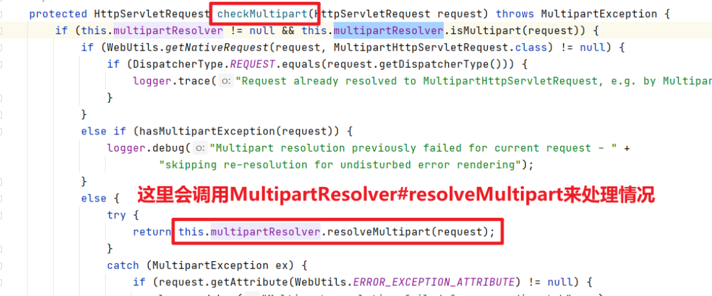
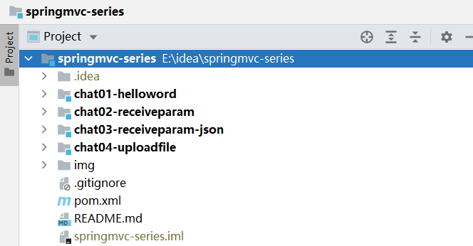

# SpringMVC第6篇 SpringMVC上传文件的 4 种方式，你都会么？

本文由 [简悦 SimpRead](http://ksria.com/simpread/) 转码， 原文地址 [mp.weixin.qq.com](https://mp.weixin.qq.com/s?__biz=MzA5MTkxMDQ4MQ==&mid=2648940588&idx=1&sn=4d8d27647fcb289d0d4c29b708b73e81&chksm=88623812bf15b1047c58a883422a8e9f94ea424018c62bd24ed27d94192f5464b47c7d201946&scene=178&cur_album_id=1873497824336658435#rd)

## 本文内容

- 文件上传开发步骤
- 单文件上传
- 多文件上传
- 通过 MultipartHttpServletRequest 处理文件上传
- 通过自定义对象接收上传的文件
- 扩展知识
- 案例代码

## 预备知识

springmvc 系列中的测试案例，基本上都是使用 idea 中的 http client 插件开发的，是一款非常高效的接口测试工具，还没有用过的，建议先去了解下用法：[idea 中的接口测试利器（http cient 插件）](https://mp.weixin.qq.com/s?__biz=MzA5MTkxMDQ4MQ==&mid=2648940431&idx=1&sn=6c592aa2746fd448c1a6ef511189eaaa&scene=21#wechat_redirect)

## 软件版本

- idea 2020.3.3
- jdk1.8
- ≥maven3.6.1
- spring5.3.6
- apache-tomcat-9.0.46

## springmvc 文件上传步骤

### 4 个步骤

1、添加 maven 配置

2、springmvc 容器中定义 MultipartResolver 这个 bean

3、controller 中使用 MultipartFile 接收上传的文件

4、调用 MultipartFile#transferTo 方法保存文件

5、指定请求类型为：`multipart/form-data`

### 步骤 1：添加 maven 配置

```xml
<dependency>
  <groupId>commons-fileupload</groupId>
  <artifactId>commons-fileupload</artifactId>
  <version>1.4</version>
</dependency>
<dependency>
  <groupId>commons-io</groupId>
  <artifactId>commons-io</artifactId>
  <version>2.6</version>
</dependency>
```

### 步骤 2：定义 MultipartResolver 这个 bean

```xml
<bean id="multipartResolver" 
  class="org.springframework.web.multipart.commons.CommonsMultipartResolver">   
  <property #{10*1024*1024}"/>
    <property #{100*1024*1024}"/>
</bean>
```

1. http 上传的请求类型为 multipart/form-data 类型，springmvc 内部需要为这种请求指定解析器，解析器的类型为`org.springframework.web.multipart.MultipartResolver`
2. MultipartResolver 有 2 个实现类，这里我们使用 CommonsMultipartResolver 作为解析器来解析文件上传的 http 请求
3. 注意 bean 名称必须为`multipartResolver`
4. 两个比较有用的属性

- maxUploadSizePerFile：单个文件大小限制（byte）
- maxUploadSize：整个请求大小限制（byte）

### 步骤 3：控制器使用 MultipartFile 接收上传的文件

```java
@RequestMapping("/upload1.do")
public ModelAndView upload1(@RequestParam("file1") MultipartFile f1){
}
```

### 步骤 4：调用 MultipartFile#transferTo 方法保存文件

```java
@RequestMapping("/upload1.do")
public ModelAndView upload1(@RequestParam("file1") MultipartFile f1){
    //destFile为目标文件，即将上传的文件写到destFile中
    f1.transferTo(destFile);
}
```

### 步骤 5：设置 http 请求类型为 multipart/form-data

上传文件，需要设置 form 表单的 enctype 属性值为 multipart/form-data


下面来介绍 4 种常用的上传文件的方式。

## MultipartFile：上传的文件对象

springmvc 中使`MultipartFile`这个类来表示上传的文件，提供了一系列方法来获取上传的文件的信息。

| 方法                         | 描述                     |
| ---------------------------- | ------------------------ |
| String getName()             | 用来获取中 name 的名称   |
| String getOriginalFilename() | 获取文件的原始名称       |
| String getContentType()      | 获取文件类型             |
| long getSize()               | 获取文件大小（byte）     |
| byte[] getBytes()            | 获取文件内容             |
| InputStream getInputStream() | 获取文件流               |
| void transferTo(File dest)   | 将上传的文件写到 dest 中 |

## 单文件上传

控制器中使用一个 MultipartFile 来接收上传的文件，下面看代码。

### 表单代码

```html
<form method="post" action="upload1.do" enctype="multipart/form-data">
  文件：<input type="file" name="file1" value="" ><br/>
  <input type="submit" value="提交">
</form>
```

表单中文件元素的 name 为 file1

### 控制器代码

```java
/**
 * 单文件上传
 * 1、MultipartFile用来接收表单中上传的文件
 * 2、每个MultipartFile对应表单中的一个元素
 * 3、@RequestParam("f1")用来自动接受表单中的哪个元素？value用来指定表单元素的名称
 *
 * @param f1
 * @return
 * @throws IOException
 */
@RequestMapping("/upload1.do")
public ModelAndView upload1(@RequestParam("file1") MultipartFile f1) throws IOException {
    //获取文件名称
    String originalFilename = f1.getOriginalFilename();
    String destFilePath = String.format("E:\\idea\\springmvc-series\\chat04-uploadfile\\src\\main\\webapp\\upfile\\%s", originalFilename);
    File destFile = new File(destFilePath);
    //调用transferTo将上传的文件保存到指定的地址
    f1.transferTo(destFile);

    ModelAndView modelAndView = new ModelAndView();
    modelAndView.setViewName("/WEB-INF/view/result.jsp");
    modelAndView.addObject("msg", destFile.getAbsolutePath());
    return modelAndView;
}
```

上传的文件会被传入 update1 方法的第一个参数，注意第一个参数有个 @RequestParam("file1") 注解，这个注解的 value 就是表单中文件元素名称。

## 多文件上传

当上传多个文件的时候，可以使用多个 MultipartFile 参数来接收上传的文件。

### 表单代码

```html
<form method="post" action="upload2.do" enctype="multipart/form-data">
  文件1：<input type="file" name="file1" value=""><br/>
  文件2：<input type="file" name="file2" value=""><br/>
  <input type="submit" value="提交">
</form>
```

### 控制器代码

```java
/**
 * 多文件上传
 * 1、方法中指定多个MultipartFile，每个MultipartFile对应一个上传的文件
 * 2、@RequestParam("file1") 用来指定具体接受上传的表单中哪个元素的名称
 *
 * @param f1
 * @param f2
 * @return
 */
@RequestMapping("/upload2.do")
public ModelAndView upload2(@RequestParam("file1") MultipartFile f1,
                            @RequestParam("file2") MultipartFile f2) {
    System.out.println("f1：" + f1);
    System.out.println("f2：" + f2);
    ModelAndView modelAndView = new ModelAndView();
    modelAndView.setViewName("/WEB-INF/view/result.jsp");
    modelAndView.addObject("msg", null);
    return modelAndView;
}
```

我们上传 2 个图片，控制台输出

f1：MultipartFile[field="file1", filename=1.jpg, contentType=image/jpeg, size=145615]
f2：MultipartFile[field="file2", filename=2.jpg, contentType=image/jpeg, size=67713]

## 通过 MultipartHttpServletRequest 处理文件上传

### MultipartHttpServletRequest 接口

1、springmvc 接受到上传文件的的请求之后，会将请求转换为 MultipartHttpServletRequest 类型的对象

2、MultipartHttpServletRequest 中提供了一系列方法来获取请求中的所有参数信息

3、其中 getParameterMap() 用来获取非文件类型的参数列表

4、getMultiFileMap() 方法用来获取上传的文件列表


下面来个案例，使用 MultipartHttpServletRequest 来处理上传的文件请求。

### 表单代码

下面表单中有 2 个文本，2 个文件元素。

```html
<form method="post" action="upload3.do" enctype="multipart/form-data">
  姓名：<input name="name" value="" /> <br/>
  年龄：<input name="age" value="" /><br/>
  文件1：<input type="file" name="file1" value="" ><br/>
  文件2：<input type="file" name="file2" value="" ><br/>
  <input type="submit" value="提交">
</form>
```

### 控制器代码

控制器中使用 MultipartHttpServletRequest 来获取所有参数信息，分了 2 部分获取

1、先使用 request.getParameterMap() 获取非文件类型的参数，即可以获取表单中的 name 和 age 这 2 个参数的信息

2、通过 request.getMultiFileMap() 获取文件类型的参数，即可以获取表单中 file1 和 file2 这 2 个文件的信息

稍后关注控制台的输出

```java
/**
 * 使用MultipartHttpServletRequest处理多文件上传
 * 上传文件的http请求会被转换为MultipartHttpServletRequest类型
 * MultipartHttpServletRequest中提供了很多很多方法用来获取请求中的参数
 *
 * @param request
 * @return
 */
@RequestMapping("/upload3.do")
public ModelAndView upload3(MultipartHttpServletRequest request) {
    //1.获取表单中非文件数据
    System.out.println("---------获取表单中非文件数据---------");
    Map parameterMap = request.getParameterMap();
    parameterMap.forEach((name, values) -> {
        System.out.println(String.format("%s:%s", name, Arrays.asList(values)));
    });
    //2、获取表单中文件数据
    System.out.println("---------获取表单中文件数据---------");
    MultiValueMap multiFileMap = request.getMultiFileMap();
    //2、遍历表单中元素信息
    multiFileMap.forEach((name, files) -> {
        System.out.println(String.format("%s:%s", name, files));
    });
    
    ModelAndView modelAndView = new ModelAndView();
    modelAndView.setViewName("/WEB-INF/view/result.jsp");
    modelAndView.addObject("msg", "上传成功");
    return modelAndView;
}
```

### 使用 http client 发起请求

这里我们使用 idea 中的 http client 这个插件来调用接口，http client 插件是一个非常方便发起 http 请求额一个插件，测试接口特别容易，后面的大量案例中我们都会使用这个工具来快速测试接口的效果，所以这个工具，如果还不会的，建议去看一下这篇文章：

[idea 中的接口测试利器（http cient 插件）](https://mp.weixin.qq.com/s?__biz=MzA5MTkxMDQ4MQ==&mid=2648940431&idx=1&sn=6c592aa2746fd448c1a6ef511189eaaa&scene=21#wechat_redirect)

下面，我们在 idea 中创建一个 UploadController.http 文件，文件内容如下：

```plain
### 多文件上传
POST http://localhost:8080/chat04/upload3.do
Content-Type: multipart/form-data; boundary=bound1

--bound1
Content-Disposition: form-data; 

name=路人
--bound1
Content-Disposition: form-data; 

age=30
--bound1
Content-Disposition: form-data; 

file1 = < ./1.jpg
--bound1
Content-Disposition: form-data; 
Content-Type: image/jpeg

file2 = < ./2.jpg
--bound1--
```


### 控制台输出

---------获取表单中非文件数据---------
name:[路人]
age:[30]
---------获取表单中文件数据---------
file1:[MultipartFile[field="file1", filename=1.jpg, contentType=*/*; charset=UTF-8, size=145615]]
file2:[MultipartFile[field="file2", filename=2.jpg, contentType=image/jpeg, size=67713]]

## 自定义对象接收多文件上传

### 表单代码

这个表单用来输入用户信息:

姓名、年龄、头像图片、2 张身份证图片

```html
<form method="post" action="upload4.do" enctype="multipart/form-data">
  姓名：<input name="name" value="" /> <br/>
  年龄：<input name="age" value="" /><br/>
  文件1：<input type="file" name="file1" value="" ><br/>
  文件2：<input type="file" name="file2" value="" ><br/>
  <input type="submit" value="提交">
</form>
```

### 自定义一个类

自定义了一个 UserDto，来接收上面表单的参数。

```java
import org.springframework.web.multipart.MultipartFile;

import java.util.List;

public class UserDto {
    //姓名
    private String name;
    //年龄
    private Integer age;
    //头像
    private MultipartFile headImg;
    //身份证（多张图像）
    private List idCardImg;

    //省略了get、set方法...
}
```

### 控制器代码

```java
@RequestMapping("/upload4.do")
public ModelAndView upload4(UserDto userDto) {
    System.out.println("姓名：" + userDto.getName());
    System.out.println("年龄：" + userDto.getAge());
    System.out.println("头像文件：" + userDto.getHeadImg());
    System.out.println("多张身份证文件：" + Arrays.asList(userDto.getIdCardImg()));
    
    ModelAndView modelAndView = new ModelAndView();
    modelAndView.setViewName("/WEB-INF/view/result.jsp");
    modelAndView.addObject("msg", "上传成功");
    return modelAndView;
}
```

### 测试代码

这里我们还是使用 http client 插件发起请求

```plain
### 单个文件上传
POST http://localhost:8080/chat04/upload1.do
Content-Type: multipart/form-data; boundary=WebAppBoundary

--WebAppBoundary
Content-Disposition: form-data; name="file1"; filename="1.jpg"

< ./1.jpg
--WebAppBoundary--


### 多文件上传
POST http://localhost:8080/chat04/upload2.do
Content-Type: multipart/form-data; boundary=WebAppBoundary

--WebAppBoundary
Content-Disposition: form-data; name="file1"; filename="1.jpg"
Content-Type: image/jpeg

< ./1.jpg
--WebAppBoundary
Content-Disposition: form-data; name="file2"; filename="2.jpg"
Content-Type: image/jpeg

< ./2.jpg
--WebAppBoundary--

### 多文件上传
POST http://localhost:8080/chat04/upload3.do
Content-Type: multipart/form-data; boundary=bound1

--bound1
Content-Disposition: form-data; name="name"

路人
--bound1
Content-Disposition: form-data; name="age"

30
--bound1
Content-Disposition: form-data; name="file1"; filename="1.jpg"

< ./1.jpg
--bound1
Content-Disposition: form-data; name="file2"; filename="2.jpg"
Content-Type: image/jpeg

< ./2.jpg
--bound1--

### 多文件上传
POST http://localhost:8080/chat04/upload4.do
Content-Type: multipart/form-data; boundary=bound1

--bound1
Content-Disposition: form-data; name="name"
Content-Type: text/plain

路人
--bound1
Content-Disposition: form-data; name="age"
Content-Type: text/plain

30
--bound1
Content-Disposition: form-data; name="headImg"; filename="1.jpg"

< ./1.jpg
--bound1
Content-Disposition: form-data; name="idCardImg"; filename="2.jpg"
Content-Type: image/jpeg

< ./2.jpg
--bound1
Content-Disposition: form-data; name="idCardImg"; filename="3.jpg"
Content-Type: image/jpeg

< ./3.jpg
--bound1--
```

### 控制台输出

输出如下，可以看到 UserDto 这个对象中的详细信息

姓名：路人
年龄：30
头像文件：MultipartFile[field="headImg", filename=1.jpg, contentType=*/*; charset=UTF-8, size=145615]
多张身份证文件：[[MultipartFile[field="idCardImg", filename=2.jpg, contentType=image/jpeg, size=67713], MultipartFile[field="idCardImg", filename=3.jpg, contentType=image/jpeg, size=39891]]]


## 扩展

**MultipartResolver 这个 bean 的名称为什么必须是 multipartResolver？**

springmvc 中会使用 MultipartResolver 来解析上传文件的请求，具体代码在`org.springframework.web.servlet.DispatcherServlet#doDispatch`中


进入`checkMultipart`，如下，这里面关键代码就是会调用`this.multipartResolver.resolveMultipart(request)`来处理文件上传的请求



下面看一下 this.multipartResolver 从哪里来的，如下，是从 springmvc 容器中查找的，名称为`multipartResolver`，所以我们定义这个 bean 的时候，名称必须为这个。


## 案例代码如何运行？

### step1：拉取代码

https://gitee.com/javacode2018/springmvc-series

### step2：导入 idea



### step3：代码结构

本文的案例在`chat04-uploadfile`模块中。

#### 页面

本文的表单代码都在 index.jsp 中


#### 控制器

本文的控制器代码都在 UploadController 类中，如下


#### http client 测试案例代码

如下图，http client 测试案例代码都在 UploadController.http 文件中，包含了 4 个案例的测试代码，大家可以点击之后直接运行。


### step4：下载 tomcat

### step5：将 chat04-uploadfile 部署到 tomcat


### step6：启动 tomcat，验证效果

