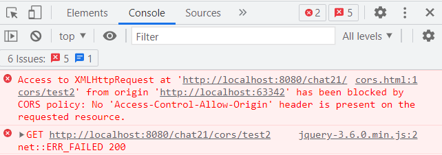

# 第13篇：特厉害的一个功能，全局异常处理『SpringMVC系列』

> 本文由 [简悦 SimpRead](http://ksria.com/simpread/) 转码， 原文地址 [mp.weixin.qq.com](https://mp.weixin.qq.com/s?__biz=MzA5MTkxMDQ4MQ==&mid=2648941075&idx=1&sn=7b439a02a3682c3369b74b3af0b21e00&chksm=88623a2dbf15b33bef2bccf36f7e1bd95310c1c619ba21e800d06438721b9972f8d7495fbbde&scene=178&cur_album_id=1873497824336658435#rd)

1、本文内容
------

带大家掌握 springmvc 中统一异常处理的使用。

2、通常我们是如何处理异常的？
---------------

看一下下面的代码，每个方法中有一段 try catch，用来对业务异常进行处理，不知道大家是否写过这种类似的代码，这种代码有什么问题么？

```java
public class Demo {
    public void m1() {
        try {
            //业务代码
        } catch (Exception e) {

        }
    }

    public void m2() {
        try {
            //业务代码
        } catch (Exception e) {

        }
    }

    ....
}
```

3、上面代码存在的问题
-----------

先来思考一个问题，当系统发生异常了，我们会怎么做？

为了方便排查错误，我们会在 catch 中将异常信息记录到日志文件中，变成了下面这样

```java
public class Demo {
    public void m1() {
        try {
            //业务代码
        } catch (Exception e) {
            //1、将错误信息记录到日志文件
        }
    }

    public void m2() {
        try {
            //业务代码
        } catch (Exception e) {
            //1、将错误信息记录到日志文件
        }
    }

    ....
}
```

如果发生了严重的异常，我们需要第一时间让开发人员介入，怎么办呢？

我们可以在 catch 中可以发送短信给开发者，让其第一时间介入解决。

此时是不是又要改代码，catch 又要添加代码了，此时要改很多很多代码，得重新测试一遍了，此时对于开发和测试都是一种灾难。

4、如何更好的解决这个问题？
--------------

采用 aop 的方式，将异常处理和业务代码进行分离，让框架拦截所有方法的执行，目标方法中不要在捕获异常了，直接将异常抛出去，由统一的地方进行进行处理。

此时异常处理和业务代码分离开了，没有耦合在一起了，此时如果需要调整异常的处理逻辑，会非常方便，只需要修改统一处理异常的代码，就 ok 了。

如果对 spring 的 aop 比较熟悉的，实现起来还是很容易的，只需要一个环绕拦截器就可以了，有兴趣的朋友可以去试试。

本文是 springmvc 的内容，**而 springmvc 中提供了类似的方式来统一处理系统所有的异常，Controller 中的所有方法都无需捕获异常，只需要做一些配置，springmvc 框架就会自动捕获异常，对异常进行集中处理**，下面咱们来看看这玩意是怎么玩的。

5、springmvc 集中统一处理异常的使用步骤
-------------------------

下面通过一个案例来看一下具体如何使用的。

### 5.1、需求

写个登录方法，方法中验证用户和密码，验证失败的时候分别抛出对应的异常，成功了跳转到 success.jsp 页面，代码如下。

```java
@Controller
public class UserController {

    @RequestMapping("/login")
    public ModelAndView login(@RequestParam("name") String name,
                              @RequestParam("pass") Integer pass) throws Exception {
        //用户名必须为路人
        if (!"路人".equals(name)) {
            throw new NameException("用户名有误!");
        }
        //密码必须为666
        if (Integer.valueOf(666).equals(pass)) {
            throw new PassException("密码有误!");
        }
        ModelAndView modelAndView = new ModelAndView();
        modelAndView.addObject("name", name);
        modelAndView.setViewName("success");
        return modelAndView;
    }
}

/**
 * 姓名异常类
 */
public class NameException extends Exception {
    public NameException(String message) {
        super(message);
    }
}

/**
 * 密码异常类
 */
public class PassException extends Exception {
    public PassException(String message) {
        super(message);
    }
}
```

**需要实现的需求**

从代码中来看，我们可以将异常分为 3 类：NameException、PassException、其他异常，咱们需要实现让 springmvc 来统一处理这 3 类异常，然后将错误信息输出到错误页面。

### 5.2、具体实现步骤：3 个步骤

#### step1：创建全局异常处理类（非常关键）

这个步骤是重点，内部包含 3 个小的步骤。

**第 1 步**：创建一个普通的类，作为全局异常处理类

**第 2 步**：在类上添加 @ControllerAdvice 注解，从注解的名称包含了 Advice 可以看出，aop 中我们接触过 Advice（通知），用来对 bean 的功能进行增强，而这个注解是对 Controller 的功能进行增强，用来集中处理 Controller 的所有异常。

**第 3 步**：添加处理异常的方法，方法上需要加上 @ExceptionHandler 注解，这个注解有个 value 属性，用来指定匹配的异常类型，当 springmvc 捕获到控制器异常后，会和这个异常类型进行匹配，匹配成功了，将调用 @ExceptionHandler 标注的方法；如果未指定 value 的值，表示匹配所有类型的异常。

最终代码如下，类中添加了 3 个方法，分别用来处理 3 类异常，方法的每一行输出了一条日志，稍后可以通过这个验证效果，方法内部对错误进行了封装，然后跳转到错误页面（error.jsp）进行展示，稍后我们会通过不同的场景来验证效果。

```java
package com.javacode2018.springmvc.chat10.handle;

import com.javacode2018.springmvc.chat10.exception.NameException;
import com.javacode2018.springmvc.chat10.exception.PassException;
import org.springframework.web.bind.annotation.ControllerAdvice;
import org.springframework.web.bind.annotation.ExceptionHandler;
import org.springframework.web.servlet.ModelAndView;

/**
 * 统一异常处理类
 */
@ControllerAdvice
public class GlobalExceptionHandle {

    /**
     * 此方法用来处理 NameException 类型的异常，
     * 当controller抛出NameException异常的时候，此方法会被调用
     *
     * @param e
     * @return
     */
    @ExceptionHandler({NameException.class})
    public ModelAndView doNameException(Exception e) {
        System.out.println("-----doNameException-----");
        ModelAndView modelAndView = new ModelAndView();
        modelAndView.setViewName("error");
        modelAndView.addObject("msg", "登录名有误!");
        modelAndView.addObject("e", e);
        return modelAndView;
    }

    /**
     * 此方法用来处理 AgeException 类型的异常，
     * 当controller抛出NameException异常的时候，此方法会被调用
     *
     * @param e
     * @return
     */
    @ExceptionHandler({PassException.class})
    public ModelAndView doPassException(Exception e) {
        System.out.println("-----doPassException-----");
        ModelAndView modelAndView = new ModelAndView();
        modelAndView.setViewName("error");
        modelAndView.addObject("msg", "密码有误!");
        modelAndView.addObject("e", e);
        return modelAndView;
    }

    /**
     * 此方法用来处理任意异常（也就是上面2个方法不能够处理的异常都会被这个方法处理）
     *
     * @param e
     * @return
     */
    @ExceptionHandler
    public ModelAndView doException(Exception e) {
        System.out.println("-----doException-----");
        ModelAndView modelAndView = new ModelAndView();
        modelAndView.setViewName("error");
        modelAndView.addObject("msg", "系统异常!");
        modelAndView.addObject("e", e);
        return modelAndView;
    }
}
```

#### step2：创建 springmvc 配置文件

添加如下配置



完整配置如下

```xml
<?xml version="1.0" encoding="UTF-8"?>
<beans xmlns="http://www.springframework.org/schema/beans"
       xmlns:xsi="http://www.w3.org/2001/XMLSchema-instance"
       xmlns:mvc="http://www.springframework.org/schema/mvc"
       xmlns:context="http://www.springframework.org/schema/context"
       xsi:schemaLocation="http://www.springframework.org/schema/beans http://www.springframework.org/schema/beans/spring-beans.xsd   http://www.springframework.org/schema/mvc https://www.springframework.org/schema/mvc/spring-mvc.xsd http://www.springframework.org/schema/context https://www.springframework.org/schema/context/spring-context.xsd">

    <!-- 设置controller扫描路径 -->
    <context:component-scan base-package="com.javacode2018.springmvc.chat10.controller"/>
    <!-- 设置全局异常处理器扫描路径 -->
    <context:component-scan base-package="com.javacode2018.springmvc.chat10.handle"/>
    <!-- 添加mvc注解驱动 -->
    <mvc:annotation-driven/>

    <bean class="org.springframework.web.servlet.view.InternalResourceViewResolver">
        <property name="prefix" value="/WEB-INF/view/"/>
        <property name="suffix" value=".jsp"/>
    </bean>

</beans>
```

#### step3：创建几个页面

##### 登录页面（index.jsp）

```jsp
<%@ page contentType="text/html;charset=UTF-8" language="java" %>
<html>
<head></head>
<body>
<div>
    <form method="post" action="${pageContext.request.contextPath}/login">
        姓名：<input name="name"/><br/>
        密码：<input name="pass"/><br/>
        <input type="submit" value="登录">
    </form>
</div>
</body>
</html>
```

##### 登录成功页面（/WEB-INF/view/success.jsp）

```jsp
<%@ page contentType="text/html;charset=UTF-8" language="java" %>
<html>
<head>
    <title>Title</title>
</head>
<body>
<h1>欢迎您，登录成功!</h1><br/>
当前用户:${requestScope.name}<br/>
</body>
</html>
```

##### 错误页面（error.jsp）

```jsp
<%@ page contentType="text/html;charset=UTF-8" language="java" %>
<html>
<head>
    <title>Title</title>
</head>
<body>
<h1>登录失败!</h1><br/>
错误提示:${requestScope.msg}<br/>
Exception.message:${e.message}
</body>
</html>
```

### 5.3、验证效果 (4 种场景)

> 下面我们来分别验证正常情况、用户名错误的情况、密码错误的情况、密码为非数字的情况，然后注意 idea 控制台和浏览器的输出效果。

#### 场景 1：正常情况


#### 场景 2：姓名错误的情况


控制台输出如下，说明进到了`GlobalExceptionHandle#doNameException`方法了

```
-----doNameException-----
```

页面输出


#### 场景 3：密码错误的情况


控制台输出如下，说明进到了`GlobalExceptionHandle#doPassException`方法了

```
-----doPassException-----
```

页面输出


#### 场景 4：密码为非数字的情况


控制台输出如下，说明进到了`GlobalExceptionHandle#doException`方法了

```
-----doException-----
```

页面输出如下，由于密码必须为数字，而我们输入的是`abc`，无法转换为数字，此时 springmvc 内部在进行参数转换的时候，会自动抛出异常，从下面的异常信息中也可以看出是类型转换错误


6、总结
----

*   本文详细介绍了 springmvc 集中统一异常处理的具体用法，大家消化一下，重点主要用到了 2 个注解`@ControllerAdvice`和`@ExceptionHandler`
    
*   目前多数系统都是前后端分离了，后端所有的接口都返回 json 格式的数据，所以下一篇文章，来一篇实战的文章，带大家看下在 controller 这层，如何实现通用的一些设计，主要包含了通用返回值及统一异常处理的设计。
    

7、案例代码
------

git地址：https://gitee.com/javacode2018/springmvc-series


