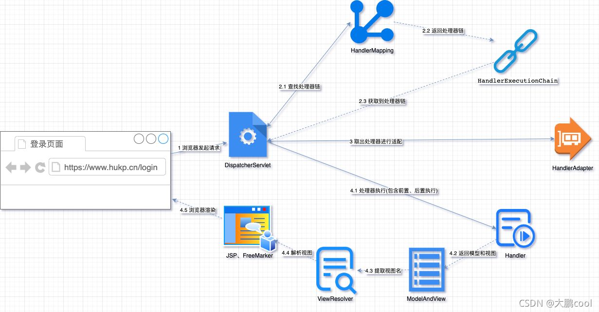
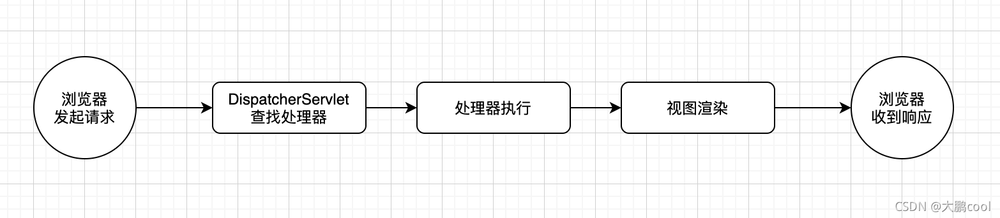
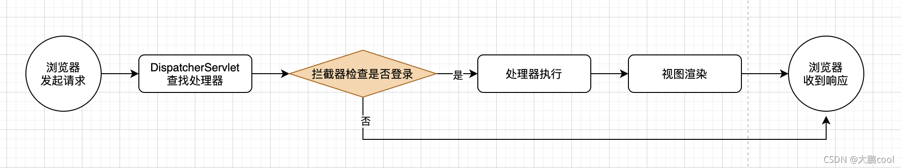

# 拦截器

> 原文地址：https://blog.csdn.net/zzuhkp/article/details/121242297


## 理解拦截器 Interceptor

拦截器 Interceptor 在 Spring MVC 中的地位等同于 Servlet 规范中的过滤器 Filter，拦截的是处理器的执行，由于是全局行为，因此常用于做一些通用的功能，如请求日志打印、权限控制等。

再把 Spring MVC DispatcherServlet 请求处理流程这张图拿出来。

当浏览器发起的请求到达 Servlet 容器，`DispatcherServlet` 先根据处理器映射器 `HandlerMapping` 获取处理器，这时候获取到的是一个包含处理器和拦截器的处理器执行链，处理器执行之前将会先执行拦截器。

不包含拦截器的情况下，`DispatcherServlet` 处理请求的流程可以简化如下。  


添加了拦截器做登录检查后，`DispatcherServlet` 请求处理的流程可以简化如下。  




## 拦截器 Interceptor 定义

事实上拦截器的执行流程远比上述 `DispatcherServelt` 简化后的流程图复杂，它不仅可以在处理器之前执行，还可以在处理器之后执行。先看拦截器 Interceptor 在 Spring MVC 中的定义。

```java
public interface HandlerInterceptor {

    default boolean preHandle(HttpServletRequest request, HttpServletResponse response, Object handler)
        throws Exception {

        return true;
    }

    default void postHandle(HttpServletRequest request, HttpServletResponse response, Object handler,
                            @Nullable ModelAndView modelAndView) throws Exception {
    }

    default void afterCompletion(HttpServletRequest request, HttpServletResponse response, Object handler,
                                 @Nullable Exception ex) throws Exception {
    }	
}

```

拦截器在 Spring MVC 中使用接口 `HandlerInterceptor` 表示，这个接口包含了三个方法：`preHandle`、`postHandle`、`afterCompletion`，这三个方法都有的 `handler` 参数表示处理器，通常情况下可以表示我们使用注解 `@Controller` 定义的控制器。

对上面的流程图继续细化。


三个方法具体的执行流程如下。

*   `preHandle`：处理器执行之前执行，如果返回 false 将跳过处理器、拦截器 `postHandle` 方法、视图渲染等，直接执行拦截器 `afterCompletion` 方法。
*   `postHandle`：处理器执行后，视图渲染前执行，如果处理器抛出异常，将跳过该方法直接执行拦截器 `afterCompletion` 方法。
*   `afterCompletion`：视图渲染后执行，不管处理器是否抛出异常，该方法都将执行。

> **注意**：自从前后端分离之后，Spring MVC 中的处理器方法执行后通常不会再返回视图，而是返回表示 json 或 xml 的对象，@Controller 方法返回值类型如果为 ResponseEntity 或标注了 @ResponseBody 注解，此时处理器方法一旦执行结束，Spring 将使用 HandlerMethodReturnValueHandler 对返回值进行处理，具体来说会将返回值转换为 json 或 xml，然后写入响应，后续也不会进行视图渲染，这时`postHandle` 将没有机会修改响应体内容。  
>
> 如果需要更改响应内容，可以定义一个实现 ResponseBodyAdvice 接口的类，然后将这个类直接定义到 RequestMappingHandlerAdapter 中的 requestResponseBodyAdvice 或通过 @ControllerAdvice 注解添加到 RequestMappingHandlerAdapter。

## 拦截器 Interceptor 使用及配置

使用拦截器需要实现 `HandlerInterceptor` 接口，为了避免实现该接口的所有方法，Spring 5 之前提供了一个抽象的实现 `HandlerInterceptorAdapter`，Java 8 接口默认方法新特性出现后，我们直接实现 `HandlerInterceptor` 接口即可。  
示例如下。

```java
public class LogInterceptor implements HandlerInterceptor {

    @Override
    public boolean preHandle(HttpServletRequest request, HttpServletResponse response, Object handler) throws Exception {
        System.out.println("请求来了");
        return true;
    }
}

public class LoginInterceptor implements HandlerInterceptor {

    @Override
    public boolean preHandle(HttpServletRequest request, HttpServletResponse response, Object handler) throws Exception {
        System.out.println("已登录");
        return true;
    }
}

```

Spring 配置通常有三种方式，分别是传统的 xml 、最新的注解配置以及通过 API 配置，拦截器也不例外。

### xml 文件配置

xml 配置方式如下。

```xml
<mvc:interceptors >
    <bean class="com.zzuhkp.mvc.interceptor.LogInterceptor"/>
    <mvc:interceptor>
        <mvc:mapping path="/**"/>
        <mvc:exclude-mapping path="/login"/>
        <bean class="com.zzuhkp.mvc.interceptor.LoginInterceptor"/>
    </mvc:interceptor>
</mvc:interceptors>

```

*   **bean**：`mvc:interceptors` 标签下的拦截器 bean 将应用到所有的处理器。
*   **mvc:interceptor**：这个标签下的子标签可以指定拦截器应用到哪些请求路径。
    *   **mvc:mapping**：指定处理的请求路径。
    *   **mvc:exclude-mapping**：指定排除的请求路径。
    *   **bean**：指定应用到给定路径的拦截器 bean。

### 注解配置

对于注解配置来说，需要将 `MappedInterceptor` 配置为 Spring 的 bean，和上述 xml 配置等价的注解配置如下。

```java
@Configuration
public class MvcConfig {

    @Bean
    public MappedInterceptor logInterceptor() {
        return new MappedInterceptor(null, new LoginInterceptor());
    }

    @Bean
    public MappedInterceptor loginInterceptor() {
        return new MappedInterceptor(new String[]{"/**"}, new String[]{"/login"}, new LoginInterceptor());
    }
}

```

### API 配置

拦截器与 Spring MVC 环境紧密结合，并且是作用范围通常是全局性的，因此大多数情况建议使用这种方式配置。

与 xml 配置对应的 API 配置如下。

```java
@Configuration
@EnableWebMvc
public class MvcConfig implements WebMvcConfigurer {

    @Override
    public void addInterceptors(InterceptorRegistry registry) {
        registry.addInterceptor(new LogInterceptor());
        registry.addInterceptor(new LoginInterceptor()).addPathPatterns("/**").excludePathPatterns("/login");
    }
}

```

这里在配置类上添加了`@EnableWebMvc`注解开启了 Spring MVC 中的某些特性，然后就可以实现 `WebMvcConfigurer` 接口中的 `addInterceptors` 方法向 Spring MVC 中添加拦截器。如果你使用了 `spring-boot-starter-web`，不再需要手工添加 `@EnableWebMvc` 注解。

## 拦截器 Interceptor 执行顺序

通常情况下，我们并不需要关心多个拦截器的执行顺序，然而，如果一个拦截器依赖于另一个拦截器的执行结果，那么就需要注意了。使用多个拦截器后的 `DispatcherServlet` 请求处理流程可以简化为如下的流程图。  
  
多个拦截器方法执行顺序如下。

1.  `preHandle` 按照拦截器的顺序先后执行。如果任意一次调用返回 `false` 则直接跳到拦截器的 `afterCompletion` 执行。
2.  `postHandle` 按照拦截器的逆序先后执行，也就说后面的拦截器先执行 `postHandle`。
3.  `afterCompletion` 也按照拦截器的逆序先后执行，后面的拦截器先执行 `afterCompletion`。


> 场景1：若每个拦截器的 `preHandle()`都返回true
>
> 此时多个拦截器的执行顺序和拦截器在SpringMVC的配置文件的配置顺序有关：
>
> `preHandle()`会按照配置的顺序执行，而`postHandle()`和`afterComplation()`会按照配置的反序执行
>
> 场景2：若某个拦截器的`preHandle()`返回了false
>
> `preHandle()`返回false和它之前的拦截器的`preHandle()`都会执行，`postHandle()`都不执行，返回`false`的拦截器之前的拦截器的`afterComplation()`会执行


那么拦截器的顺序是如何指定的呢？

*   对于 xml 配置来说，Spring 将记录 bean 声明的顺序，先声明的拦截器将排在前面。
*   对于注解配置来说，由于通过反射读取方法无法保证顺序，因此需要在方法上添加`@Order`注解指定 bean 的声明顺序。
*   对应 API 配置来说，拦截器的顺序并非和添加顺序完全保持一致，为了控制先后顺序，需要自定义的拦截器实现`Ordered`接口。

注解配置指定顺序示例如下。

```java
@Configuration
public class MvcConfig {

    @Order(2)
    @Bean
    public MappedInterceptor loginInterceptor() {
        return new MappedInterceptor(new String[]{"/**"}, new String[]{"/login"}, new LoginInterceptor());
    }

    @Order(1)
    @Bean
    public MappedInterceptor logInterceptor() {
        return new MappedInterceptor(null, new LoginInterceptor());
    }

}

```

此时虽然登录拦截器写在前面，但因为 @Order 注解指定的值较大，因此将排在日志拦截器的后面。

API 配置指定顺序示例如下。

```java
public class LoginInterceptor implements HandlerInterceptor, Ordered {

    @Override
    public boolean preHandle(HttpServletRequest request, HttpServletResponse response, Object handler) throws Exception {
        System.out.println("已登录");
        return true;
    }

    @Override
    public int getOrder() {
        return 2;
    }
}

public class LogInterceptor implements HandlerInterceptor, Ordered {

    @Override
    public boolean preHandle(HttpServletRequest request, HttpServletResponse response, Object handler) throws Exception {
        System.out.println("请求来了");
        return true;
    }

    @Override
    public int getOrder() {
        return 1;
    }
}

```

`LogInterceptor` 指定的排序号较 `LoginInterceptor` 来说比较小，因此 `LogInterceptor` 将排在前面。

## 拦截器 Interceptor 原理分析

`DispatcherServlet` 处理请求的代码位于 `DispatcherServlet#doDispatch` 方法，关于处理器和拦截器简化后的代码如下。

```JAVA
protected void doDispatch(HttpServletRequest request, HttpServletResponse response) throws Exception {
    HttpServletRequest processedRequest = request;
    HandlerExecutionChain mappedHandler = null;

    try {
        ModelAndView mv = null;
        Exception dispatchException = null;

        // 从 HandlerMapping 获取处理器链
        mappedHandler = getHandler(processedRequest);
        // 处理器适配
        HandlerAdapter ha = getHandlerAdapter(mappedHandler.getHandler());
        // 拦截器 preHandle 执行
        if (!mappedHandler.applyPreHandle(processedRequest, response)) {
            return;
        }
        // 处理器执行
        mv = ha.handle(processedRequest, response, mappedHandler.getHandler());
        // 拦截器 postHandle 执行
        mappedHandler.applyPostHandle(processedRequest, response, mv);

        // 视图渲染
        processDispatchResult(processedRequest, response, mappedHandler, mv, dispatchException);
    } catch (Exception ex) {
        // 拦截器 afterCompletion 执行
        triggerAfterCompletion(processedRequest, response, mappedHandler, ex);
    } catch (Throwable err) {
        // 拦截器 afterCompletion 执行
        triggerAfterCompletion(processedRequest, response, mappedHandler,
                               new NestedServletException("Handler processing failed", err));
    }
}

```

可以看到，整体流程和我们前面描述是保持一致的，以拦截器预执行 preHandle 为例，看一下处理器链是怎么调用拦截器方法的。

```java
public class HandlerExecutionChain {

    boolean applyPreHandle(HttpServletRequest request, HttpServletResponse response) throws Exception {
        HandlerInterceptor[] interceptors = getInterceptors();
        if (!ObjectUtils.isEmpty(interceptors)) {
            for (int i = 0; i < interceptors.length; i++) {
                // 循环调用拦截器方法
                HandlerInterceptor interceptor = interceptors[i];
                if (!interceptor.preHandle(request, response, this.handler)) {
                    // 返回 false 则直接执行 afterCompletion
                    triggerAfterCompletion(request, response, null);
                    return false;
                }
                this.interceptorIndex = i;
            }
        }
        return true;
    }
}

```

处理器链拿到拦截器列表后按照顺序调用了拦截器的 preHandle 方法，如果返回 false 则跳到 afterCompletion 执行。那处理器链中的拦截器的列表从哪来的呢？继续跟踪获取处理器链的方法`DispatcherServlet#getHandler`，可以发现获取处理器链的核心代码如下。

```java
public abstract class AbstractHandlerMapping extends WebApplicationObjectSupport
    implements HandlerMapping, Ordered, BeanNameAware {

    protected HandlerExecutionChain getHandlerExecutionChain(Object handler, HttpServletRequest request) {
        HandlerExecutionChain chain = (handler instanceof HandlerExecutionChain ?
                                       (HandlerExecutionChain) handler : new HandlerExecutionChain(handler));

        String lookupPath = this.urlPathHelper.getLookupPathForRequest(request, LOOKUP_PATH);
        for (HandlerInterceptor interceptor : this.adaptedInterceptors) {
            // 拦截器添加到处理器链
            if (interceptor instanceof MappedInterceptor) {
                MappedInterceptor mappedInterceptor = (MappedInterceptor) interceptor;
                if (mappedInterceptor.matches(lookupPath, this.pathMatcher)) {
                    chain.addInterceptor(mappedInterceptor.getInterceptor());
                }
            } else {
                chain.addInterceptor(interceptor);
            }
        }
        return chain;
    }
}

```

Spring 创建处理器链 `HandlerExecutionChain` 后将 AbstractHandlerMapping 中拦截器列表 `adaptedInterceptors` 中的拦截器添加到了处理器链，那 AbstractHandlerMapping 中的拦截器列表中的拦截器又从哪来呢？

```JAVA
public abstract class AbstractHandlerMapping extends WebApplicationObjectSupport
		implements HandlerMapping, Ordered, BeanNameAware {

	private final List<Object> interceptors = new ArrayList<>();

	private final List<HandlerInterceptor> adaptedInterceptors = new ArrayList<>();

	@Override
	protected void initApplicationContext() throws BeansException {
		extendInterceptors(this.interceptors);
        // 
		detectMappedInterceptors(this.adaptedInterceptors);
        // 
		initInterceptors();
	}

    // 从容器中获取拦截器
	protected void detectMappedInterceptors(List<HandlerInterceptor> mappedInterceptors) {
		mappedInterceptors.addAll(
				BeanFactoryUtils.beansOfTypeIncludingAncestors(
						obtainApplicationContext(), MappedInterceptor.class, true, false).values());
	}

	// 拦截器适配
	protected void initInterceptors() {
		if (!this.interceptors.isEmpty()) {
			for (int i = 0; i < this.interceptors.size(); i++) {
				Object interceptor = this.interceptors.get(i);
				if (interceptor == null) {
					throw new IllegalArgumentException("Entry number " + i + " in interceptors array is null");
				}
				this.adaptedInterceptors.add(adaptInterceptor(interceptor));
			}
		}
	}		
}

```

各种 HandlerMapping 的实现都继承了 AbstractHandlerMapping，HandlerMapping 被容器创建时将回调`#initApplicationContext`方法，这个方法回调时会从容器中查找类型为 MappedInterceptor 的拦截器，然后对拦截器进行适配。Spring MVC 中如果使用了 @EnableWebMvc ，HandlerMapping bean 被创建时会回调`WebMvcConfigurer#addInterceptors`方法直接将拦截器设置到 AbstractHandlerMapping 中的 interceptors。

总结
--

总结 Spring MVC 整个拦截器相关的流程如下。

1.  HandlerMapping 被容器实例化并初始化。
    1.  初始化时默认从容器中查找类型为 MappedInterceptor 的拦截器添加到 HandlerMapping 中的拦截器列表，这种默认行为支持了 xml 和注解配置拦截器。
    2.  使用 @EnableWebMvc 注解后，Spring 通过 @Bean 创建 HandlerMapping bean，实例化后回调 `WebMvcConfigurer#addInterceptors` 将拦截器提前设置到 HandlerMapping 中的拦截器列表，这种行为支持了 API 配置拦截器。
2.  客户端发起请求，DispatcherServlet 使用 HandlerMapping 查找处理器执行链，将 HandlerMapping 中的拦截器添加到处理器执行链 HandlerExecutionChain 中的拦截器列表。
3.  DispatcherServlet 按照拦截器的顺序依次调用拦截器中的回调方法。