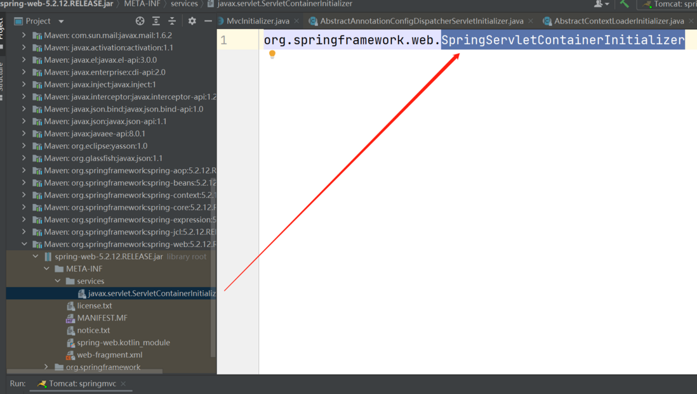
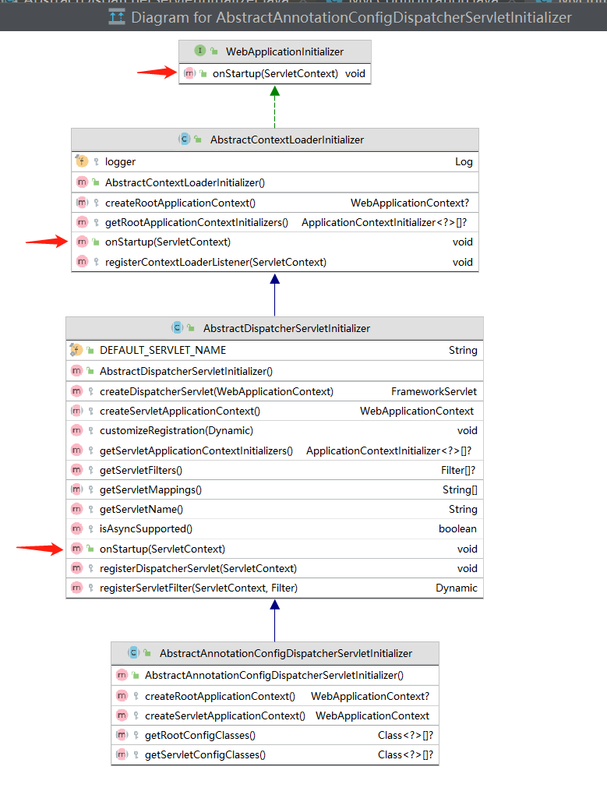

# 注解配置SpringMVC原理

## Servlet3.0

Servlet3.0是基于注解配置的理论基础。

Servlet3.0引入了基于注解配置Servlet的规范，提出了可拔插的ServletContext初始化方式，引入了一个叫ServletContainerInitializer的接口。

> An instance of the ServletContainerInitializer is looked up via the jar services API by the container at container / application startup time. The framework providing an implementation of the ServletContainerInitializer MUST bundle in the META-INF/services directory of the jar file a file called javax.servlet.ServletContainerInitializer, as per the jar services API, that points to the implementation class of the ServletContainerInitializer.
> Servlet3.0规范约定：WEB容器（比如tomcat）要通过SPI的方式检查应用jar包的META-INF/services目录下的Servlet容器的初始化类（ServletContainerInitializer接口的实现类），通过调用该实现类的onStartup方法完成Servlet容器的初始化。

此外，Servlet3.0还引入了@HandlesTypes注解，用来指定Servlet容器初始化过程中，WEB容器会认为应用中的哪些类（由@HandlesTypes指定）会参与到Servlet容器的初始化过程中来。

SpringMVC正是通过以上方式实现Servlet容器的初始化的！！！

## SpringMVC Servlet容器初始化过程



SpringMVC指定的Servlet容器初始化的实现类为`org.springframework.web.SpringServletContainerInitializer`。

```java
@HandlesTypes(WebApplicationInitializer.class)
public class SpringServletContainerInitializer implements ServletContainerInitializer {
}
```

```java
@Override
    public void onStartup(@Nullable Set<Class<?>> webAppInitializerClasses, ServletContext servletContext)
            throws ServletException {

        List<WebApplicationInitializer> initializers = new LinkedList<>();

        if (webAppInitializerClasses != null) {
            for (Class<?> waiClass : webAppInitializerClasses) {
                // Be defensive: Some servlet containers provide us with invalid classes,
                // no matter what @HandlesTypes says...
                if (!waiClass.isInterface() && !Modifier.isAbstract(waiClass.getModifiers()) &&
                        WebApplicationInitializer.class.isAssignableFrom(waiClass)) {
                    try {
                        initializers.add((WebApplicationInitializer)
                                ReflectionUtils.accessibleConstructor(waiClass).newInstance());
                    }
                    catch (Throwable ex) {
                        throw new ServletException("Failed to instantiate WebApplicationInitializer class", ex);
                    }
                }
            }
        }

        if (initializers.isEmpty()) {
            servletContext.log("No Spring WebApplicationInitializer types detected on classpath");
            return;
        }

        servletContext.log(initializers.size() + " Spring WebApplicationInitializers detected on classpath");
        AnnotationAwareOrderComparator.sort(initializers);
        for (WebApplicationInitializer initializer : initializers) {
            initializer.onStartup(servletContext);
        }
    }

}
```

检查传入的参数webAppInitializerClasses，如果是实现类的话（不是接口或抽象类）则通过反射机制实例化webAppInitializerClasses并强转为WebApplicationInitializer，然后调用WebApplicationInitializer的onStartup方法。

这里有一个小问题：参数webAppInitializerClasses实例化之后，为什么能强转为WebApplicationInitializer？

其实这也是Servlet3.0规范约定的，WEB容器会根据@HandlesTypes的设置，从当前类加载器中查找符合条件的类，当前@HandlesTypes指定的正是WebApplicationInitializer。

之后的操作就都交给WebApplicationInitializer了。


WebApplicationInitializer是承担起Servlet3.0规范约定的初始化Servlet容器



Spring框架实现了WebApplicationInitializer接口的3个抽象类，最后一个抽象类AbstractAnnotationConfigDispatcherServletInitializer没有onStartup方法，onStartup方法是他的父类实现的。

我们看一下他的父类AbstractDispatcherServletInitializer的onStartup方法：

```java
    @Override
    public void onStartup(ServletContext servletContext) throws ServletException {
        super.onStartup(servletContext);
        registerDispatcherServlet(servletContext);
    }
```

可以发现他其实是一个模板方法，首先调用了父类的onStartup，之后调用registerDispatcherServlet方法。父类的onStartup方法是实现rootApplicationContext调用的，看一下registerDispatcherServlet方法：

```java
protected void registerDispatcherServlet(ServletContext servletContext) {
    String servletName = getServletName();
    Assert.hasLength(servletName, "getServletName() must not return null or empty");

    WebApplicationContext servletAppContext = createServletApplicationContext();
    Assert.notNull(servletAppContext, "createServletApplicationContext() must not return null");

    FrameworkServlet dispatcherServlet = createDispatcherServlet(servletAppContext);
    Assert.notNull(dispatcherServlet, "createDispatcherServlet(WebApplicationContext) must not return null");
    dispatcherServlet.setContextInitializers(getServletApplicationContextInitializers());

    ...省略代码
```

首先调用createServletApplicationContext创建ServletApplicationContext（Servlet容器）,之后创建DispathcerServlet并且把创建好的Servlet容器传递给DispatcherServlet（DispatcherServlet要记录他所在的ServletApplicationContext）。

关键代码出现了，Servlet容器的创建过程应该就在这个createServletApplicationContext方法中，是在AbstractAnnotationConfigDispatcherServletInitializer中实现的：

```java
@Override
protected WebApplicationContext createServletApplicationContext() {
    AnnotationConfigWebApplicationContext context = new AnnotationConfigWebApplicationContext();
    Class<?>[] configClasses = getServletConfigClasses();
    if (!ObjectUtils.isEmpty(configClasses)) {
        context.register(configClasses);
    }
    return context;
}
```

创建了一个新的AnnotationConfigWebApplicationContext对象，然后调用getServletConfigClasses()方法获取配置类，之后把配置类注册到了新创建的AnnotationConfigWebApplicationContext对象中。这个getServletConfigClasses()方法是没有实现的（应该是我们的实现类需要实现的）。

至此，Spring通过Servlet3.0规范进行初始化的过程应该已经很清晰了：

- Spring Framework通过WebApplicationInitializer接口的onStartup方法完成Servlet上下文的初始化。
- Spring Framework已经完成了WebApplicationInitializer接口的大部分实现（提供了3个抽象类），已经通过模板方法完成了大部分的初始化操作。
- 猜测：应用层只需要扩展AbstractAnnotationConfigDispatcherServletInitializer类实现getServletConfigClasses()方法、返回Servlet的配置类，即可完成初始化。