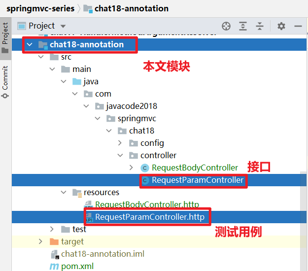

# @RequestParam用法及原理，你未必真知道

> 本文由 [简悦 SimpRead](http://ksria.com/simpread/) 转码， 原文地址 [mp.weixin.qq.com](https://mp.weixin.qq.com/s?__biz=MzA5MTkxMDQ4MQ==&mid=2648942752&idx=1&sn=c54f0e1437c69722a7b6abf0881d9287&chksm=8862309ebf15b988c158d06326d0cbdb0a720cd57541bf1b3a0620ff6b4820d990143a043dd7&scene=178&cur_album_id=1873497824336658435#rd)

**大家好，我是路人，这是 SpringMVC 系列第 23 篇。**

前面没有详细介绍 SpringMVC 中各种注解的用法，这里准备一一补上，今天来看 @RequestParam 注解的用法。

1、预备知识
------

1.  [接口测试利器 HTTP Client](https://mp.weixin.qq.com/s?__biz=MzA5MTkxMDQ4MQ==&mid=2648940431&idx=1&sn=6c592aa2746fd448c1a6ef511189eaaa&scene=21#wechat_redirect)
    
2.  [参数解析器 HandlerMethodArgumentResolver 解密](https://mp.weixin.qq.com/s?__biz=MzA5MTkxMDQ4MQ==&mid=2648942681&idx=1&sn=eeea9d5d97e1cdd46a63cb1c953b5176&scene=21#wechat_redirect)
    

2、@RequestParam 注解的作用
---------------------

标注在接口的方法参数上，被标注的参数的值来源于`request.getParameter`或`request.getParameterValues`。

3、@RequestParam 源码
------------------

```java
@Target(ElementType.PARAMETER)
@Retention(RetentionPolicy.RUNTIME)
@Documented
public @interface RequestParam {

 /**
  * 对应request中参数名称
  */
 @AliasFor("name")
 String value() default "";

 /**
  * 同value
  */
 @AliasFor("value")
 String name() default "";

 /**
  * 请求中是否必须有这个参数，默认为true
  */
 boolean required() default true;

 /**
  * 默认值
  */
 String defaultValue() default ValueConstants.DEFAULT_NONE;

}
```

4、案例 1：@RequestParam 指定 name，获取对应参数的值
-------------------------------------

### 4.1、案例接口代码

```json
/**
 * {@link RequestParam}中指定name，用来取name的值对应的请求参数中的值
 *
 * @param name：可以不传递name参数，不传递的时候默认值为ready
 * @param age
 * @param pets
 * @return
 */
@RequestMapping("/requestparam/test1")
public Map<String, Object> test1(@RequestParam(value = "name", required = false, defaultValue = "ready") String name, //相当于request.getParameter("name")
                                 @RequestParam("age") int age, //Integer.parseInt(request.getParameter("age"))
                                 @RequestParam("interests") String[] interests, //request.getParameterValues("pets")
                                 @RequestParam("pets") List<String> pets //Arrays.asList(request.getParameterValues("pets"))
) {
    Map<String, Object> result = new LinkedHashMap<>();
    result.put("name", name);
    result.put("age", age);
    result.put("interests", interests);
    result.put("pets", pets);
    return result;
}
```

### 4.2、用例 1：所有参数都传值

```
POST http://localhost:8080/chat18/requestparam/test1
Content-Type: application/x-www-form-urlencoded

name=路人&age=35&interests=篮球&interests=旅游&pets=小狗&pets=小猫


```

运行上面用例代码输出

```json
{
  "name": "路人",
  "age": 35,
  "interests": [
    "篮球",
    "旅游"
  ],
  "pets": [
    "小狗",
    "小猫"
  ]
}
```

### 4.3、用例 2：name 不传递，会取默认值 ready

```
POST http://localhost:8080/chat18/requestparam/test1
Content-Type: application/x-www-form-urlencoded

age=35&interests=篮球&interests=旅游&pets=小狗&pets=小猫


```

运行上面用例代码输出

```json
{
  "name": "ready",
  "age": 35,
  "interests": [
    "篮球",
    "旅游"
  ],
  "pets": [
    "小狗",
    "小猫"
  ]
}
```

### 4.4、用来 3：required 属性为 true，不传，则报错

```
POST http://localhost:8080/chat18/requestparam/test1
Content-Type: application/x-www-form-urlencoded
```

参数都没有传递，而接口要求除 name 之外的，其他几个参数都必须传递，所以这个案例结果会报 400 错，提示 age 参数不存在，这个错误比较常见，大家熟悉下，以后看到了就知道什么问题了。


5、案例 2：@RequestParam 不指定 name，获取所有参数值
-------------------------------------

当我们想用一个 Map 来接收所有参数的之后，代码如下，@RequestParam 不用指定 name 的值，参数类型为 Map<String,String>，所有请求参数会以参数名称: 值的方式丢在 Map 中。

```java
/**
 * {@link RequestParam}不指定name，用于接收所有参数的值，
 * 参数类型为Map<String,String>,key为请求中的参数名称，value为值
 *
 * @param paramMap
 * @return
 */
@RequestMapping("/requestparam/test2")
public Map<String, String> test2(@RequestParam Map<String, String> paramMap) {
    return paramMap;
}

```

运行下面的用例调用上面接口

```
###
POST http://localhost:8080/chat18/requestparam/test2
Content-Type: application/x-www-form-urlencoded

name=路人&age=35&interests=篮球&interests=旅游&pets=小狗&pets=小猫


```

运行输出

```
{
  "name": "路人",
  "age": "35",
  "interests": "篮球",
  "pets": "小狗"
}


```

interests 和 pet 都是有多个值，上面的结果中都只获取了第一个 值，如果我们想获取所有的值呢，下面看案例 3。

6、案例 3：@RequestParam 不指定 name，获取所有参数值
-------------------------------------

```java
/**
 * {@link RequestParam}不指定name，用于接收所有参数的值，
 * 参数类型为MultiValueMap<String, String>：key为请求中的参数名称，value为值的集合List<String>
 *
 * @param paramMap
 * @return
 */
@RequestMapping(value = "/requestparam/test3", produces = MediaType.APPLICATION_JSON_VALUE)
public MultiValueMap<String, String> test3(@RequestParam MultiValueMap<String, String> paramMap) {
    return paramMap;
}
```

这个接口的参数是`MultiValueMap`类型，这玩意是干啥的？好像很陌生啊，哈哈

再模式的东西，把其源码放出来，瞬间明了了，如下，可以看出来`MultiValueMap`相当于`Map<String,List<String>>`

```java
public interface MultiValueMap<K, V> extends Map<K, List<V>> {
}
```

运行下面的用例调用上面接口，注意下面第 3 行，表示我们期望服务器端返回 json 格式数据

```
POST http://localhost:8080/chat18/requestparam/test3
Content-Type: application/x-www-form-urlencoded
Accept: application/json

name=路人&age=35&interests=篮球&interests=旅游&pets=小狗&pets=小猫

```

运行输出，结果的值比较特别，是一个 String 类型的数组，这次获取到所有参数的值了。

```java
{
  "name": [
    "路人"
  ],
  "age": [
    "35"
  ],
  "interests": [
    "篮球",
    "旅游"
  ],
  "pets": [
    "小狗",
    "小猫"
  ]
}

```

7、@RequestParam 原理
------------------

@RequestParam 标注的参数的值是有下面 2 个类处理的，有兴趣了解的建议先看一下上一篇中的：[参数解析器 HandlerMethodArgumentResolver 解密](https://mp.weixin.qq.com/s?__biz=MzA5MTkxMDQ4MQ==&mid=2648942681&idx=1&sn=eeea9d5d97e1cdd46a63cb1c953b5176&scene=21#wechat_redirect)，然后再来看下面 2 个类的源码就是小意思了。

```
org.springframework.web.method.annotation.RequestParamMethodArgumentResolver
org.springframework.web.method.annotation.RequestParamMapMethodArgumentResolver

```

8、总结
----

*   @RequestParam 注解用来标注在控制器方法的参数上，springmvc 从 request 中获取请求的值赋值给方法的参数
*   @RequestParam 指定 name 时，可以获取 request 中指定参数的值，相当于 request.getParameter(name) 或 request.getParameters(name)
*   @RequestParam 未指定 name，参数类型为：Map<String,String> 时，用来接收 request 中所有参数的值，Map 中 key 为参数名称，value 为参数的值
*   @RequestParam 未指定 name，参数类型为 MultiValueMap<String, String> 时，用来接收 request 中所有参数的值，key 为请求中的参数名称，value 为值的集合 `List<String>`

9、代码位置及说明
---------

### 9.1、git 地址

https://gitee.com/javacode2018/springmvc-series


### 9.2、本文案例代码结构说明



6.  