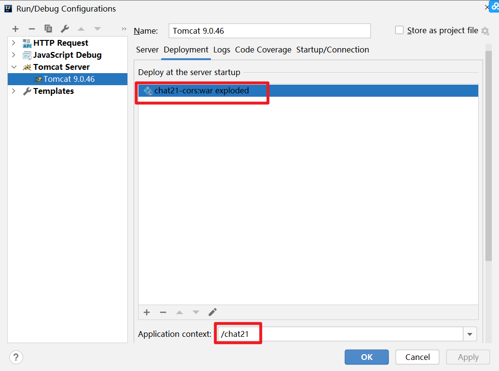
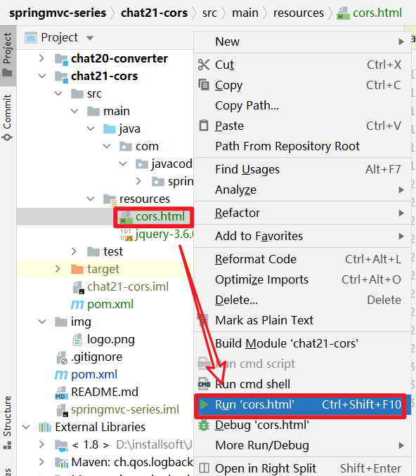

# SpringBoot 中到底如何解决跨域问题？


> 本文由 [简悦 SimpRead](http://ksria.com/simpread/) 转码， 原文地址 [mp.weixin.qq.com](https://mp.weixin.qq.com/s?__biz=MzA5MTkxMDQ4MQ==&mid=2648944130&idx=1&sn=2b071c4e836947f423095612420d7ec4&chksm=8862363cbf15bf2af22bad06c1be745632718b78c71f53d6383587d1ad930dcc3e851515eccd&scene=178&cur_album_id=1873497824336658435#rd)

**大家好，我是路人，这是 SpringMVC 系列第 31 篇。**

今天又给大家带来了一个很重要的知识点：SpringMVC 中如何处理跨域问题，本文的内容同样适合于 SpringBoot

1、跨域访问报错
--------

当一个请求 url 的协议、域名、端口三者之间任意一个与当前页面 url 不同即为跨域。

出于安全原因，浏览器禁止 Ajax 调用驻留在当前原点之外的资源，比如从 a.com 发送一个 ajax 请求到 b.com，则浏览器控制台会报跨域访问错误。

如下图，从`http://localhost:63342/`站点页面中向`ttp://localhost:8080/chat21/cors/test2`发送一个 ajax 请求，则出现了红色的错误信息，错误中包含了`Access-Controll-Allow-Origin`这样字样的错误，以后看到这个的时候，大家就要一眼看出来这是跨域问题。


2、同源定义
------

同源策略是浏览器的一个重要的安全策略，它用于限制一个源的文档或其加载的脚本如何与另外一个源进行交互，它能够隔绝恶意文档，减少被攻击的媒介。

如果两个 URL 的**协议**、**主机名**和**端口号**都是相同的，那么这两个 URL 就是同源的，否则不同源，不同源的访问就会出现跨域问题，就会出现上面的错误。

下表给出了与 URL `http://store.company.com/dir/page.html` 的源进行对比的示例:

<table><thead><tr><th>URL</th><th>结果</th><th>原因</th></tr></thead><tbody><tr><td>http://store.company.com/dir2/other.html</td><td>同源</td><td>只有路径不同</td></tr><tr><td>https://store.company.com/secure.html</td><td>非同源</td><td>协议不同</td></tr><tr><td>http://store.company.com:81/dir/etc.html</td><td>非同源</td><td>端口号不同</td></tr><tr><td>http://news.company.com/dir/other.html</td><td>非同源</td><td>主机名不同</td></tr></tbody></table>

也就是说当在`http://store.company.com/dir/page.html`这个网站中向`https://store.company.com`、`http://store.company.com:81`和`http://news.company.com`三个地址发起`AXJX`请求都会失败并且会报跨域的错误。这就是浏览器的同源策略，只能访问同源的数据。

3、跨域问题如何解决？
-----------

跨域问题需要使用 CORS 来解决，请求端和后端接口需要遵循 CORS 规则来通信，便可解决跨域访问的问题。

CORS 全称 Cross-Origin Resource Sharing, 即跨域资源共享，是一个由一系列 HTTP 头组成的系统，这些 HTTP 头决定浏览器是否阻止前端`javascript`代码获取跨域请求的响应。为什么需要 CORS ？这是因为浏览器存在同源安全策略，当我们在当前域请求另外一个域的资源时，浏览器默认会阻止脚本读取它的响应，这时 CORS 就有了用武之地。

跨源资源共享（CORS）是由大多数浏览器实现的 W3C 规范，允许您灵活地指定什么样的跨域请求被授权，而不是使用一些不太安全和不太强大的策略，如 IFRAME 或 JSONP 等。

### 4、CORS 原理

CORS 的原理：简单点说，就是在请求头或响应头中添加了一些配置，通过这些配置来便可轻松解决跨域问题。

想详细了解 CORS 原理的，建议先阅读下面 2 篇文章，然后再继续向下看，否则，最后你知道 SpringMVC 是如何解决的，但是不知道本质的原理是什么。

*   CORS 通信：http://itsoku.com/article/197
    
*   浏览器安全策略 & CORS：http://itsoku.com/article/198
    

5、SpringMVC 中如何解决跨域问题？
----------------------

SpringMVC 内部提供了跨域问题的解决方案，只需要做一些简单的配置，而接口基本上不用做任何修改，便可解决跨域问题。

SpringMVC 解决跨域问题的原理也就是 SpringMVC 遵循了 CORS 通信的规则来解决了跨域的问题，在响应头中添加了一些 CORS 需要的信息。

SpringMVC 中提供了 3 种方案来解决跨域问题，下面一起来了解下。

6、方案 1：方法或者类上标注 @CrossOrigin 注解
-------------------------------

*   接口方法上标注`org.springframework.web.bind.annotation.CrossOrigin`注解，如下 test1 接口上标注了`@CrossOrigin`注解，这个接口就支持跨域访问，@CrossOrigin 注解中含有更详细的配置，这里就不细说了
    
*   也可以在类上标注`@CrossOrigin`注解，那么这个类中所有接口会支持跨域访问
    
*   也可同时在类和方法上标注`@CrossOrigin`注解，最后方法上的跨域访问会取合并后的配置
    

```java
@RestController
public class CorsController {

    @RequestMapping("/cors/test1")
    @CrossOrigin
    public List<String> test1() {
        List<String> result = Arrays.asList("www.itsoku.com",
                "Spring高手系列",
                "SpringMVC系列",
                "MySQL系列",
                "高并发系列");
        return result;
    }

}
```

7、方案 2：全局配置的方式
--------------

除了细粒度、基于注释的配置之外，您还可能需要定义一些全局 CORS 配置，这类似于使用筛选器，但可以声明为 Spring MVC 并结合细粒度 @CrossOrigin 配置。默认情况下，所有 origins and GET, HEAD and POST methods 是允许的。

```java
@EnableWebMvc
@Configuration
public class MvcConfig implements WebMvcConfigurer {

    @Override
    public void addCorsMappings(CorsRegistry registry) {

        //每次调用registry.addMappin可以添加一个跨域配置，需要多个配置可以多次调用registry.addMapping
        registry.addMapping("/**")
                .allowedOrigins("*") //放行哪些原始域
                .allowedMethods("PUT", "DELETE"，"POST", "GET") //放行哪些请求方式
                .allowedHeaders("header1", "header2", "header3") //放行哪些原始请求头部信息
                .exposedHeaders("header1", "header2") //暴露哪些头部信息
                .allowCredentials(false) //是否发送 Cookie
                .maxAge(3600);

        // Add more mappings...
    }
}
```

8、方案 3：拦截器的方式 CorsFilter
------------------------

```java
//处理跨域的Filter
//1. 添加 CORS配置信息
CorsConfiguration config = new CorsConfiguration();
//放行哪些原始域
config.addAllowedOrigin("*");
//是否发送 Cookie
config.setAllowCredentials(false);
//放行哪些请求方式
config.addAllowedMethod("*");
//放行哪些原始请求头部信息
config.addAllowedHeader("*");
//暴露哪些头部信息
config.addExposedHeader("*");
//2. 添加映射路径
UrlBasedCorsConfigurationSource corsConfigurationSource = new UrlBasedCorsConfigurationSource();
corsConfigurationSource.registerCorsConfiguration("/**",config);
```

9、案例代码
------

### 9.1、案例完整代码

git地址:https://gitee.com/javacode2018/springmvc-series


### 9.2、接口代码：CorsController

> CorsController 中有 2 个接口，第一个接口上标注了 @CrossOrigin 注解，可以解决跨域访问的问题，而第二个方法没有标注。

```java
@RestController
public class CorsController {

    @RequestMapping("/cors/test1")
    @CrossOrigin
    public List<String> test1() {
        List<String> result = Arrays.asList("www.itsoku.com",
                "Spring高手系列",
                "SpringMVC系列",
                "MySQL系列",
                "高并发系列");
        return result;
    }

    @RequestMapping("/cors/test2")
    public List<String> test2() {
        List<String> result = Arrays.asList("www.itsoku.com",
                "Spring高手系列",
                "SpringMVC系列",
                "MySQL系列",
                "高并发系列");
        return result;
    }

}
```

### 9.3、静态页面：cors.html

> 静态页面 cors.html 中添加了 2 个按钮，点击 2 个按钮的时候，分别以 ajax 跨域的方式访问上面 2 个接口，第 1 个按钮访问第一个接口，第 2 个按钮访问第二个接口，然后在浏览器控制台查看效果。

```html
<!DOCTYPE html>
<html lang="en">
<head>
    <meta charset="UTF-8">
    <title>cors</title>
    <script type="text/javascript" src="jquery-3.6.0.min.js"></script>
    <script type="text/javascript">
        $(function () {
            $("#cors-btn1").click(function () {
                $.ajax({
                    url: "http://localhost:8080/chat21/cors/test1",
                    success: function (data) {
                        console.log(JSON.stringify(data));
                    }
                });
            });
            $("#cors-btn2").click(function () {
                $.ajax({
                    url: "http://localhost:8080/chat21/cors/test2",
                    success: function (data) {
                        console.log(JSON.stringify(data));
                    }
                });
            });
        })
    </script>
</head>
<body>
<button id="cors-btn1">跨域测试test1</button>
<button id="cors-btn2">跨域测试test2</button>
</body>
</html>
```

### 9.4、将 chat21-cores 模块发布到 tomcat




### 9.5、运行静态页面 cors.html

在 idea 中选中`cors.html`，然后鼠标右键 ->Run，即可运行



运行效果如下（最好以 chrome 浏览器运行），idea 中支持直接运行静态页面，大家注意这里的端口是 63342，而上面 tomcat 的端口是 8080，然后浏览器中按 F12 打开浏览器控制台，选中 Console 选项卡，稍后在这里可以看到点击按钮验证跨域的效果。


### 9.6、点击第 1 个按钮，测试跨域正常请求


再看看下面这个图，正常的跨域请求，响应头多了几个头，主要是 Access-Control 开头的头是和 CORS 相关的，浏览器就是根据这些响应头来决定跨域访问是不是正常的，如果没有这些头，浏览器将拒绝读取响应体，然后就报错啦。


### 9.7、点击第 2 个按钮，测试跨域异常请求


10、总结
-----

掌握 SpringMVC 中解决跨域问题的 3 种方式

1.  注解的方式：@CrossOrigin
    
2.  全局配置的方式：WebMvcConfigurer 接口的 addCorsMappings 方法中注册 CORS 配置
    
3.  拦截器的方式：CorsFilter
    
