# Spring Security 实战

> 参考：陈木鑫老师的《Spring Security 实战》

## 创建简单的 Spring security 项目

### 创建 spring boot 项目

通过 Intellij IDEA 创建 Spring Boot 项目的方式有许多种，其中最简单的方式就是使用 Spring Initializr
工具。
Spring Initializr 允许我们提前选定一些常用的项目依赖，此处我们选择 Security 作为构建 Spring
Security 项目的最小依赖，选择 Web 作为 Spring Boot 构建 Web 应用的核心依赖。
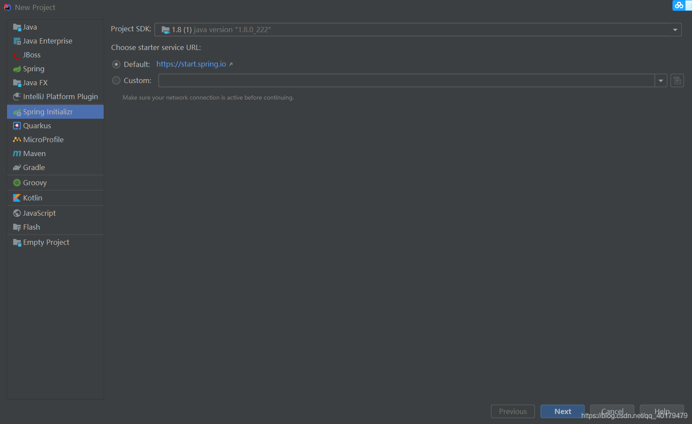
Next :
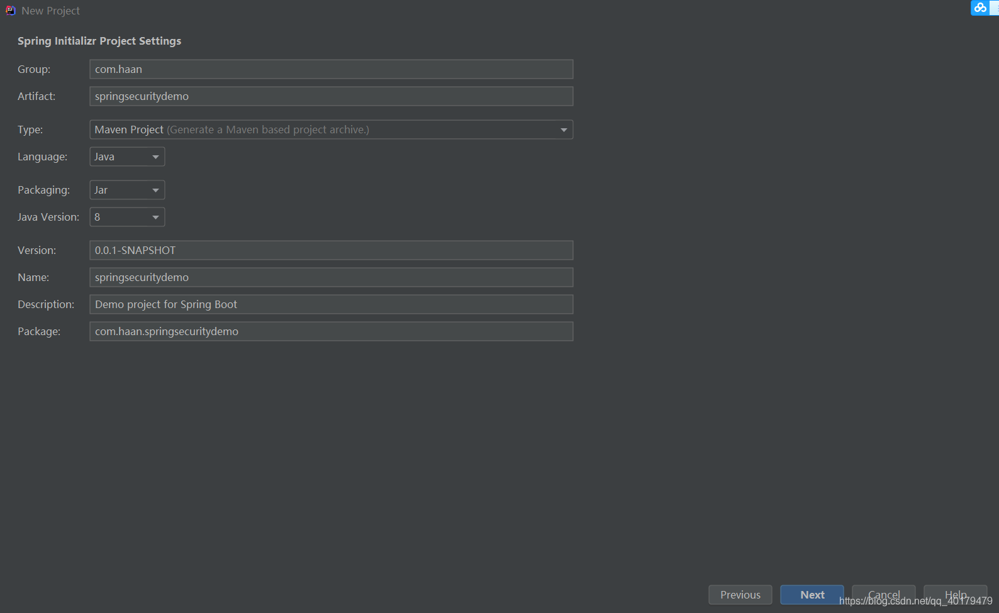
Next:

创建项目的目录结构：
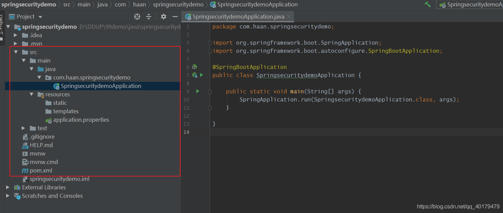

### maven 引用

在自动构建的 Spring Security 项目中，Spring Initializr 为我们引入了以下依赖：

```xml
        <dependency>
            <groupId>org.springframework.boot</groupId>
            <artifactId>spring-boot-starter-security</artifactId>
        </dependency>
```

我们点开`spring-boot-starter-security`可以看到，其包含了以下依赖：

```xml
    <dependency>
      <groupId>org.springframework.boot</groupId>
      <artifactId>spring-boot-starter</artifactId>
      <version>2.3.1.RELEASE</version>
      <scope>compile</scope>
    </dependency>
    <dependency>
      <groupId>org.springframework</groupId>
      <artifactId>spring-aop</artifactId>
      <scope>compile</scope>
    </dependency>
    <dependency>
      <groupId>org.springframework.security</groupId>
      <artifactId>spring-security-config</artifactId>
      <scope>compile</scope>
    </dependency>
    <dependency>
      <groupId>org.springframework.security</groupId>
      <artifactId>spring-security-web</artifactId>
      <scope>compile</scope>
    </dependency>
```

其中 `spring-security-web`和`spring-security-config`两个核心模块，正是官方建议引入的 Spring Security 最小依赖。

### 声明 controller

在项目中声明一个测试路由`TestController`：

```java
package com.haan.springsecuritydemo;

import org.springframework.web.bind.annotation.GetMapping;
import org.springframework.web.bind.annotation.RestController;

@RestController
public class TestController {

    @GetMapping
    public String hello(){
        return "Hello Spring Security!";
    }
}

```

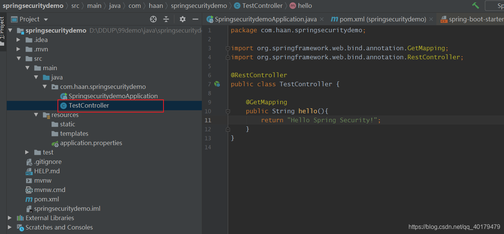

### 运行`SpringsecuritydemoApplication`

运行`SpringsecuritydemoApplication`,默认启动 `8080` 端口，打开浏览器，访问`localhost:8080`,我们发现页面跳转到了`localhost:8080/login`:
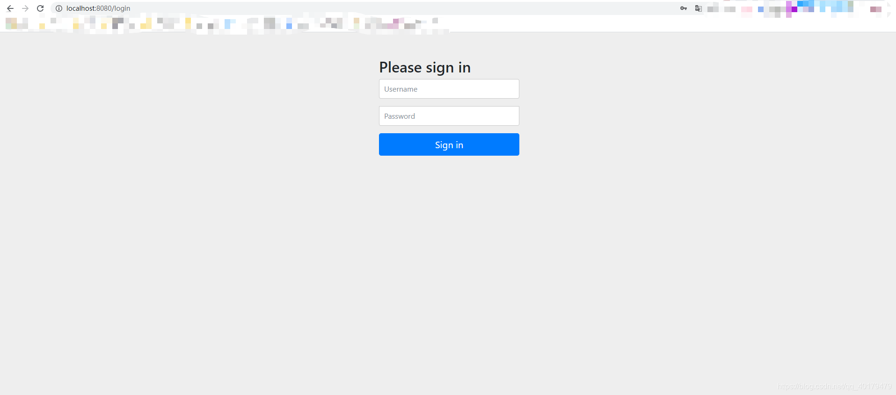
在引入 Spring Security 项目之后，虽然没有进行任何相关的配置或编码，但 Spring Security 有一个默认的运行状态，要求在经过表单基本认证后才能访问对应的 URL 资源，其默认使用的用户名为 `user` ，密码则是动态生成并打印到控制台的一串随机码。翻看控制台的打印信息:
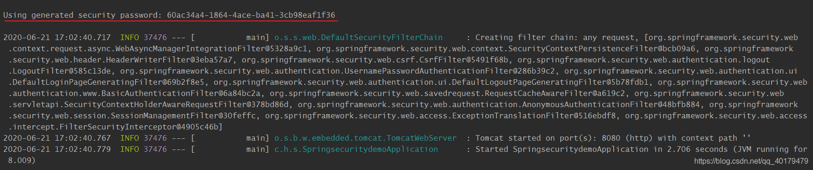
输入用户名和密码后，单击“登录”按钮即可成功访问:
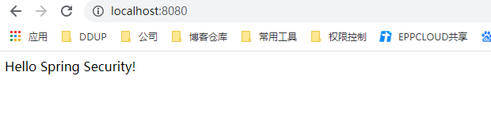

### 修改登录信息

基本表单认证中，用户名和密码都是可以配置的，最常见的就是在 resources 下的`application`配置文件中修改：

```xml
spring.security.user.name=user02
spring.security.user.password=aaaaaa
```

重新启动程序，发现控制台不再打印默认密码串了，此时使用我们自定义的用户名和密码即可登录。

### WebSecurityConfigurerAdapter

```java
    protected void configure(HttpSecurity http) throws Exception {
        this.logger.debug("Using default configure(HttpSecurity). If subclassed this will potentially override subclass configure(HttpSecurity).");
        ((HttpSecurity)((HttpSecurity)((AuthorizedUrl)http.authorizeRequests().anyRequest()).authenticated().and()).formLogin().and()).httpBasic();
    }
```

可以看到 `WebSecurityConfigurerAdapter` 已经默认声明了一些安全特性：

- 验证所有请求。
- 允许用户使用表单登录进行身份验证（Spring Security 提供了一个简单的表单登录页面）。
- 允许用户使用 HTTP 基本认证。

spring boot 默认定义了`DefaultConfigurerAdapter ` ,由`@ConditionalOnMissingBean`可知当没有其他`WebSecurityConfigurerAdapter`被定义时，将使用`DefaultConfigurerAdapter`：

```java
@Configuration(
    proxyBeanMethods = false
)
@ConditionalOnClass({WebSecurityConfigurerAdapter.class})
@ConditionalOnMissingBean({WebSecurityConfigurerAdapter.class})
@ConditionalOnWebApplication(
    type = Type.SERVLET
)
public class SpringBootWebSecurityConfiguration {
    public SpringBootWebSecurityConfiguration() {
    }

    @Configuration(
        proxyBeanMethods = false
    )
    @Order(2147483642)
    static class DefaultConfigurerAdapter extends WebSecurityConfigurerAdapter {
        DefaultConfigurerAdapter() {
        }
    }
}
```

### 自定义表单登录页

Spring boot 提供了`WebSecurityConfigurerAdapter` 的默认实现`DefaultConfigurerAdapter`，能够提供基本表单登录认证。

虽然自动生成的表单登录页可以方便、快速地启动，但是大多数应用程序更希望提供自己的表单登录页，此时就需要我们提供自己的`WebSecurityConfigurerAdapter`来代替`DefaultConfigurerAdapter`,覆写`WebSecurityConfigurerAdapter`的`configure`方法:

```java
@EnableWebSecurity
public class MyWebSecurityConfiguration extends WebSecurityConfigurerAdapter {

    @Override
    protected void configure(HttpSecurity http) throws Exception {
        http.authorizeRequests()
                .anyRequest().authenticated()
                .and()
                .formLogin()
                .loginPage("/myLogin.html")	//指明登录页面
                .permitAll()    //指明登录页允许所有进行访问
                .and()
                .csrf().disable();
    }
}
```

- `authorizeRequests（）`方法实际上返回了一个 URL 拦截注册器，我们可以调用它提供的`anyRequest（）`、`antMatchers（）`和 `regexMatchers（）`等方法来匹配系统的 URL，并为其指定安全策略。
- `formLogin（）`方法和`httpBasic（）`方法都声明了需要 Spring Security 提供的表单认证方式，分别返回对应的配置器。其中`formLogin（）.loginPage（"/myLogin.html"）`指定自定义的登录
  页 `/myLogin.html`，同时，Spring Security 会用`/myLogin.html`注册一个`POST`路由，用于接收登录请求。
- `csrf（）`方法是 Spring Security 提供的跨站请求伪造防护功能，当我们继承`WebSecurityConfigurer Adapter`时会默认开启 `csrf（）`方法。

访问`localhost:8080` ,我们发现，页面就跳转到了`localhost:8080/myLogin.html`,由于我们静态文件中并没有`myLogin.html` 文件，所以提示了一个 404 的`white page`:
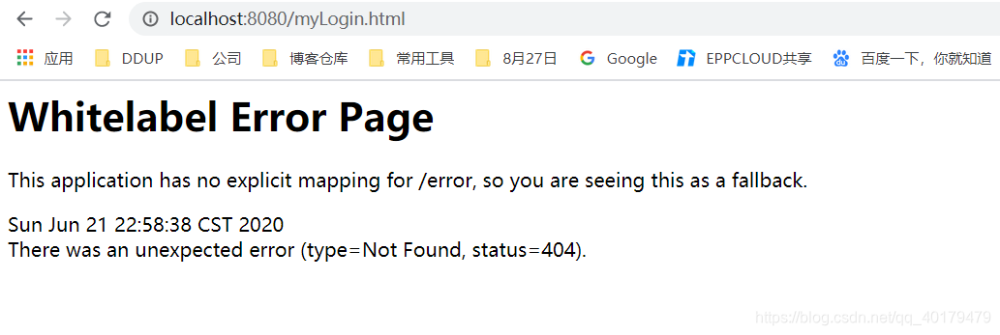
我们在`resources/static` 文件夹下创建页面`myLogin.html`:

```html
<!DOCTYPE html>
<html lang="en">
  <head>
    <meta charset="UTF-8" />
    <title>Hello Security!</title>
  </head>
  <body>
    <h3>登录页</h3>
    <form action="/myLogin.html" method="post">
      <input type="text" name="username" /> <br />
      <input type="text" name="password" /> <br />
      <input type="submit" value="login" />
    </form>
  </body>
</html>
```

重启服务，再次访问`localhost:8080`:
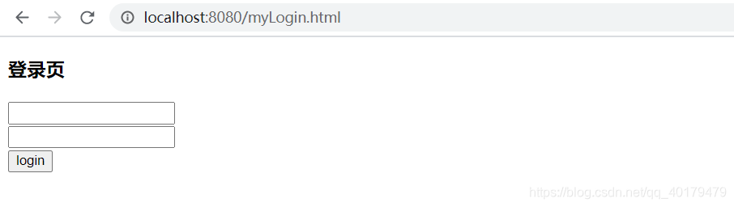
输入上面的`application.properties`中配置的用户登录账户和密码进行登录，登陆成功：
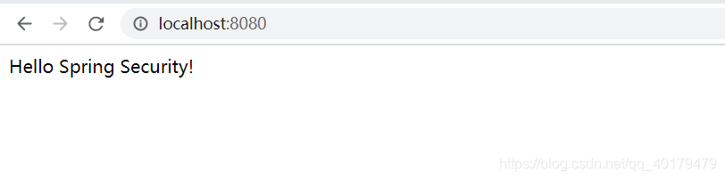

### 其他表单配置项

#### 指定登录处理 URL

在自定义表单登录页之后，处理登录请求的`URL`也会相应改变,默认情况下，
如果只配置`loginPage`而不配置`loginProcessingUrl`的话那么`loginProcessingUrl`默认就是`loginPage`，如果需要自定义登录请求的`URL`,需要配置`loginProcessingUrl`:

```java

```

重启登录，我们发现中间访问了`localhost:8080/myLogin`
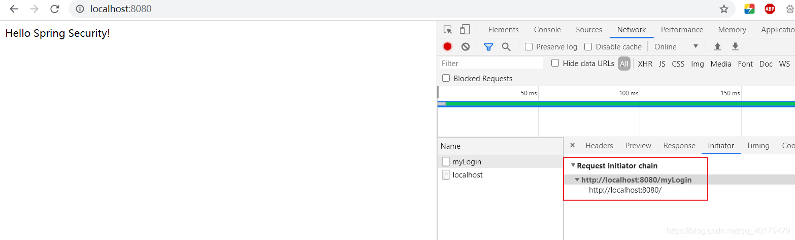

> 补充：`loginPage`和`loginProcessingUrl`
>
> - 两者都不配置：默认都是`/login`
> - 两者都配置：按自己的来
> - 只配置`loginProcessingUrl`：`loginPage`默认`/login`
> - 只配置`loginPage`: `loginProcessingUrl`默认就是`loginPage`

#### 设置登录成功处理

此时，有些读者可能会有疑问，因为按照惯例，在发送登录请求并认证成功之后，页面会跳转回原访问页。在某些系统中的确是跳转回原访问页的，但在部分前后端完全分离、仅靠 JSON 完成所有交互的系统中，一般会在登录时返回一段 JSON 数据，告知前端成功登录成功与否，由前端决定如何处
理后续逻辑，而非由服务器主动执行页面跳转。这在 Spring Security 中同样可以实现。

表单登录配置模块提供了` successHandler（）`和 `failureHandler（）`两个方法，分别处理登录成功和登录失败的逻辑。

- `successHandler（）`方法带有一个`Authentication`参数，携带当前登录用户名及其角色等信息；

- `failureHandler（）`方法携带一个`AuthenticationException`异常参数。具体处理方式需按照系统的情况自定义。

```java
@EnableWebSecurity
public class MyWebSecurityConfiguration extends WebSecurityConfigurerAdapter {

    @Override
    protected void configure(HttpSecurity http) throws Exception {
        http.authorizeRequests()
                .anyRequest().authenticated()
                .and()
                .formLogin()
                .loginPage("/myLogin.html") //指明登录页面
                .loginProcessingUrl("/myLogin")   //指明处理登陆的URL路径，即登陆表单提交请求
                .successHandler(new AuthenticationSuccessHandler() {        // 设置登录成功的处理器
                    @Override
                    public void onAuthenticationSuccess(HttpServletRequest httpServletRequest, HttpServletResponse httpServletResponse, Authentication authentication) throws IOException, ServletException {
                        PrintWriter responseWriter = httpServletResponse.getWriter();
                        String name = authentication.getName();
                        responseWriter.write(name+" login success!");
                    }
                })
                .failureHandler(new AuthenticationFailureHandler() {        // 设置登录失败的处理器
                    @Override
                    public void onAuthenticationFailure(HttpServletRequest httpServletRequest, HttpServletResponse httpServletResponse, AuthenticationException e) throws IOException, ServletException {
                        PrintWriter responseWriter = httpServletResponse.getWriter();
                        responseWriter.write("login error!");
                    }
                })
                .permitAll()    //指明登录页允许所有进行访问
                .and()
                .csrf().disable();
    }
}
```

正确的账号密码：
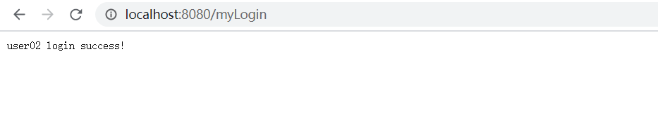
错误的账号密码：
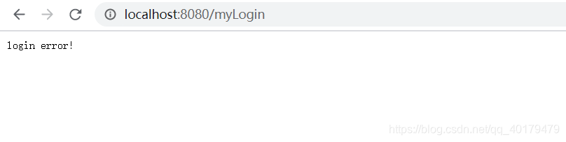

## 基于数据库的认证与授权

### 环境准备

#### controller

```java
@RestController
@RequestMapping("/api/admin")
public class AdminController {

    @GetMapping("/hello")
    public String hello(){
        return "hello! this is admin page";
    }
}

/**----------------------分割线------------------------*/

@RestController
@RequestMapping("/api/user")
public class UserController {

    @GetMapping("/hello")
    public String hello(){
        return "hello! this is user page!";
    }
}

/**----------------------分割线------------------------*/

@RestController
@RequestMapping("/api/public")
public class PublicController {

    @GetMapping("/hello")
    public String hello(){
        return "hello! this is public page";
    }
}

```

#### 资源权限配置

```java
@EnableWebSecurity
public class MySecurityConfiguration extends WebSecurityConfigurerAdapter {

    @Override
    protected void configure(HttpSecurity http) throws Exception {
        http.authorizeRequests()
                .antMatchers("/api/user/**").hasAnyRole("user")  //user 角色访问/api/user/开头的路由
                .antMatchers("/api/admin/**").hasAnyRole("admin") //admin角色访问/api/admin/开头的路由
                .antMatchers("/api/public/**").permitAll()                 //允许所有可以访问/api/public/开头的路由
                .and()
            .formLogin();
    }
}
```

`antMatchers（）`是一个采用 ANT 模式的 URL 匹配器：

- `*` 表示匹配 0 或任意数量的字符
- `**` 表示匹配 0 或者更多的目录。`antMatchers（"/admin/api/**"）`相当于匹配了`/admin/api/`下的所有 API。

#### 配置默认用户，密码和角色信息

```xml
#默认登录用户
spring.security.user.name=user
#默认user用户密码
spring.security.user.password=user
#默认user用户所属角色
spring.security.user.roles=user
```

#### 启动服务进行验证

直接方访问`localhost:8080/api/public/hello`,没问题，正常访问：
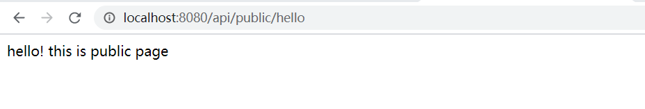
访问`localhost:8080/api/user/hello`,跳转到了登录验证页面：
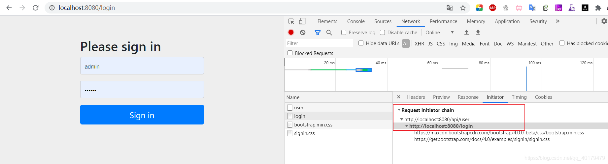
正确使用`user`用户进行登录后,也能够正常访问：
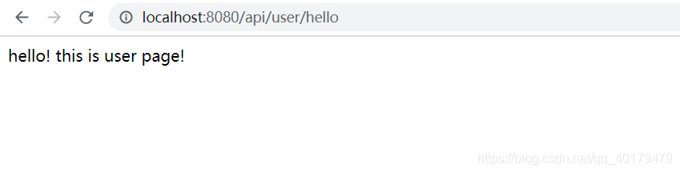
访问`localhost:8080/api/admin/hello`,跳转到了登录验证页面：

此时正确使用`user`用户进行登录后，发现提示了`403`：
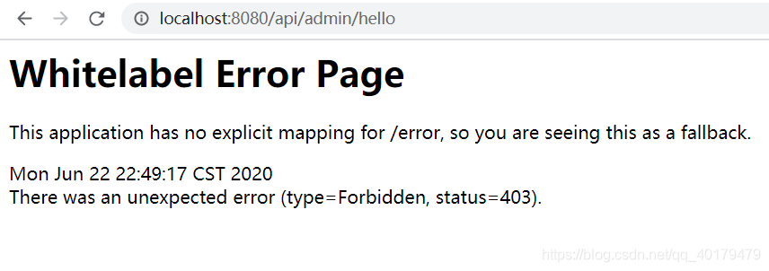

> 页面显示`403`错误，表示该用户授权失败,`401`代表该用户认证失败；本次访问已经通过了认证环节，只是在授权的时候被驳回了。

### 基于内存的多用户支持

到目前为止，我们仍然只有一个可登录的用户，怎样引入多用户呢？非常简单，我们只需实现一个自定义的`UserDetailsService`即可:

```
    @Bean
    public UserDetailsService userDetailsService(){
        UserDetailsManager userDetailsManager = new InMemoryUserDetailsManager();
        //创建用户user01,密码user01,角色user
        userDetailsManager.createUser(User.withUsername("user01").password("user01").roles("user").build());
        //创建用户admin01,密码admin01,角色admin
        userDetailsManager.createUser(User.withUsername("admin01").password("admin01").roles("admin").build());
        return userDetailsManager;
    }
```

其中`InMemoryUserDetailsManager` 是 `UserDetailManager`的实现类，它将用户数据源寄存在内存里，在一些不需要引入数据库这种重数据源的系统中很有帮助。
`UserDetailManager` 继承了 `UserDetailService`;

重启服务，使用新创建的用户`admin01`去访问`localhost:8080/api/admin/hello`,我们可以发现，依旧未能够正确认证并授权：
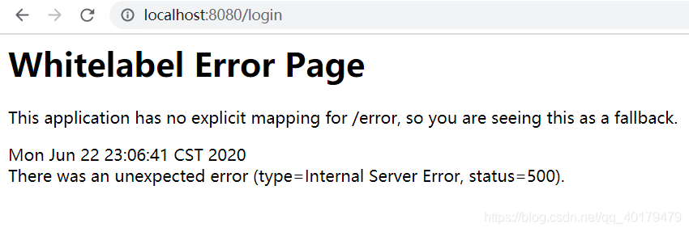

> 这块儿在陈木鑫老师的书中是已经能够正确认证并授权通过了，现在为什么没有成功呢？
> 因为 Spring security 5.0 中新增了多种加密方式，也改变了密码的格式。详见：`https://blog.csdn.net/canon_in_d_major/article/details/79675033`
>
> 我们这里针对性对`userDetailsService`进行修改，指明使用默认的`passwordEncoder`：

```java
    @Bean
    public UserDetailsService userDetailsService(){
        InMemoryUserDetailsManager userDetailsManager = new InMemoryUserDetailsManager();

        //创建用户user01,密码user01,角色user
        userDetailsManager.createUser(User.withDefaultPasswordEncoder().username("user01").password("user01").roles("user").build());
        //创建用户admin01,密码admin01,角色admin
        userDetailsManager.createUser(User.withDefaultPasswordEncoder().username("admin01").password("admin01").roles("admin").build());

        return userDetailsManager;
    }
```

这样我们就可以正确的认证访问了：
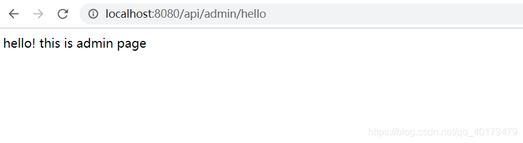

### 基于默认数据库模型的认证与授权

除了`InMemoryUserDetailsManager`,Spring Security 还提供另一个`UserDetailsService`实现类：`JdbcUserDetailsManager`。
`JdbcUserDetailsManager`帮助我们以`JDBC`的方式对接数据库和 Spring Security。

`JdbcUserDetailsManager`设定了一个默认的数据库模型，只要遵从这个模型，在简便性上，`JdbcUserDetailsManager`甚至可以媲美`InMemoryUserDetailsManager`。

#### 准备数据库

我这里使用的是`PostgreSQL`数据库，在这块儿使用其他数据库（例如`MySQL`）都是一样的，这块儿看个人爱好吧。

（1）在工程中引入`jdbc`和`PostgreSQL`两个必要依赖:

```xml
        <dependency>
            <groupId>org.springframework.boot</groupId>
            <artifactId>spring-boot-starter-jdbc</artifactId>
        </dependency>
        <dependency>
            <groupId>org.postgresql</groupId>
            <artifactId>postgresql</artifactId>
        </dependency>
```

（2）在`application.properties`配置文件中配置数据库连接信息：

```properties
#数据库连接信息
spring.datasource.driver-class-name=org.postgresql.Driver
spring.datasource.url=jdbc:postgresql://localhost:5432/springsecuritydemo?schema=public
spring.datasource.data-username=postgres
spring.datasource.data-password=aaaaaa
```

（3）预制表结构和数据
`JdbcUserDetailsManager`设定了一个默认的数据库模型，Spring Security 将该模型定义在`/org/springframework/security/core/userdetails/jdbc/users.ddl`内:

```sql
create table users(username varchar_ignorecase(50) not null primary key,password varchar_ignorecase(500) not null,enabled boolean not null);
create table authorities (username varchar_ignorecase(50) not null,authority varchar_ignorecase(50) not null,constraint fk_authorities_users foreign key(username) references users(username));
create unique index ix_auth_username on authorities (username,authority);
```

`JdbcUserDetailsManager`需要两个表，其中`users`表用来存放用户名、密码和是否可用三个信息，`authorities`表用来存放用户名及其权限的对应关系。

我们现在使用 sql 创建这两张表，在 Pg 数据库中执行上面的语句，我们发现以下错误：
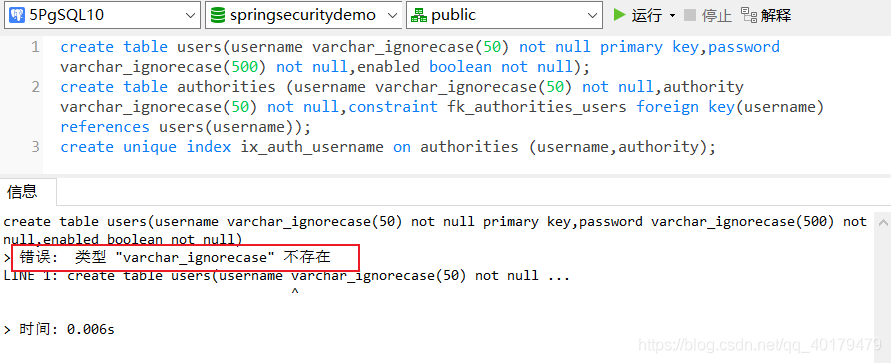
因为该语句是用`hsqldb`创建的，而 PostgreSQL 不支持
`varchar_ignorecase`这种类型。怎么办呢？很简单，将`varchar_ignorecase`改为 PostgreSQL 支持的`varchar`即可:

```sql
create table users(username varchar(50) not null primary key,password varchar(500) not null,enabled boolean not null);
create table authorities (username varchar(50) not null,authority varchar(50) not null,constraint fk_authorities_users foreign key(username) references users(username));
create unique index ix_auth_username on authorities (username,authority);
```

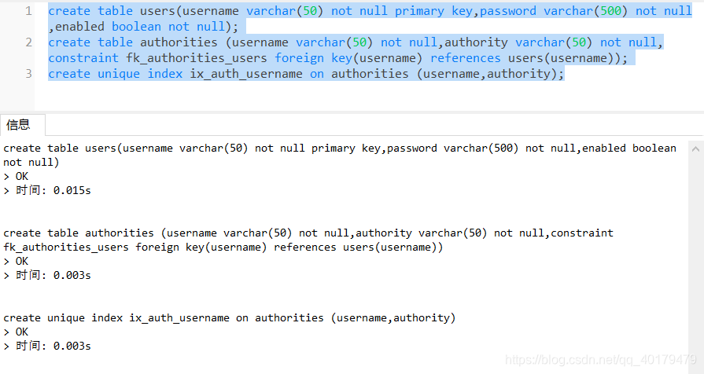
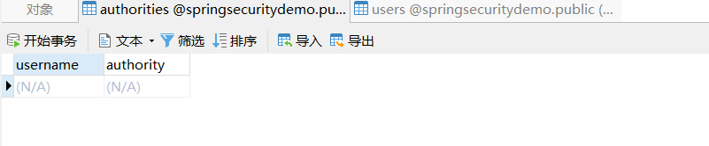
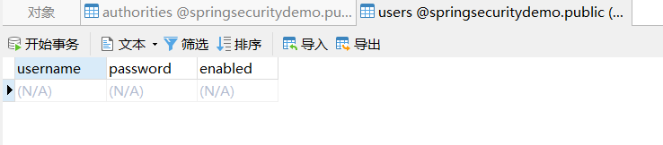
配置完成后，重启环境，正常启动。

#### 编码实现

下面我们修改一下`userDetailService` bean,使用`JdbcUserDetailsManager`实现，让 Spring Security 使用数据库来管理用户:

```java
    @Bean
    public UserDetailsService userDetailsService(DataSource dataSource){
        JdbcUserDetailsManager userDetailsManager = new JdbcUserDetailsManager();
        userDetailsManager.setDataSource(dataSource);

        //创建用户user01,密码user01,角色user
        userDetailsManager.createUser(User.withDefaultPasswordEncoder().username("user01").password("user01").roles("user").build());
        //创建用户admin01,密码admin01,角色admin
        userDetailsManager.createUser(User.withDefaultPasswordEncoder().username("admin01").password("admin01").roles("admin").build());

        return userDetailsManager;
    }
```

`JdbcUserDetailsManager`与`InMemoryUserDetailsManager`在用法上没有太大区别，只是多了设置`DataSource `的环节。Spring Security 通过`DataSource`执行设定好的命令。例如，此处的`createUser`函数实际上就是执行了下面的 SQL 语句:

```sql
insert into users (username,password,enabled) values(?,?,?)
```

查看 `JdbcUserDetailsManager` 的源代码可以看到更多定义好的 SQL 语句，诸如`deleteUserSql`、`updateUserSql`等，这些都是`JdbcUserDetailsManager`与数据库实际交互的形式。当然，`JdbcUserDetailsManager ` 也允许我们在特殊情况下自定义这些 SQL 语句，如有必要，调用对应的`setXxxSql`方法即可。
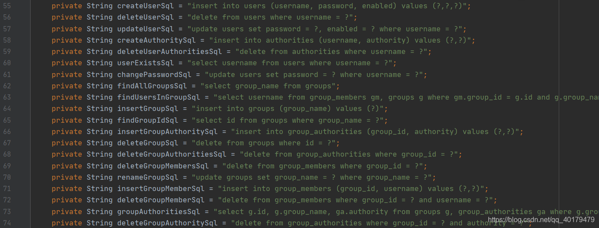
现在重启服务，我们发现看看 Spring Security 在数据库中生成了下面这些数据：
users 表：
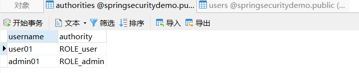
authorities 表：
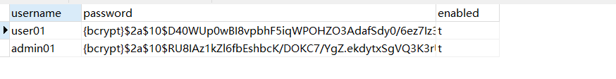
重启服务后，使用`user01`用户和`admin01`用户都能够正常合理访问接口，与预期的行为一致。

到目前为止，一切都工作得很好，但是只要我们重启服务，应用就会报错。这是因为 users 表在创建语句时，username 字段为主键，主键是唯一不重复的，但重启服务后会再次创建 admin 和 user，导致数据库报错（在内存数据源上不会出现这种问题，因为重启服务后会清空 username 字段中的内容）。
所以如果需要在服务启动时便生成部分用户，那么建议先判断用户名是否存在。

```java
    @Bean
    public UserDetailsService userDetailsService(DataSource dataSource){
        JdbcUserDetailsManager userDetailsManager = new JdbcUserDetailsManager();
        userDetailsManager.setDataSource(dataSource);

        //创建用户user01,密码user01,角色user
        if (!userDetailsManager.userExists("user01")) { //判断user01是否存在
            userDetailsManager.createUser(User.withDefaultPasswordEncoder().username("user01").password("user01").roles("user").build());
        }
        //创建用户admin01,密码admin01,角色admin
        if (!userDetailsManager.userExists("admin01")) {//判断admin01是否存在
            userDetailsManager.createUser(User.withDefaultPasswordEncoder().username("admin01").password("admin01").roles("admin").build());
        }
        return userDetailsManager;
    }
```

#### 补充

`WebSecurityConfigurer Adapter`定义了三个`configure`:

```java
    protected void configure(AuthenticationManagerBuilder auth) throws Exception {
        this.disableLocalConfigureAuthenticationBldr = true;
    }
    public void configure(WebSecurity web) throws Exception {
    }

    protected void configure(HttpSecurity http) throws Exception {
        this.logger.debug("Using default configure(HttpSecurity). If subclassed this will potentially override subclass configure(HttpSecurity).");
        ((HttpSecurity)((HttpSecurity)((AuthorizedUrl)http.authorizeRequests().anyRequest()).authenticated().and()).formLogin().and()).httpBasic();
    }

```

我们只用到了一个参数，用来接收 HttpSecurity 对象的配置方法。另外两个参数也有各自的用途，其中，`AuthenticationManagerBuilder的configure`同样允许我们配置认证用户:

```java
@EnableWebSecurity
public class MySecurityConfiguration extends WebSecurityConfigurerAdapter {

    @Override
    protected void configure(HttpSecurity http) throws Exception {

        http.authorizeRequests()
                .antMatchers("/api/user/**").hasAnyRole("user")  //user 角色访问/api/user/开头的路由
                .antMatchers("/api/admin/**").hasAnyRole("admin") //admin 角色访问/api/admin/开头的路由
                .antMatchers("/api/public/**").permitAll()                 //允许所有可以访问/api/public/开头的路由
                .and()
            .formLogin();
    }

//    @Bean
//    public UserDetailsService userDetailsService(){
//        InMemoryUserDetailsManager userDetailsManager = new InMemoryUserDetailsManager();
//
//        //创建用户user01,密码user01,角色user
//        userDetailsManager.createUser(User.withDefaultPasswordEncoder().username("user01").password("user01").roles("user").build());
//        //创建用户admin01,密码admin01,角色admin
//        userDetailsManager.createUser(User.withDefaultPasswordEncoder().username("admin01").password("admin01").roles("admin").build());
//
//        return userDetailsManager;
//    }

//    @Bean
//    public UserDetailsService userDetailsService(DataSource dataSource){
//        JdbcUserDetailsManager userDetailsManager = new JdbcUserDetailsManager();
//        userDetailsManager.setDataSource(dataSource);
//
//        //创建用户user01,密码user01,角色user
//        if (!userDetailsManager.userExists("user01")) { //判断user01是否存在
//            userDetailsManager.createUser(User.withDefaultPasswordEncoder().username("user01").password("user01").roles("user").build());
//        }
//        //创建用户admin01,密码admin01,角色admin
//        if (!userDetailsManager.userExists("admin01")) {//判断admin01是否存在
//            userDetailsManager.createUser(User.withDefaultPasswordEncoder().username("admin01").password("admin01").roles("admin").build());
//        }
//        return userDetailsManager;
//    }


    @Override
    protected void configure(AuthenticationManagerBuilder auth) throws Exception {
        auth.jdbcAuthentication()
                .passwordEncoder(new BCryptPasswordEncoder())
                .withUser("user1")
                .password(new BCryptPasswordEncoder().encode("user01"))
                .roles("user")
                .and()
                .passwordEncoder(new BCryptPasswordEncoder())
                .withUser("admin01")
                .password(new BCryptPasswordEncoder().encode("admin01"))
                .roles("admin");
    }
}
```

### 自定义数据库模型的认证于授权

`InMemoryUserDetailsManager` 和 `JdbcUserDetailsManager  `两个类都是`UserDetailsService`的实现类，自定义数据库结构实际上也仅需实现一个自定义的`UserDetailsService`。
`UserDetailsService`仅定义了一个`loadUserByUsername`方法，用于获取一个`UserDetails`对象。`UserDetails`对象包含了一系列在验证时会用到的信息，包括用户名、密码、权限以及其他信息，Spring Security 会根据这些信息判定验证是否成功。

```java
public interface UserDetailsService {
    UserDetails loadUserByUsername(String var1) throws UsernameNotFoundException;
}

```

```java
public interface UserDetails extends Serializable {
    Collection<? extends GrantedAuthority> getAuthorities();

    String getPassword();

    String getUsername();

    boolean isAccountNonExpired();

    boolean isAccountNonLocked();

    boolean isCredentialsNonExpired();

    boolean isEnabled();
}

```

也就是说，不管数据库结构如何变化，只要能构造一个`UserDetails`即可。

#### 自定义实现`UserDetail`

1.编写实体`User`实现`UserDetail`

```java
public class User implements UserDetails {
    private Long id;
    private String userName;
    private String password;
    private Boolean enable;
    private String roles;
    private List<GrantedAuthority> authentications;

    public Long getId() {
        return id;
    }

    public void setId(Long id) {
        this.id = id;
    }

    public String getUserName() {
        return userName;
    }

    public void setUserName(String userName) {
        this.userName = userName;
    }

    public void setPassword(String password) {
        this.password = password;
    }

    public String getRoles() {
        return roles;
    }

    public void setRoles(String roles) {
        this.roles = roles;
    }

    public Boolean getEnable() {
        return enable;
    }

    public void setEnable(Boolean enable) {
        this.enable = enable;
    }

    public List<GrantedAuthority> getAuthentications() {
        return authentications;
    }

    public void setAuthentications(List<GrantedAuthority> authentications) {
        this.authentications = authentications;
    }

    @Override
    public Collection<? extends GrantedAuthority> getAuthorities() {
        return this.getAuthentications();
    }

    @Override
    public String getPassword() {
        return this.password;
    }

    @Override
    public String getUsername() {
        return this.userName;
    }

    @Override
    public boolean isAccountNonExpired() {
        return true;
    }

    @Override
    public boolean isAccountNonLocked() {
        return true;
    }

    @Override
    public boolean isCredentialsNonExpired() {
        return true;
    }

    @Override
    public boolean isEnabled() {
        return this.enable;
    }
}
```

实现`UserDetails`定义的几个方法：

- `isAccountNonExpired`、`isAccountNonLocked `和 `isCredentialsNonExpired` 暂且用不到，统一返回`rue`，否则 Spring Security 会认为账号异常。
- `isEnabled`对应`enable`字段，将其代入即可。
- `getAuthorities`方法本身对应的是`roles`字段，但由于结构不一致，所以此处新建一个，并在后续进行填充。

  2.数据库持久层

这里使用`JPA` 实现实体关系型映射，建立实体与数据库的关系：

（1）需要引入`spring-boot-stater-data-jpa`依赖

```xml
        <dependency>
            <groupId>org.springframework.boot</groupId>
            <artifactId>spring-boot-starter-data-jpa</artifactId>
        </dependency>
```

（2）更改`User`为数据库映射实体类:

```java
@Entity
@Table
public class User implements UserDetails {
    @Id
    @GeneratedValue(strategy = GenerationType.SEQUENCE)
    private Long id;
    private String userName;
    private String password;
    private Boolean enable;
    private String roles;

    @Transient
    private List<GrantedAuthority> authentications;
```

（3）新建`UserRepository`

```java
public interface UserRepository extends JpaRepository<User,Long> {
    User findByUserName(String userName);
}
```

#### 自定义实现`UserDetailsService`

```java
@Service
public class MyUserDetailServiceImpl implements UserDetailsService {

    @Autowired
    private UserRepository userRepository;

    @Override
    public UserDetails loadUserByUsername(String username) throws UsernameNotFoundException {
        //(1)从数据库获取用户
        User user = userRepository.findByUserName(username);
        if (user==null)//用户不存在
            throw new RuntimeException("用户"+username+"不存在!");
        //(2)将数据库中的roles解析为UserDetail的权限集
        String roles = user.getRoles();
        List<GrantedAuthority> grantedAuthorities = AuthorityUtils.commaSeparatedStringToAuthorityList(roles);
        user.setAuthentications(grantedAuthorities);
        return user;
    }
}
```

`AuthorityUtils.commaSeparatedStringToAuthorityList(String list)` 是 spring security 提供的将逗号隔开的权限集字符串切割为权限对象列表，当然上面代码中我们也可以自己实现来代替：

```java
    List<GrantedAuthority> getGrantedAuthorities(String roles){
        List<GrantedAuthority> grantedAuthorities = new ArrayList<>();
        String[] split = StringUtils.split(roles, ";");
        for (int i = 0;i<split.length;i++){
            if (!StringUtils.isEmpty(split[i])){
                SimpleGrantedAuthority grantedAuthority = new SimpleGrantedAuthority(split[i]);
                grantedAuthorities.add(grantedAuthority);
            }
        }
        return grantedAuthorities;
    }
```

至此，我们就实现了 Spring Security 的自定义数据库结构认证工程。

## RememberMe 实现自动登录

自动登录是将用户的登录信息保存在用户浏览器的 cookie 中，当用户下次访问时，自动实现校验并建立登录态的一种机制。
Spring Security 提供了两种非常好的令牌：

- 散列算法加密用户必要的登录信息并生成令牌
- 数据库等持久性数据存储机制用的持久化令牌
  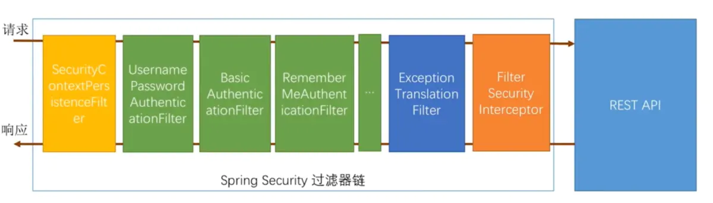
  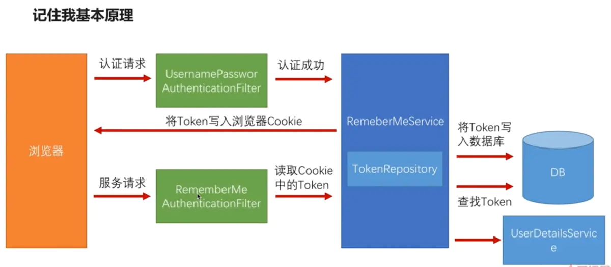

### 散列加密方案

在 Spring Security 中加入自动登录的功能非常简单：

```java
    @Override
    protected void configure(HttpSecurity http) throws Exception {
        http.authorizeRequests()
                .antMatchers("/api/user/**").hasRole("user")  //user 角色访问/api/user/开头的路由
                .antMatchers("/api/admin/**").hasRole("admin") //admin 角色访问/api/admin/开头的路由
                .antMatchers("/api/public/**").permitAll()                 //允许所有可以访问/api/public/开头的路由
                .and()
                .formLogin()
                .and()
                .rememberMe().userDetailsService(userDetailsService());      //记住密码
    }


```

重启服务后访问受限 API，这次在表单登录页中多了一个可选框:

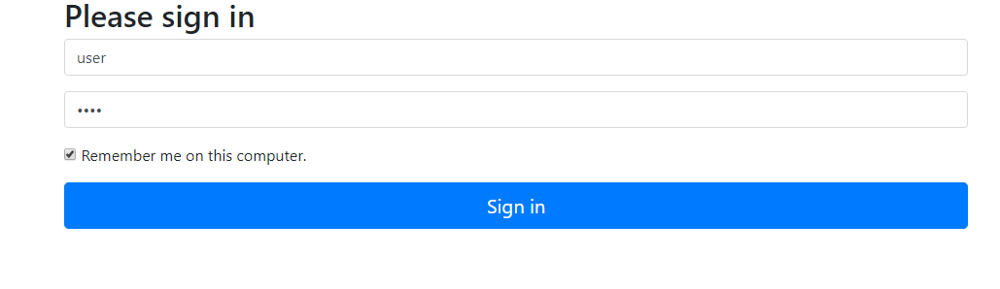

勾选“Remember me on this computer”可选框（简写为 Remember-me），按照正常的流程登录，并在开发者工具中查看浏览器 cookie，可以看到除 JSESSIONID 外多了一个值：

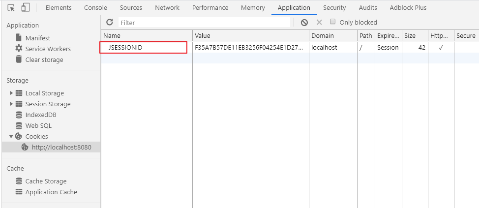

这是 Spring Security 默认自动登录的 cookie 字段。在不配置的情况下，过期时间是两个星期:

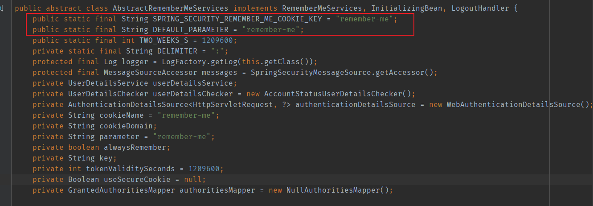

Spring Security 会在每次表单登录成功之后更新此令牌，具体处理方式在源码中:

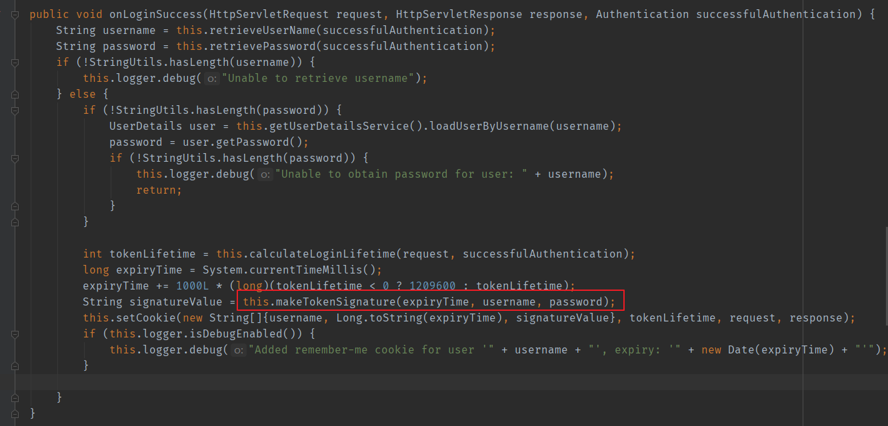
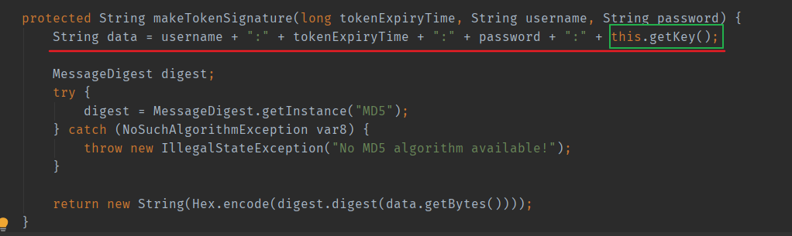
RememberConfigurer:
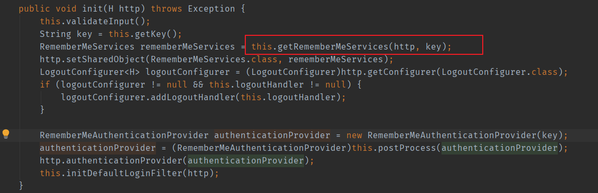

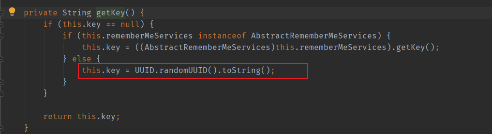

### 持久化令牌方案

在持久化令牌方案中，最核心的是 series 和 token 两个值，它们都是用 MD5 散列过的随机字符串。不同的是，series 仅在用户使用密码重新登录时更新，而 token 会在每一个新的 session 中都重新生成。
解决了散列加密方案中一个令牌可以同时在多端登录的问题。每个会话都会引发 token 的更
新，即每个 token 仅支持单实例登录。
自动登录不会导致 series 变更，而每次自动登录都需要同时验证 series 和 token 两个值，当该
令牌还未使用过自动登录就被盗取时，系统会在非法用户验证通过后刷新 token 值，此时在合法用户
的浏览器中，该 token 值已经失效。当合法用户使用自动登录时，由于该 series 对应的 token 不同，系统
可以推断该令牌可能已被盗用，从而做一些处理。例如，清理该用户的所有自动登录令牌，并通知该
用户可能已被盗号等
Spring Security 使用 PersistentRememberMeToken 来表明一个验证实体:

```java
public class PersistentRememberMeToken {
    private final String username;
    private final String series;
    private final String tokenValue;
    private final Date date;

    public PersistentRememberMeToken(String username, String series, String tokenValue, Date date) {
        this.username = username;
        this.series = series;
        this.tokenValue = tokenValue;
        this.date = date;
    }

    public String getUsername() {
        return this.username;
    }

    public String getSeries() {
        return this.series;
    }

    public String getTokenValue() {
        return this.tokenValue;
    }

    public Date getDate() {
        return this.date;
    }
}
```

需要使用持久化令牌方案,需要传入 PersistentTokenRepository 的实例：
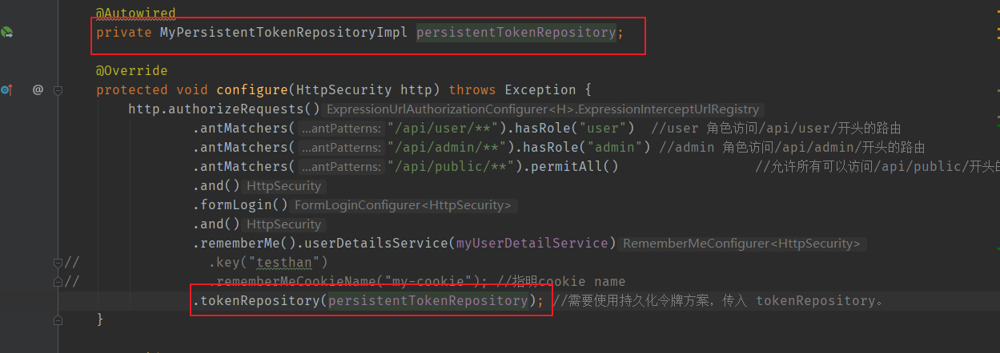

PersistentTokenRepository 接口主要涉及 token 的增删查改四个接口：
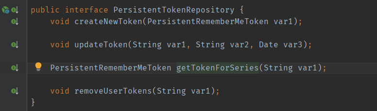

MyPersistentTokenRepositoryImpl 使我们实现 PersistentTokenRepository 接口：

```java
@Service
public class MyPersistentTokenRepositoryImpl implements PersistentTokenRepository {

    @Autowired
    private JPAPersistentTokenRepository  repository;

    @Override
    public void createNewToken(PersistentRememberMeToken persistentRememberMeToken) {
        MyPersistentToken myPersistentToken = new MyPersistentToken();
        myPersistentToken.setSeries(persistentRememberMeToken.getSeries());
        myPersistentToken.setUsername(persistentRememberMeToken.getUsername());
        myPersistentToken.setTokenValue(persistentRememberMeToken.getTokenValue());
        myPersistentToken.setUser_last(persistentRememberMeToken.getDate());
        repository.save(myPersistentToken);
    }

    @Override
    public void updateToken(String series, String tokenValue, Date lastUsed) {
        MyPersistentToken myPersistentToken = repository.findBySeries(series);
        myPersistentToken.setUser_last(lastUsed);
        myPersistentToken.setTokenValue(tokenValue);
        repository.save(myPersistentToken);
    }

    @Override
    public PersistentRememberMeToken getTokenForSeries(String series) {
        MyPersistentToken myPersistentToken = repository.findBySeries(series);
        PersistentRememberMeToken persistentRememberMeToken = new PersistentRememberMeToken(myPersistentToken.getUsername(), myPersistentToken.getSeries(), myPersistentToken.getTokenValue(), myPersistentToken.getUser_last());
        return persistentRememberMeToken;
    }

    @Override
    @Transactional
    public void removeUserTokens(String username) {
        repository.deleteByUsername(username);
    }
}
```

```java
public interface JPAPersistentTokenRepository extends JpaRepository<MyPersistentToken,Long> {
    MyPersistentToken findBySeries(String series);
    void deleteByUsername(String username);
}
```

```java
@Entity
@Table(name = "persistent_token")
public class MyPersistentToken {
    @Id
    @GeneratedValue(strategy = GenerationType.SEQUENCE)
    private Long id;
    private  String username;
    @Column(unique = true)
    private  String series;
    private  String tokenValue;
    private  Date user_last;

    public Long getId() {
        return id;
    }

    public void setId(Long id) {
        this.id = id;
    }

    public String getUsername() {
        return username;
    }

    public void setUsername(String username) {
        this.username = username;
    }

    public String getSeries() {
        return series;
    }

    public void setSeries(String series) {
        this.series = series;
    }

    public String getTokenValue() {
        return tokenValue;
    }

    public void setTokenValue(String tokenValue) {
        this.tokenValue = tokenValue;
    }

    public Date getUser_last() {
        return user_last;
    }

    public void setUser_last(Date user_last) {
        this.user_last = user_last;
    }
}
```

当自动登录认证时，Spring Security 通过 series 获取用户名、token 以及上一次自动登录时间三个信息，通过用户名确认该令牌的身份，通过对比 token 获知该令牌是否有效，通过上一次自动登录时间获知该令牌是否已过期，并在完整校验通过之后生成新的 token。

## Spring Security 注销登录

Spring Security 支持在继承 WebSecurityConfigurerAdapter 的配置类中配置注销登录：
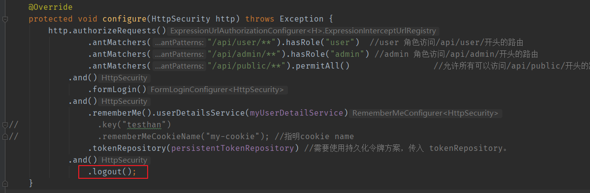

HttpSecurity 内的 logout（）方法以一个 LogoutConfigurer 作为配置基础，创建一个用于注销登录的过滤器:
HttpSecurity:

```java
public LogoutConfigurer<HttpSecurity> logout() throws Exception {
       return (LogoutConfigurer)this.getOrApply(new LogoutConfigurer());
   }

   public HttpSecurity logout(Customizer<LogoutConfigurer<HttpSecurity>> logoutCustomizer) throws Exception {
       logoutCustomizer.customize(this.getOrApply(new LogoutConfigurer()));
       return this;
   }
```

LogoutConfigurer:

```java
    public void configure(H http) throws Exception {
        LogoutFilter logoutFilter = this.createLogoutFilter(http);
        http.addFilter(logoutFilter);
    }


    private LogoutFilter createLogoutFilter(H http) {
        this.logoutHandlers.add(this.contextLogoutHandler);
        this.logoutHandlers.add(this.postProcess(new LogoutSuccessEventPublishingLogoutHandler()));
        LogoutHandler[] handlers = (LogoutHandler[])this.logoutHandlers.toArray(new LogoutHandler[0]);
        LogoutFilter result = new LogoutFilter(this.getLogoutSuccessHandler(), handlers);
        result.setLogoutRequestMatcher(this.getLogoutRequestMatcher(http));
        result = (LogoutFilter)this.postProcess(result);
        return result;
    }
```

它默认注册了一个/logout 路由，用户通过访问该路由可以安全地注销其登录状态，包括使 HttpSession 失效、清空已配置的 Remember-me 验证，以及清空 SecurityContextHolder，并在注销成功之后重定向到/login?logout 页面。

如有必要，还可以重新配置：
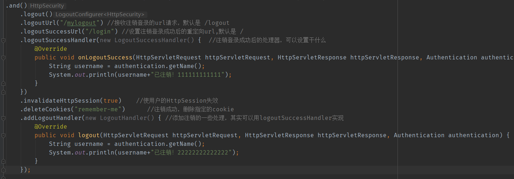

## Spring Security 自定义过滤器

在 Spring Security 中自定义一个的过滤器，将其添加到 Spring Security 过滤器链的合适位置。定义一个自己的过滤器类继承 Filter 接口即可。

> 但是在 Spring 体系中，推荐使用
> OncePerRequestFilter 来实现，它可以确保一次请求只会通过一次该过滤器（Filter 实际上并不能保证这
> 一点）。

```java
public class MySecurityFilter extends OncePerRequestFilter {
    @Override
    protected void doFilterInternal(HttpServletRequest httpServletRequest, HttpServletResponse httpServletResponse, FilterChain filterChain) throws ServletException, IOException {
        // 非登录请求，不处理
        if("/login".equals(httpServletRequest.getRequestURI())&&httpServletRequest.getMethod().equals(HttpMethod.POST.name())) {
            String username = httpServletRequest.getParameter("username");
            String password = httpServletRequest.getParameter("password");
            System.out.println("username:" + username);
            System.out.println("password:" + password);
        }else {
            System.out.println("非登录处理！");
        }
        filterChain.doFilter(httpServletRequest,httpServletResponse);
    }
}
```

创建 Spring Security 配置类，继承`WebSecurityConfigurerAdapter`,重写方法 `void configure(HttpSecurity http)`,将自定义的过滤器添加到 Spring Security 过滤器链中：

```java
@EnableWebSecurity
public class WebSecurityConfig extends WebSecurityConfigurerAdapter {

    @Override
    protected void configure(HttpSecurity http) throws Exception {
        super.configure(http);
        // 将自定义的过滤器添加到Spring Security 过滤器链中
        http.addFilterBefore(new MySecurityFilter(),UsernamePasswordAuthenticationFilter.class);
    }

}
```

将该过滤器添加到 Spring Security 的过滤器链中即可生效,Spring Security 支持三种 filter 添加策略：

```java
public final class HttpSecurity extends AbstractConfiguredSecurityBuilder<DefaultSecurityFilterChain, HttpSecurity> implements SecurityBuilder<DefaultSecurityFilterChain>, HttpSecurityBuilder<HttpSecurity> {
     // .....

     // 将自定义的过滤器添加在指定过滤器之后
    public HttpSecurity addFilterAfter(Filter filter, Class<? extends Filter> afterFilter) {
        this.comparator.registerAfter(filter.getClass(), afterFilter);
        return this.addFilter(filter);
    }
    // 将自定义的过滤器添加在指定过滤器之前
    public HttpSecurity addFilterBefore(Filter filter, Class<? extends Filter> beforeFilter) {
        this.comparator.registerBefore(filter.getClass(), beforeFilter);
        return this.addFilter(filter);
    }

    // 添加一个过滤器，但必须是Spring Security自身提供的过滤器实例或其子过滤器
    public HttpSecurity addFilter(Filter filter) {
        Class<? extends Filter> filterClass = filter.getClass();
        if (!this.comparator.isRegistered(filterClass)) {
            throw new IllegalArgumentException("The Filter class " + filterClass.getName() + " does not have a registered order and cannot be added without a specified order. Consider using addFilterBefore or addFilterAfter instead.");
        } else {
            this.filters.add(filter);
            return this;
        }
    }

    // 添加一个过滤器在指定过滤器位置
    public HttpSecurity addFilterAt(Filter filter, Class<? extends Filter> atFilter) {
        this.comparator.registerAt(filter.getClass(), atFilter);
        return this.addFilter(filter);
    }
    ......
}
```

重启服务测试：
访问`localhost:8080/login`,会跳转到 `localhost:8080/login.html` 页面，输入账号密码,登录,整个流程的日志记录如下：

```plain
非登录处理！
username:admin
password:aaaaaa
非登录处理！
```

### 实战：实现图片验证码

参考：kaptcha 谷歌验证码工具 `https://www.cnblogs.com/zhangyuanbo/p/11214078.html`

#### maven 引入验证码相关包

```xml
        <!--    图片验证码相关-->
        <dependency>
            <groupId>com.github.penggle</groupId>
            <artifactId>kaptcha</artifactId>
            <version>2.3.2</version>
        </dependency>
```

#### 获取图片验证码

编写自定义的图片验证码校验过滤器：

```java
  @Bean
    public DefaultKaptcha getDDefaultKaptcha() {
        DefaultKaptcha dk = new DefaultKaptcha();
        Properties properties = new Properties();
        // 图片边框
        properties.setProperty("kaptcha.border", "yes");
        // 边框颜色
        properties.setProperty("kaptcha.border.color", "105,179,90");
        // 字体颜色
        properties.setProperty("kaptcha.textproducer.font.color", "red");
        // 图片宽
        properties.setProperty("kaptcha.image.width", "110");
        // 图片高
        properties.setProperty("kaptcha.image.height", "40");
        // 字体大小
        properties.setProperty("kaptcha.textproducer.font.size", "30");
        // session key
        properties.setProperty("kaptcha.session.key", "code");
        // 验证码长度
        properties.setProperty("kaptcha.textproducer.char.length", "4");
        // 字体
        properties.setProperty("kaptcha.textproducer.font.names", "宋体,楷体,微软雅黑");
        Config config = new Config(properties);
        dk.setConfig(config);

        return dk;
    }
```

KaptchaController.java

```java
@Controller
public class KaptchaController {

    /**
     * 验证码工具
     */
    @Autowired
    DefaultKaptcha defaultKaptcha;

    @GetMapping("/kaptcha.jpg")
    public void defaultKaptcha(HttpServletRequest request, HttpServletResponse response) throws Exception {

            // 设置内容类型
            response.setContentType("image/jpeg");
            // 创建验证码文本
            String createText = defaultKaptcha.createText();
            // 将生成的验证码保存在session中
            request.getSession().setAttribute("kaptcha", createText);
            // 创建验证码图片
            BufferedImage bi = defaultKaptcha.createImage(createText);

            // 获取响应输出流
            ServletOutputStream out = response.getOutputStream();
            // 将图片验证码数据写入到图片输出流
            ImageIO.write(bi, "jpg", out);

            // 推送并关闭输出流
            out.flush();
            out.close();
        }

}
```

当用户访问`/captcha.jpg`时，即可得到一张携带验证码的图片，验证码文本则被存放到 session 中，用于后续的校验。

#### 图片验证码校验过滤器

有了图形验证码的 API 之后，就可以自定义验证码校验过滤器。

```java
public class MyVerificationCodeFilter extends OncePerRequestFilter {
    @Override
    protected void doFilterInternal(HttpServletRequest request, HttpServletResponse response, FilterChain filterChain) throws ServletException, IOException {
        // 只处理登录请求
        if("/login".equals(request.getRequestURI())&&request.getMethod().equals(HttpMethod.POST.name())) {
            if(this.verificationCode(request, response)){
                filterChain.doFilter(request, response);
            }else {
                response.getWriter().write("verification code check failure!");
            }
        }else {
            filterChain.doFilter(request, response);
        }
    }


    private Boolean verificationCode(HttpServletRequest request,HttpServletResponse response){
        // 从session中获取正确的验证码
        HttpSession session = request.getSession();
        String kaptcha = (String) session.getAttribute("kaptcha");

        // 从参数中获取用户输入的验证码
        String code = request.getParameter("code");
        if (StringUtils.isEmpty(code)){
            // 清空session中的验证码，让用户重新获取
            session.removeAttribute("kaptcha");
            return false;
        }
        // 验证码校验
        if (!code.equals(kaptcha)){
            return false;
        }
        return true;
    }
}

```

将`MyVerificationCodeFilter`添加在`UsernamePasswordAuthenticationFilter`之前，即在密码认证之前：

```java
@EnableWebSecurity
public class WebSecurityConfig extends WebSecurityConfigurerAdapter {

    @Override
    protected void configure(HttpSecurity http) throws Exception {
        super.configure(http);
        // 将自定义的过滤器添加到Spring Security 过滤器链中
        http
                .addFilterBefore(new MyVerificationCodeFilter(),UsernamePasswordAuthenticationFilter.class);
    }
```

#### 自定义带验证码的登陆页

在 static 文件夹下新建 login.html：

```html
<!DOCTYPE html>
<html lang="en">
  <head>
    <meta charset="UTF-8" />
    <title>Title</title>
  </head>
  <body>
    <form method="post" action="/login">
      <input type="text" name="username" /><br />
      <input type="password" name="password" /><br />
      <div style="display: inline-block">
        <input type="text" name="code" required placeholder="验证码" />
        
        <a>看不清？点击图片刷新一下</a>
      </div>
      <br />
      <input type="submit" value="登录" />
    </form>
  </body>
</html>
```

修改`WebSecurityConfig`，设置自定义登录页 URL：

```java
@EnableWebSecurity
public class WebSecurityConfig extends WebSecurityConfigurerAdapter {

    @Override
    protected void configure(HttpSecurity http) throws Exception {
//        super.configure(http);
        http
                .authorizeRequests()
                .antMatchers("/kaptcha.jpg").permitAll()    // 放开验证码获取的访问地址
                .anyRequest()
                .authenticated()
                .and()
                .formLogin()
                .loginPage("/login.html")           // 自定义登录页URL
                .loginProcessingUrl("/login")       // 自定义登陆处理请求地址
                .permitAll();
        // 将自定义的过滤器添加到Spring Security 过滤器链中
        http
                .addFilterBefore(new MyVerificationCodeFilter(),UsernamePasswordAuthenticationFilter.class);
    }
}
```

#### 重启服务,测试执行

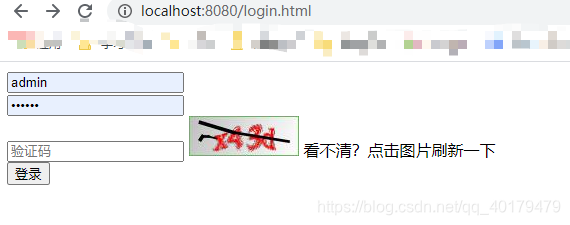

## Spring Security 认证流程

### 认证流程

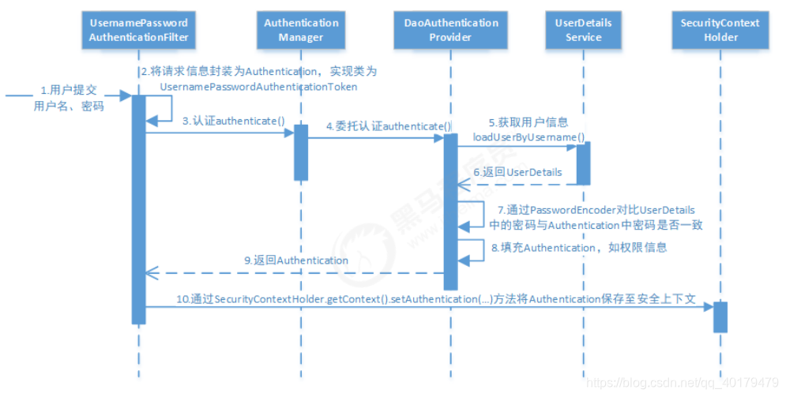
图片来自于：黑马程序员 SpringSecurity 认证课程

认证过程：

1. 用户提交用户名、密码被 SecurityFilterChain 中的 UsernamePasswordAuthenticationFilter 过滤器获取到，封装为请求 Authentication，通常情况下是 UsernamePasswordAuthenticationToken 这个实现类。
2. 然后过滤器将 Authentication 提交至认证管理器（AuthenticationManager）进行认证
3. 认证成功后， AuthenticationManager 身份管理器返回一个被填充满了信息的（包括上面提到的权限信息，身份信息，细节信息，但密码通常会被移除） Authentication 实例。
4. SecurityContextHolder 安全上下文容器将第 3 步填充了信息的 Authentication ，通过 SecurityContextHolder.getContext().setAuthentication(…)方法，设置到其中。可以看出 AuthenticationManager 接口（认证管理器）是认证相关的核心接口，也是发起认证的出发点，它
   的实现类为 ProviderManager。而 Spring Security 支持多种认证方式，因此 ProviderManager 维护着一个
   `List<AuthenticationProvider>` 列表，存放多种认证方式，最终实际的认证工作是由
   AuthenticationProvider 完成的。咱们知道 web 表单的对应的 AuthenticationProvider 实现类为
   DaoAuthenticationProvider，它的内部又维护着一个 UserDetailsService 负责 UserDetails 的获取。最终
   AuthenticationProvider 将 UserDetails 填充至 Authentication。
   认证核心组件的大体关系如下：
   ![[外链图片转存失败,源站可能有防盗链机制,建议将图片保存下来直接上传(img-Eg2sjTq4-1599134067449)(F7BB8422DBB94B699003912F92800ECA)]](https://i-blog.csdnimg.cn/blog_migrate/b30287dd4244521f00bc3c40abe4d33e.png#pic_center)
   图片来自于：黑马程序员 SpringSecurity 认证课程

### 知识点认识

#### Authentication

我们所面对的系统中的用户，在 Spring Security 中被称为主体（principal）。主体包含了所有能够经过验证而获得系统访问权限的用户、设备或其他系统。主体的概念实际上来自 Java Security,Spring Security 通过一层包装将其定义为一个 Authentication。

```java
public interface Authentication extends Principal, Serializable {
    // 获取主体授权列表
    Collection<? extends GrantedAuthority> getAuthorities();

    // 获取主体凭证，一般为密码
    Object getCredentials();

    // 获取主体携带的详细信息
    Object getDetails();

    // 获取主体，通常为username
    Object getPrincipal();

    // 获取当前主体是否认证成功
    boolean isAuthenticated();

    // 设置当前主体是否认证成功状态
    void setAuthenticated(boolean var1) throws IllegalArgumentException;
}

```

#### AuthenticateProvider

Spring Security 认证的过程其实就是一个构建 Authentication 的过程。Authentication 在 Spring Security 的各个 AuthenticationProvider 中流动，AuthenticationProvider 被 Spring Security 定义为一个验证过程：

```java
public interface AuthenticationProvider {
    // 验证完成，成功，返回一个验证完成的Authentication
    Authentication authenticate(Authentication var1) throws AuthenticationException;

    // 是否支持验证当前的Authentication类型
    boolean supports(Class<?> var1);
}

```

> 大部分场景下身份验证都是基于用户名和密码进行的，所以 Spring Security 提供了一个 UsernamePasswordAuthenticationToken 用于代指这一类证。，每一个登录用户即主体都被包装为一个 UsernamePasswordAuthenticationToken，从而在 Spring Security 的各个 AuthenticationProvider 中流动。

#### ProviderManager

一次完整的认证可以包含多个 AuthenticationProvider，一般由 ProviderManager 管理。

```java
public class ProviderManager implements AuthenticationManager, MessageSourceAware, InitializingBean {
    private static final Log logger = LogFactory.getLog(ProviderManager.class);
    private AuthenticationEventPublisher eventPublisher;

    // AuthenticationProvider 列表
    private List<AuthenticationProvider> providers;
    protected MessageSourceAccessor messages;
    private AuthenticationManager parent;
    private boolean eraseCredentialsAfterAuthentication;

    public ProviderManager(List<AuthenticationProvider> providers) {
        this(providers, (AuthenticationManager)null);
    }

    public ProviderManager(List<AuthenticationProvider> providers, AuthenticationManager parent) {
        this.eventPublisher = new ProviderManager.NullEventPublisher();
        this.providers = Collections.emptyList();
        this.messages = SpringSecurityMessageSource.getAccessor();
        this.eraseCredentialsAfterAuthentication = true;
        Assert.notNull(providers, "providers list cannot be null");
        this.providers = providers;
        this.parent = parent;
        this.checkState();
    }

    public void afterPropertiesSet() {
        this.checkState();
    }

    private void checkState() {
        if (this.parent == null && this.providers.isEmpty()) {
            throw new IllegalArgumentException("A parent AuthenticationManager or a list of AuthenticationProviders is required");
        }
    }

    // 迭代AuthenticationProvider 列表，进行认证，返回最终结果
    public Authentication authenticate(Authentication authentication) throws AuthenticationException {
        Class<? extends Authentication> toTest = authentication.getClass();
        AuthenticationException lastException = null;
        AuthenticationException parentException = null;
        Authentication result = null;
        Authentication parentResult = null;
        boolean debug = logger.isDebugEnabled();
        Iterator var8 = this.getProviders().iterator();

        // 迭代
        while(var8.hasNext()) {
            AuthenticationProvider provider = (AuthenticationProvider)var8.next();
            // 判断AuthenticationProvider 是否支持当前验证
            if (provider.supports(toTest)) {
                if (debug) {
                    logger.debug("Authentication attempt using " + provider.getClass().getName());
                }

                try {
                    // 执行AuthenticationProvider的认证。
                    result = provider.authenticate(authentication);
                    if (result != null) {
                        this.copyDetails(authentication, result);
                        // 有一个验证通过，就返回
                        break;
                    }
                } catch (InternalAuthenticationServiceException | AccountStatusException var13) {
                    this.prepareException(var13, authentication);
                    throw var13;
                } catch (AuthenticationException var14) {
                    lastException = var14;
                }
            }
        }

        if (result == null && this.parent != null) {
            try {
                result = parentResult = this.parent.authenticate(authentication);
            } catch (ProviderNotFoundException var11) {
            } catch (AuthenticationException var12) {
                parentException = var12;
                lastException = var12;
            }
        }

        if (result != null) {
            if (this.eraseCredentialsAfterAuthentication && result instanceof CredentialsContainer) {
                ((CredentialsContainer)result).eraseCredentials();
            }

            if (parentResult == null) {
                this.eventPublisher.publishAuthenticationSuccess(result);
            }

            return result;
        } else {
            if (lastException == null) {
                lastException = new ProviderNotFoundException(this.messages.getMessage("ProviderManager.providerNotFound", new Object[]{toTest.getName()}, "No AuthenticationProvider found for {0}"));
            }

            if (parentException == null) {
                this.prepareException((AuthenticationException)lastException, authentication);
            }

            throw lastException;
        }
    }

    private void prepareException(AuthenticationException ex, Authentication auth) {
        this.eventPublisher.publishAuthenticationFailure(ex, auth);
    }

    private void copyDetails(Authentication source, Authentication dest) {
        if (dest instanceof AbstractAuthenticationToken && dest.getDetails() == null) {
            AbstractAuthenticationToken token = (AbstractAuthenticationToken)dest;
            token.setDetails(source.getDetails());
        }

    }

    public List<AuthenticationProvider> getProviders() {
        return this.providers;
    }

    public void setMessageSource(MessageSource messageSource) {
        this.messages = new MessageSourceAccessor(messageSource);
    }

    public void setAuthenticationEventPublisher(AuthenticationEventPublisher eventPublisher) {
        Assert.notNull(eventPublisher, "AuthenticationEventPublisher cannot be null");
        this.eventPublisher = eventPublisher;
    }

    public void setEraseCredentialsAfterAuthentication(boolean eraseSecretData) {
        this.eraseCredentialsAfterAuthentication = eraseSecretData;
    }

    public boolean isEraseCredentialsAfterAuthentication() {
        return this.eraseCredentialsAfterAuthentication;
    }

    private static final class NullEventPublisher implements AuthenticationEventPublisher {
        private NullEventPublisher() {
        }

        public void publishAuthenticationFailure(AuthenticationException exception, Authentication authentication) {
        }

        public void publishAuthenticationSuccess(Authentication authentication) {
        }
    }
}

```

### 自定义 AuthenticationProvider

Spring Security 提供了多种常见的认证技术，包括但不限于以下几种：

- HTTP 层面的认证技术，包括 HTTP 基本认证和 HTTP 摘要认证两种。
- 基于 LDAP 的认证技术（Lightweight Directory Access Protocol，轻量目录访问协议）。
- 聚焦于证明用户身份的 OpenID 认证技术。
- 聚焦于授权的 OAuth 认证技术。
- 系统内维护的用户名和密码认证技术。
  其中，使用最为广泛的是由系统维护的用户名和密码认证技术，通常会涉及数据库访问。为了更好地按需定制，Spring Security 并没有直接糅合整个认证过程，而是提供了一个抽象的 AuthenticationProvider，AbstractUserDetailsAuthenticationProvider:

```java
public abstract class AbstractUserDetailsAuthenticationProvider implements AuthenticationProvider, InitializingBean, MessageSourceAware {
    protected final Log logger = LogFactory.getLog(this.getClass());
    protected MessageSourceAccessor messages = SpringSecurityMessageSource.getAccessor();
    private UserCache userCache = new NullUserCache();
    private boolean forcePrincipalAsString = false;
    protected boolean hideUserNotFoundExceptions = true;
    private UserDetailsChecker preAuthenticationChecks = new AbstractUserDetailsAuthenticationProvider.DefaultPreAuthenticationChecks();
    private UserDetailsChecker postAuthenticationChecks = new AbstractUserDetailsAuthenticationProvider.DefaultPostAuthenticationChecks();
    private GrantedAuthoritiesMapper authoritiesMapper = new NullAuthoritiesMapper();

    public AbstractUserDetailsAuthenticationProvider() {
    }

    // 附件认证过程
    protected abstract void additionalAuthenticationChecks(UserDetails var1, UsernamePasswordAuthenticationToken var2) throws AuthenticationException;

    public final void afterPropertiesSet() throws Exception {
        Assert.notNull(this.userCache, "A user cache must be set");
        Assert.notNull(this.messages, "A message source must be set");
        this.doAfterPropertiesSet();
    }

    // 主体认证过程
    public Authentication authenticate(Authentication authentication) throws AuthenticationException {
        Assert.isInstanceOf(UsernamePasswordAuthenticationToken.class, authentication, () -> {
            return this.messages.getMessage("AbstractUserDetailsAuthenticationProvider.onlySupports", "Only UsernamePasswordAuthenticationToken is supported");
        });
        String username = authentication.getPrincipal() == null ? "NONE_PROVIDED" : authentication.getName();
        boolean cacheWasUsed = true;
        UserDetails user = this.userCache.getUserFromCache(username);
        if (user == null) {
            cacheWasUsed = false;

            try {
                // 先检索用户
                user = this.retrieveUser(username, (UsernamePasswordAuthenticationToken)authentication);
            } catch (UsernameNotFoundException var6) {
                this.logger.debug("User '" + username + "' not found");
                if (this.hideUserNotFoundExceptions) {
                    throw new BadCredentialsException(this.messages.getMessage("AbstractUserDetailsAuthenticationProvider.badCredentials", "Bad credentials"));
                }

                throw var6;
            }

            Assert.notNull(user, "retrieveUser returned null - a violation of the interface contract");
        }

        try {
            // 认证前检查，检查账号是否可用
            this.preAuthenticationChecks.check(user);
            // 执行附加认证
            this.additionalAuthenticationChecks(user, (UsernamePasswordAuthenticationToken)authentication);
        } catch (AuthenticationException var7) {
            if (!cacheWasUsed) {
                throw var7;
            }
            cacheWasUsed = false;
            user = this.retrieveUser(username, (UsernamePasswordAuthenticationToken)authentication);
            this.preAuthenticationChecks.check(user);
            this.additionalAuthenticationChecks(user, (UsernamePasswordAuthenticationToken)authentication);
        }
        // 认证后检查，一般是检查账号密码是否过期
        this.postAuthenticationChecks.check(user);
        if (!cacheWasUsed) {
            this.userCache.putUserInCache(user);
        }

        Object principalToReturn = user;
        if (this.forcePrincipalAsString) {
            principalToReturn = user.getUsername();
        }

        // 返回一个认证通过的Authentication
        return this.createSuccessAuthentication(principalToReturn, authentication, user);
    }

    protected Authentication createSuccessAuthentication(Object principal, Authentication authentication, UserDetails user) {
        UsernamePasswordAuthenticationToken result = new UsernamePasswordAuthenticationToken(principal, authentication.getCredentials(), this.authoritiesMapper.mapAuthorities(user.getAuthorities()));
        result.setDetails(authentication.getDetails());
        return result;
    }

    protected void doAfterPropertiesSet() throws Exception {
    }

    public UserCache getUserCache() {
        return this.userCache;
    }

    public boolean isForcePrincipalAsString() {
        return this.forcePrincipalAsString;
    }

    public boolean isHideUserNotFoundExceptions() {
        return this.hideUserNotFoundExceptions;
    }

    // 检索用户
    protected abstract UserDetails retrieveUser(String var1, UsernamePasswordAuthenticationToken var2) throws AuthenticationException;

    public void setForcePrincipalAsString(boolean forcePrincipalAsString) {
        this.forcePrincipalAsString = forcePrincipalAsString;
    }

    public void setHideUserNotFoundExceptions(boolean hideUserNotFoundExceptions) {
        this.hideUserNotFoundExceptions = hideUserNotFoundExceptions;
    }

    public void setMessageSource(MessageSource messageSource) {
        this.messages = new MessageSourceAccessor(messageSource);
    }

    public void setUserCache(UserCache userCache) {
        this.userCache = userCache;
    }

    // 此认证支持UsernamePasswordAuthenticationToken及其衍生类认证
    public boolean supports(Class<?> authentication) {
        return UsernamePasswordAuthenticationToken.class.isAssignableFrom(authentication);
    }

    protected UserDetailsChecker getPreAuthenticationChecks() {
        return this.preAuthenticationChecks;
    }

    public void setPreAuthenticationChecks(UserDetailsChecker preAuthenticationChecks) {
        this.preAuthenticationChecks = preAuthenticationChecks;
    }

    protected UserDetailsChecker getPostAuthenticationChecks() {
        return this.postAuthenticationChecks;
    }

    public void setPostAuthenticationChecks(UserDetailsChecker postAuthenticationChecks) {
        this.postAuthenticationChecks = postAuthenticationChecks;
    }

    public void setAuthoritiesMapper(GrantedAuthoritiesMapper authoritiesMapper) {
        this.authoritiesMapper = authoritiesMapper;
    }

    private class DefaultPostAuthenticationChecks implements UserDetailsChecker {
        private DefaultPostAuthenticationChecks() {
        }

        public void check(UserDetails user) {
            if (!user.isCredentialsNonExpired()) {
                AbstractUserDetailsAuthenticationProvider.this.logger.debug("User account credentials have expired");
                throw new CredentialsExpiredException(AbstractUserDetailsAuthenticationProvider.this.messages.getMessage("AbstractUserDetailsAuthenticationProvider.credentialsExpired", "User credentials have expired"));
            }
        }
    }

    private class DefaultPreAuthenticationChecks implements UserDetailsChecker {
        private DefaultPreAuthenticationChecks() {
        }

        public void check(UserDetails user) {
            if (!user.isAccountNonLocked()) {
                AbstractUserDetailsAuthenticationProvider.this.logger.debug("User account is locked");
                throw new LockedException(AbstractUserDetailsAuthenticationProvider.this.messages.getMessage("AbstractUserDetailsAuthenticationProvider.locked", "User account is locked"));
            } else if (!user.isEnabled()) {
                AbstractUserDetailsAuthenticationProvider.this.logger.debug("User account is disabled");
                throw new DisabledException(AbstractUserDetailsAuthenticationProvider.this.messages.getMessage("AbstractUserDetailsAuthenticationProvider.disabled", "User is disabled"));
            } else if (!user.isAccountNonExpired()) {
                AbstractUserDetailsAuthenticationProvider.this.logger.debug("User account is expired");
                throw new AccountExpiredException(AbstractUserDetailsAuthenticationProvider.this.messages.getMessage("AbstractUserDetailsAuthenticationProvider.expired", "User account has expired"));
            }
        }
    }
}
```

在 AbstractUserDetailsAuthenticationProvider 中实现了基本的认证流程，通过继承 AbstractUserDetailsAuthenticationProvider，并实现 retrieveUser 和 additionalAuthenticationChecks 两个抽象方法即可自定义核心认证过程，灵活性非常高。示例，Spring Security 用于处理 UsernamePasswordAuthenticationToken 的 DaoAuthenticationProvider:

```java
public class DaoAuthenticationProvider extends AbstractUserDetailsAuthenticationProvider {
    private static final String USER_NOT_FOUND_PASSWORD = "userNotFoundPassword";
    // 密码加密
    private PasswordEncoder passwordEncoder;
    private volatile String userNotFoundEncodedPassword;

    // UserDetailsService 用来获取用户信息
    private UserDetailsService userDetailsService;
    private UserDetailsPasswordService userDetailsPasswordService;

    public DaoAuthenticationProvider() {
        this.setPasswordEncoder(PasswordEncoderFactories.createDelegatingPasswordEncoder());
    }

    // 添加附加认证
    @Override
    protected void additionalAuthenticationChecks(UserDetails userDetails, UsernamePasswordAuthenticationToken authentication) throws AuthenticationException {
        if (authentication.getCredentials() == null) {
            this.logger.debug("Authentication failed: no credentials provided");
            throw new BadCredentialsException(this.messages.getMessage("AbstractUserDetailsAuthenticationProvider.badCredentials", "Bad credentials"));
        } else {
            String presentedPassword = authentication.getCredentials().toString();
            // 密码对比判断
            if (!this.passwordEncoder.matches(presentedPassword, userDetails.getPassword())) {
                this.logger.debug("Authentication failed: password does not match stored value");
                throw new BadCredentialsException(this.messages.getMessage("AbstractUserDetailsAuthenticationProvider.badCredentials", "Bad credentials"));
            }
        }
    }

    protected void doAfterPropertiesSet() {
        Assert.notNull(this.userDetailsService, "A UserDetailsService must be set");
    }

    // 获取用户
    @Override
    protected final UserDetails retrieveUser(String username, UsernamePasswordAuthenticationToken authentication) throws AuthenticationException {
        this.prepareTimingAttackProtection();

        try {
            UserDetails loadedUser = this.getUserDetailsService().loadUserByUsername(username);
            if (loadedUser == null) {
                throw new InternalAuthenticationServiceException("UserDetailsService returned null, which is an interface contract violation");
            } else {
                return loadedUser;
            }
        } catch (UsernameNotFoundException var4) {
            this.mitigateAgainstTimingAttack(authentication);
            throw var4;
        } catch (InternalAuthenticationServiceException var5) {
            throw var5;
        } catch (Exception var6) {
            throw new InternalAuthenticationServiceException(var6.getMessage(), var6);
        }
    }

    protected Authentication createSuccessAuthentication(Object principal, Authentication authentication, UserDetails user) {
        boolean upgradeEncoding = this.userDetailsPasswordService != null && this.passwordEncoder.upgradeEncoding(user.getPassword());
        if (upgradeEncoding) {
            String presentedPassword = authentication.getCredentials().toString();
            String newPassword = this.passwordEncoder.encode(presentedPassword);
            user = this.userDetailsPasswordService.updatePassword(user, newPassword);
        }

        return super.createSuccessAuthentication(principal, authentication, user);
    }

    private void prepareTimingAttackProtection() {
        if (this.userNotFoundEncodedPassword == null) {
            this.userNotFoundEncodedPassword = this.passwordEncoder.encode("userNotFoundPassword");
        }

    }

    private void mitigateAgainstTimingAttack(UsernamePasswordAuthenticationToken authentication) {
        if (authentication.getCredentials() != null) {
            String presentedPassword = authentication.getCredentials().toString();
            this.passwordEncoder.matches(presentedPassword, this.userNotFoundEncodedPassword);
        }

    }

    public void setPasswordEncoder(PasswordEncoder passwordEncoder) {
        Assert.notNull(passwordEncoder, "passwordEncoder cannot be null");
        this.passwordEncoder = passwordEncoder;
        this.userNotFoundEncodedPassword = null;
    }

    protected PasswordEncoder getPasswordEncoder() {
        return this.passwordEncoder;
    }

    public void setUserDetailsService(UserDetailsService userDetailsService) {
        this.userDetailsService = userDetailsService;
    }

    protected UserDetailsService getUserDetailsService() {
        return this.userDetailsService;
    }

    public void setUserDetailsPasswordService(UserDetailsPasswordService userDetailsPasswordService) {
        this.userDetailsPasswordService = userDetailsPasswordService;
    }
}
```

### UserDetailsService

道 DaoAuthenticationProvider 处理了 web 表单的认证逻辑，认证成功后既得到一个 Authentication(UsernamePasswordAuthenticationToken 实现)，里面包含了身份信息（Principal）。  
这个身份信息就是一个 Object，大多数情况下它可以被强转为 UserDetails 对象。DaoAuthenticationProvider 中包含了一个 UserDetailsService 实例，它负责根据用户名提取用户信息 UserDetails(包含密码)。

而后 DaoAuthenticationProvider 会去对比 UserDetailsService 提取的用户密码与用户提交的密码是否匹配作为认证成功的关键依据。

因此可以通过将自定义的 UserDetailsService 公开为 spring bean 来定义自定义身份验证。

```java
public interface UserDetailsService {
    UserDetails loadUserByUsername(String username) throws UsernameNotFoundException;
}
```

### PasswordEncoder

DaoAuthenticationProvider 认证处理器通过 UserDetailsService 获取到 UserDetails 后，它是如何与请求 Authentication 中的密码做对比呢？

在这里 Spring Security 为了适应多种多样的加密类型，又做了抽象，DaoAuthenticationProvider 通过 PasswordEncoder 接口的 matches 方法进行密码的对比，而具体的密码对比细节取决于实现：

```java
public interface PasswordEncoder {
    String encode(CharSequence var1);

    boolean matches(CharSequence var1, String var2);

    default boolean upgradeEncoding(String encodedPassword) {
        return false;
    }
}

```

而 Spring Security 提供很多内置的 PasswordEncoder，能够开箱即用，使用某种 PasswordEncoder 只需要进行如下声明即可，如下：

```java
@Bean
public PasswordEncoder passwordEncoder() {
    return  NoOpPasswordEncoder.getInstance();
}
```

## Spring Security OAtho2.0 实现 GitHub 快捷登录

### 添加依赖

```xml
        <dependency>
            <groupId>org.springframework.boot</groupId>
            <artifactId>spring-boot-starter-oauth2-client</artifactId>
        </dependency>
        <dependency>
            <groupId>org.springframework.boot</groupId>
            <artifactId>spring-boot-starter-security</artifactId>
        </dependency>
        <dependency>
            <groupId>org.springframework.boot</groupId>
            <artifactId>spring-boot-starter-web</artifactId>
        </dependency>
```

### 注册 OAuth 应用

在 GitHub 官网上注册一个新的 OAuth 应用，地址是`https://github.com/settings/applications/new`，打开页面如图所：
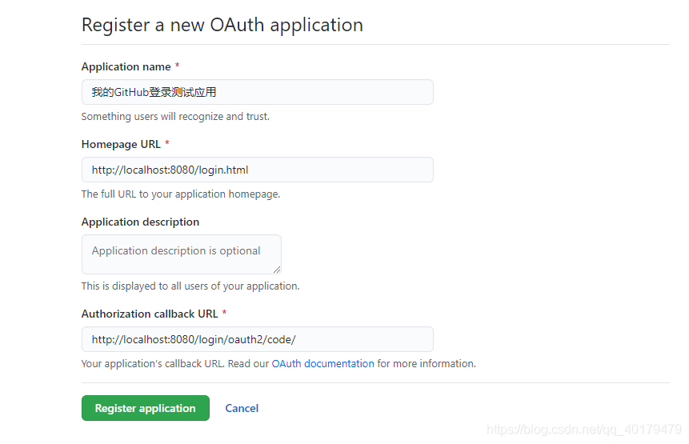

- Application name：应用名称，必填项。
- Homepage URL：主页 URL，必填项。在本地开发时，将其设置为本地登录页即可。
- Application description：应用的说明，选填项，置空即可。
- Authorization callback URL:OAuth 认证的重定向地址，必填项，本地开发环节可设置为 `http://localhost:8080/login/oauth2/code/github`。

> 当用户通过用户代理（浏览器）成功登录 GitHub，并且用户在批准页（Approva Page）授权允许注册的客户端应用访问自己的用户数据后，GitHub 会将授权码（Code）通过重定向的方式传递给客户端应用。
>
> Spring Security OAuth 默认的重定向模板是{baseUrl}/login/oauth2/code/{registrationId},registrationId 是 ClientRegistration 的唯一 ID，通常以接入的 OAuth 服务提供商的简称来命名即可，所以此处设置为 github。

单击“Register application”按钮，即可注册得到 Client ID 和 Client Secret 信息：

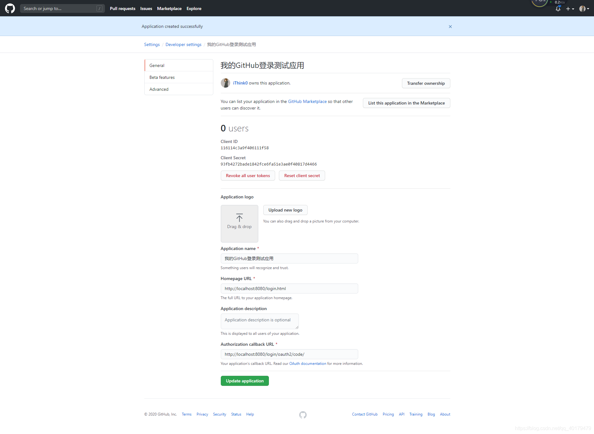

### 配置 application.yml

前面在工程的 pom 文件中引入了相关依赖包，并且在 GitHub 上成功注册了一个 OAuth 客户端应用，接下来需要在配置文件 application.yml 中增加相应配置。

```yml
spring:
  security:
    oauth2:
      client:
        registration:
          github:
            client-id: 116114c3a9f406111f58
            client-secret: 93fb4272bade1842fce6fa51e3ae0f40817d4466
```

说明：

（1）spring.security.oauth2.client.registration 是 OAuth 客户端所有属性的基础前缀。

（2）registration 下面的 github 是 ClientRegistration 的唯一 ID。

另外，client-id 和 client-secret 需要替换为前面在 GitHub 上注册得到的 clientId 和 clientSecret。

### 编写测试 controller

### 测试

（1）进入默认登录页`localhost:8080/login`，可以发现提供了 GitHub 的登陆跳转:
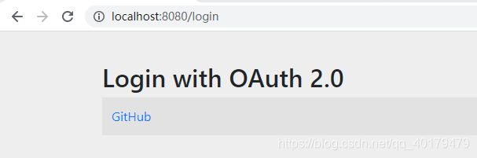

（2）点击‘GitHub’，进行认证：
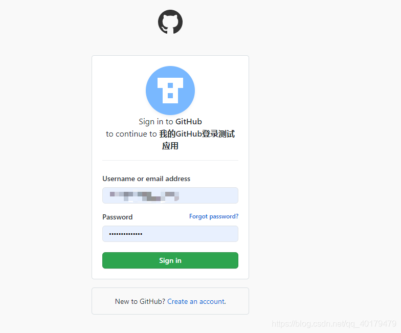

看一下浏览器地址：

```http
https://github.com/login/oauth/authorize
?response_type=code
&client_id=116114c3a9f406111f58
&scope=read:user
&state=O98bsosrtkbhhplyHbfOlXTUvd0RGzUEeOObv0xNPNo%3D
&redirect_uri=http://localhost:8080/login/oauth2/code/github
```

单击“Authorize andyzhaozhao”按钮，以允许 OAuth 客户端应用访问 GitHub 的用户数据。此时 OAuth 客户端应用会调用用户数据接口（the UserInf Endpoint），创建认证对象。

我们此时请求`localhost:8080/hello`,浏览器将打印字符串“hello,user:×××”。


