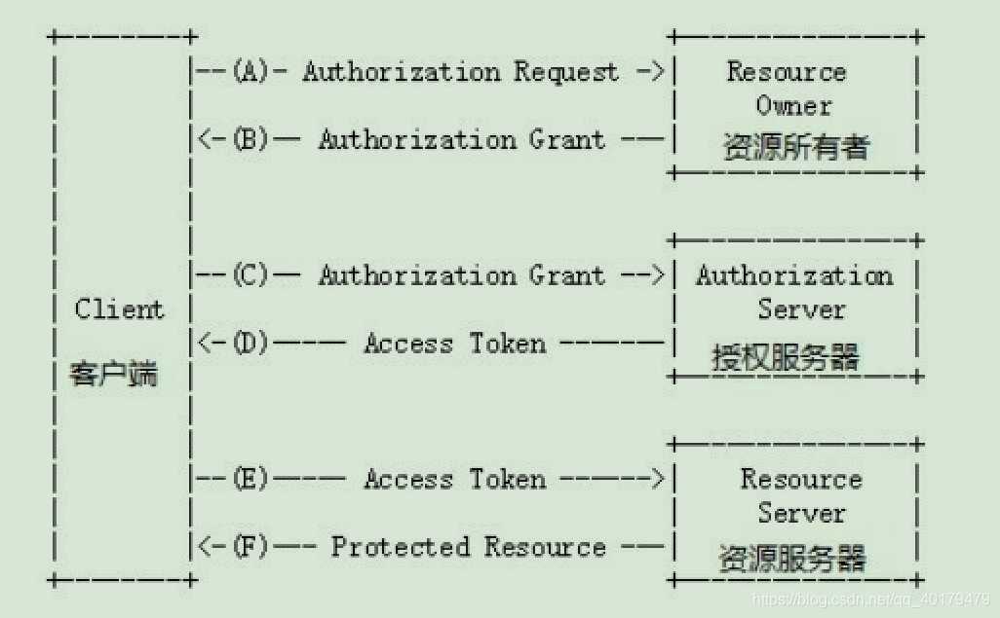
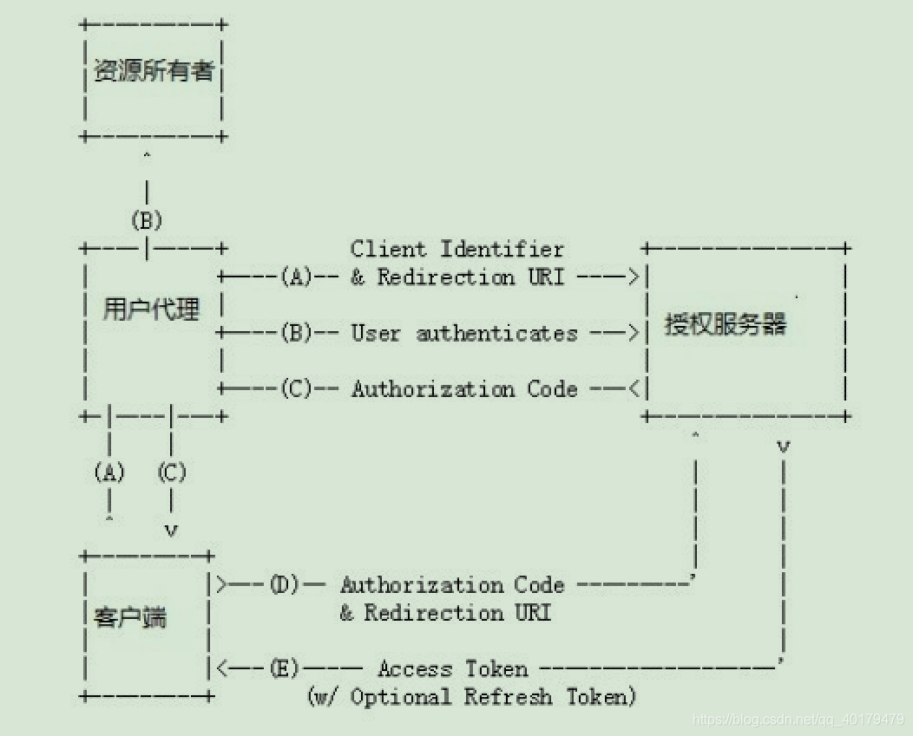
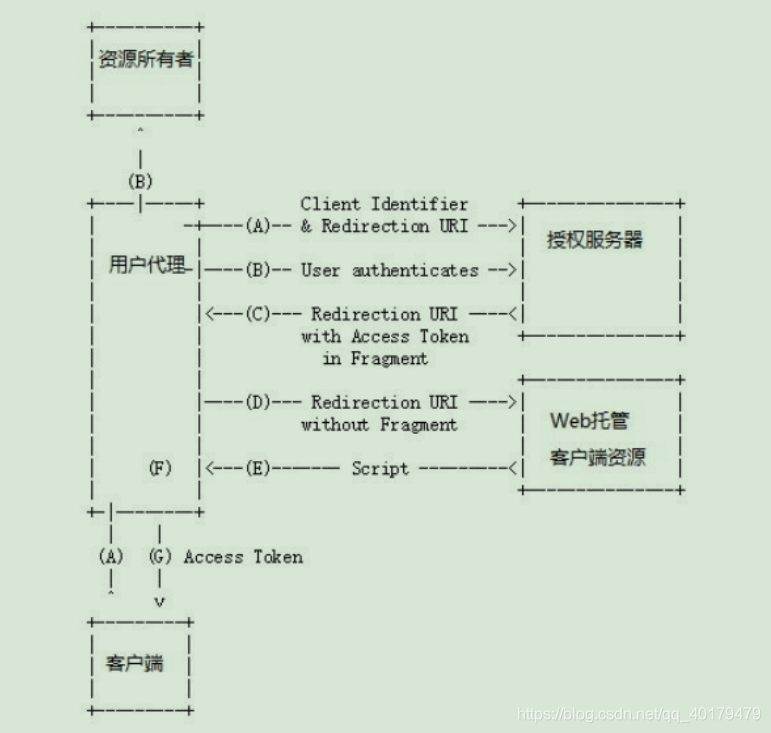
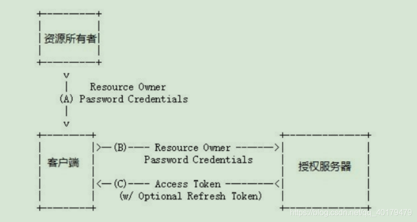
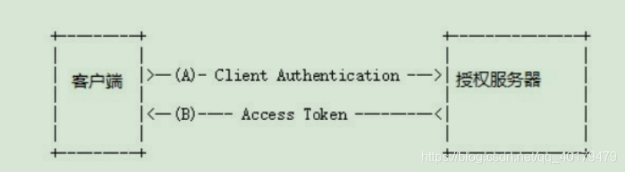

# 认识Autho2.0

## 什么是 OAuth

开放授权（Open Authorization,OAuth）是一种资源提供商用于授权第三方应用代表资源所有者获取有限访问权限的授权机制。是一个开放标准。

由于在整个授权过程中，第三方应用都无须触及用户的密码就可以取得部分资源的使用权限，所以 OAuth 是安全开放的。

由于 OAuth1.0 复杂的签名逻辑以及单一的授权流程存在较大缺陷，推出了 OAuth2.0。OAuth2.0 是 OAuth 协议的延续版本，但不向后兼容 OAuth 1.0，即完全废止了 OAuth1.0。

## OAuth2.0 的运行流程

要理解 OAuth2.0 的运行流程，则必须要认识 4 个重要的角色：

（1）Client：

客户端。要获取用户资源的第三方应用，如 CSDN 网站

（2）Resource Owner：

资源拥有者。通常为用户，也可以是应用程序，即该资源的拥有者。

（3）Resource Server:

资源服务器，指存放用户受保护资源的服务器。例如，存储 QQ 用户基本信息的服务器，充当的便是资源服务器的
角色。

（4）Authorization Server：

授权服务器（也称认证服务器）。用于验证资源所有者，并在验证成功之后向客户端发放相关访问令牌。例如，QQ 授权登录服务器。

下图清晰地描述了这 4 种角色是如何进行交互的：


（A）客户端要求用户提供授权许可。  
（B）用户同意向客户端提供授权许可。  
（C）客户端携带用户提供的授权许可向授权服务器申请资源服务器的访问令牌。  
（D）授权服务器验证客户端及其携带的授权许可，确认有效后发放访问令牌。  
（E）客户端使用访问令牌向资源服务器申请资源。  
（F）资源服务器验证访问令牌，确认无误后向客户端提供资源。

在这个流程中，B 步骤是最为关键的一步，OAuth2.0 定义了 4 种授权模式，用于将用户的授权许可提供给客户端：

- 授权码模式（Authorization Code）
- 隐式授权模式（Implicit）
- 密码授权模式（Password Credentials）
- 客户端授权模式（Client Credentials）

## 授权码模式（Authentication Code）

授权码模式是功能最完整、流程最严密的授权模式，它将用户引导到授权服务器进行身份验证，授权服务器将发放的访问令牌传递给客户端。

授权码模式交互图：


（A）资源拥有者打开客户端，客户端要求资源拥有者给予授权，通过用户代理（如：浏览器）被重定向到授权服务器，重定向时会附加客户端的身份信息：

```plain
/uaa/oauth/authorize?
client_id=c1
&response_type=code
&scope=all
&redirect_uri=http://www.baidu.com
```

- client_id ：指客户端 ID,是客户端准入标识，为必填项。
- response_type ：指授权类型，必填项。授权码模式值为 code。
- scope ：客户端权限范围。
- redirect_uri ：授权通过后的重定向 URL，授权服务器将在用户登录完成之后重定向到此地址，并在后边带上 code 参数（授权码）。

（B）浏览器出现向授权服务器授权页面，之后将用户同意授权。

（C）授权服务器将授权码（Authorization Code）转经浏览器发送给 client(通过 redirect_uri)

（D）客户端拿着授权码向授权服务器索要访问 access_token，请求示例如下：

```plain
/uaa/oauth/token?
client_id=c1
&client_secret=secret
&grant_type=authorization_code
&code=5PgfcD
&redirect_uri=http://www.baidu.com
```

参数列表如下：

- client_id ：客户端准入标识。
- client_secret ：客户端秘钥。
- grant_type ：授权类型，填写 authorization_code，表示授权码模式
- code ：授权码，就是刚刚获取的授权码，注意：授权码只使用一次就无效了，需要重新申请。
- redirect_uri ：申请授权码时的跳转 url，一定和申请授权码时用的 redirect_uri 一致。

（E）授权服务器返回令牌(access_token)。

这种模式是四种模式中最安全的一种模式。一般用于 client 是 Web 服务器端应用或第三方的原生 App 调用资源服务的时候。因为在这种模式中 access_token 不会经过浏览器或移动端的 App，而是直接从服务端去交换，这样就最大限度的减小了令牌泄漏的风险。

## 隐式授权模式（Implicit）

隐式授权模式（Implicit）也称简易模式。与授权码模式相比，用户的登录环节是一样的，只是在授权成功之后的重定向上，授权码模式是携带一个认证码，由客户端（第三方应用后端程序）通过认证码申请访问令牌的；而隐式授权模式则
直接将访问令牌作为 URL 的散列部分传递给浏览器。



（A）资源拥有者打开客户端，客户端要求资源拥有者给予授权，它将浏览器被重定向到授权服务器，重定向时会附加客户端的身份信息。如：

```plain
/uaa/oauth/authorize?
client_id=c1
&response_type=token
&scope=all
&redirect_uri=http://www.baidu.com
```

参数描述同授权码模式 ，注意 response_type=token，说明是简化模式。

（B）浏览器出现向授权服务器授权页面，之后将用户同意授权。

（C）授权服务器将授权码将令牌（access_token）以 Hash 的形式存放在重定向 uri 的 fargment 中发送给浏览器。

> 注：fragment 主要是用来标识 URI 所标识资源里的某个资源，在 URI 的末尾通过 （#）作为 fragment 的开头，
> 其中 # 不属于 fragment 的值。如 `https://domain/index#L18` 这个 URI 中 L18 就是 fragment 的值。大家只需要
> 知道 js 通过响应浏览器地址栏变化的方式能获取到 fragment 就行了。

在 OAuth 标准实现中，隐式授权模式在重定向时也会携带若干个参数，包括 access_token，即最关键的访问令牌；expire_in，指该访问令牌在多少秒后过期；state，指客户端的状态参数。

客户端页面可以使用 JavaScript 获取该散列值。

```javascript
var hash = windows.location.hash;
```

一般来说，简化模式用于没有服务器端的第三方单页面应用，因为没有服务器端就无法接收授权码。

## 密码授权模式（Password Credentials）

顾名思义，就是客户端直接携带用户的密码向授权服务器申请令牌。这种登录操作不再像前两种授权模式一样跳转到授权服务器进行，而是由客户端提供专用面。

如果用户信任该客户端（通常为信誉度高的著名公司），用户便可以直接提供密码，客户端在不储存用户密码的前提下完成令牌的申请。

密码授权模式的完整运行流程:



（A）资源拥有者将用户名、密码发送给客户端。

（B）客户端拿着资源拥有者的用户名、密码向授权服务器请求令牌（access_token），请求示例如下：

```plain
/uaa/oauth/token?
client_id=c1
&client_secret=secret
&grant_type=password
&username=shangsan
&password=123
```

参数列表如下：

- client_id ：客户端准入标识。
- client_secret ：客户端秘钥。
- grant_type ：授权类型，填写 password 表示密码模式
- username ：资源拥有者用户名。
- password ：资源拥有者密码。

（C）授权服务器将令牌（access_token）发送给客户端。

这种模式十分简单，但是却意味着直接将用户敏感信息泄漏给了 client，因此这就说明这种模式只能用于 client 是我们自己开发的情况下。因此密码模式一般用于我们自己开发的，第一方原生 App 或第一方单页面应用。

## 客户端授权模式（Client Credentials）

客户端授权模式实际上并不属于 OAuth 的范畴，因为它的关注点不再是用户的私有信息或数据，而是一些由资源服务器持有但并非完全公开的数据，如微信的公众平台授权等。

客户端授权模式通常由客户端提前向授权服务器申请应用公钥、密钥，并通过这些关键信息向授权服务器申请访问令牌，从而得到资源服务器提供的资源。



（A）客户端向授权服务器发送自己的身份信息，并请求令牌（access_token）。

（B）确认客户端身份无误后，将令牌（access_token）发送给 client，请求如下:

```plain
/uaa/oauth/token?
client_id=c1
&client_secret=secret
&grant_type=client_credentials
```

参数列表如下：

- client_id ：客户端准入标识。
- client_secret ：客户端秘钥。
- grant_type ：授权类型，填写 client_credentials 表示客户端模式
