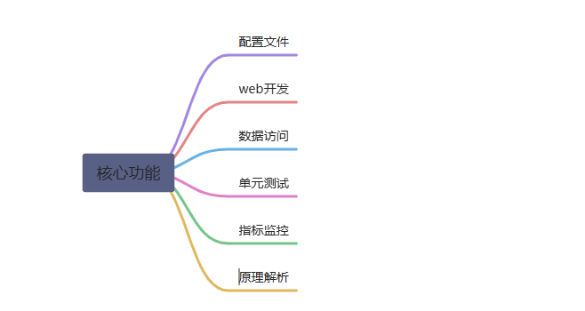

# lfy系列-springboot2

## 第一季：SpringBoot2 核心技术-基础入门

### 学习要求

- 熟悉 Spring 基础

- 熟悉 Maven 使用

### 环境要求

- Java8 及以上

- Maven 3.3 及以上：https://docs.spring.io/spring-boot/docs/current/reference/html/getting-started.html#getting-started-system-requirements

学习资料

- 文档地址： https://www.yuque.com/atguigu/springboot 文档不支持 IE、Edge 浏览器，请使用 chrome 或者 firefox

- 视频地址： http://www.gulixueyuan.com/

- 源码地址：https://gitee.com/leifengyang/springboot2

## 第一季：SpringBoot2 核心技术-核心功能

[leifengyang · 语雀](https://www.yuque.com/leifengyang)
