# RabbitMQ 安装

## Docker 安装RabbitMQ

### 下载镜像

进入docker hub镜像仓库地址：https://hub.docker.com/

搜索rabbitMq，进入官方的镜像，可以看到以下几种类型的镜像；我们选择带有“mangement”的版本（包含web管理页面）；


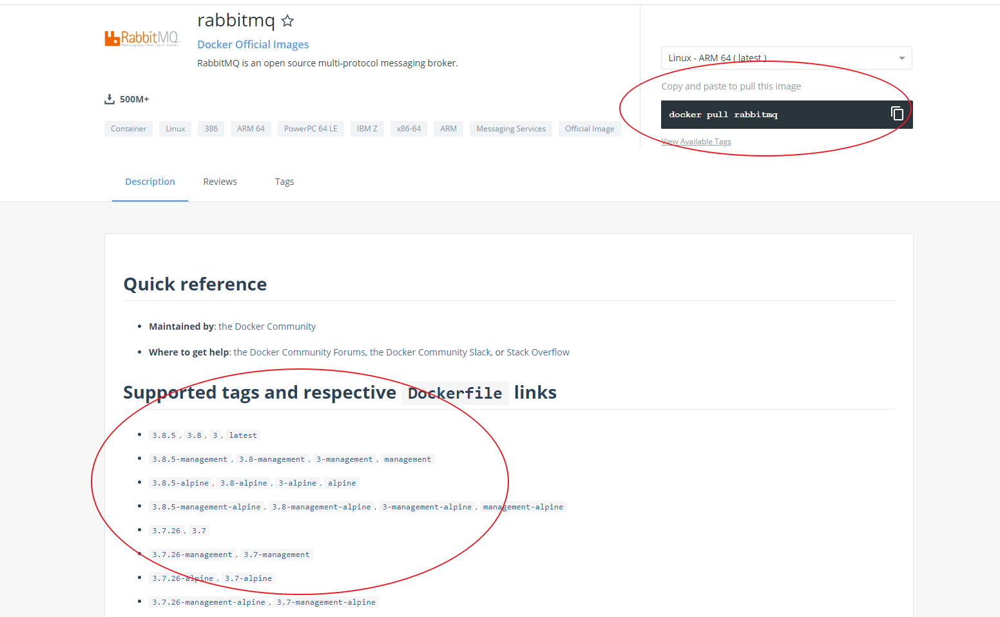


拉取镜像

docker pull rabbitmq:3.8-management

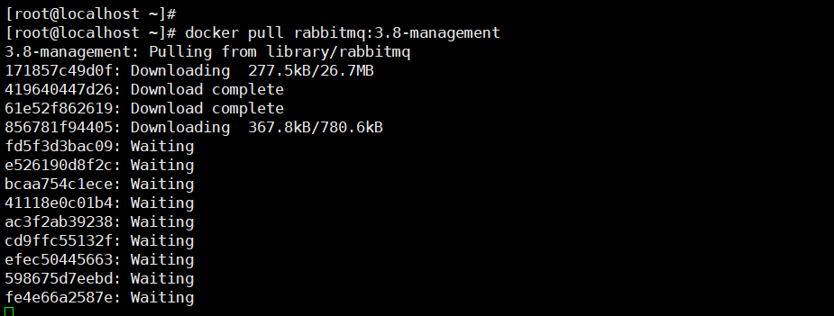

### 安装和web界面启动


\#方式一：默认guest 用户，密码也是 guest

docker run -d --hostname my-rabbit --name rabbit -p 15672:15672 -p 5672:5672 rabbitmq:3.8-managemen


\#方式二：设置用户名和密码

docker run -d 

--hostname my-rabbit 

--name rabbit

-v  /rabbitmq:/var/lib/rabbitmq 

-e RABBITMQ_DEFAULT_VHOST=my_vhost

-e RABBITMQ_DEFAULT_USER=admin

-e RABBITMQ_DEFAULT_PASS=aaaaaa

-p 15672:15672 -p 5672:5672 

rabbitmq:3.8-management


说明：

- -d 后台运行容器；
- --name 指定容器名；
- -p 指定服务运行的端口（5672：应用访问端口；15672：控制台Web端口号）；
- -v 映射目录或文件；
- --hostname 主机名（RabbitMQ的一个重要注意事项是它根据所谓的 “节点名称” 存储数据，默认为主机名）；
- -e 指定环境变量；（RABBITMQ_DEFAULT_VHOST：默认虚拟机名；RABBITMQ_DEFAULT_USER：默认的用户名；RABBITMQ_DEFAULT_PASS：默认用户名的密码）

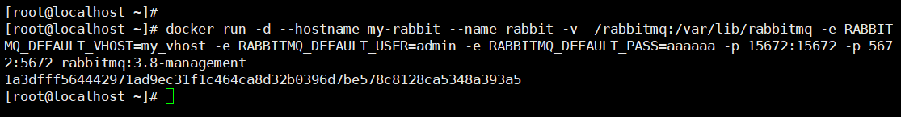

开启防火墙15672端口


firewall-cmd --zone=public --add-port=15672/tcp --permanent　　　　　　　　

firewall-cmd --reload 


打开web管理界面：[http://服务器IP:15672/](http://xn--ip-fr5c86lx7z:15672/) ，账号和密码是启动时中设置的用户和密码。

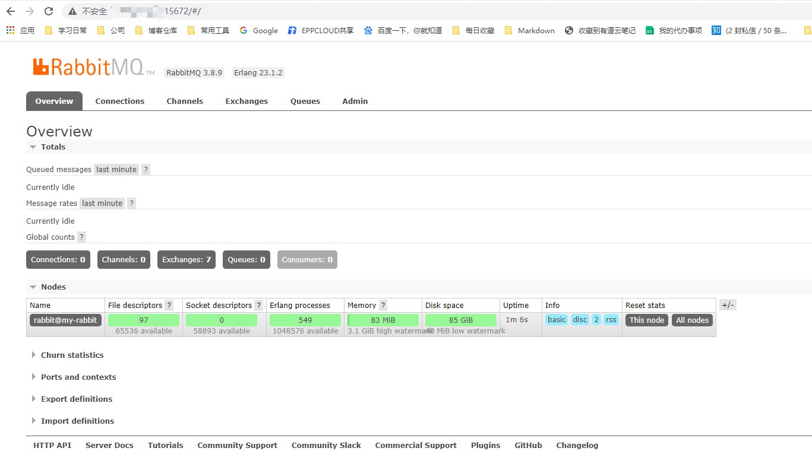

https://www.cnblogs.com/sentangle/p/13201127.html

https://registry.hub.docker.com/_/rabbitmq/


## 配置

### 添加用户


### virtual host 就相当于 数据库db

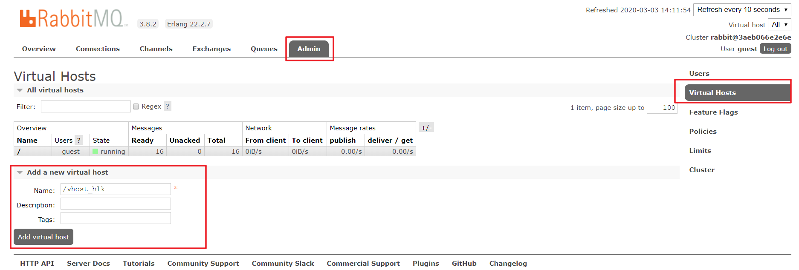

一般以/开头


### 对用户进行授权


# 简单入门

## 介绍

RabbitMQ是一个消息代理:它接受和转发消息。你可以把它想象成一个邮局:当你把你想要投寄的邮件放进邮箱时，你可以确定邮差先生或女士最终会把邮件送到你的收件人那里。在这个类比中，RabbitMQ是一个邮筒，一个邮局和一个邮递员。

RabbitMQ和邮局之间的主要区别是，它不处理纸张，而是接受、存储和转发二进制的数据消息块。

RabbitMQ和一般的消息传递使用一些术语。

### 生产者（Producer）

生产不只意味着发送。发送消息的程序是一个生产者（Producer）:


### 队列（Queue）

队列是驻留在RabbitMQ内的邮箱的名称。尽管消息流经RabbitMQ和您的应用程序，但它们只能存储在队列中。一个队列只受主机的内存和磁盘限制，它本质上是一个大的消息缓冲区。许多生产者可以将消息发送到一个队列，而许多消费者可以尝试从一个队列接收数据。这是我们如何表示一个队列:


### 消费者（Customer）

消费与接受有着相似的意义。消费者是一个程序，主要是等待接收消息:


注意，生产者、消费者和代理不必驻留在同一主机上;实际上，在大多数应用程序中，它们并没有这样做。应用程序也可以既是生产者又是消费者。


## 简单实例 Hello World

在本部分教程中，我们将用Java编写两个程序;发送单个消息的生产者和接收消息并将其打印出来的使用者。我们将忽略Java API中的一些细节，集中讨论这个非常简单的问题。这是一个信息传递的“Hello World!”。


在下面的图表中，“P”是我们的生产者，“C”是我们的消费者。中间的框是一个队列—— 一个消息缓冲区RabbitMQ代表使用者保存的。


依赖项：


```xml
<!-- https://mvnrepository.com/artifact/com.rabbitmq/amqp-client -->
<dependency>
    <groupId>com.rabbitmq</groupId>
    <artifactId>amqp-client</artifactId>
    <version>5.8.0</version>
</dependency>
```


### 发送（Sending）


我们将调用消息发布者(发送方)Send和消息使用者(接收方)Recv。发布服务器将连接到RabbitMQ，发送一条消息，然后退出。


（1）设置类并命名队列:

```java
public class RabbitMQSend {
    private final static String QUEUE_NAME = "hello";
    public static void main(String[] args) {
     ....   
    }
```


（2）然后我们可以创建一个连接到服务器

```java
public class RabbitMQSend {
    private final static String QUEUE_NAME = "hello";
    public static void main(String[] args) {
        ConnectionFactory factory = new ConnectionFactory();
        factory.setHost("localhost");
        try (Connection connection = factory.newConnection();
             Channel channel = connection.createChannel()) {
            
        } catch (TimeoutException e) {
            e.printStackTrace();
        } catch (IOException e) {
            e.printStackTrace();
        }
    }
}
```

连接抽象套接字连接，并为我们处理协议版本协商和身份验证等。在这里，我们连接到本地机器上的代理——也就是本地主机（localhost）。如果我们想要连接到另一台机器上的代理，我们只需在这里指定它的名称或IP地址。

接下来，我们创建一个通道Channel，用于完成任务的大部分API都驻留在这个通道中。注意，我们可以使用try-with-resources语句，因为Connection和Channel都实现了java.io.Closeable。这样，我们就不需要在代码中显式地关闭它们。


（4）要发送，我们必须声明一个队列以便我们发送；然后我们可以发布一条消息到队列，所有这些都在try-with-resources语句中:

```java
channel.queueDeclare(QUEUE_NAME, false, false, false, null);
String message = "Hello World!";
channel.basicPublish("", QUEUE_NAME, null, message.getBytes());
System.out.println(" [x] Sent '" + message + "'");
```

声明队列是幂等的——只有在队列不存在时才会创建它。消息内容是一个字节数组，因此您可以对其中的任何内容进行编码。

下面是Send.class的完整代码：


```java
package com.example.messagequeueonredisdemo;

import com.rabbitmq.client.Channel;
import com.rabbitmq.client.Connection;
import com.rabbitmq.client.ConnectionFactory;

import java.io.IOException;
import java.util.concurrent.TimeoutException;

/**
 * @Desc
 * @Created By liukuihan
 * @date on 2020/3/3
 */
public class RabbitMQSend {
    private final static String QUEUE_NAME = "hello";
    public static void main(String[] args) {
        ConnectionFactory factory = new ConnectionFactory();
        factory.setHost("192.168.38.130");
        factory.setPort(5672);
        factory.setUsername("guest");
        factory.setPassword("guest");
        try (Connection connection = factory.newConnection();
             Channel channel = connection.createChannel()) {
            channel.queueDeclare(QUEUE_NAME, false, false, false, null);
            String message = "Hello World!";
            channel.basicPublish("", QUEUE_NAME, null, message.getBytes());
            System.out.println(" [x] Sent '" + message + "'");
        } catch (TimeoutException e) {
            e.printStackTrace();
        } catch (IOException e) {
            e.printStackTrace();
        }
    }
}
```


### 接收 Receiving

我们的使用者侦听来自RabbitMQ的消息，因此与发布单个消息的发布者不同，我们将保持它运行以侦听消息并将其打印出来。


额外的DefaultConsumer是一个实现消费者接口的类，我们将使用它来缓冲服务器推送给我们的消息。


设置与发布服务器相同;我们打开一个连接和一个通道，并声明我们将要使用的队列。注意，这与发送发布到的队列相匹配。


```java
public class RabbitRecv {
    private final static String QUEUE_NAME = "hello";

    public static void main(String[] argv) throws Exception {
        ConnectionFactory factory = new ConnectionFactory();
        factory.setHost("localhost");
        Connection connection = factory.newConnection();
        Channel channel = connection.createChannel();
        channel.queueDeclare(QUEUE_NAME, false, false, false, null);
        System.out.println(" [*] Waiting for messages. To exit press CTRL+C");

    }
}
```


注意，我们在这里也声明了队列。因为我们可能会在发布服务器之前启动使用者，所以我们希望在尝试使用来自它的消息之前确保队列存在。

为什么不使用try-with-resource语句来自动关闭通道和连接呢?通过这样做，我们可以简单地使程序继续前进，关闭一切，然后退出!这可能会很尴尬，因为我们希望在使用者异步侦听消息到达时，进程保持活动状态。


我们将告诉服务器将队列中的消息发送给我们。因为它将异步地推送消息，所以我们以对象的形式提供一个回调，它将缓冲消息，直到我们准备好使用它们。这就是DeliverCallback子类的作用。


```java
DeliverCallback deliverCallback = (consumerTag, delivery) -> {
    String message = new String(delivery.getBody(), "UTF-8");
    System.out.println(" [x] Received '" + message + "'");
};
channel.basicConsume(QUEUE_NAME, true, deliverCallback, consumerTag -> { });
```


完整的Recv.class代码如下：


```java
package com.example.messagequeueonredisdemo;

import com.rabbitmq.client.Channel;
import com.rabbitmq.client.Connection;
import com.rabbitmq.client.ConnectionFactory;
import com.rabbitmq.client.DeliverCallback;

/**
 * @Desc
 * @Created By liukuihan
 * @date on 2020/3/3
 */
public class RabbitRecv {
    private final static String QUEUE_NAME = "hello";

    public static void main(String[] argv) throws Exception {
        ConnectionFactory factory = new ConnectionFactory();
        factory.setHost("192.168.38.130");
        Connection connection = factory.newConnection();
        Channel channel = connection.createChannel();
        channel.queueDeclare(QUEUE_NAME, false, false, false, null);
        System.out.println(" [*] Waiting for messages. To exit press CTRL+C");
        DeliverCallback deliverCallback = (consumerTag, delivery) -> {
            String message = new String(delivery.getBody(), "UTF-8");
            System.out.println(" [x] Received '" + message + "'");
        };
        channel.basicConsume(QUEUE_NAME, true, deliverCallback, consumerTag -> { });
    }
}
```


# 工作队列（Work Queues）

在第一个教程中，我们编写了从指定队列发送和接收消息的程序。在本例中，我们将创建一个工作队列，用于在多个工作者之间分配耗时的任务。

工作队列(即任务队列)背后的主要思想是避免立即执行资源密集型任务，并且必须等待它完成。相反，我们把任务安排在以后完成。我们将任务封装为消息并将其发送到队列。在后台运行的工作进程将弹出任务并最终执行作业。当您运行许多worker时，任务将在它们之间共享。


这个概念在web应用程序中特别有用，因为在短的HTTP请求窗口中不可能处理复杂的任务


## 准备

我们使用Thread.sleep来模拟耗时的任务。现在，我们对上面“Hello World”的例子进行改造。

## 轮询调度（Round-robin dispatching）

任务队列的优点是能够很容易的进行并行工作。如果我们积压了很多工作，我们仅仅通过增加更多的workers就可以解决问题，使系统的伸缩性更加容易。


默认情况下，RabbitMQ将会发送的每一条消息按照顺序给下一个消费者。平均每一个消费者将获得相同数量的消息。这种分配方式称为轮询调度。值得注意的是，这种分配过程是一次性分配，并非一个一个分配。

更改代码：

Sender


```java
package com.example.messagequeueonredisdemo;

import com.rabbitmq.client.Channel;
import com.rabbitmq.client.Connection;
import com.rabbitmq.client.ConnectionFactory;

import java.io.IOException;
import java.util.concurrent.TimeoutException;

/**
 * @Desc
 * @Created By liukuihan
 * @date on 2020/3/3
 */
public class MQSend {
    private final static String QUEUE_NAME = "hello";
    public static void main(String[] args) throws IOException, TimeoutException {
        //创建连接仓库
        ConnectionFactory factory = new ConnectionFactory();
        //设置IP,端口号，虚拟主机，用户名和密码
        factory.setHost("192.168.38.130");
        factory.setPort(5672);
        factory.setVirtualHost("/");
        factory.setUsername("guest");
        factory.setPassword("guest");
        //创建一个连接
        Connection connection=factory.newConnection();
        //创建一个通道
        Channel channel = connection.createChannel();
        //声明指定一个队列
        channel.queueDeclare(QUEUE_NAME, false, false, false, null);
        //发送信息
        for (int i=0;i<50;i++){
            String message = "消息Hello"+i;
            channel.basicPublish("", QUEUE_NAME, null, message.getBytes());
            System.out.println("send:"+message);
        }
        System.out.println("done");

        //关闭连接
        channel.close();
        connection.close();
    }
}
```


customer:


```java
package com.example.messagequeueonredisdemo;

import com.rabbitmq.client.*;

import java.io.IOException;
import java.util.concurrent.TimeUnit;

/**
 * @Desc
 * @Created By liukuihan
 * @date on 2020/3/3
 */
public class MQCustomer01 {
    private final static String QUEUE_NAME = "hello";

    public static void main(String[] argv) throws Exception {
        //创建连接仓库
        ConnectionFactory factory = new ConnectionFactory();
        //设置连接IP,端口号，虚拟主机，用户名和密码
        factory.setHost("192.168.38.130");
        factory.setPort(5672);
        factory.setVirtualHost("/");
        factory.setUsername("guest");
        factory.setPassword("guest");
        //创建一个连接
        Connection connection = factory.newConnection();
        //创建一个通道
        Channel channel = connection.createChannel();
        //声明指定一个队列
        channel.queueDeclare(QUEUE_NAME, false, false, false, null);
        System.out.println(" [*] Waiting for messages. To exit press CTRL+C");
        //创建队列消费者
        Consumer consumer=new DefaultConsumer(channel){
            @Override
            public void handleDelivery(String consumerTag, Envelope envelope, AMQP.BasicProperties properties, byte[] body) throws IOException {
                String message =new String(body,"UTF-8");
                System.out.println("【1】："+message);
                try {
                    doWork();
                } catch (InterruptedException e) {
                    e.printStackTrace();
                }
            }
        };

        //接收信息
        Boolean autoAck=true;
        channel.basicConsume(QUEUE_NAME, true,consumer);
    }

    private static void doWork() throws InterruptedException {
        //休息1秒
        Thread.sleep(1000);
    }
}
```


首先，我们开启两个customer。然后，启动Send进行消息发送。打印结果如下

customer1：


customer2：

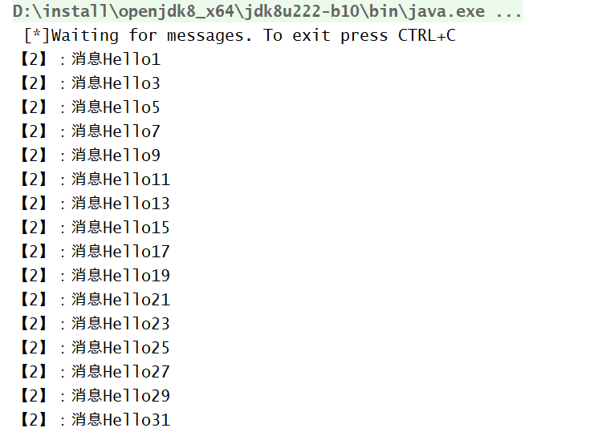

再做一个实验，我们开启3个customer，然后，启动Send进行消息发送。打印结果如下:

customer1:


customer2:


customer3:


我们发现，通过增加更多的customer就可以进行并行工作，并且接受的消息平均分配。

## 公平转发（Fair dispatch）

你可能已经注意到，目前的消息调度并非是我们想要的。例如，这样一种情况下，一个消费者将一直繁忙，另一个消费者却很快执行完任务后等待，没有任何工作。造成这样的原因，是因为RabbitMQ仅仅是当消息到达队列后进行转发消息，并不在乎有多少任务。


为了解决这样的问题，我们可以使用basicQos方法，传递参数为prefetchCount = 1。这样告诉RabbitMQ不要在同一时间给一个消费者超过一条消息。换句话说，只有在消费者空闲的时候会发送下一条信息。


设置一次值处理一条消息，限制发送给customer一次不超过一条消息：

```java
int prefetchCount = 1;
channel.basicQos(prefetchCount) ;
```


手动回执：


```java
   //创建队列消费者
        Consumer consumer=new DefaultConsumer(channel){
            @Override
            public void handleDelivery(String consumerTag, Envelope envelope, AMQP.BasicProperties properties, byte[] body) throws IOException {
                String message =new String(body,"UTF-8");
                System.out.println("【1】："+message);
                try {
                    doWork();
                    //手动应答
                    channel.basicAck(envelope.getDeliveryTag(),false);
                } catch (InterruptedException e) {
                    e.printStackTrace();
                }
            }
        };
```


自动应答改为false：

```java
// 自动应答改为false,变为手动应答
boolean autoAck = false ;
channel.basicConsume(QUEUE_NAME, autoAck, consumer);
```


## 消息应答(Message Acknowledgment)

执行一个任务需要花费几秒钟。在执行任务时发生中断。上面例子，RabbItMQ一旦给消费者发送消息，会马上从内存中移除这个信息。在这种情况下，如果杀死正在执行任务的某个Worker，我们会丢失它正在处理的信息。我们也会丢失已经转发给这个工作者且它还未执行的消息。


我们不希望丢失任何消息。当某个Worker被杀死时，我们希望将任务传递给另一个Worker。


为了保证消息永远不会丢失，RabbitMQ支持消息应答。消费者发送应答给RabbitMQ，告诉它信息已经被接收和处理，然后RabbitMQ可以自由的进行信息删除。如果消费者被杀死而没有发送应答，RabbitMQ会认为该信息没有被完全的处理，然后将会重新转发给别的消费者。通过这种方式，你可以确认信息不会被丢失，即使消者被杀死。


这种机制并没有超时时间这么一说，RabbitMQ只有在消费者连接断开时重新转发此信息。如果消费者处理一个信息需要耗费特别特别长的时间是允许的。


消息应答默认是打开的。上面的代码中我们通过显示的设置autoAsk=true关闭了这种机制。当使用消息应答，只需要设置auAsk=false即可：


```java
// 打开消息应答
boolean autoAck = false ;
channel.basicConsume(QUEUE_NAME, ack, consumer);
```


## 消息持久化（Message durability）

我们已经学会了如何确保即使消费者死了，消息也不会丢失。但是如果此时RabbitMQ服务被停止，我们的消息仍然会丢失。当RabbitMQ退出或者异常退出，将会丢失所有的队列和信息，除非你告诉它不要丢失。为了保证消息在服务停止的时候，不丢失，我们要考虑保证消息的持久化。


首先，我们需要确认RabbitMQ永远不会丢失我们的队列。为此，我们需要声明它为持久化的。


```java
//声明消息持久化
boolean durable = true;
channel.queueDeclare( QUEUE_NAME, durable, false, false, null);
```


其次，我们需要标识我们的信息为持久化的。通过设置MessageProperties值为PERSISTENT_TEXT_PLAIN：


```java
//标识发布的信息是持久化的
channel.basicPublish("", QUEUE_NAME,MessageProperties.PERSISTENT_TEXT_PLAIN,message.getBytes());
```


RabbitMQ不允许使用不同的参数重新定义一个队列，所以已经存在的队列，我们无法修改其属性。


此时，读者，可以做一个实验，我们启动Send进行消息发送，然后RabbitMQ关闭服务。再重新启动服务RabbitMQ，开启1个customer，观察输出结果，是否customer的接受到之前Send发送消息。

# 发布订阅模式(Publish-Subscribe)

在上一个教程中我们创建了一个工作队列。工作队列背后的假设是，每个任务恰好交付给一个工人。在这一部分中，我们将做一些完全不同的事情-我们将消息传达给多个消费者。这种模式称为“发布/订阅”。

为了说明这种模式，我们将构建一个简单的日志记录系统。它由两个程序组成-第一个程序将发出日志消息，第二个程序将接收并打印它们。

在我们的日志记录系统中，接收器程序的每个运行副本都将获得消息。这样，我们将能够运行一个接收器并将日志定向到磁盘。同时，我们将能够运行其他接收器并在屏幕上查看日志。

本质上，已发布的日志消息将被广播到所有接收者。

## 交换器（Exchange）

在本教程前面的部分中，我们向队列发送和接收消息。现在是时候在Rabbit中引入完整的消息传递模型了。


RabbitMQ消息传递模型的核心思想是，生产者从不直接向队列发送任何消息。实际上，通常情况下，生产者甚至根本不知道消息是否会被传递到任何队列。


相反，生产者只能向交换器发送消息。交换是一件非常简单的事情。一边接收来自生产者的消息，另一边将消息推送到队列。交换器必须确切地知道如何处理它接收到的消息。它应该被附加到一个特定的队列吗?它应该被添加到许多队列中吗?或者它应该被丢弃。


下面列出一些可用的转发器类型： Direct、Topic、Headers、Fanout。目前我们关注最后一个fanout，声明转发器类型的代码：


```java
channel.exchangeDeclare("logs", "fanout");
```


fanout 交换非常简单。正如您可能从名称中猜到的那样，它把所有接受的消息，广播到所有它所知道的队列。不过这正是我们前述的日志系统所需要的。


在上一个教程中，我们不知道转发器，但仍然能够发送消息到队列。这是因为我们使用了一个默认的转发器，我们用空的字符串（""）。

之前发送消息的代码：

```java
channel.basicPublish("", QUEUE_NAME, null, message.getBytes());
```


第一个参数表示转发器的名称，我们设置为""，第二个参数表示消息由routingKey决定发送到哪个队列。现在我们可以指定消息发送到的转发器：

```java
channel.basicPublish( "logs","", null, message.getBytes());
```


## 临时队列(Temporary Queue)


之前，我们都是使用的队列指定了一个特定的名称，我们需要指出Worker到同一个队列。不过，对于我们的日志系统而言，我们并不关心队列的名称。我们想要接收到所有的消息，而且我们也只对当前正在传递的数据的感兴趣。为了满足我们的需求，需要做两件事。


首先，每当我们连接到RabbitMQ，我们需要一个新的空的队列。要做到这一点，我们可以创建一个随机名称的队列，或者，让服务器给我们提供一个随机的名称。


其次，一旦消费者与RabbitMQ断开，消费者所接收的那个队列应该被自动删除。


Java中我们可以使用queueDeclare()方法，不传递任何参数，来创建一个非持久的、唯一的、自动删除的队列，且队列名称由服务器随机产生。


```java
String queueName = channel.queueDeclare().getQueue();
```


## 绑定（Bindings）


我们已经创建了一个fanout交换器和一个队列。现在我们需要告诉交换器将消息发送到我们的队列。交换和队列之间的关系称为绑定。


```java
channel.queueBind(queueName, "logs", "");
```


从现在开始，log交换器将向我们的队列添加消息。

## 总结


发送端：


```java
package com.example.messagequeueonredisdemo;

import com.rabbitmq.client.Channel;
import com.rabbitmq.client.Connection;
import com.rabbitmq.client.ConnectionFactory;

import java.io.IOException;
import java.util.concurrent.TimeoutException;

/**
 * @Desc
 * @Created By liukuihan
 * @date on 2020/3/3
 */
public class MQSend {
    private final static String CHANGE_NAME = "test_change_fanout";
    public static void main(String[] args) throws IOException, TimeoutException {
        //创建连接仓库
        ConnectionFactory factory = new ConnectionFactory();
        //设置IP,端口号，虚拟主机，用户名和密码
        factory.setHost("192.168.38.130");
        factory.setPort(5672);
        factory.setVirtualHost("/");
        factory.setUsername("guest");
        factory.setPassword("guest");
        //创建一个连接
        Connection connection=factory.newConnection();
        //创建一个通道
        Channel channel = connection.createChannel();
        //设置一次值处理一条消息，限制发送给customer一次不超过一条消息：
        int prefetchCount=1;
        channel.basicQos(prefetchCount);
        //声明指定一个队列
        //channel.queueDeclare("QUEUE_NAME", false, false, false, null);
        
        //声明一个交换机change
        channel.exchangeDeclare(CHANGE_NAME,"fanout");
        //发送信息
        for (int i=0;i<50;i++){
            String message = "消息Hello"+i;
            channel.basicPublish(CHANGE_NAME, "", null, message.getBytes());
            System.out.println("send:"+message);
        }
        System.out.println("done");
        //关闭连接
        channel.close();
        connection.close();
    }
}
```


接收端：


```java
package com.example.messagequeueonredisdemo;

import com.rabbitmq.client.*;

import java.io.IOException;
import java.util.concurrent.TimeUnit;

/**
 * @Desc
 * @Created By liukuihan
 * @date on 2020/3/3
 */
public class MQCustomer01 {
    private final static String QUEUE_NAME = "test_queue_hello1";
    private final static String CHANGE_NAME = "test_change_fanout";
    public static void main(String[] argv) throws Exception {
        //创建连接仓库
        ConnectionFactory factory = new ConnectionFactory();
        //设置连接IP,端口号，虚拟主机，用户名和密码
        factory.setHost("192.168.38.130");
        factory.setPort(5672);
        factory.setVirtualHost("/");
        factory.setUsername("guest");
        factory.setPassword("guest");
        //创建一个连接
        Connection connection = factory.newConnection();
        //创建一个通道
        Channel channel = connection.createChannel();
        //声明指定一个队列
        channel.queueDeclare(QUEUE_NAME, false, false, false, null);
        //绑定队列和交换器change
        channel.queueBind(QUEUE_NAME,CHANGE_NAME,"");
        System.out.println(" [*] Waiting for messages. To exit press CTRL+C");
        //创建队列消费者
        Consumer consumer=new DefaultConsumer(channel){
            @Override
            public void handleDelivery(String consumerTag, Envelope envelope, AMQP.BasicProperties properties, byte[] body) throws IOException {
                String message =new String(body,"UTF-8");
                System.out.println("【1】："+message);
                try {
                    doWork();
                    //手动应答
                    channel.basicAck(envelope.getDeliveryTag(),false);
                } catch (InterruptedException e) {
                    e.printStackTrace();
                }
            }
        };

        //接收信息
        Boolean autoAck=false;
        channel.basicConsume(QUEUE_NAME, autoAck,consumer);
    }

    private static void doWork() throws InterruptedException {
        Thread.sleep(1000);
    }
}
```


customer1：


customer2：

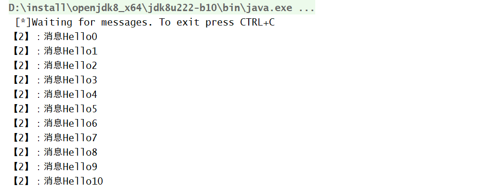


我们发现，MQCustomer1和MQCustomer2同时收到了消息。


# 路由（Routing）

在前一篇教程中，我们构建了一个简单的日志系统。我们能够向许多接收者广播日志消息。

在本教程中，我们将为其添加一个特性—我们将使仅订阅消息的一个子集成为可能。例如，我们将能够仅将关键的错误消息定向到日志文件(以节省磁盘空间)，同时仍然能够在控制台上打印所有的日志消息。


## 绑定Bindings

在上一个教程中，我们已经使用过绑定。类似下面的代码：


```java
channel.queueBind(queueName, EXCHANGE_NAME, "");
```


绑定是交换和队列之间的关系。这可以简单地理解为:队列对来自这个交换器的消息感兴趣。


绑定可以附带一个额外的参数routingKey。为了与避免basicPublish方法（发布消息的方法）的参数混淆，我们准备把它称作绑定键（binding key） 。下面展示如何使用绑定键（binding key）来创建一个绑定。


```java
channel.queueBind(queueName, EXCHANGE_NAME, "black");
```


绑定键的意义取决于交换类型。我们以前使用的fanout交换器完全忽略了它的价值。对于fanout类型，忽略此参数.

## 直接转发（Direct exchange）

我们之前教程中的日志系统将所有消息广播给所有用户。我们希望扩展它，允许根据消息的严重程度过滤消息。例如，我们可能希望将日志消息写入磁盘的程序只接收严重错误，而不会在警告或信息日志消息上浪费磁盘空间。


我们之前使用的是fanout交换，这并没有给我们多大的灵活性——它只能进行不需要动脑筋的广播。


所以，我们将会使用direct类型的转发器进行替代。direct类型的转发器背后的路由转发算法很简单：消息会被推送至绑定键（binding key）和消息发布附带的选择键（routing key）完全匹配的队列。


我们可以看到direct类型的转发器与两个队列绑定。第一个队列与绑定键orange绑定，第二个绑定有两个绑定，一个与绑定键black绑定，另一个与green绑定键绑定。在这样的设置的情况下，当一个消息附带一个选择键（routing key） orange发布至转发器将会被导向到队列Q1。消息附带一个选择键（routing key）black或者green将会被导向到队列Q2。所有其他消息将被丢弃。


## 多重绑定（Multiple bindings）


使用一个绑定键（binding key）绑定多个队列是完全合法的。在这种情况下，一个附带选择键（routing key）的消息将会被转发到Q1和Q2。

## 发送日志（Emitting logs）

我们准备将这种模式用于我们的日志系统。我们将消息发送到direct类型的转发器而不是fanout类型。我们将把日志的严重性作为选择键（routing key） 。这样的话，接收程序可以根据严重性来选择接收。我们首先关注发送日志的代码：


```java
//声明交换
channel.exchangeDeclare(EXCHANGE_NAME,"direct");
```


现在，我们准备发送一条消息：


```java
channel.basicPublish(EXCHANGE_NAME, severity, null, message.getBytes());
```

为了简化代码，我们假定‘severity’是‘info’，‘warning’，‘error’中的一个。

## 订阅（Subscribing）

接收消息将工作就像在以前的教程中，只有一点不同，我们给我们所感兴趣的严重性类型的日志创建一个绑定。


```java
String queueName = channel.queueDeclare().getQueue();
for(String severity : argv){
  channel.queueBind(queueName, EXCHANGE_NAME, severity);
}
```


## 总结


发送端，连接到RabbitMQ（此时服务需要启动），发送数据：


```java
package com.example.messagequeueonredisdemo;

import com.rabbitmq.client.Channel;
import com.rabbitmq.client.Connection;
import com.rabbitmq.client.ConnectionFactory;

import java.io.IOException;
import java.util.Random;
import java.util.concurrent.TimeoutException;

/**
 * @Desc
 * @Created By liukuihan
 * @date on 2020/3/3
 */
public class MQSend {
    private static final String EXCHANGE_NAME = "direct_logs";
    private static final String[] LOG_LEVEL = {"debug", "info", "error"};
    public static void main(String[] args) throws IOException, TimeoutException {
        //创建连接仓库
        ConnectionFactory factory = new ConnectionFactory();
        //设置IP,端口号，虚拟主机，用户名和密码
        factory.setHost("192.168.38.130");
        factory.setPort(5672);
        factory.setVirtualHost("/");
        factory.setUsername("guest");
        factory.setPassword("guest");
        //创建一个连接
        Connection connection=factory.newConnection();
        //创建一个通道
        Channel channel = connection.createChannel();
        //设置一次值处理一条消息，限制发送给customer一次不超过一条消息：
        int prefetchCount=1;
        channel.basicQos(prefetchCount);
        //声明指定一个队列
        //channel.queueDeclare("QUEUE_NAME", false, false, false, null);
        //声明一个交换机change,类型为direct
        channel.exchangeDeclare(EXCHANGE_NAME,"direct");
        //发送信息
        for (int i=0;i<50;i++){
            int rand = new Random().nextInt(3);
            String routingKey=LOG_LEVEL[rand];
            String message = "["+routingKey+"]：消息Hello"+i;
            channel.basicPublish(EXCHANGE_NAME, routingKey, null, message.getBytes());
            System.out.println("send:"+message);
        }
        System.out.println("done");
        //关闭连接
        channel.close();
        connection.close();
    }
}
```


接受端，不断等待服务器推送消息，然后在控制台输出：


```java
package com.example.messagequeueonredisdemo;

import com.rabbitmq.client.*;

import java.io.IOException;
import java.util.concurrent.TimeUnit;

/**
 * @Desc
 * @Created By liukuihan
 * @date on 2020/3/3
 */
public class MQCustomer01 {
    private static final String LOG_LEVEL = "debug";
    private static final String EXCHANGE_NAME = "direct_logs";
    public static void main(String[] argv) throws Exception {
        //创建连接仓库
        ConnectionFactory factory = new ConnectionFactory();
        //设置连接IP,端口号，虚拟主机，用户名和密码
        factory.setHost("192.168.38.130");
        factory.setPort(5672);
        factory.setVirtualHost("/");
        factory.setUsername("guest");
        factory.setPassword("guest");
        //创建一个连接
        Connection connection = factory.newConnection();
        //创建一个通道
        Channel channel = connection.createChannel();
        //声明一个交换机
        channel.exchangeDeclare(EXCHANGE_NAME,"direct");
        //声明指定一个临时队列
        //String QUEUE_NAME = channel.queueDeclare().getQueue();
        String QUEUE_NAME="test_log02";
        channel.queueDeclare(QUEUE_NAME, false, false, false, null);
        //指明routingKey
        String routingKey = LOG_LEVEL;
        channel.queueBind(QUEUE_NAME,EXCHANGE_NAME,routingKey);
        System.out.println(" [*] Waiting for messages. To exit press CTRL+C");
        //创建队列消费者
        Consumer consumer=new DefaultConsumer(channel){
            @Override
            public void handleDelivery(String consumerTag, Envelope envelope, AMQP.BasicProperties properties, byte[] body) throws IOException {
                String message =new String(body,"UTF-8");
                System.out.println("【1】："+message);
                try {
                    doWork();
                    //手动应答
                    channel.basicAck(envelope.getDeliveryTag(),false);
                } catch (InterruptedException e) {
                    e.printStackTrace();
                }
            }
        };

        //接收信息
        Boolean autoAck=false;
        channel.basicConsume(QUEUE_NAME, autoAck,consumer);
    }

    private static void doWork() throws InterruptedException {
        Thread.sleep(1000);
    }
}
```


customer1(debug)：


customer2(info):


customer3(debug+error):


我们发现，customer1、customer2、customer3同时收到了属于自己级别的消息


# 主题Topic

虽然使用direct类型的转发器，改善了我们的日志系统。但是仍然存在一些局限性：它不能够基于多重条件进行路由选择。我们有可能希望不仅根据日志的级别，而且想根据日志的来源进行订阅。为了在我们的系统中实现上述的需求，我们需要了解一个更复杂的转发器：topic类型的转发器。

## 主题转发（Topic exchange）

使用topic类型的转发器，不能随意的设置选择键（routing_key），必须是由点隔开的一系列的标识符组成。标识符可以是任何东西，但是一般都与消息的某些特性相关。你可以定义任何数量的标识符，上限为255个字节。


绑定键和选择键的形式一样。topic类型的转发器和direct类型的转发器很类似，一个附带特殊的选择键将会被转发到绑定键与之匹配的队列中。需要注意的是：关于绑定键有两种特殊的情况

- \* 可以匹配一个标识符。
- \# 可以匹配0个或多个标识符。


通过下图，我们大概可以了解到topic类型的转发器的处理流程：


在本例中，我们将发送所有描述动物的消息。这些消息将使用由三个单词(两个点)组成的路由键发送。路由键中的第一个词将描述速度，第二种颜色和第三种物种:"<speed>,<color>,<special>"


我们创建了三个绑定:Q1绑定绑定键"*.orange.*",Q2绑定绑定键："*.*.rabbit"和"lazy.#"

这些绑定可概括为:

Q1对所有的橙色动物都感兴趣。

Q2想知道关于兔子和懒动物的一切。


将routingKey设置为“quick.orange.rabbit”的消息。将被发送到两个队列。消息“lazy.orange.elephant”也会去他们两个。另一方面，“quick.orange.fox”消息只会去第一个队列，“lazy,brown.fox”消息只到第二个。“lazy.pink.rabbit”消息将只被传递到第二个队列一次，即使它匹配两个绑定。“quick.brown.fox”消息将不匹配任何绑定，所以会被丢弃。

## 总结实例


发送端


```java
package com.example.messagequeueonredisdemo;

import com.rabbitmq.client.Channel;
import com.rabbitmq.client.Connection;
import com.rabbitmq.client.ConnectionFactory;

import java.io.IOException;
import java.util.Random;
import java.util.concurrent.TimeoutException;

/**
 * @Desc
 * @Created By liukuihan
 * @date on 2020/3/3
 */
public class MQSend {
    private static final String EXCHANGE_NAME = "test_topic_exchange";
    private static final String[] SPEED = {"common", "lazy", "quick"};
    private static final String[] COLOR={"red","orange","blue"};
    private static final String[] ANIMAL={"rabbit","fox","dog"};
    public static void main(String[] args) throws IOException, TimeoutException {
        //创建连接仓库
        ConnectionFactory factory = new ConnectionFactory();
        //设置IP,端口号，虚拟主机，用户名和密码
        factory.setHost("192.168.38.130");
        factory.setPort(5672);
        factory.setVirtualHost("/");
        factory.setUsername("guest");
        factory.setPassword("guest");
        //创建一个连接
        Connection connection=factory.newConnection();
        //创建一个通道
        Channel channel = connection.createChannel();
        //设置一次值处理一条消息，限制发送给customer一次不超过一条消息：
        int prefetchCount=1;
        channel.basicQos(prefetchCount);
        //声明指定一个队列
        //channel.queueDeclare("QUEUE_NAME", false, false, false, null);
        //声明一个交换机change,类型为direct
        channel.exchangeDeclare(EXCHANGE_NAME,"topic");
        //发送信息
        for (int i=0;i<20;i++){
            int rand1 = new Random().nextInt(3);
            int rand2 = new Random().nextInt(3);
            int rand3 = new Random().nextInt(3);
            String routingKey=SPEED[rand1]+"."+COLOR[rand2]+"."+ANIMAL[rand3];
            String message = "消息：["+routingKey+"]：发送了"+i;
            channel.basicPublish(EXCHANGE_NAME, routingKey, null, message.getBytes());
            System.out.println("Send"+message);
        }
        System.out.println("done");
        //关闭连接
        channel.close();
        connection.close();
    }
}
```


接收端customer1:


```java
package com.example.messagequeueonredisdemo;

import com.rabbitmq.client.*;

import java.io.IOException;
import java.util.concurrent.TimeUnit;

/**
 * @Desc
 * @Created By liukuihan
 * @date on 2020/3/3
 */
public class MQCustomer01 {
    private static final String EXCHANGE_NAME = "test_topic_exchange";
    public static void main(String[] argv) throws Exception {
        //创建连接仓库
        ConnectionFactory factory = new ConnectionFactory();
        //设置连接IP,端口号，虚拟主机，用户名和密码
        factory.setHost("192.168.38.130");
        factory.setPort(5672);
        factory.setVirtualHost("/");
        factory.setUsername("guest");
        factory.setPassword("guest");
        //创建一个连接
        Connection connection = factory.newConnection();
        //创建一个通道
        Channel channel = connection.createChannel();
        //声明一个交换机
        channel.exchangeDeclare(EXCHANGE_NAME,"topic");
        //声明指定一个临时队列
        //String QUEUE_NAME = channel.queueDeclare().getQueue();
        String QUEUE_NAME="test_log02";
        channel.queueDeclare(QUEUE_NAME, false, false, false, null);
        //指明routingKey
        channel.queueBind(QUEUE_NAME,EXCHANGE_NAME, "*.orange.*");
        System.out.println(" [*] Waiting for messages. To exit press CTRL+C");
        //创建队列消费者
        Consumer consumer=new DefaultConsumer(channel){
            @Override
            public void handleDelivery(String consumerTag, Envelope envelope, AMQP.BasicProperties properties, byte[] body) throws IOException {
                String message =new String(body,"UTF-8");
                System.out.println("【1】："+message);
                try {
                    doWork();
                    //手动应答
                    channel.basicAck(envelope.getDeliveryTag(),false);
                } catch (InterruptedException e) {
                    e.printStackTrace();
                }
            }
        };

        //接收信息
        Boolean autoAck=false;
        channel.basicConsume(QUEUE_NAME, autoAck,consumer);
    }

    private static void doWork() throws InterruptedException {
        Thread.sleep(1000);
    }
}
```


接收端customer2:

```java
package com.example.messagequeueonredisdemo;

import com.rabbitmq.client.*;

import java.io.IOException;

/**
 * @Desc
 * @Created By liukuihan
 * @date on 2020/3/3
 */
public class MQCustomer02 {
    private static final String EXCHANGE_NAME = "test_topic_exchange";
    public static void main(String[] argv) throws Exception {
        //创建连接仓库
        ConnectionFactory factory = new ConnectionFactory();
        //设置连接IP,端口号，虚拟主机，用户名和密码
        factory.setHost("192.168.38.130");
        factory.setPort(5672);
        factory.setVirtualHost("/");
        factory.setUsername("guest");
        factory.setPassword("guest");
        //创建一个连接
        Connection connection = factory.newConnection();
        //创建一个通道
        Channel channel = connection.createChannel();
        //声明一个交换机
        channel.exchangeDeclare(EXCHANGE_NAME,"topic");
        //声明指定一个临时队列
        //String QUEUE_NAME = channel.queueDeclare().getQueue();
        String QUEUE_NAME="test_log01";
        channel.queueDeclare(QUEUE_NAME, false, false, false, null);
        //指明routingKey
        channel.queueBind(QUEUE_NAME,EXCHANGE_NAME,"*.*.rabbit");
        channel.queueBind(QUEUE_NAME,EXCHANGE_NAME,"lazy.#");
        System.out.println(" [*] Waiting for messages. To exit press CTRL+C");
        //创建队列消费者
        Consumer consumer=new DefaultConsumer(channel){
            @Override
            public void handleDelivery(String consumerTag, Envelope envelope, AMQP.BasicProperties properties, byte[] body) throws IOException {
                String message =new String(body,"UTF-8");
                System.out.println("【2】："+message);
                try {
                    doWork();
                    //手动应答
                    channel.basicAck(envelope.getDeliveryTag(),false);
                } catch (InterruptedException e) {
                    e.printStackTrace();
                }
            }
        };

        //接收信息
        Boolean autoAck=false;
        channel.basicConsume(QUEUE_NAME, autoAck,consumer);
    }

    private static void doWork() throws InterruptedException {
        Thread.sleep(2000);
    }
}
```


消息发送:


customer1接收：

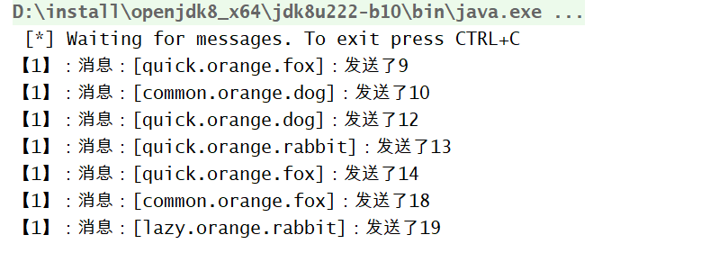

customer2接收：


# RabbitMQ的消息确认机制


在使用RabbitMQ的时候，我们可以通过消息持久化操作来解决因为服务器的异常奔溃导致的消息丢失，除此之外我们还会遇到一个问题，当消息的发布者在将消息发送出去之后，消息到底有没有正确到达broker代理服务器呢？如果不进行特殊配置的话，默认情况下发布操作是不会返回任何信息给生产者的，也就是默认情况下我们的生产者是不知道消息有没有正确到达broker的，如果在消息到达broker之前已经丢失的话，持久化操作也解决不了这个问题，因为消息根本就没到达代理服务器，你怎么进行持久化，那么这个问题该怎么解决呢？


RabbitMQ为我们提供了两种方式：

​     方式一：通过AMQP事务机制实现，这也是从AMQP协议层面提供的解决方案；

​    方式二：通过将channel设置成confirm模式来实现；

## AMQP事务机制

RabbitMQ中与事务机制有关的方法有三个：

- exSelect：用于将当前channel设置为transation模式
- txCommit：用于提交事务
- txRollback：回滚事务

在通过txSelect开启事务之后，我们便可以发布消息给broker代理服务器了，如果txCommit提交成功了，则消息一定是到达broker了，如果在txCommit执行之前broker异常奔溃或者由于其他原因抛出异常，这个时候我们便可以捕获异常通过txRollback回滚事务了；


生产者


采用事务机制实现会降低RabbitMQ的消息吞吐量，那么有没有更加高效的解决方式呢？RabbitMQ团队为我们拿出了更好的方案，即采用发送方确认模式；


  生产者确认模式实现原理：


   生产者将信道设置成confirm模式，一旦信道进入confirm模式，所有在该信道上面发布的消息都将会被指派一个唯一的ID(从1开始)，一旦消息被投递到所有匹配的队列之后，broker就会发送一个确认给生产者(包含消息的唯一ID)，这就使得生产者知道消息已经正确到达目的队列了，如果消息和队列是可持久化的，那么确认消息会在将消息写入磁盘之后发出，broker回传给生产者的确认消息中delivery-tag域包含了确认消息的序列号，此外broker也可以设置basic.ack的multiple域，表示到这个序列号之前的所有消息都已经得到了处理；


   confirm模式最大的好处在于他是异步的，一旦发布一条消息，生产者应用程序就可以在等信道返回确认的同时继续发送下一条消息，当消息最终得到确认之后，生产者应用便可以通过回调方法来处理该确认消息，如果RabbitMQ因为自身内部错误导致消息丢失，就会发送一条nack消息，生产者应用程序同样可以在回调方法中处理该nack消息；


   开启confirm模式的方法：


   生产者通过调用channel的confirmSelect方法将channel设置为confirm模式，(注意一点，已经在transaction事务模式的channel是不能再设置成confirm模式的，即这两种模式是不能共存的)，如果没有设置no-wait标志的话，broker会返回confirm.select-ok表示同意发送者将当前channel信道设置为confirm模式(从目前RabbitMQ最新版本3.6来看，如果调用了channel.confirmSelect方法，默认情况下是直接将no-wait设置成false的，也就是默认情况下broker是必须回传confirm.select-ok的，而且我也没找到我们自己能够设置no-wait标志的方法)；


   生产者实现confiem模式有三种编程方式：


   (1)：普通confirm模式，每发送一条消息，调用waitForConfirms()方法等待服务端confirm，这实际上是一种串行的confirm，每publish一条消息之后就等待服务端confirm，如果服务端返回false或者超时时间内未返回，客户端进行消息重传；


   (2)：批量confirm模式，每发送一批消息之后，调用waitForConfirms()方法，等待服务端confirm，这种批量确认的模式极大的提高了confirm效率，但是如果一旦出现confirm返回false或者超时的情况，客户端需要将这一批次的消息全部重发，这会带来明显的重复消息，如果这种情况频繁发生的话，效率也会不升反降


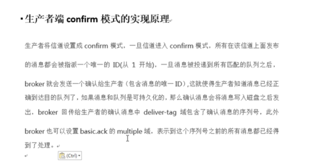

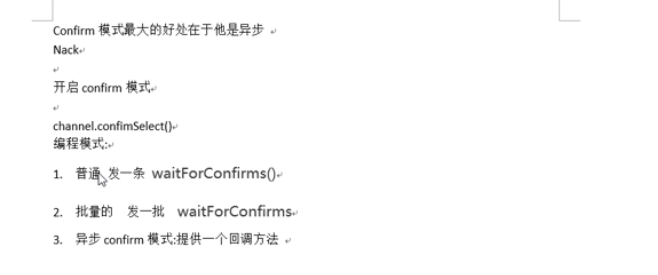

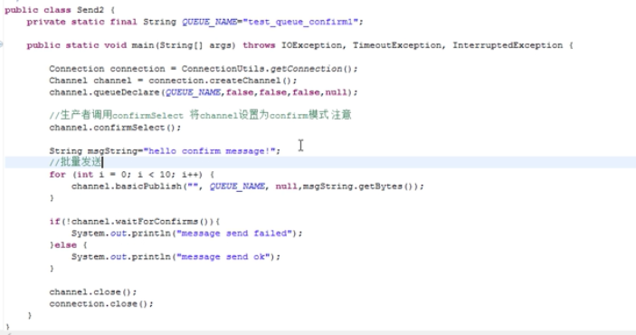

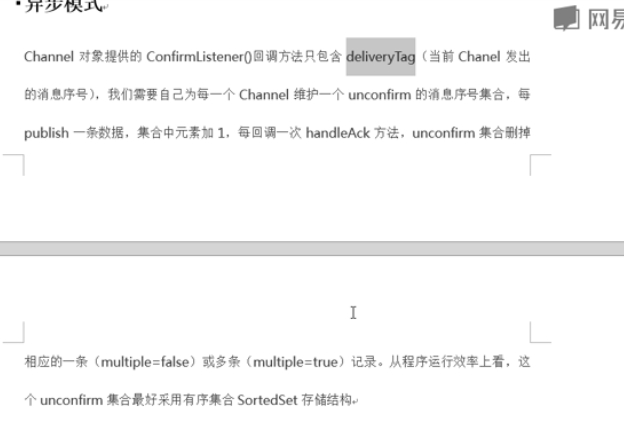

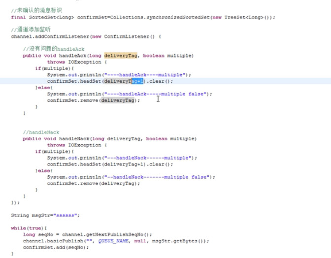

# 远程过程调用RPC

 RPC，Remote Procedure Call 远程过程调用。通俗讲，两段程序不在同一个内存空间，无法直接通过方法名调用，就需要通过网络通信方式调用。

对于RabbitMQ，本身就是用于消息通信。简单的RabbitMQ是，生产端发送消息，经由交换器，到达队列。消费端不需要知道生产端，消费端订阅队列，消费队列中的消息。而对于RPC，希望消费端消费消息后，返回一个结果，结果经由网络，再返回给生产端。


## 实现原理

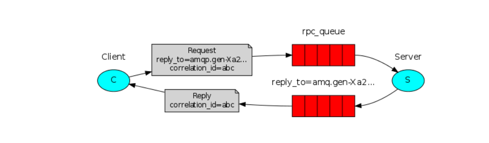

我们的RPC将这样工作:

- 对于RPC请求，客户端发送具有两个属性的消息:replyTo和correlationId，前者设置为仅为请求创建的匿名独占队列，后者设置为每个请求的惟一值。
- 请求被发送到rpc_queue队列。
- RPC工作程序(即:服务器)正在该队列上等待请求。当出现一个请求时，它执行任务，并使用replyTo字段中的队列将结果发送回客户机。
- 客户端在应答队列上等待数据。当消息出现时，它检查correlationId

## Callback队列

通常，在RabbitMQ上执行RPC是很容易的。客户端发送请求消息，服务器使用响应消息进行应答。为了接收响应，我们需要发送一个'回调'队列地址与请求。我们可以使用default队列(它在Java客户机中是独占的)。让我们试一试:


```java
callbackQueueName = channel.queueDeclare().getQueue();

BasicProperties props = new BasicProperties
                            .Builder()
                            .replyTo(callbackQueueName)
                            .build();

channel.basicPublish("", "rpc_queue", props, message.getBytes());
```


## Correlation Id

我们建议为每个RPC请求创建一个回调队列。这是非常低效的，但幸运的是，有一种更好的方法——让我们为每个客户机创建一个回调队列。

这就产生了一个新问题，在接收到该队列中的响应后，还不清楚响应属于哪个请求。这时就使用了correlationId属性。我们将为每个请求设置一个惟一的值。稍后，当我们在回调队列中接收到消息时，我们将查看此属性，并基于此属性，我们将能够将响应与请求匹配起来。


## 实例

服务端


```java
package com.example.messagequeueonredisdemo.rpc;

import com.rabbitmq.client.*;

import java.io.IOException;
import java.util.concurrent.TimeoutException;

/**
 * @Desc
 * @Created By liukuihan
 * @date on 2020/3/4
 */
public class rpcServer {
    public static void main(String[] args) throws IOException, TimeoutException {
        String replyQueueName="rpc_callback";
        String requestQueueName = "rpc_queue";
        //创建一个连接仓库
        ConnectionFactory factory = new ConnectionFactory();
        //设置IP,端口号，虚拟主机，用户名和密码
        factory.setHost("192.168.38.130");
        factory.setPort(5672);
        factory.setVirtualHost("/");
        factory.setUsername("guest");
        factory.setPassword("guest");
        //创建一个连接
        Connection connection = factory.newConnection();
        //创建一个channel
        Channel channel = connection.createChannel();
        //声明queue
        channel.queueDeclare(requestQueueName,false,false,false,null);
        DefaultConsumer consumer = new DefaultConsumer(channel) {
            @Override
            public void handleDelivery(String consumerTag, Envelope envelope, AMQP.BasicProperties properties, byte[] body) throws IOException {
                System.out.println("RPC收到请求信息"+new String(body,"utf-8"));
                try {
                    AMQP.BasicProperties replyProperties = new AMQP.BasicProperties().builder()
                            .contentType("UTF-8")
                            .correlationId(properties.getCorrelationId())
                            .build();
                    String replyMessage = new String(body,"utf-8")+"计算后返回";
                    channel.basicPublish("", replyQueueName, replyProperties,replyMessage.getBytes());
                    System.out.println("----------RPC结果已返回----------");
                } catch (Exception e) {
                    e.printStackTrace();
                }
            }
        };
        channel.basicConsume(requestQueueName,true,consumer);
    }
}
```


客户端

```java
package com.example.messagequeueonredisdemo.rpc;

import com.rabbitmq.client.*;
import com.rabbitmq.client.impl.AMQBasicProperties;

import java.io.IOException;
import java.util.concurrent.TimeoutException;

/**
 * @Desc
 * @Created By liukuihan
 * @date on 2020/3/4
 */
public class rpcClient {

    public static void main(String[] args) throws IOException, TimeoutException {
        String replyQueueName="rpc_callback";
        String requestQueueName = "rpc_queue";
        //创建一个连接仓库
        ConnectionFactory factory = new ConnectionFactory();
        //设置IP,端口号，虚拟主机，用户名和密码
        factory.setHost("192.168.38.130");
        factory.setPort(5672);
        factory.setVirtualHost("/");
        factory.setUsername("guest");
        factory.setPassword("guest");
        //创建一个连接
        Connection connection = factory.newConnection();
        //创建一个channel
        Channel channel = connection.createChannel();
        //声明一个队列
        channel.queueDeclare(requestQueueName,false,false,false,null);
        //设置只发送一条消息
        channel.basicQos(1);
        AMQP.BasicProperties props = new AMQP.BasicProperties.Builder()
                .replyTo(replyQueueName)
                .correlationId("001")
                .build();
        for (int i=0;i<20;i++) {
            String message = "请求"+i;
            channel.basicPublish("", "rpc_queue", props, message.getBytes());
        }
        //回收
        channel.queueDeclare(replyQueueName, false, false, false, null);
        DefaultConsumer consumer = new DefaultConsumer(channel) {
            @Override
            public void handleDelivery(String consumerTag, Envelope envelope, AMQP.BasicProperties properties, byte[] body) throws IOException {
                System.out.println(new String(body, "utf-8"));
            }
        };
        channel.basicConsume(replyQueueName, consumer);
    }
}
```


# SpringBoot集成RabbitMQ


## 配置pom.xml文件添加rabbitmq相关引用


```xml
        <dependency>
            <groupId>org.springframework.boot</groupId>
            <artifactId>spring-boot-starter-amqp</artifactId>
        </dependency>
```


## 配置yml文件添加rabbitmq配置信息


```yaml
spring:
  rabbitmq:
    host: 192.168.38.130
    port: 5672
    virtual-host: /
    username: guest
    password: guest
```


## 实例

我们这里创建两个项目：

生产者：ra

消费者：

注意：实际项目中，一个系统可能即为生产者、又为消费者。

### direct交换机


（1）在DirectRabbitConfig中注册队列Bean


```java
@Configuration
public class DirectRabbitConfig {

    //队列名
    public static final String[] QUEUE_NAME={"task","msg","other"};

    //声明队列
    @Bean
    public Queue msgQueue(){
        return new Queue(QUEUE_NAME[1]);
    }
    //声明队列
    @Bean
    public Queue taskQueue(){
        return new Queue(QUEUE_NAME[0]);
    }
}
```


（2）消费者


```java
@Component
public class DirectMsgConsumer {
    @Autowired
    RabbitTemplate rabbitTemplate;

    @RabbitListener(queues = {"msg"})
    public void consumeMsg(String msg){
        System.out.println("消息消费者接收到消息："+msg);
    }

    @RabbitListener(queues = {"task"})
    public void consumeTask(String msg){
        System.out.println("任务消费者接收消息："+msg);
    }
}
```


（3）生产者

```java
@Component
public class DirectMsgSender {
    @Autowired
    RabbitTemplate rabbitTemplate;

    public void send(String msg){
        for (int i=0;i<10;i++) {
            int rand = new Random().nextInt(3);
            rabbitTemplate.convertAndSend(DirectRabbitConfig.QUEUE_NAME[rand], msg+i);
            System.out.println("生产者已发送"+DirectRabbitConfig.QUEUE_NAME[rand]+"消息！"+i);
        }
    }
}
```


（4）测试，调用生产者的send()方法


```java
@SpringBootTest
class RabbitmqdemoApplicationTests {
    @Autowired
    DirectMsgSender directMsgSender;
    @Test
    void test_send_direct(){
        directMsgSender.send("任务消息---");
    }
}
```


执行结果：

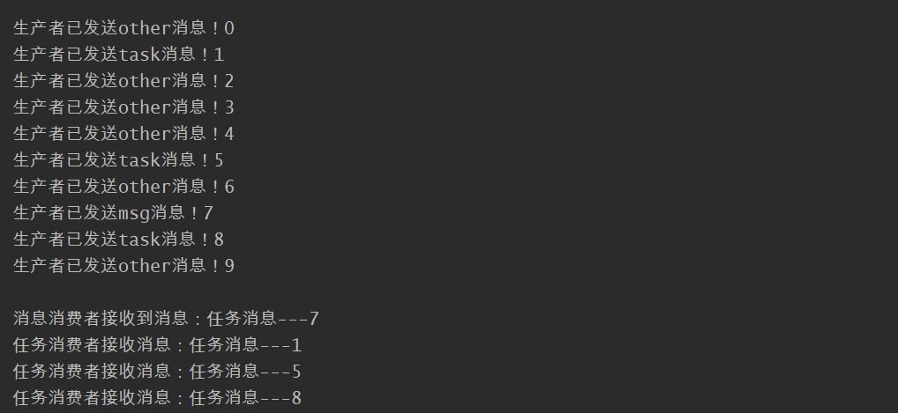


### fanout交换机

使用 fanout 交换机的话，那么生产者与消费者的配置就不一样了。

（1）注册队列Bean


```java
@Configuration
public class FanoutRabbitConfig {
    //声明交换机名称
    private static final String  FANOUT_TASK_EXCHANGE="fanout_exchange";
    //声明队列名称
    private static final String FANOUT_QUEUE1 = "fanout_queue_task1";
    private static final String FANOUT_QUEUE2 = "fanout_queue_task2";
    //注册交换机
    @Bean
    public FanoutExchange fanoutExchange() {
        return new FanoutExchange(FANOUT_TASK_EXCHANGE);
    }
    //注册任务队列1
    @Bean
    public Queue taskQueue1() {
        return new Queue(FANOUT_QUEUE1);
    }
    //注册任务队列2
    @Bean
    public Queue taskQueue2() {
        return new Queue(FANOUT_QUEUE2);
    }
    
    //注册绑定：交换机和队列绑定1
    @Bean
    public Binding bindingExchange1() {
        return BindingBuilder.bind(taskQueue1()).to(fanoutExchange());
    }
    //注册绑定：交换机和队列绑定2
    @Bean
    public Binding bindingExchange2() {
        return BindingBuilder.bind(taskQueue2()).to(fanoutExchange());
    }
}
```


（2）消费者


```java
@Component
public class FanoutTaskConsumer {
    //声明队列名称
    private static final String FANOUT_QUEUE1 = "fanout_queue_task1";
    private static final String FANOUT_QUEUE2 = "fanout_queue_task2";

    //消费者1
    @RabbitListener(queues = {FANOUT_QUEUE1})
    public void customer1(String msg){
        System.out.println("【1】处理消息："+msg);
    }
    //消费者2
    @RabbitListener(queues = {FANOUT_QUEUE2})
    public void customer2(String msg){
        System.out.println("【2】处理消息："+msg);
    }
}
```


（3）生产者


```java
@Component
public class FanoutTaskRender {
    //声明交换机名称
    private static final String  FANOUT_TASK_EXCHANGE="fanout_exchange";
    @Autowired
    private RabbitTemplate rabbitTemplate;
    public void send(String msg){
        //参数一:交换机名称，参数二:发送的routingKey，参数三:内容
        rabbitTemplate.convertAndSend(FANOUT_TASK_EXCHANGE,"",msg);
        System.out.println("生产者发送消息："+msg);
    }
}
```


（4）测试


```java
@SpringBootTest
class RabbitmqdemoApplicationTests {
    @Autowired
    FanoutTaskRender fanoutTaskRender;
    @Test
    public void testFanout(){
        for (int i=0;i<10;i++) {
            fanoutTaskRender.send("任务"+i);
        }
    }

}
```


执行结果


### topic交换机

使用 topic 交换机，生产者与消费者的配置也不一样。


（1）配置队列、交换机等


```java
@Configuration
public class TopicRabbitConfig {

    //声明exchange名称
    private static final String TOPIC_EXCHANGE="topic_change";
    //声明queue名称
    private static final String TOPIC_QUEUE1="topic_task_queue1";
    private static final String TOPIC_QUEUE2="topic_task_queue2";
    //注册exchange
    @Bean
    public TopicExchange topicExchange(){
        return new TopicExchange(TOPIC_EXCHANGE);
    }

    //注册queue1
    @Bean
    public Queue topicQueue1(){
        return new Queue(TOPIC_QUEUE1);
    }

    //注册queue2
    @Bean
    public Queue topicQueue2(){
        return new Queue(TOPIC_QUEUE2);
    }

    //配置绑定：exchange和queue1,全接收
    @Bean
    public Binding topBindingExchange() {
        //*表示一个词，#表示零个或多个词
        String routingKey="#.#";
        return BindingBuilder.bind(topicQueue1()).to(topicExchange()).with(routingKey);
    }

    //配置绑定：exchange和queue1
    @Bean
    public Binding topBindingExchange2() {
        //*表示一个词，#表示零个或多个词
        String routingKey="task.#";
        return BindingBuilder.bind(topicQueue2()).to(topicExchange()).with(routingKey);
    }
}
```


（2）生产者


```java
@Component
public class TopicTaskConsumer {
    private static final String TOPIC_QUEUE1="topic_task_queue1";
    private static final String TOPIC_QUEUE2="topic_task_queue2";
    
    //消费者1
    @RabbitListener(queues = {TOPIC_QUEUE1})
    public void consumer1(String msg){
        System.out.println("【1】处理了消息："+msg);
    }
    
    //消费者2
    @RabbitListener(queues = {TOPIC_QUEUE2})
    public void consumer2(String msg){
        System.out.println("【2】处理了消息："+msg);
    }
    
}
```


（3）生产者


```java
@Component
public class TopicTaskRender {
    private static final String TOPIC_EXCHANGE="topic_change";
    @Autowired
    RabbitTemplate rabbitTemplate;
    public void send(String routingKey,String msg){
        rabbitTemplate.convertAndSend(TOPIC_EXCHANGE,routingKey,msg);
    }
}
```


（4）测试


```java
@SpringBootTest
class RabbitmqdemoApplicationTests {
    @Autowired
    TopicTaskRender topicTaskRender;
    @Test
    public void testTopic(){
        String[] keys1 = {"task","msg"};
        String[] keys2 = {"1","2"};
        String[] keys3 = {"1","2"};
        for (int i=0;i<10;i++) {
            int rand1 = new Random().nextInt(2);
            int rand2 = new Random().nextInt(2);
            int rand3 = new Random().nextInt(2);
            String routingKey=keys1[rand1]+"."+keys2[rand2]+"."+keys3[rand3];
            topicTaskRender.send(routingKey,"任务"+routingKey);
            System.out.println("发送了消息："+"任务"+routingKey);
        }
    }
}
```


