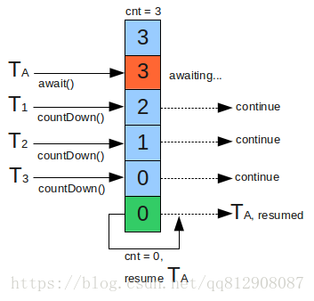

原文地址 https://blog.csdn.net/qq812908087/article/details/81112188

## 概念

CountDownLatch 是一个同步工具类，它允许一个或多个线程一直等待，直到其他线程执行完后再执行。例如，应用程序的主线程希望在负责启动框架服务的线程已经启动所有框架服务之后执行。

## CountDownLatch 的用法

CountDownLatch 典型用法 1：某一线程在开始运行前等待 n 个线程执行完毕。

1. 将 CountDownLatch 的计数器初始化为 n。`new CountDownLatch(n)` 。
2. 每当一个任务线程执行完毕，就将计数器减 1 `countdownlatch.countDown()`。
3. 当计数器的值变为 0 时，在 CountDownLatch 上 `await()` 的线程就会被唤醒。

一个典型应用场景就是启动一个服务时，主线程需要等待多个组件加载完毕之后再继续执行。


CountDownLatch 典型用法 2：实现多个线程开始执行任务的最大**并行性**。注意是并行性，不是并发，强调的是多个线程在某一时刻同时开始执行。类似于赛跑，将多个线程放到起点，等待发令枪响，然后同时开跑。


做法是初始化一个共享的 CountDownLatch(1)，将其计数器初始化为 1，多个线程在开始执行任务前首先 `coundownlatch.await()`，当主线程调用 `countDown()` 时，计数器变为 0，多个线程同时被唤醒。

### CountDownLatch 原理

CountDownLatch 是通过一个计数器来实现的，计数器的初始化值为线程的数量。每当一个线程完成了自己的任务后，计数器的值就相应得减 1。当计数器到达 0 时，表示所有的线程都已完成任务，然后在闭锁上等待的线程就可以恢复执行任务。




### CountDownLatch 使用例子

1. 主线程需要等待多个组件加载完毕之后再继续执行。


```java
public static void main(String[] args) throws InterruptedException {
    // 1. 设置计数器值为10    
    CountDownLatch latch = new CountDownLatch(10);
 
        for (int i=0; i<9; i++) {
            new Thread(new Runnable() {
                @Override
                public void run() {
                    System.out.println(Thread.currentThread().getName() + " 运行");
                    try {
                        Thread.sleep(3000);
                    } catch (InterruptedException e) {
                        e.printStackTrace();
                    } finally {
                        // 每结束一个线程，计数减1
                        latch.countDown();
                    }
                }
            }).start();
        }
 
        System.out.println("等待子线程运行结束");
    	// 等待计数器结束，设置了10s的最长等到时间，10s后子线程不结束，将自动执行
        latch.await(10, TimeUnit.SECONDS);
        System.out.println("子线程运行结束");
}
```


2、子线程等待主线程处理完毕开始处理，子线程处理完毕后，主线程输出


```java
class MyRunnable implements Runnable {
 
    private CountDownLatch countDownLatch;
 
    private CountDownLatch await;
 
    public MyRunnable(CountDownLatch countDownLatch, CountDownLatch await){
        this.countDownLatch = countDownLatch;
        this.await = await;
    }
 
    @Override
    public void run() {
        try {
            countDownLatch.await();
            System.out.println("子线程" +Thread.currentThread().getName()+ "处理自己事情");
            Thread.sleep(1000);
            await.countDown();
        } catch (InterruptedException e) {
            e.printStackTrace();
        }
 
    }
}
```


```java
public static void main(String[] args) throws InterruptedException {
        CountDownLatch countDownLatch = new CountDownLatch(1);
        CountDownLatch await = new CountDownLatch(5);
 
        for (int i=0; i< 5; i++) {
            new Thread(new MyRunnable(countDownLatch, await)).start();
        }
 
        System.out.println("主线程处理自己事情");
        Thread.sleep(3000);
        countDownLatch.countDown();
        System.out.println("主线程处理结束");
        await.await();
        System.out.println("子线程处理完毕啦");
    }
```


### 在实时系统中的使用场景


1. 实现最大的并行性：有时我们想同时启动多个线程，实现最大程度的并行性。例如，我们想测试一个单例类。如果我们创建一个初始计数器为 1 的 CountDownLatch，并让其他所有线程都在这个锁上等待，只需要调用一次 countDown() 方法就可以让其他所有等待的线程同时恢复执行。
2. 开始执行前等待 N 个线程完成各自任务：例如应用程序启动类要确保在处理用户请求前，所有 N 个外部系统都已经启动和运行了。
3. 死锁检测：一个非常方便的使用场景是你用 N 个线程去访问共享资源，在每个测试阶段线程数量不同，并尝试产生死锁。