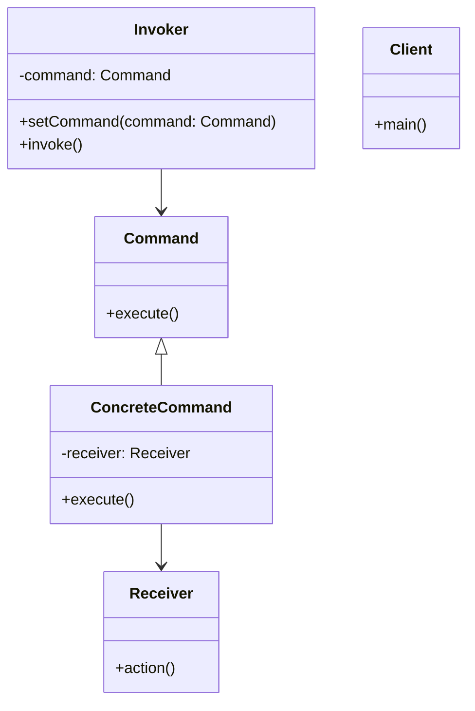

# 策略模式之命令模式

命令模式（Command Pattern）是一种行为设计模式，它将请求封装为对象，从而使您可以用不同的请求对客户进行参数化，对请求排队或记录请求日志，以及支持可撤销的操作。

## 命令模式的结构

命令模式主要包含以下几个部分：
1. **命令接口（Command）**：定义执行操作的接口。
2. **具体命令（ConcreteCommand）**：实现命令接口，绑定一个接收者对象并调用接收者的相关操作。
3. **接收者（Receiver）**：执行与请求相关的操作。
4. **调用者（Invoker）**：持有命令对象并通过调用命令对象的方法来执行请求。
5. **客户端（Client）**：创建具体命令对象并设置其接收者。

## 命令模式的优点

- **解耦**：将请求的发送者和接收者解耦。
- **扩展性**：可以很容易地添加新命令。
- **支持撤销和重做**：通过存储命令历史记录，可以实现操作的撤销和重做。

## 命令模式的缺点

- **类的数量增加**：每个具体命令都需要一个类，可能会导致类的数量增加。
- **复杂性**：对于简单的操作，使用命令模式可能显得过于复杂。

## UML 类图



## 示例代码

以下是一个简单的命令模式实现示例：

```java
// 命令接口
public interface Command {
    void execute();
}

// 接收者
public class Light {
    public void turnOn() {
        System.out.println("The light is on");
    }

    public void turnOff() {
        System.out.println("The light is off");
    }
}

// 具体命令
public class TurnOnLightCommand implements Command {
    private Light light;

    public TurnOnLightCommand(Light light) {
        this.light = light;
    }

    @Override
    public void execute() {
        light.turnOn();
    }
}

public class TurnOffLightCommand implements Command {
    private Light light;

    public TurnOffLightCommand(Light light) {
        this.light = light;
    }

    @Override
    public void execute() {
        light.turnOff();
    }
}

// 调用者
public class RemoteControl {
    private Command command;

    public void setCommand(Command command) {
        this.command = command;
    }

    public void pressButton() {
        command.execute();
    }
}

// 客户端
public class Client {
    public static void main(String[] args) {
        Light light = new Light();
        Command turnOn = new TurnOnLightCommand(light);
        Command turnOff = new TurnOffLightCommand(light);

        RemoteControl remote = new RemoteControl();

        remote.setCommand(turnOn);
        remote.pressButton();

        remote.setCommand(turnOff);
        remote.pressButton();
    }
}
```

## 使用场景

- 需要对请求排队或记录请求日志的场景。
- 需要支持撤销操作的场景。
- 需要将一组操作组合为一个操作的场景。

命令模式通过将请求封装为对象，提供了灵活性和扩展性，是一种非常实用的设计模式。

## 命令模式与策略模式的区别
命令模式和策略模式都是行为设计模式，但它们的目的和使用场景有所不同：
- **命令模式**：主要用于将请求封装为对象，以便于参数化和操作的撤销。它关注的是请求的发送和接收之间的解耦。
- **策略模式**：主要用于定义一系列算法，并将每个算法封装起来，使它们可以互换。它关注的是算法的选择和使用。

代码结构上的区别：
- **命令模式**：通常包含命令接口、具体命令、接收者、调用者和客户端。
- **策略模式**：通常包含策略接口、具体策略和上下文。
- **命令模式**：命令对象通常会持有接收者的引用，并在执行时调用接收者的方法。
- **策略模式**：上下文对象持有一个策略对象，并在需要时调用策略的方法。
- **命令模式**：命令对象通常会包含执行操作的具体逻辑。
- **策略模式**：策略对象通常只包含算法的实现逻辑。


## 如何理解命令模式可撤销操作
命令模式的可撤销操作是通过存储命令对象的历史记录来实现的。每当执行一个命令时，可以将该命令对象存储在一个栈或列表中。当需要撤销操作时，可以从历史记录中取出最近执行的命令，并调用其撤销方法。
```java
// 撤销命令接口
public interface UndoableCommand extends Command {
    void undo();
}
// 具体撤销命令
public class TurnOnLightCommand implements UndoableCommand {
    private Light light;

    public TurnOnLightCommand(Light light) {
        this.light = light;
    }

    @Override
    public void execute() {
        light.turnOn();
    }

    @Override
    public void undo() {
        light.turnOff();
    }
}
// 调用者
public class RemoteControl {
    private Command command;
    private Stack<UndoableCommand> history = new Stack<>();

    public void setCommand(Command command) {
        this.command = command;
    }

    public void pressButton() {
        command.execute();
        if (command instanceof UndoableCommand) {
            history.push((UndoableCommand) command);
        }
    }

    public void undo() {
        if (!history.isEmpty()) {
            UndoableCommand lastCommand = history.pop();
            lastCommand.undo();
        }
    }
}
```