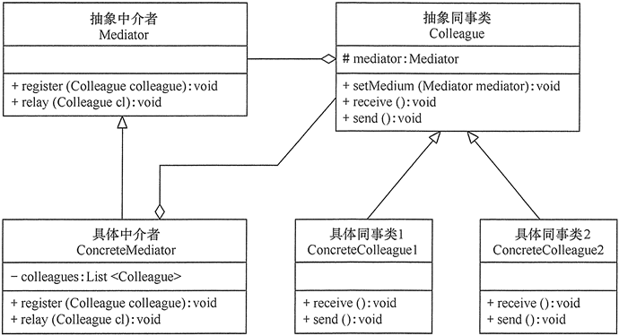

# 中介者模式（Mediator Pattern）
中介者模式是一种行为型设计模式，它通过引入一个中介者对象来简化对象之间的通信和交互。 中介者模式可以让对象之间解耦，并允许它们通过中介者进行通信，而不需要直接相互引用。

## uml


- 抽象中介者（Mediator）角色：它是中介者的接口，提供了同事对象注册与转发同事对象信息的抽象方法。
- 具体中介者（ConcreteMediator）角色：实现中介者接口，定义一个 List 来管理同事对象，协调各个同事角色之间的交互关系，因此它依赖于同事角色。
- 抽象同事类（Colleague）角色：定义同事类的接口，保存中介者对象，提供同事对象交互的抽象方法，实现所有相互影响的同事类的公共功能。
- 具体同事类（Concrete Colleague）角色：是抽象同事类的实现者，当需要与其他同事对象交互时，由中介者对象负责后续的交互。

中介者模式在Java中实现如下：
```java

/**
 * 中介者抽象类
 */
public abstract class Mediator {

    //注册同事
    abstract void register(Colleague colleague);

    //回复消息
    abstract void relay(Colleague colleague);

}

/***
 * 中介者实现类
 */
public class ConcreteMediator implements Mediator {

    /**
     * 被中介者代理的同事
     */
    private List<Colleague> colleagues;

    public ConcreteMediator() {
        colleagues = new ArrayList<>();
    }

    public void register(Colleague colleague) {
        if (!colleagues.contains(colleague)) {
            colleague.setMediator(this);
            this.colleagues.add(colleague);
        }
    }

    public void relay(Colleague colleague) {
        colleagues.forEach(c -> {
            if (!c.equals(colleague)) {
                c.receive();
            }
        });
    }
}

/**
 * 同事抽象类
 */
public abstract class Colleague {

    //中介者抽象类
    protected Mediator mediator;

    public void setMediator(Mediator mediator) {
        this.mediator = mediator;
    }

    //接受消息
    public abstract void receive();

    //发送消息
    public abstract void send();
}


/**
 * 具体的同事类1
 */
public class ConcreteColleague1 extends Colleague {
    @Override
    public void receive() {
        System.out.println("colleague1 receive message.");
    }

    @Override
    public void send() {
        System.out.println("colleague1 send message.");
        //请中介者转发
        this.mediator.relay(this);
    }
}

/**
 * 具体的同事类2
 */
public class ConcreteColleague2 extends Colleague {
    @Override
    public void receive() {
        System.out.println("colleague2 receive message.");
    }

    @Override
    public void send() {
        System.out.println("colleague2 send message.");
        //请中介者转发
        this.mediator.relay(this);
    }
}


/**
 * 测试与应用
 */
public class Test {

    public static void main(String[] args) {
        //构建中介者
        Mediator mediator = new ConcreteMediator();

        //构建具体的同事类
        Colleague colleague1 = new ConcreteColleague1();
        Colleague colleague2 = new ConcreteColleague2();

        //注册同事
        mediator.register(colleague1);
        mediator.register(colleague2);

        //发送消息
        colleague1.send();
        colleague2.send();
    }
}

// colleague1 send message.
// colleague2 receive message.
// colleague2 send message.
// colleague1 receive message.
```