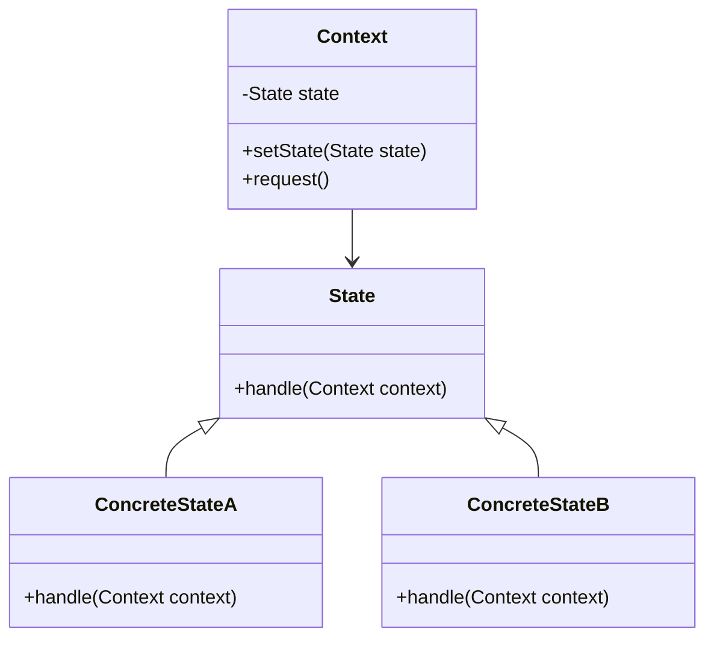

# 设计模式之状态模式

状态模式（State Pattern）是一种行为设计模式，它允许对象在其内部状态改变时改变其行为。状态模式将状态的相关行为封装到独立的类中，使得状态切换更加清晰和易于维护。

## 状态模式的结构

状态模式主要包含以下几个部分：
1. **Context（上下文）**：维护一个具体状态的实例，这个实例定义了当前的状态。
2. **State（抽象状态）**：定义一个接口，用于封装与上下文的一个特定状态相关的行为。
3. **ConcreteState（具体状态）**：实现抽象状态接口的具体状态类，每个类对应上下文的一个具体状态。

## uml



## 状态模式的优点
- **封装状态变化**：将状态相关的行为封装到独立的类中，减少了上下文类的复杂性。
- **遵循开闭原则**：添加新状态时，只需新增具体状态类，而无需修改已有代码。
- **提高可维护性**：状态切换逻辑集中在状态类中，便于管理和扩展。

## 状态模式的缺点
- **类的数量增加**：每个状态都需要定义一个具体状态类，可能导致类的数量增加。
- **状态切换复杂**：如果状态之间的切换逻辑复杂，可能会增加实现难度。

## 示例代码

以下是一个简单的状态模式实现示例：

```java
// 抽象状态
public interface State {
    void handle(Context context);
}

// 具体状态A
public class ConcreteStateA implements State {
    @Override
    public void handle(Context context) {
        System.out.println("当前状态：A");
        context.setState(new ConcreteStateB());
    }
}

// 具体状态B
public class ConcreteStateB implements State {
    @Override
    public void handle(Context context) {
        System.out.println("当前状态：B");
        context.setState(new ConcreteStateA());
    }
}

// 上下文
public class Context {
    private State state;

    public Context(State state) {
        this.state = state;
    }

    public void setState(State state) {
        this.state = state;
    }

    public void request() {
        state.handle(this);
    }
}

// 测试
public class StatePatternDemo {
    public static void main(String[] args) {
        Context context = new Context(new ConcreteStateA());
        context.request(); // 输出：当前状态：A
        context.request(); // 输出：当前状态：B
    }
}
```

## 使用场景
- 对象的行为依赖于其状态，并且需要在运行时根据状态改变行为。
- 避免使用大量的条件语句来管理状态切换。

## 总结
状态模式通过将状态相关的行为封装到独立的类中，使得状态切换更加清晰和易于维护。在实际开发中，状态模式常用于处理复杂的状态转换逻辑，例如工作流引擎、游戏角色状态管理等场景。
