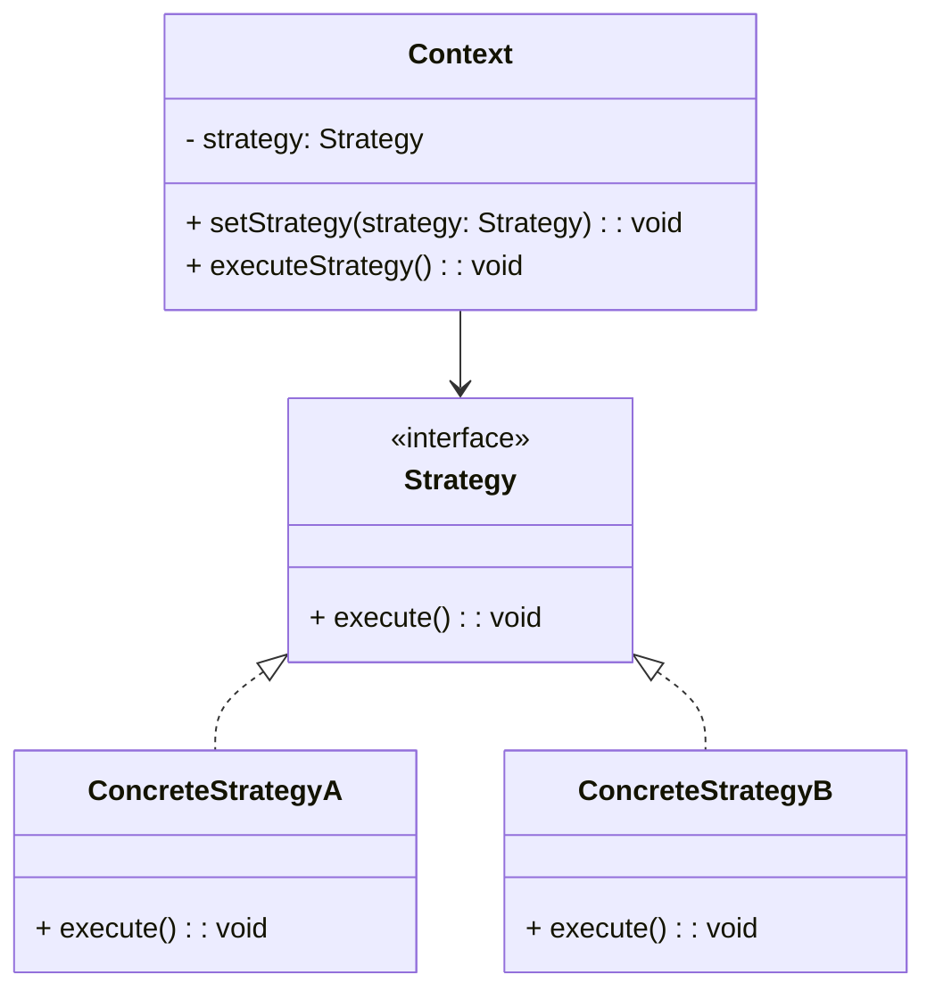

# 策略模式 (Strategy Pattern)

[toc]

策略模式是一种行为设计模式，它定义了一系列算法，并将每个算法封装起来，使它们可以互换使用。策略模式让算法的变化独立于使用算法的客户端。

## 模式结构

策略模式包含以下几个主要角色：

1. **上下文（Context）**：维护一个对策略对象的引用。
2. **策略接口（Strategy）**：定义所有支持的算法的公共接口。
3. **具体策略（ConcreteStrategy）**：实现策略接口的具体算法。

## UML 类图



## 示例代码

以下是一个使用策略模式的简单示例，展示如何动态切换算法：

```java
// 策略接口
interface Strategy {
    int[] execute(int[] data);
}

// 具体策略 A
class ConcreteStrategyA implements Strategy {
    @Override
    public int[] execute(int[] data) {
        int[] sortedData = data.clone();
        java.util.Arrays.sort(sortedData);
        return sortedData;
    }
}

// 具体策略 B
class ConcreteStrategyB implements Strategy {
    @Override
    public int[] execute(int[] data) {
        int[] sortedData = data.clone();
        java.util.Arrays.sort(sortedData);
        for (int i = 0; i < sortedData.length / 2; i++) {
            int temp = sortedData[i];
            sortedData[i] = sortedData[sortedData.length - 1 - i];
            sortedData[sortedData.length - 1 - i] = temp;
        }
        return sortedData;
    }
}

// 上下文
class Context {
    private Strategy strategy;

    public Context(Strategy strategy) {
        this.strategy = strategy;
    }

    public void setStrategy(Strategy strategy) {
        this.strategy = strategy;
    }

    public int[] executeStrategy(int[] data) {
        return strategy.execute(data);
    }
}

// 使用示例
public class StrategyPatternExample {
    public static void main(String[] args) {
        int[] data = {5, 2, 9, 1};

        Context context = new Context(new ConcreteStrategyA());
        System.out.println("Ascending: " + java.util.Arrays.toString(context.executeStrategy(data)));

        context.setStrategy(new ConcreteStrategyB());
        System.out.println("Descending: " + java.util.Arrays.toString(context.executeStrategy(data)));
    }
}
```

## 优点

- 提高了代码的灵活性，便于扩展新的算法。
- 避免了使用大量的条件语句。

## 缺点

- 增加了类的数量。
- 客户端需要了解不同策略的实现。

## 适用场景

- 需要动态切换算法或行为。
- 有许多相关的类仅在行为上有所不同。

策略模式是一种强大的设计模式，适用于需要灵活切换算法的场景。


## 使用枚举和 Map 优化策略模式

通过结合枚举和 Map，可以进一步优化策略模式，使代码更加简洁和易于维护。以下是一个示例：

```java
// 策略枚举
enum StrategyType {
    ASCENDING(new ConcreteStrategyA()),
    DESCENDING(new ConcreteStrategyB());

    private final Strategy strategy;

    StrategyType(Strategy strategy) {
        this.strategy = strategy;
    }

    public Strategy getStrategy() {
        return strategy;
    }
}

// 上下文
class Context {
    private final Map<StrategyType, Strategy> strategyMap = new EnumMap<>(StrategyType.class);

    public Context() {
        for (StrategyType type : StrategyType.values()) {
            strategyMap.put(type, type.getStrategy());
        }
    }

    public int[] executeStrategy(StrategyType type, int[] data) {
        Strategy strategy = strategyMap.get(type);
        if (strategy == null) {
            throw new IllegalArgumentException("Invalid strategy type");
        }
        return strategy.execute(data);
    }
}

```

优化后的优点

1. **代码更简洁**：通过枚举管理策略，避免了手动创建和管理策略对象。
2. **易于扩展**：新增策略时，只需在枚举中添加对应的策略类型和实现。
3. **性能优化**：策略对象在枚举中初始化，避免了重复创建。

