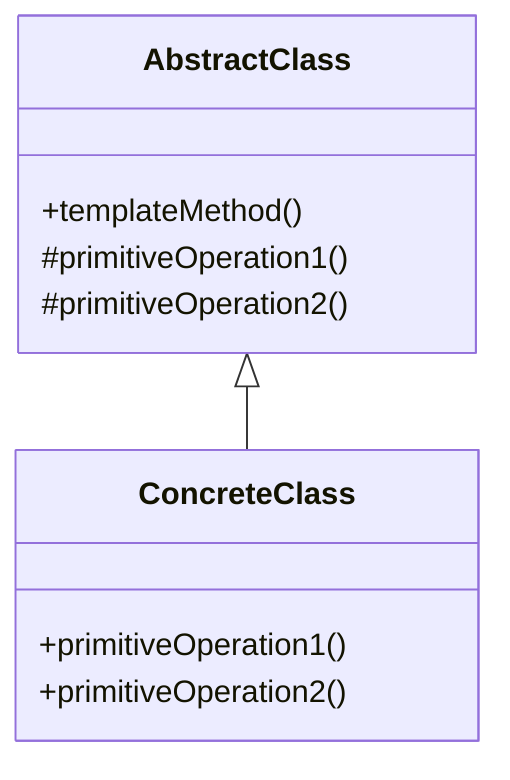

# 设计模式之模板模式

模板模式（Template Method Pattern）是一种行为型设计模式，它定义了一个操作中的算法骨架，而将一些步骤延迟到子类中。通过模板方法，子类可以在不改变算法结构的情况下，重新定义算法的某些步骤。

## 模式结构

模板模式包含以下主要角色：
1. **抽象类（AbstractClass）**：定义算法的骨架，并声明一些抽象方法供子类实现。
2. **具体类（ConcreteClass）**：实现抽象类中定义的抽象方法，完成算法的具体步骤。

## UML 类图



## 示例代码

以下是一个简单的模板模式示例，展示如何制作一杯饮料：

### 抽象类

```java
abstract class Beverage {
    // 模板方法
    public final void prepareRecipe() {
        boilWater();
        brew();
        pourInCup();
        addCondiments();
    }

    protected abstract void brew();
    protected abstract void addCondiments();

    private void boilWater() {
        System.out.println("Boiling water");
    }

    private void pourInCup() {
        System.out.println("Pouring into cup");
    }
}
```

### 具体类

```java
class Tea extends Beverage {
    @Override
    protected void brew() {
        System.out.println("Steeping the tea");
    }

    @Override
    protected void addCondiments() {
        System.out.println("Adding lemon");
    }
}

class Coffee extends Beverage {
    @Override
    protected void brew() {
        System.out.println("Dripping coffee through filter");
    }

    @Override
    protected void addCondiments() {
        System.out.println("Adding sugar and milk");
    }
}
```

### 测试代码

```java
public class TemplateMethodTest {
    public static void main(String[] args) {
        Beverage tea = new Tea();
        tea.prepareRecipe();

        System.out.println();

        Beverage coffee = new Coffee();
        coffee.prepareRecipe();
    }
}
```

### 输出结果

```
Boiling water
Steeping the tea
Pouring into cup
Adding lemon

Boiling water
Dripping coffee through filter
Pouring into cup
Adding sugar and milk
```

## 模式优点

1. 提高代码复用性：将通用的代码放在抽象类中，减少重复代码。
2. 易于扩展：新增子类时，只需实现抽象方法即可。
3. 符合开闭原则：算法骨架固定，具体实现可扩展。

## 模式缺点

1. 增加了类的数量：每个具体实现都需要一个子类。
2. 灵活性降低：算法的框架已经固定，难以在运行时动态修改。

## 使用场景

1. 多个子类有相同的操作步骤，但具体实现不同。
2. 需要控制子类的扩展行为，避免子类破坏算法结构。

## 总结

模板模式通过定义算法骨架，将具体实现延迟到子类中，既保证了算法的稳定性，又提高了代码的复用性和可维护性。在实际开发中，模板模式常用于框架设计和代码复用场景。
