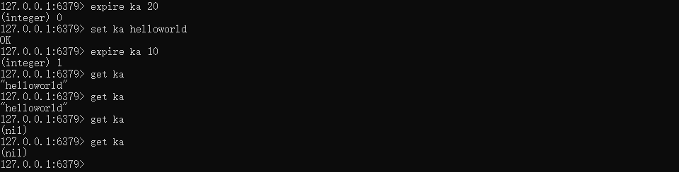

# Redis中Key过期

## 简介

有时候我们并不希望redis的key一直存在。例如缓存，验证码等数据，我们希望它们能在一定时间内自动的被销毁。redis提供了一些命令，能够让我们对key设置过期时间，并且让key过期之后被自动删除。

## 相关命令

### EXPIRE和PEXPIRE

EXPIRE key "seconds"

接口描述：设置一个key在当前时间"seconds"(秒)之后过期。返回1代表设置成功，返回0代表key不存在或者无法设置过期时间。

PEXPIRE key "milliseconds"

接口描述：设置一个key在当前时间"milliseconds"(毫秒)之后过期。返回1代表设置成功，返回0代表key不存在或者无法设置过期时间。

### EXPIREAT和PEXPIREAT

EXPIREAT 接口定义：EXPIREAT key "timestamp"

　　接口描述：设置一个key在"timestamp"(时间戳(秒))之后过期。返回1代表设置成功，返回0代表key不存在或者无法设置过期时间。

PEXPIREAT 接口定义：PEXPIREAT key "milliseconds-timestamp"

　　接口描述：设置一个key在"milliseconds-timestamp"(时间戳(毫秒))之后过期。返回1代表设置成功，返回0代表key不存在或者无法设置过期时间

### TTL和PTTL

**TTL** 接口定义：TTL key

　　接口描述：获取key的过期时间。如果key存在过期时间，返回剩余生存时间(秒)；如果key是永久的，返回-1；如果key不存在或者已过期，返回-2。

**PTTL** 接口定义：PTTL key

　　接口描述：获取key的过期时间。如果key存在过期时间，返回剩余生存时间(毫秒)；如果key是永久的，返回-1；如果key不存在或者已过期，返回-2。

#### 

### PERSIST

**PERSIST** 接口定义：PERSIST key

　　接口描述：移除key的过期时间，将其转换为永久状态。如果返回1，代表转换成功。如果返回0，代表key不存在或者之前就已经是永久状态。

### SETEX

**SETEX** 接口定义：SETEX key "seconds" "value"

　　接口描述：SETEX在逻辑上等价于SET和EXPIRE合并的操作，区别之处在于SETEX是一条命令，而命令的执行是原子性的，所以不会出现并发问题。　

## Redis如何清理过期key　

redis出于性能上的考虑，无法做到对每一个过期的key进行即时的过期监听和删除。但是redis提供了其它的方法来清理过期的key。

- 被动清理

  当用户主动访问一个过期的key时，redis会将其直接从内存中删除。

- 主动清理

　　在redis的持久化中，我们知道redis为了保持系统的稳定性，健壮性，会周期性的执行一个函数。在这个过程中，会进行之前已经提到过的自动的持久化操作，同时也会进行内存的主动清理。

　　在内存主动清理的过程中，redis采用了一个随机算法来进行这个过程：简单来说，redis会随机的抽取N(默认100)个被设置了过期时间的key，