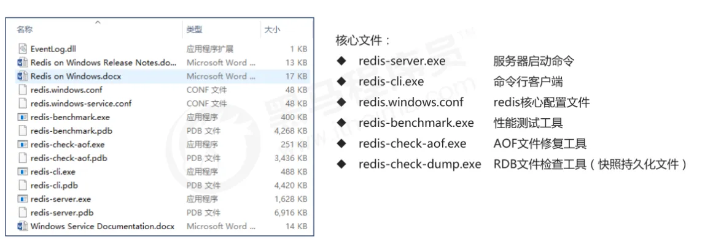

# Redis安装

## Redis目录结构



## 客户端UI

- [AnotherRedisDesktopManager](https://github.com/qishibo/AnotherRedisDesktopManager) 一款比较稳定简洁的 redis UI 工具。[AnotherRedisDesktopManager 发行版 - Gitee.com](https://gitee.com/qishibo/AnotherRedisDesktopManager/releases)

- redis-desktop-manager-0.8.8.384  https://www.alipan.com/s/chJuKNm6iQ7 提取码: 29rw 

## Windows 环境安装Redis

安装包下载：[Index of /releases/](https://download.redis.io/releases/)

[在 windows 上安装 Redis](https://redis.com.cn/redis-installation.html)

## docker 安装Redis

```bash
docker run -d --name redis-test -p 6379:6379 redis:latest --requirepass "密码"
```


