# 路人的 SpringMVC 系列来了！！！


本文由 [简悦 SimpRead](http://ksria.com/simpread/) 转码， 原文地址 https://mp.weixin.qq.com/s?__biz=MzA5MTkxMDQ4MQ==&mid=2648940259&idx=1&sn=89b71abf95db83f96c046830b393215a&chksm=886206ddbf158fcbf886df462ed57e4e92d430737fa39d76c35d11274ce3caca49774ca57a52&scene=178&cur_album_id=1873497824336658435#rd

**大家好，我是路人**，前段时间把 spring 系列写完之后，就直接写 springboot 系列了，但是发现了一个问题，有不少粉丝问我 springmvc 系列哪里看？这些粉丝中可能有些朋友根本没有接触过 springmvc，然后直接被我带入了 springboot，会突然感觉很懵逼。

目前大多数公司都会使用 Springboot 来开发微服务，为其他端提供接口，而这些功能都是依靠 springmvc 实现的，所以为了大家看我的文章能够顺畅一些，还是决定先把 springmvc 系列补上，不管大家是否学过 springmvc，都希望你们和我一起再过一遍 springmvc，因为每个人对 springmvc 的理解也是不一样的，我会采用大量案例来进行讲解，也会介绍原理及源码，希望对你有所帮助。

## 1、为什么需要学 springmvc？

工作需要

目前用到 java 的企业，99.99% 都会用到 springmvc，即使没有直接使用 springmvc，也会使用 springboot，而 springboot 中基本上都会用到 springmvc

面试需要

企业都在使用 springmvc，所以面试的时候基本都会问到相关的问题。

更好的学习 springboot、springcloud

如果想学好 springboot 和 springcloud，那么必须先掌握 spring、springmvc 这 2 个技术。

## 2、预备知识

学习 springmvc 之前，需要先掌握 2 个系列的课程：maven 和 spring，还未学的朋友，先去补补。

- [路人甲 Java - maven 系列](http://mp.weixin.qq.com/s?__biz=MzA5MTkxMDQ4MQ==&mid=2648933753&idx=1&sn=0b41083939980be87a61c4f573792459&chksm=88621d47bf1594516092b662c545abfac299d296e232bf25e9f50be97e002e2698ea78218828&scene=21#wechat_redirect)
- [路人甲 Java - spring 高手系列](http://mp.weixin.qq.com/s?__biz=MzA5MTkxMDQ4MQ==&mid=2648939328&idx=1&sn=4eecdb72f0cb1206ebbcc8af59886980&chksm=8862037ebf158a68a770f10062e6816281220a6ed5debff60b05441e4fe619ccfaac9df6be95&scene=21#wechat_redirect)

## 3、软件版本

- idea 2020.3.3
- jdk1.8
- ≥maven3.6.1
- spring5.3.6
- apache-tomcat-9.0.46

## 4、本文目标

通过 springmvc 实现一个 helloword，将项目发布到 tomcat 中，然后在首页中发起一个请求，请求交给 springmvc 处理，由 springmvc 向客户端输出一个 helloword，通过这个案例让大家熟悉下 springmvc 的使用步骤。

## 5、Helloword 案例

### 开发步骤

1、创建一个maven项目
2、在项目中创建一个maven web模块
3、maven中添加springmvc相关依赖
4、web.xml中配置springmvc
5、添加springmvc配置文件
6、写一个HelloWordController
7、将项目部署到tomcat中
8、浏览器中验证效果

下面跟着我一步步来操作。

### step1：创建一个 maven 项目

使用 idea 创建父子项目，打开 idea->File->New->Project


按照下图输入对应的信息


点击 Finish，项目创建成功，如下图

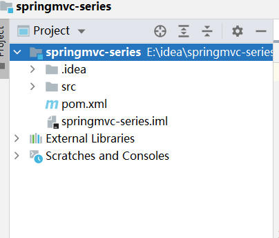

按照下图中的说明，将红框的部分删除

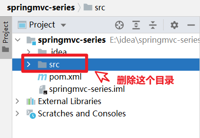

将 pom.xml 文件内容替换为下面的内容

```xml
<project xmlns="http://maven.apache.org/POM/4.0.0"
  xmlns:xsi="http://www.w3.org/2001/XMLSchema-instance"
  xsi:schemaLocation="http://maven.apache.org/POM/4.0.0 http://maven.apache.org/xsd/maven-4.0.0.xsd">
  <modelVersion>4.0.0</modelVersion>

  <groupId>com.javacode2018</groupId>
  <artifactId>springmvc-series</artifactId>
  <version>1.0-SNAPSHOT</version>
  <packaging>pom</packaging>

  <properties>
    <maven.compiler.source>8</maven.compiler.source>
    <maven.compiler.target>8</maven.compiler.target>
  </properties>

</project>
```

此时项目结构如下图

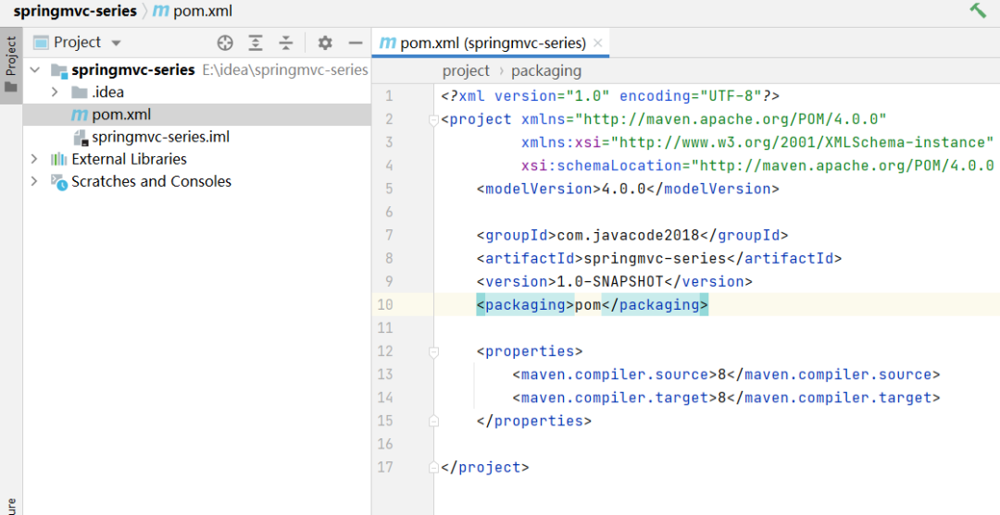

如下图，`File->Settings`中指定项目 maven 的版本

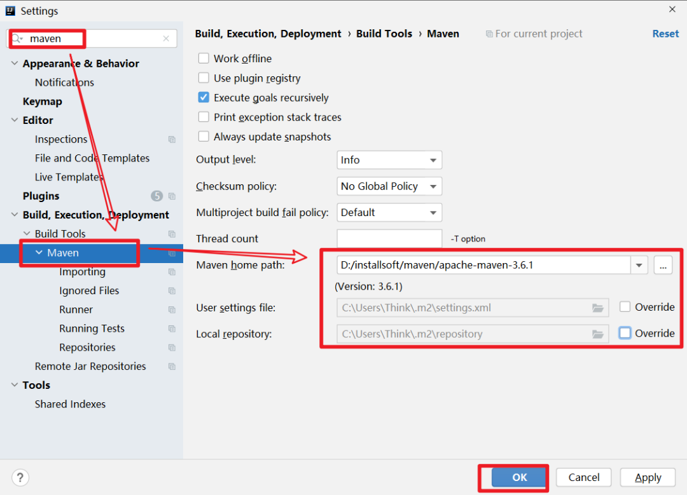

### step2、项目中创建一个 maven 模块

选中项目 -> 点击鼠标右键 ->New->Module，创建一个 maven 模块


如下图，通过 maven 的插件来创建 web 模块，这个地方的 maven 插件需要注意下，不要选错了

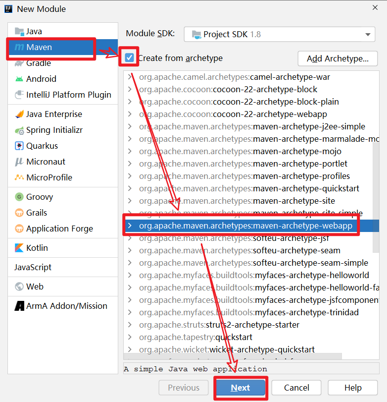

点击上图中的 Next，进入下面页面，输入模块的信息，然后点击 Next


如下图，继续点击 Finish，完成模块的创建


项目结构如下图

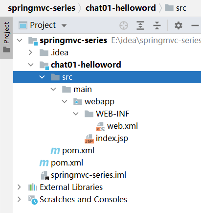

chat01-helloword 模块中需要添加几个文件夹，操作如下图：


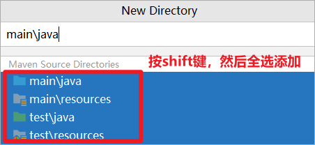

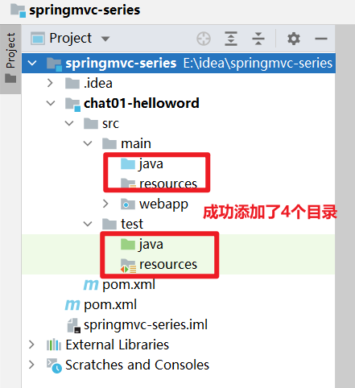

### step3、maven 中添加 springmvc 相关依赖

将下面内容替换到 chat01-helloword/pom.xml 中，主要添加了 springmvc 和 servlet 的依赖配置信息。

```xml
<project xmlns="http://maven.apache.org/POM/4.0.0" xmlns:xsi="http://www.w3.org/2001/XMLSchema-instance"
  xsi:schemaLocation="http://maven.apache.org/POM/4.0.0 http://maven.apache.org/xsd/maven-4.0.0.xsd">
  <modelVersion>4.0.0</modelVersion>

  <groupId>com.javacode2018</groupId>
  <artifactId>chat01-helloword</artifactId>
  <version>1.0-SNAPSHOT</version>
  <packaging>war</packaging>

  <name>chat01-helloword Maven Webapp</name>
  <url>http://www.itsoku.com</url>

  <properties>
    <project.build.sourceEncoding>UTF-8</project.build.sourceEncoding>
  </properties>

  <dependencies>

    <dependency>
      <groupId>org.springframework</groupId>
      <artifactId>spring-webmvc</artifactId>
      <version>5.3.6</version>
    </dependency>


    <dependency>
      <groupId>jakarta.servlet</groupId>
      <artifactId>jakarta.servlet-api</artifactId>
      <version>5.0.0-M1</version>
      <scope>provided</scope>
    </dependency>
  </dependencies>

  <build>
    <finalName>chat01-helloword</finalName>
  </build>
</project>
```

### step4、web.xml 中配置 springmvc

web.xml 版本太低了，我们先升级下他的版本


点击`File->Project Structure->Module`，进入到下面界面


点击上图中的`-`按钮，如下图，然后确定删除

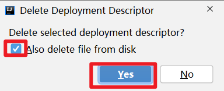


然后按照下面操作，添加新版本的 web.xml 文件


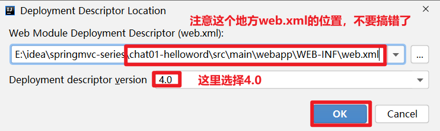

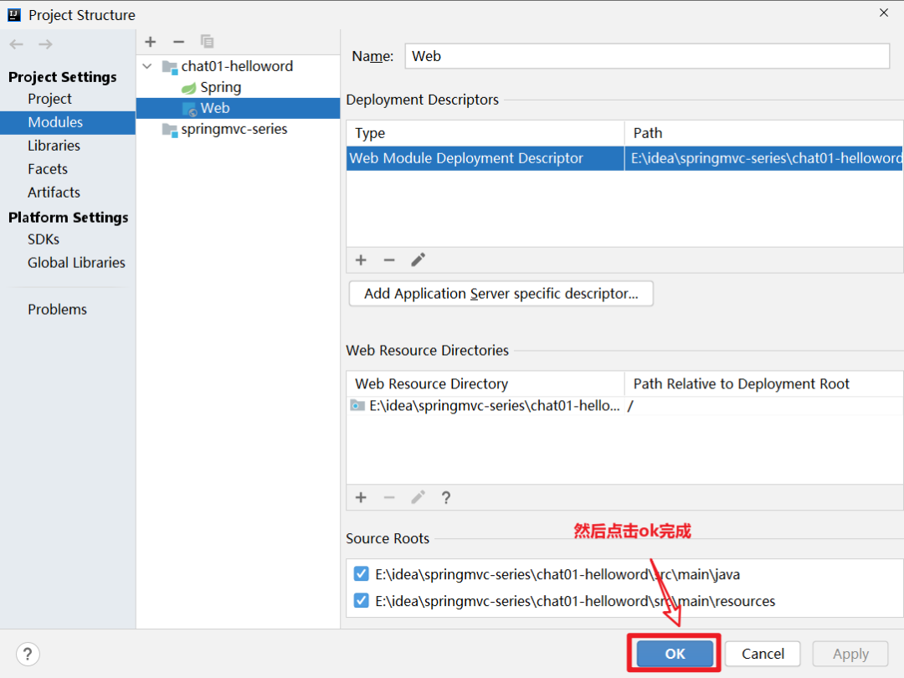

web.xml 版本升级成功

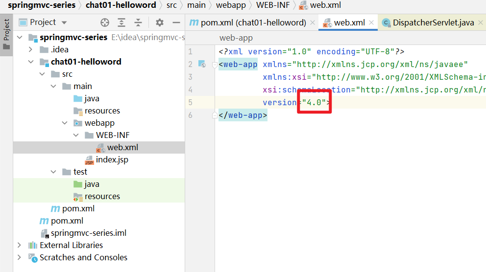

在 web.xml 中添加 springmvc 的配置，可以直接将下面代码直接替换到 web.xml 中，主要就是配置了 DispatcherServlet 这个 servlet，这个是 springmvc 的核心配置

```xml
<web-app xmlns="http://xmlns.jcp.org/xml/ns/javaee"
  xmlns:xsi="http://www.w3.org/2001/XMLSchema-instance"
  xsi:schemaLocation="http://xmlns.jcp.org/xml/ns/javaee http://xmlns.jcp.org/xml/ns/javaee/web-app_4_0.xsd"
  version="4.0">

  <servlet>
    <servlet-name>springmvc</servlet-name>
    <servlet-class>org.springframework.web.servlet.DispatcherServlet</servlet-class>
    <init-param>

      <param-name>contextConfigLocation</param-name>
      <param-value>classpath:springmvc.xml</param-value>
    </init-param>

    <load-on-startup>0</load-on-startup>
  </servlet>
  <servlet-mapping>
    <servlet-name>springmvc</servlet-name>
    <url-pattern>*.do</url-pattern>
  </servlet-mapping>
</web-app>
```

### step5、添加 springmvc 配置文件

```
chat01-helloword->resource->鼠标右键->New->XXML Configuration File->Spring Config
```


输入文件名称：springmvc.xml

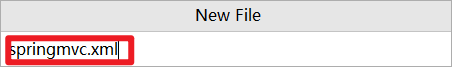

文件添加成功

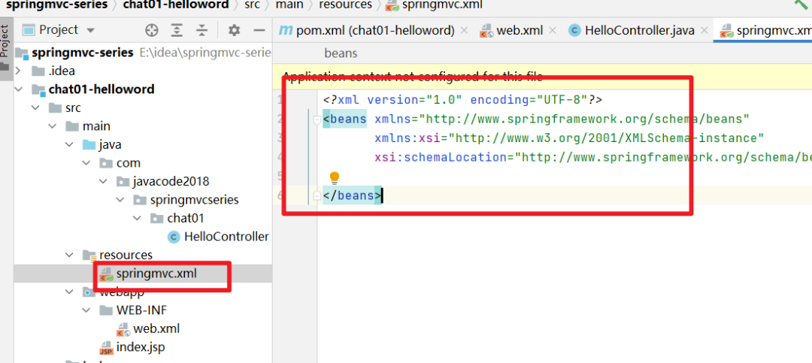

替换下这个文件的内容

```xml
<beans xmlns="http://www.springframework.org/schema/beans"
  xmlns:xsi="http://www.w3.org/2001/XMLSchema-instance"
  xmlns:context="http://www.springframework.org/schema/context"
  xsi:schemaLocation="http://www.springframework.org/schema/beans http://www.springframework.org/schema/beans/spring-beans.xsd http://www.springframework.org/schema/context https://www.springframework.org/schema/context/spring-context.xsd">


  <context:component-scan base-package="com.javacode2018.springmvcseries.chat01"/>

</beans>
```

### step6、写一个 HelloWordController

这个类中创建了一个 hello 方法，方法上面添加了一个 @RequestMapping 注解，是 Springmvc 中的一个注解，value 属性用来指定一个 url 列表，springmvc 会将这些指定的 url 请求转发给当前方法处理。

我们希望访问 / hello.do 的时候，跳转到 / WEB-INF/view/hello.jsp 这个页面，这个页面中输出一段内容

```java
package com.javacode2018.springmvcseries.chat01;

import org.springframework.stereotype.Controller;
import org.springframework.web.bind.annotation.RequestMapping;
import org.springframework.web.servlet.ModelAndView;

@Controller
public class HelloController {
    /**
     * @RequestMapping：用来表示url和方法的映射
     * value属性用来指定一个url列表，springmvc会将这些指定的url请求转发给当前方法处理
     * @return
     */
    @RequestMapping("/hello.do")
    public ModelAndView hello() {
        ModelAndView modelAndView = new ModelAndView();
        modelAndView.setViewName("/WEB-INF/view/hello.jsp");
        //稍后将这个信息显示在hello.jsp中，modelAndView.addObject相当于request.setAttribute(name,value)
        modelAndView.addObject("msg","这是第一个springboot程序!");
        return modelAndView;
    }
}
```

/WEB-INF/view / 中添加 hello.jsp 内容如下


```html
<%@ page contentType="text/html;charset=UTF-8" language="java" %>
<html>
<head>
    <title>Hello SpringMvc</title>
</head>
<body>
<h2>hello SpringMVC</h2>
<p>msg:${message}</p>
</body>
</html>
```

修改 index.jsp 的内容，如下，主要添加一个超链接，当点击这个超链接的时候，请求会发给 springmvc，然后 springmvc 会将请求转发给 HelloController 的 hello 方法，然后通过这个方法最后将 hello.jsp 内容输出

```html
<html>
<body>
<a href="hello.do">springmvc第一个案例</a>
</body>
</html>
```

### `step7、将项目部署到 tomcat 中`

这里我们将项目部署到 tomcat10 中，过程如下：

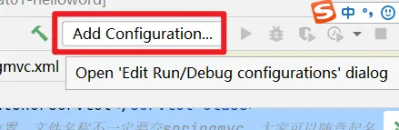

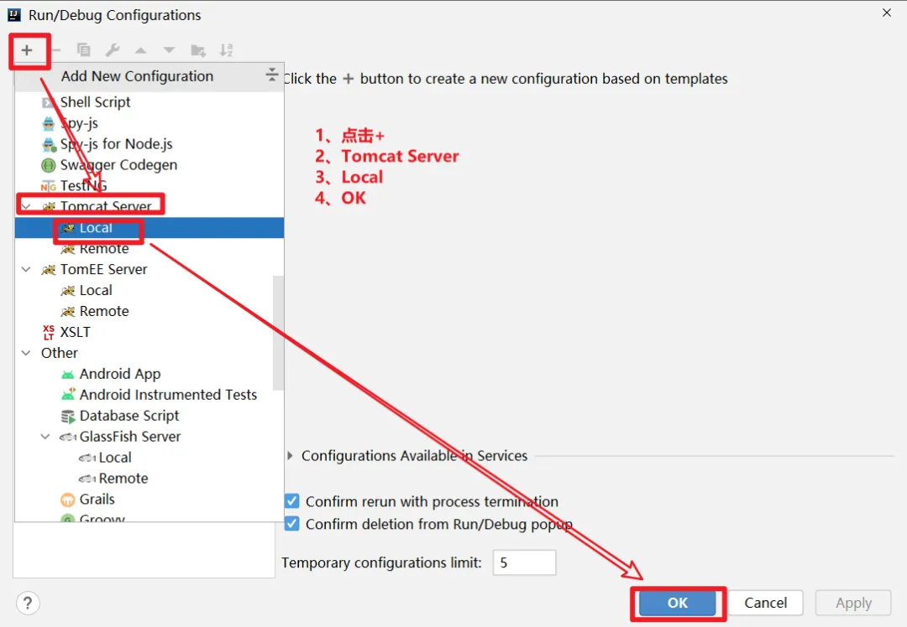


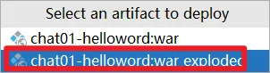

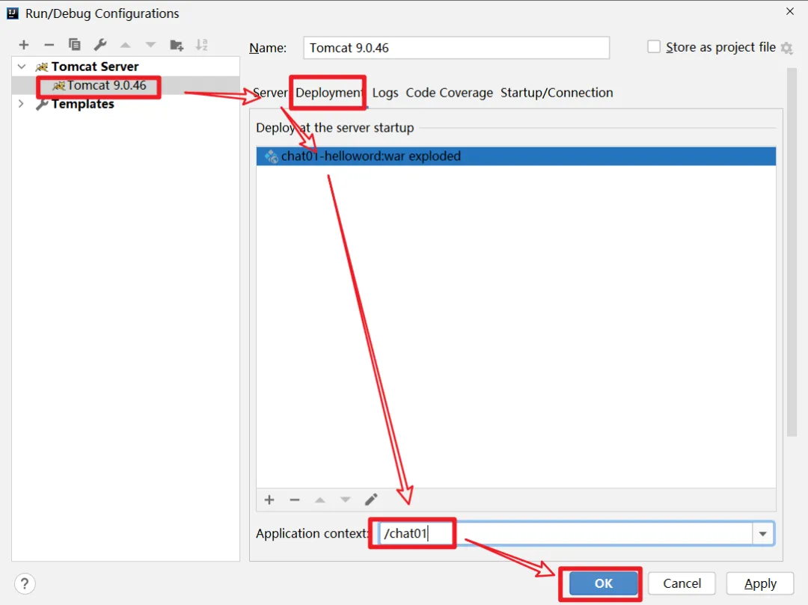


如下图，启动 tomcat


### step8、验证效果

访问：http://localhost:8080/chat01/

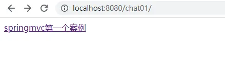

点击页面中的连接，会跳转到http://localhost:8080/chat01/hello.do，输出


## 6、SpringMVC 处理请的过程

### 6.1、详细的过程

1、tomcat 启动的时候，会初始化 DispatcherServlet，DispatcherServlet 中会创建一个 springmvc 容器，其实就是我们熟悉的 spring 容器（ApplicationContext），只不过这个容器的类型是（WebApplicationContext），此容器会加载 web.xml 中 contextConfigLocation 指定的 springmvc 配置文件


2、由于 springmvc.xml 中指定了扫描包的规则，而 HelloController 符合这个扫描规则，所以会被注册到 springmvc 容器中

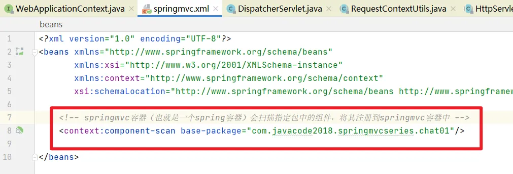

3、当发起*.do 请求的时候，请求会到达 DispatcherServlet 中央处理器，中央处理器会根据请求路径，去 springmvc 容器中找到能够处理这个请求的方法，具体由哪个方法来处理这个请求呢？

这里就是通过@RequestMapping 来匹配的，这个注解可以将请求和方法进行映射，匹配的请求会被@RequestMapping 标注的方法处理，所以在这个步骤中 springmvc 容器会发现 HelloController 这个 bean 的 hello 方法方法可以处理/hello.do 请求


4、DispatcherServlet 中通过反射来调用 helloController 这个 bean 的 hello 方法


5、DispatcherServlet 接收到了 hello 方法的返回值


6、DispatcherServlet 根据 hello 方法的返回值，做跳转操作，相当于

```java
request.getRequestDispatcher("/WEB-INF/view/hello.jsp").forward(request,response);
```

### 6.2、简化过程

客户端发送请求 ---> 到达 tomcat ---> tomcat 发现是请求是*.do 的请求 ---> tomcat 将请求转发给中央调度器 DispatcherServlet ---> 中央调度器根据 url 将转发给我们自定义的 controller ---> DispacherServlet 根据 controller 的返回结果做跳转操作 ---> 将结果输出到客户端

## 7、总结

本文主要通过一个案例详细介绍了 springmvc 开发项目的一个过程，大家把案例敲一遍，有问题，欢迎留言交流。

## 8、软件及代码位置

软件地址：

链接：https://pan.baidu.com/s/1_Ol-UZkN_6woMBtjcFygvQ

提取码：e66j


代码位于码云上

https://gitee.com/javacode2018/springmvc-series

