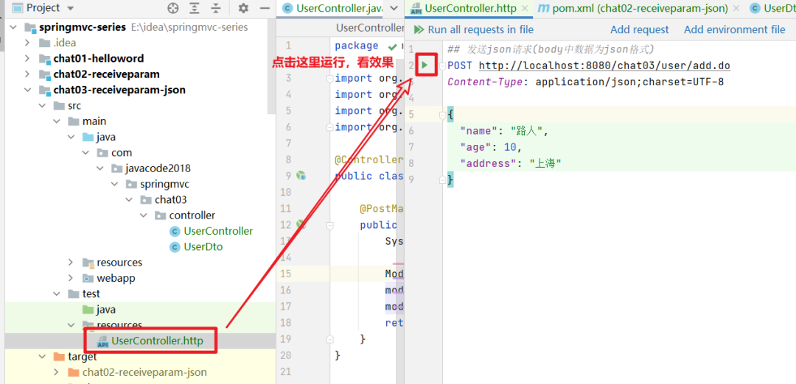
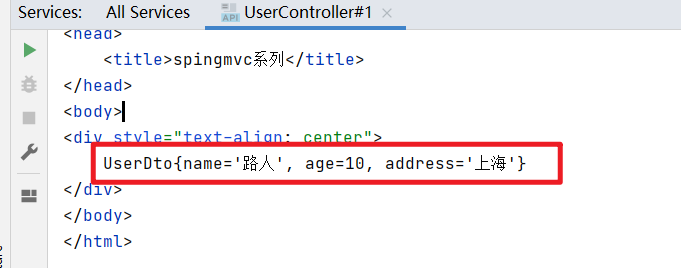
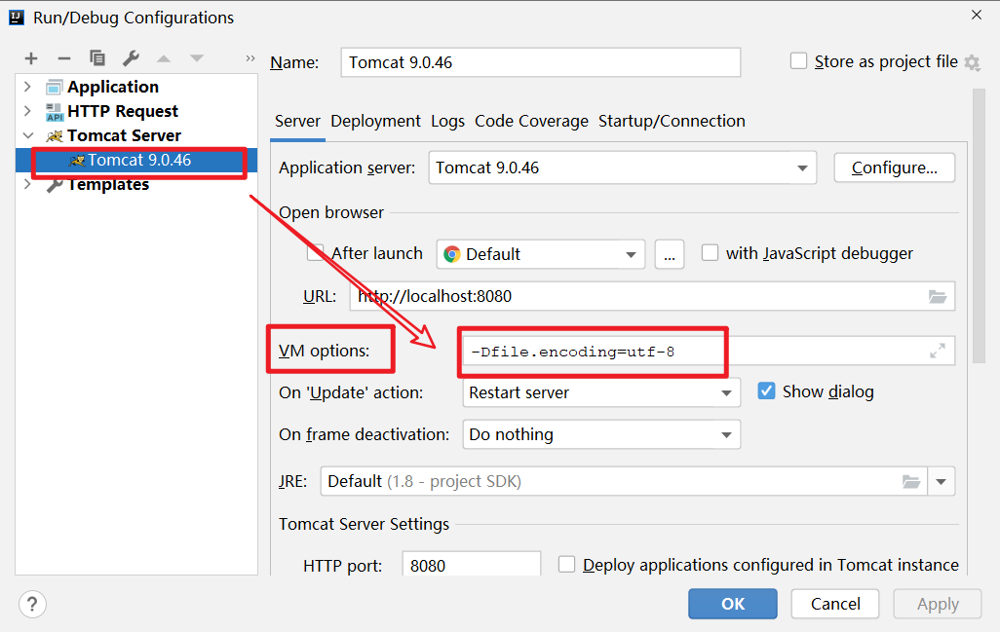

# SpringMVC第5篇 @RequestBody大解密，说点你不知道的

本文由 [简悦 SimpRead](http://ksria.com/simpread/) 转码， 原文地址 [mp.weixin.qq.com](https://mp.weixin.qq.com/s?__biz=MzA5MTkxMDQ4MQ==&mid=2648940539&idx=1&sn=155ec6022fa6e6f3f96f7eb767900b02&chksm=886207c5bf158ed3873d2a3b269f832727eb4b0552a54d0a2ce7229e4bc033911e2c7e48321e&scene=178&cur_album_id=1873497824336658435#rd)

## 本文内容

1、掌握接收 json 格式数据的使用步骤及原理

2、掌握 @RequestBody 注解的用法

3、**（重点）通过源码来分析控制器具体可以接收哪些参数**

## 软件版本

1、idea 2020.3.3

2、jdk1.8

3、≥maven3.6.1

4、spring5.3.6

5、apache-tomcat-9.0.46

## json 格式数据的好处

当 http 请求传输的数据格式比较复杂的时，可以采用 json 格式

- 数据量更小
- 组装数据更容易
- 数据结构看起来更清晰

## Http 发起 json 格式的请求

1、头中需要设置 Content-Type 的值为 application/json

2、请求 body 中数据格式为 json 文本


## 我们来实现一个需求

http 发送 json 格式的请求，如：

```http
## 发送json请求(body中数据为json格式)
POST http://localhost:8080/chat03/user/add.do
Content-Type: application/json;charset=UTF-8

{
  "name": "路人",
  "age": 10,
  "address": "上海"
}
```

我们希望下面这个方法可以处理这个请求，由 springmvc 负责将 body 中的 json 格式的数据转换为 UserDto 对象，然后传递给下面的 add 方法。

```java
@PostMapping("/user/add.do")
public ModelAndView add(UserDto user)
public class UserDto {
    //姓名
    private String name;
    //年龄
    private Integer age;
    //地址
    private String address;

    //省略get、set

    @Override
    public String toString() {
        return "UserDto{" +
        " + name + '\'' +
        ", age=" + age +
        ", address='" + address + '\'' +
        '}';
    }
}
```

## SpringMVC 接受 json 格式数据 (3 个步骤)

### 步骤 1：maven 添加 jackson 配置

```xml
<dependency>
  <groupId>com.fasterxml.jackson.core</groupId>
  <artifactId>jackson-core</artifactId>
  <version>2.11.4</version>
</dependency>

<dependency>
  <groupId>com.fasterxml.jackson.core</groupId>
  <artifactId>jackson-databind</artifactId>
  <version>2.11.4</version>
</dependency>
```

jackson 是一个 json 工具包，可以将 json 格式的字符串和 java 对象互转。

而我们 body 中的数据是 json 格式的，controller 中方法是 java 对象，所以需要将 json 数据转换为 java 对象。

而 json 库有很多，比如 jackson、gson、fastjson，此处我们使用 springmvc 推荐的 jackson。

### 步骤 2：springmvc 中添加 mvc 驱动配置

```xml
<mvc:annotation-driven/>
```

**这 2 个步骤配置好了之后，springmvc 就被赋予了一个强大的功能，有能力将 http 请求 body 中 json 格式的数据转换为 java 对象。**

透露一下原理：springmvc 容器中被添加了一个 MappingJackson2HttpMessageConverter 对象，这个类可以将 body 中 json 格式的数据转换为 java 对象，内部用到的是 jackson。

MappingJackson2HttpMessageConverter 这类就是在步骤 1 添加的 maven 包中。

### 步骤 3：方法参数使用 @RquestBody 注解标注

当我们希望 controller 中处理器的方法参数的数据来源于 http 请求的 body 时，需要在参数的前面加上 @RequestBody 注解

```java
@PostMapping("/user/add.do")
public ModelAndView add(@RequestBody UserDto user) {
    System.out.println("user:" + user);

    ModelAndView modelAndView = new ModelAndView();
    modelAndView.setViewName("/WEB-INF/view/result.jsp");
    modelAndView.addObject("msg", user);
    return modelAndView;
}
```

就这么简单，此时这个方法就可以接受 json 格式的数据，springmvc 会自动将 body 中 json 格式的字符串转换为 UserDto 对象，然后传递给上面的 add 方法的第一个参数。

### 案例代码

1、拉取代码

https://gitee.com/javacode2018/springmvc-series

2、导入 idea


3、发布到 tomcat

4、运行用例，用例的位置



输出的结果如下，可以看出 json 数据被 UserDto 接收成功了。



## @RequestBody 注解

### 作用

**用来接收 http 请求 body 的数据。**

HTTP 请求大家比较熟悉，比如 POST 方式提交的请求，是有个 body 部分的，在 springmvc 中，我们希望控制器的方法中某个参数的值为 http 请求中的 body 的值，那么只需要在这个参数的前面加上 @RequestBody 注解，springmvc 会将 http 请求中 body 的数据读取出来，然后传递给这个参数。

来看 2 个案例。

### 案例 1：使用 String 类型接受 body

```java
public void m1(@RequestBody String body)
```

springmvc 会将请求中 body 部分的数据读取出来，转换为 String 类型传递给这个参数。

### 案例 2：使用字节数组接受 body 的数据

```java
public void m1(@RequestBody byte[] bytes);
```

springmvc 会将请求中 body 部分的数据读取出来，然后转换为字节数组然后传递给 bytes 参数。

### 2 个案例代码位置


## (重点)HandlerMethodArgumentResolver

这里给大家扩展点知识，到目前我们知道可以使用 @RequestParam 接收表单的值，@RequestBody 可以接收请求中 body 的数据，@PathVariable 可以接受 url 中动态参数。

**那么问题来了，控制器的方法具体可以接收哪些类型的参数呢？这是个好问题**

**说句实话，可以接收参数的类型非常的多，这里我教大家大家一招，看看 springmvc 具体可以接受哪些类型的参数。**

这里只需要掌握一个关键的接口就可以了：**HandlerMethodArgumentResolver（控制器方法参数解析器）**，这个接口特别重要，负责将 http 请求中的数据转换为 controller 中的方法能够接收的数据，就是根据控制器中方法参数信息，将 http 请求中的信息，转换控制器方法需要的参数的值。

这个接口有 2 个方法大家需要掌握

```java
public interface HandlerMethodArgumentResolver {
    //判断当前解析器是否能处理这个parameter这个参数，也就是说是否能够将请求中的数据转换为parameter指定的参数的值
    boolean supportsParameter(MethodParameter parameter);

    //解析参数：从http请求中解析出控制器需要的参数的值
    Object resolveArgument(MethodParameter parameter, @Nullable ModelAndViewContainer mavContainer,NativeWebRequest webRequest, @Nullable WebDataBinderFactory binderFactory) throws Exception;
}
```

这个接口有很多实现类，列几个比较熟悉的，当大家想知道 springmvc 还可以接收哪些类型的参数，以及这些参数有什么特点的时候，看看源码

| 实现类                                | 对应的控制器参数                                        | 说明                                              |
| ------------------------------------- | ------------------------------------------------------- | ------------------------------------------------- |
| PathVariableMapMethodArgumentResolver | @PathVariable 标注参数                                  | 从 url 中提取参数的值                             |
| RequestHeaderMethodArgumentResolver   | @RequestHeader 标注参数                                 | 从 http 头中提取参数值                            |
| RequestParamMethodArgumentResolver    | @RequestParam 标注参数                                  | http 请求参数中获取值                             |
| RequestResponseBodyMethodProcessor    | @RequestBody 标注参数                                   | 提取 body 数据，转换为参数类型                    |
| ServletResponseMethodArgumentResolver | ServletResponse、OutputStream、Writer 这 3 种类型的参数 | 这几种类型用来控制 http 请求的响应输出流          |
| HttpEntityMethodProcessorHttpEntity   | HttpEntity 类型的参数                                   | HttpEntity 中包含了 http 请求头和 body 的所有信息 |
| ExpressionValueMethodArgumentResolver | @Value 标注的参数                                       | spel 表达式，从 spring 容器中获取值               |
| MapMethodProcessor                    | 参数为 Map 或者子类型                                   | -                                                 |
| ModelMethodProcessor                  | 参数为 org.springframework.ui.Model 或子类型            | -                                                 |
| ModelAttributeMethodProcessor         | @ModelAttribute 标注的参数                              | -                                                 |

## tomcat9 乱码问题

大家在 tomcat9 中跑案例的时候，控制台可能会输出乱码，需要配置下编码

