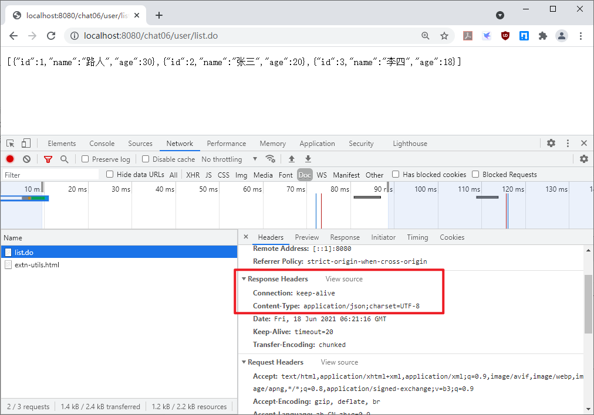
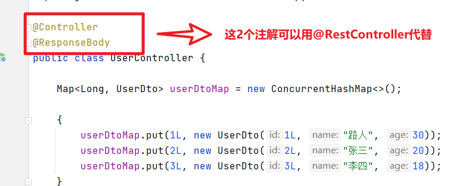
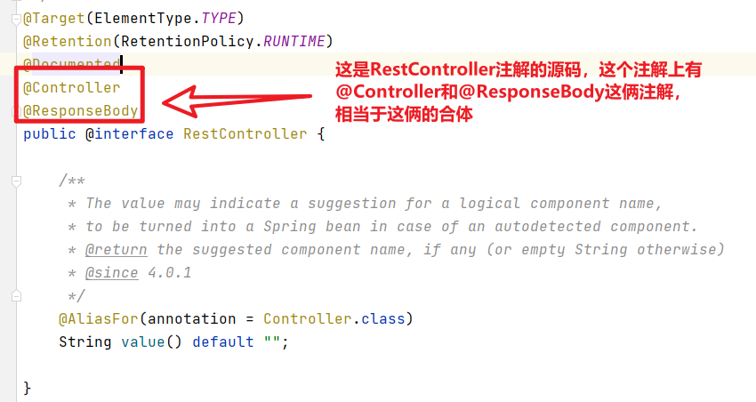
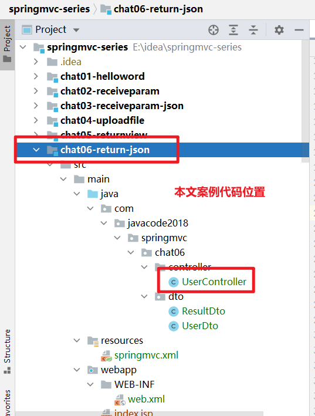

目前比较流行前后端分离，后端只需为前端提供 restfull 接口，所有的接口都返回 json 格式的数据，前端接收到 json 数据之后再进行处理。

那么在 SpringMVC 中如何向前端输出 json 格式的数据呢？

常见的有 3 种方式，我们来了解下。

## 1、方式 1：方法上添加 @ResponseBody

### 需求

使用 springmvc 提供一个接口，以 json 格式输出用户列表。

### 3 个步骤

#### step1：maven 配置引入 jackjson

jackjson 用于将 java 对象转换为 json 格式的字符串，也可以将 json 格式的字符串转换为 java 对象

我们的接口需要将 java 对象转换为 json 格式的字符串输出到客户端，所以我们需要用到这个包。

```
<dependency>
    <groupId>com.fasterxml.jackson.coregroupId>
    <artifactId>jackson-coreartifactId>
    <version>2.11.4version>
dependency>

<dependency>
    <groupId>com.fasterxml.jackson.coregroupId>
    <artifactId>jackson-databindartifactId>
    <version>2.11.4version>
dependency>
```

#### step2：springmvc 配置文件中添加注解驱动

```
<mvc:annotation-driven/>
```

添加了这段代码之后，springmvc 就被赋予了将 java 对象转换为 json 格式字符串输出到客户端的能力。

#### step3：处理器的方法上添加 @ResponseBody 注解

如下代码，我们希望 list() 方法用于向客户端以 json 格式输出用户列表。

此时只需要在这个方法上面添加一个`@ResponseBody`注解，SpringMVC 发现这个方法上有`@ResponseBody`这个注解，并且方法返回值是一个普通的 java 对象的时候，会将方法的返回值使用 jackson 转换为 json 格式的字符串，然后输出到客户端。

```
@Controller
public class UserController {
    /**
     * 用户列表(用户id->用户信息)
     */
    Map userDtoMap = new ConcurrentHashMap<>();

    {
        userDtoMap.put(1L, new UserDto(1L, "路人", 30));
        userDtoMap.put(2L, new UserDto(2L, "张三", 20));
        userDtoMap.put(3L, new UserDto(3L, "李四", 18));
    }

    @GetMapping("/user/list.do")
    @ResponseBody
    public Collection list() {
        return this.userDtoMap.values();
    }

}
```

### 验证效果

谷歌浏览器中访问下这个接口


F12 看一下接口的响应头，如下，可以看到 response 的`Content-Type`的值为`application/json;chatset=UTF-8`，这个说明响应结果的内容格式是 json 格式。





## 2、方式 2：Controller 上添加 @ResponseBody 注解

当我们 controller 中方法很多的时候，且所有方法都要求返回 json 格式的数据的时候，如果按照方式 1，我们需要在每个方法上都要添加`@ResponseBody`注解，此时有更简单的方法，将所有方法上的`@ResponseBody`注解都去掉，然后在 Controller 上加上`@ResponseBody`就可以了。

比如下面这段代码，我们可以将 2 个方法上面的`@ResponseBody`干掉，然后在类上添加`@ResponseBody`注解就可以了。

```
@Controller
public class UserController {

    Map userDtoMap = new ConcurrentHashMap<>();

    {
        userDtoMap.put(1L, new UserDto(1L, "路人", 30));
        userDtoMap.put(2L, new UserDto(2L, "张三", 20));
        userDtoMap.put(3L, new UserDto(3L, "李四", 18));
    }

    @GetMapping("/user/list.do")
    @ResponseBody
    public Collection list() {
        return this.userDtoMap.values();
    }


    @GetMapping("/user/{id}.do")
    @ResponseBody
    public UserDto user(@PathVariable("id") Long id) {
        return this.userDtoMap.get(id);
    }

}
```

调整之后如下

```
@Controller
@ResponseBody
public class UserController {

    Map userDtoMap = new ConcurrentHashMap<>();

    {
        userDtoMap.put(1L, new UserDto(1L, "路人", 30));
        userDtoMap.put(2L, new UserDto(2L, "张三", 20));
        userDtoMap.put(3L, new UserDto(3L, "李四", 18));
    }

    @GetMapping("/user/list.do")
    public Collection list() {
        return this.userDtoMap.values();
    }


    @GetMapping("/user/{id}.do")
    public UserDto user(@PathVariable("id") Long id) {
        return this.userDtoMap.get(id);
    }

}
```

## 3、方式 3：Controllers 上使用 @RestController

我们回头再看下上面代码，如下图，UserController 上有 2 个注解`@Controller`和`@ResponseBody`，而 SpringMVC 提供了一个更好的注解`@RestController`，相当于这 2 个注解的合体，所以可以用来替换这 2 个注解。








## 4、restfull 接口通用返回值

客户端调用服务器端接口的时候，接口有可能会发生异常，这些异常信息需要返回给调用者，通常我们会为错误定义错误码以及提示信息。

一般我们会定义通用的返回值类型，格式如下：

```
/**
 * rest接口通用返回值数据结构
 * @param 
 */
public class ResultDto<T> {
    //接口状态（成功还是失败）
    private Boolean success;
    //错误码
    private String code;
    //提示信息
    private String msg;
    //数据
    private T data;

    public static  ResultDto success(T data) {
        return success(data, "操作成功!");
    }

    public static  ResultDto success(T data, String msg) {
        ResultDto result = new ResultDto<>();
        result.setSuccess(Boolean.TRUE);
        result.setMsg(msg);
        result.setData(data);
        return result;
    }

    //省略get、set方法

}
```

控制器中所有的方法都返回 ResultDto 类型的结果，如下代码

```
@RestController
public class UserController {

    Map userDtoMap = new ConcurrentHashMap<>();

    {
        userDtoMap.put(1L, new UserDto(1L, "路人", 30));
        userDtoMap.put(2L, new UserDto(2L, "张三", 20));
        userDtoMap.put(3L, new UserDto(3L, "李四", 18));
    }

    @GetMapping("/user/list.do")
    public ResultDto<collection> list() {
        return ResultDto.success(this.userDtoMap.values());
    }


    @GetMapping("/user/{id}.do")
    public ResultDto user(@PathVariable("id") Long id) {
        return ResultDto.success(this.userDtoMap.get(id));
    }

}
</collection
```

## 5、案例代码

```
git地址：https://gitee.com/javacode2018/springmvc-series
```





## 6、总结

- 掌握 @ResponseBody 的用法，用来返回 json 格式的数据，注意需要在 springmvc 配置文件中添加注解驱动的配置，否则调用会报错

  ```
  <mvc:annotation-driven/>
  ```

- 掌握通用接口返回值的用法