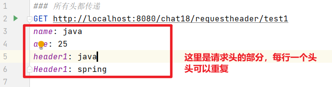
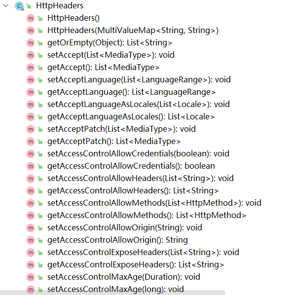
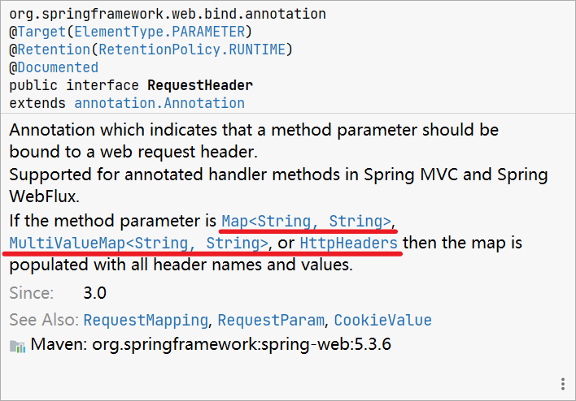
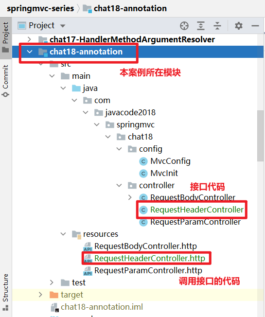

# @RequestHeader 解密，这玩意还能这么用？


> 本文由 [简悦 SimpRead](http://ksria.com/simpread/) 转码， 原文地址 [mp.weixin.qq.com](https://mp.weixin.qq.com/s?__biz=MzA5MTkxMDQ4MQ==&mid=2648943141&idx=1&sn=08e685c7dfd1df33ad7f8f9018bf8e88&chksm=8862321bbf15bb0d357d88170fa65098009a98110b0417a548be9c3af0b367c316fcf6217d6e&scene=178&cur_album_id=1873497824336658435#rd)


当我们在接口中想获取请求头的值的时候，怎么写代码更简单呢？

SpringMVC 中提供了 @RequestHeader 注解，用来获取请求头中的信息。

本文将介绍 @RequestHeader 的 4 种用法及原理。

1、预备知识
------

1.  [接口测试利器 HTTP Client](https://mp.weixin.qq.com/s?__biz=MzA5MTkxMDQ4MQ==&mid=2648940431&idx=1&sn=6c592aa2746fd448c1a6ef511189eaaa&scene=21#wechat_redirect)
    
2.  [参数解析器 HandlerMethodArgumentResolver 解密](https://mp.weixin.qq.com/s?__biz=MzA5MTkxMDQ4MQ==&mid=2648942681&idx=1&sn=eeea9d5d97e1cdd46a63cb1c953b5176&scene=21#wechat_redirect)

2、@RequestHeader 介绍
-------------------

@RequestBody 注解源码如下，可以用来标注在接口的参数上，用来获取 HTTP 请求 header 中的值，下面通过案例列出常见的 4 种用法。

```java
@Target(ElementType.PARAMETER)
@Retention(RetentionPolicy.RUNTIME)
@Documented
public @interface RequestHeader {

 /**
  * header的名称
  */
 @AliasFor("name")
 String value() default "";

 /**
  * 同value，指定header的名称
  */
 @AliasFor("value")
 String name() default "";

 /**
  * 是否是必须的，默认为ture，若指定的name在请求中不存在且未指定默认值defaultValue，则会出现异常
  */
 boolean required() default true;

 /**
  * 默认值
  */
 String defaultValue() default ValueConstants.DEFAULT_NONE;

}
```


3、用法 1：指定 name，获取指定的 header
---------------------------

### 3.1、接口代码

参数使用 @RquestHeader 标注，并指定 name 属性的值，可以获取请求头中 name 对应头的值。

test1 方法有 3 个参数：

*   name：用来获取头中 name 的值，required 为 false，表示不是必须的，并设置了 defaultValue=ready，如果 name 不传递，则默认值为 ready
    
*   age：相当于`Integer.parseInt(request.getHeader("age"))`
    
*   header1：类型为 List，相当于`Arrays.asList(request.getHeaders("header1"))`
    

```java
@RequestMapping("/requestheader/test1")
public Map<String, Object> test1(@RequestHeader(value = "name", required = false, defaultValue = "ready") String name,
                                 @RequestHeader(value = "age") int age,
                                 @RequestHeader(value = "header1") List<String> header1) {
    Map<String, Object> result = new LinkedHashMap<>();
    result.put("name", name);
    result.put("age", age);
    result.put("header1", header1);
    return result;
}
```

下面来测试 3 种场景，验证效果

### 3.2、用例 1：所有 header 都传递

```http
### 所有头都传递
GET http://localhost:8080/chat18/requestheader/test1
name: java
age: 25
header1: java
Header1: spring
```



点击红框旁边的绿色箭头运行，输出

```json
{
  "name": "java",
  "age": 25,
  "header1": [
    "java",
    "spring"
  ]
}
```

### 3.3、用例 2：name 头不传递，会使用默认值

我们将头中的 name 干掉，相当于方法的第一个参数不传递，看看什么效果

```http
### 头name不传递，会使用默认值
GET http://localhost:8080/chat18/requestheader/test1
age: 25
header1: java
header1: spring
```

运行输出如下，name 取了默认值 ready

```json
{
  "name": "ready",
  "age": 25,
  "header1": [
    "java",
    "spring"
  ]
}
```

### 3.4、用例 3：required 为 true 的，没有默认值的，不传递，会报错

大家注意第二个参数`@RequestHeader(value = "age") int age`，`required`属性取的默认值 true，表示请求头中必须有 age，否则会报错，我们直接在浏览器中访问接口，报错了，400 错误，详细信息如下，大家熟悉下，以后遇到的时候，可以快速定位


4、用法 2：不指定 name 属性，参数为 Map 类型，用来接收所有头
-------------------------------------

### 4.1、用法

当我们想获取所有头的时候，参数上使用 @RequestHeader 标注，参数类型为 Map<String,String> 类型，用来接收所有请求头

### 4.2、代码

```java
/**
 * {@link RequestHeader}不指定name，用于接收所有header的值，
 * 参数类型为Map<String,String>：key为头的名称，value为header的值
 *
 * @param headerMap
 * @return
 */
@RequestMapping("/requestheader/test2")
public Map<String, String> test2(@RequestHeader Map<String, String> headerMap) {
    return headerMap;
}
```

### 4.3、调用接口

```http
### 用法2：未指定name属性，参数为Map<String,Strintg>类型，用来接收所有头
GET http://localhost:8080/chat18/requestheader/test2
name: java
age: 25
header1: java
header1: spring
```

### 4.4、运行输出

上面调用接口的代码中传递了 4 个头，输出中却多了几个，多出的几个是 http client 自动为我们加上的几个，大家不必在意。

这里输出中有个问题，header1 我们传递了 2 个，输出中只输出了第一个的值，第二个丢失了，那是因为参数是 Map<String,String> 结构导致的，用法 3 和用法 4 会解决这个问题。

```json
{
  "name": "java",
  "age": "25",
  "header1": "java",
  "host": "localhost:8080",
  "connection": "Keep-Alive",
  "user-agent": "Apache-HttpClient/4.5.12 (Java/11.0.10)",
  "accept-encoding": "gzip,deflate"
}
```


5、用法 3：不指定 name 属性，参数为 MultiValueMap 类型，用来接收所有头
-----------------------------------------------

### 5.1、用法

用法 2 中，使用 Map 接收的时候，有重复的头的时候，同名的只会取一个，后面的会丢失，如何解决这个问题呢？

将参数类型改为 MultiValueMap 即可解决，MultiValueMap 相当于 `Map<String,List<String>>`，值是一个集合。

```java
/**
 * 参数为如果为 org.springframework.core.io.Resource 类型，
 * 则只能为Resource的[ByteArrayResource,InputStreamResource]这2种子类型:
 *
 * @param body
 * @return
 * @throws IOException
 */
@RequestMapping("/requestbody/test3")
public String test3(@RequestBody InputStreamResource body) throws IOException {
    String content = IOUtils.toString(body.getInputStream(), "UTF-8");
    System.out.println("content:" + content);
    return "ok";
}
```

### 5.2、调用接口

```
### 用法3：不指定name属性，参数为MultiValueMap类型，用来接收所有头
GET http://localhost:8080/chat18/requestheader/test3
name: java
age: 25
header1: java
header1: spring
```

### 5.3、运行输出

```
{
  "name": [
    "java"
  ],
  "age": [
    "25"
  ],
  "header1": [
    "java",
    "spring"
  ],
  "host": [
    "localhost:8080"
  ],
  "connection": [
    "Keep-Alive"
  ],
  "user-agent": [
    "Apache-HttpClient/4.5.12 (Java/11.0.10)"
  ],
  "accept-encoding": [
    "gzip,deflate"
  ]
}
```


6、用法 4：不指定 name 属性，参数为 HttpHeaders 类型，用来接收所有头
---------------------------------------------

### 6.1、HttpHeaders

上面的几种用法不是特别方便，比如获取到所有的 header 之后，此时我想获取某个头，那么我需要调用 map.get(头名) 来获取，此时我们可以将参数类型改为 HttpHeaders，用这种类型，那么就方便了，先来看看这个类是什么玩意。

SpringMVC 为咱们提供了一个更牛逼的类：HttpHeaders，用来表示 http 请求头，这个类中有很多好东西

*   实现了 MultiValueMap<String,String> 接口，而 MultiValueMap 实现了 Map 接口，相当于 `Map<String,List<String>>`
    
*   定义了大量 header 名称常量，基本所有常见的 header 名称，这个里面都有
    
*   定义了大量获取各种 header 的方法，比如`List<MediaType> getAccept()`等等，非常好用
    
*   还定义了大量 set 方法，用来设置头的信息
    




### 6.1、用法：参数为 HttpHeaders 类型，接收所有请求头

```java
/**
 * {@link RequestHeader}不指定name，用于接收所有header的值，
 * 参数类型为HttpHeaders，实现了MultiValueMap接口，HttpHeaders中提供了大量的获取头信息的各种方法，使用特别方便
 *
 * @param httpHeaders
 * @return
 */
@RequestMapping("/requestheader/test4")
public Map<String,List<String>> test4(@RequestHeader HttpHeaders httpHeaders) {
    Map<String,List<String>> result = new LinkedHashMap<>(httpHeaders);
    return result;
}
```

### 6.2、调用接口

```java
### 用法4：不指定name属性，参数为HttpHeaders类型，用来接收所有头
GET http://localhost:8080/chat18/requestheader/test4
name: java
age: 25
header1: java
header1: spring
```

### 6.3、运行输出

```json
{
  "name": [
    "java"
  ],
  "age": [
    "25"
  ],
  "header1": [
    "java",
    "spring"
  ],
  "host": [
    "localhost:8080"
  ],
  "connection": [
    "Keep-Alive"
  ],
  "user-agent": [
    "Apache-HttpClient/4.5.12 (Java/11.0.10)"
  ],
  "accept-encoding": [
    "gzip,deflate"
  ]
}
```


7、@RequestHeader 原理
-------------------

方法参数上标注了 @RequestHeader 注解的，参数的值的获取主要有 2 个类来处理

*   指定了 name 的会被 `org.springframework.web.method.annotation.RequestHeaderMethodArgumentResolver` 处理
    
*   未指定 name 的，会被 `org.springframework.web.method.annotation.RequestHeaderMapMethodArgumentResolver` 处理
    

后面这个类的源码贴出来让大家瞅瞅，特别的简单，主要就 2 个方法，第一个方法用来判断是否支持解析当前参数，判断规则就是看参数上是否有`RequestHeader`注解及参数的类型是否为 Map 类型。

resolveArgument 方法用来解析参数，代码就不解释了，简单明了，一看就懂，另外一个类`RequestHeaderMethodArgumentResolver`代码就不贴了，大家也自己去看看。

```java
public class RequestHeaderMapMethodArgumentResolver implements HandlerMethodArgumentResolver {

    @Override
    public boolean supportsParameter(MethodParameter parameter) {
        return (parameter.hasParameterAnnotation(RequestHeader.class) &&
                Map.class.isAssignableFrom(parameter.getParameterType()));
    }

    @Override
    public Object resolveArgument(MethodParameter parameter, @Nullable ModelAndViewContainer mavContainer,
                                  NativeWebRequest webRequest, @Nullable WebDataBinderFactory binderFactory) throws Exception {

        Class<?> paramType = parameter.getParameterType();
        if (MultiValueMap.class.isAssignableFrom(paramType)) {
            MultiValueMap<String, String> result;
            if (HttpHeaders.class.isAssignableFrom(paramType)) {
                result = new HttpHeaders();
            }
            else {
                result = new LinkedMultiValueMap<>();
            }
            for (Iterator<String> iterator = webRequest.getHeaderNames(); iterator.hasNext();) {
                String headerName = iterator.next();
                String[] headerValues = webRequest.getHeaderValues(headerName);
                if (headerValues != null) {
                    for (String headerValue : headerValues) {
                        result.add(headerName, headerValue);
                    }
                }
            }
            return result;
        }
        else {
            Map<String, String> result = new LinkedHashMap<>();
            for (Iterator<String> iterator = webRequest.getHeaderNames(); iterator.hasNext();) {
                String headerName = iterator.next();
                String headerValue = webRequest.getHeader(headerName);
                if (headerValue != null) {
                    result.put(headerName, headerValue);
                }
            }
            return result;
        }
    }

}
```

关于`@RequestHeader`的用法，大家其实可以去看看其源码中注释，注释中已经详细说了其用法，如下图，遇到其他的类的时候，也可以先看注释。



8、代码位置及说明
---------

### 8.1、git 地址

https://gitee.com/javacode2018/springmvc-series


### 8.2、本文案例代码结构说明



