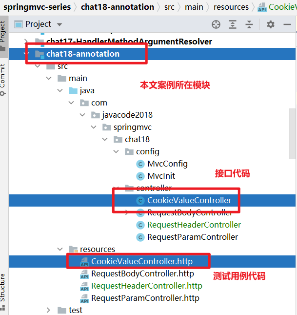

# @CookieValue解密，确实很好用啊

> 本文由 [简悦 SimpRead](http://ksria.com/simpread/) 转码， 原文地址 [mp.weixin.qq.com](https://mp.weixin.qq.com/s?__biz=MzA5MTkxMDQ4MQ==&mid=2648943427&idx=1&sn=e6deda9dfc7dffc56010984c201892e2&chksm=8862337dbf15ba6bce8d4ee058eae3a01123bfee3d2b09aa350f68d3252edb0a66ea6129aab1&scene=178&cur_album_id=1873497824336658435#rd)


当我们在接口中想获取 cookie 值的时候，怎么写代码更简单呢？

此时可以使用 SpringMVC 中的 @CookieValue 注解来标注参数，下面来看具体的用法。

1、预备知识
------

1.  [接口测试利器 HTTP Client](https://mp.weixin.qq.com/s?__biz=MzA5MTkxMDQ4MQ==&mid=2648940431&idx=1&sn=6c592aa2746fd448c1a6ef511189eaaa&scene=21#wechat_redirect)
    
2.  [参数解析器 HandlerMethodArgumentResolver 解密](https://mp.weixin.qq.com/s?__biz=MzA5MTkxMDQ4MQ==&mid=2648942681&idx=1&sn=eeea9d5d97e1cdd46a63cb1c953b5176&scene=21#wechat_redirect)
    

2、@CookieValue
--------------

*   该注释指示应将方法参数绑定到 HTTP cookie。
    
*   方法参数可以声明为`javax.servlet.http.Cookie`类型，也可以声明为 Cookie 值类型（String、int 等）。
    

```java
@Target(ElementType.PARAMETER)
@Retention(RetentionPolicy.RUNTIME)
@Documented
public @interface CookieValue {

 /**
  * cookie名称
  */
 @AliasFor("name")
 String value() default "";

 /**
  * 同value属性
  */
 @AliasFor("value")
 String name() default "";

 /**
  * 是否需要cookie。
  * 默认值为true，如果请求中缺少cookie，则会引发异常。
  * 如果请求中不存在cookie，则希望使用空值，请将此选项切换为false。
  * 或者，提供一个默认值defaultValue，它隐式地将此标志设置为false。
  */
 boolean required() default true;

 /**
  * 默认值
  */
 String defaultValue() default ValueConstants.DEFAULT_NONE;

}
```

3、2 种用法
-------

*   用法 1：参数类型为非`javax.servlet.http.Cookie`类型，比如（String、int 等类型）
    
*   用法 2：参数类型为`javax.servlet.http.Cookie`类型
    

4、案例代码
------

```java
package com.javacode2018.springmvc.chat18.controller;

import org.springframework.web.bind.annotation.CookieValue;
import org.springframework.web.bind.annotation.RequestMapping;
import org.springframework.web.bind.annotation.RestController;

import javax.servlet.http.Cookie;
import java.util.LinkedHashMap;
import java.util.Map;

@RestController
public class CookieValueController {

    @RequestMapping("/cookievalue/test1")
    public Map<String, Object> test1(@CookieValue("name") String name,
                                     @CookieValue("age") int age) {
        Map<String, Object> result = new LinkedHashMap<>();
        result.put("name", name);
        result.put("age", age);
        return result;
    }

    /**
     * @param nameCookie
     * @param ageCookie
     * @return
     */
    @RequestMapping("/cookievalue/test2")
    public Map<String, Object> test2(@CookieValue("name") Cookie nameCookie,
                                     @CookieValue("age") Cookie ageCookie) {
        Map<String, Object> result = new LinkedHashMap<>();
        result.put("nameCookie", nameCookie);
        result.put("ageCookie", ageCookie);
        return result;
    }

}
```

测试用例代码

```http
###
POST http://localhost:8080/chat18/cookievalue/test1
Cookie: name=java; age=26


###
POST http://localhost:8080/chat18/cookievalue/test2
Cookie: name=java; age=26
```

运行 2 个用例

用例 1 输出

```json
{
  "name": "java",
  "age": 26
}
```

用例 2 输出

```json
{
  "nameCookie": {
    "name": "name",
    "value": "java",
    "version": 0,
    "comment": null,
    "domain": null,
    "maxAge": -1,
    "path": null,
    "secure": false,
    "httpOnly": false
  },
  "ageCookie": {
    "name": "age",
    "value": "26",
    "version": 0,
    "comment": null,
    "domain": null,
    "maxAge": -1,
    "path": null,
    "secure": false,
    "httpOnly": false
  }
}
```

5、@CookieValue 原理
-----------------

`@CookieValue`标注的参数的值来源于`org.springframework.web.servlet.mvc.method.annotation.ServletCookieValueMethodArgumentResolver` 解析器


6、代码位置及说明
---------

### 6.1、git 地址

https://gitee.com/javacode2018/springmvc-series

### 6.2、本文案例代码结构说明



