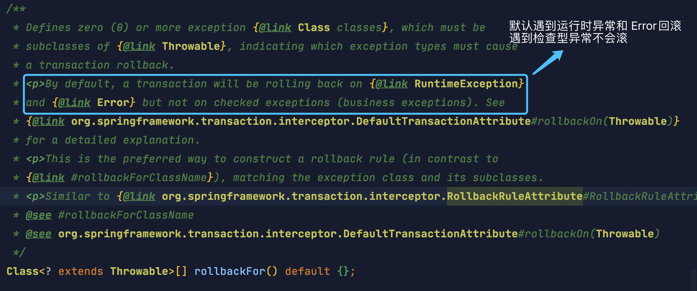

## 什么是事务

**事务是逻辑上的一组操作，要么都执行，要么都不执行。**

数据库事务（Transaction）是由若干个SQL语句构成的一个操作序列。数据库系统保证在一个事务中的所有SQL要么全部执行成功，要么全部不执行。

举个例子：假设小明准备给小红支付100，两人在数据库中的记录主键分别是123和456，那么用两条SQL语句操作如下：

```sql
-- 从id=123 的账户给id=456 的账户转账100元
-- 第一步：将id=123的A账户余额减去100
UPDATE accounts SET balance = balance - 100 WHERE id = 123;
-- 第二步：将id=2的B账户余额加上100
UPDATE accounts SET balance = balance + 100 WHERE id = 456;
```

这两条语句必须以事务方式执行才能保证业务的正确性，因为一旦第一条SQL执行成功而第二条SQL失败的话，系统的钱就会凭空减少100，而有了事务，要么这笔转账成功，要么转账失败，双方账户的钱都不变。

## 数据库事务的四大特性 ACID

- A：Atomicity，原子性，将所有SQL作为原子工作单元执行，要么全部执行，要么全部不执行；
- C：Consistency，一致性，事务完成后，所有数据的状态都是一致的，即A账户只要减去了100，B账户则必定加上了100；
- I：Isolation，隔离性，如果有多个事务并发执行，每个事务作出的修改必须与其他事务隔离；
- D：Durability，持久性，即事务完成后，对数据库数据的修改被持久化存储。

**补充：只有保证了事务的持久性、原子性、隔离性之后，一致性才能得到保障。也就是说 A、I、D 是手段，C 是目的**


## 事务的隔离级别

对于两个并发执行的事务，如果涉及到操作同一条记录的时候，可能会发生问题。因为并发操作会带来数据的不一致性，包括脏读、不可重复读、幻读等。数据库系统提供了隔离级别来让我们有针对性地选择事务的隔离级别，避免数据不一致的问题。

### Read Uncommitted

**一个事务会读到另一个事务更新后但未提交的数据，如果另一个事务回滚，那么当前事务读到的数据就是脏数据，这就是脏读（Dirty Read）**

| 时刻 | 事务A                                             | 事务B                                             |
| ---- | ------------------------------------------------- | ------------------------------------------------- |
| 1    | SET TRANSACTION ISOLATION LEVEL READ UNCOMMITTED; | SET TRANSACTION ISOLATION LEVEL READ UNCOMMITTED; |
| 2    | BEGIN;                                            | BEGIN;                                            |
| 3    | UPDATE students SET name = 'Bob' WHERE id = 1;    |                                                   |
| 4    |                                                   | SELECT * FROM students WHERE id = 1;              |
| 5    | ROLLBACK;                                         |                                                   |
| 6    |                                                   | SELECT * FROM students WHERE id = 1;              |
| 7    |                                                   | COMMIT;                                           |

当事务A执行完第3步时，它更新了id=1的记录，但并未提交，而事务B在第4步读取到的数据就是未提交的数据。

随后，事务A在第5步进行了回滚，事务B再次读取id=1的记录，发现和上一次读取到的数据不一致，这就是脏读。

可见，在Read Uncommitted隔离级别下，一个事务可能读取到另一个事务更新但未提交的数据，这个数据有可能是脏数据。

### Read Committed

在Read Committed隔离级别下，一个事务可能会遇到不可重复读（Non Repeatable Read）的问题。

不可重复读是指，在一个事务内，多次读同一数据，在这个事务还没有结束时，如果另一个事务恰好修改了这个数据，那么，在第一个事务中，两次读取的数据就可能不一致。

| 时刻                                                         | 事务A                                           | 事务B                                           |
| ------------------------------------------------------------ | ----------------------------------------------- | ----------------------------------------------- |
| 1                                                            | SET TRANSACTION ISOLATION LEVEL READ COMMITTED; | SET TRANSACTION ISOLATION LEVEL READ COMMITTED; |
| 2                                                            | BEGIN;                                          | BEGIN;                                          |
| 3                                                            |                                                 | SELECT * FROM students WHERE id = 1; -- Alice   |
| 4                                                            | UPDATE students SET name = 'Bob' WHERE id = 1;  |                                                 |
| 5                                                            | COMMIT;                                         |                                                 |
| 6                                                            |                                                 | SELECT * FROM students WHERE id = 1; -- Bob     |
| 7                                                            |                                                 | COMMIT;                                         |
| 当事务B第一次执行第3步的查询时，得到的结果是Alice，随后，由于事务A在第4步更新了这条记录并提交，所以，事务B在第6步再次执行同样的查询时，得到的结果就变成了Bob，因此，在Read Committed隔离级别下，事务不可重复读同一条记录，因为很可能读到的结果不一致。 |                                                 |                                                 |

### Repeatable Read

在Repeatable Read隔离级别下，一个事务可能会遇到幻读（Phantom Read）的问题。

幻读是指，在一个事务中，第一次查询某条记录，发现没有，但是，当试图更新这条不存在的记录时，竟然能成功，并且，再次读取同一条记录，它就神奇地出现了。

| 时刻                                                         | 事务A                                               | 事务B                                                        |
| ------------------------------------------------------------ | --------------------------------------------------- | ------------------------------------------------------------ |
| 1                                                            | SET TRANSACTION ISOLATION LEVEL REPEATABLE READ;    | SET TRANSACTION ISOLATION LEVEL REPEATABLE READ;             |
| 2                                                            | BEGIN;                                              | BEGIN;                                                       |
| 3                                                            |                                                     | SELECT * FROM students WHERE id = 99; -- empty               |
| 4                                                            | INSERT INTO students (id, name) VALUES (99, 'Bob'); |                                                              |
| 5                                                            | COMMIT;                                             |                                                              |
| 6                                                            |                                                     | SELECT * FROM students WHERE id = 99; -- empty               |
| 7                                                            |                                                     | UPDATE students SET name = 'Alice' WHERE id = 99; -- 1 row affected |
| 8                                                            |                                                     | SELECT * FROM students WHERE id = 99; -- Alice               |
| 9                                                            |                                                     | COMMIT;                                                      |
| 事务B在第3步第一次读取id=99的记录时，读到的记录为空，说明不存在id=99的记录。随后，事务A在第4步插入了一条id=99的记录并提交。事务B在第6步再次读取id=99的记录时，读到的记录仍然为空，但是，事务B在第7步试图更新这条不存在的记录时，竟然成功了，并且，事务B在第8步再次读取id=99的记录时，记录出现了。 |                                                     |                                                              |

可见，幻读就是没有读到的记录，以为不存在，但其实是可以更新成功的，并且，更新成功后，再次读取，就出现了。

### Serializable

Serializable是最严格的隔离级别。在Serializable隔离级别下，所有事务按照次序依次执行，因此，脏读、不可重复读、幻读都不会出现。

虽然Serializable隔离级别下的事务具有最高的安全性，但是，由于事务是串行执行，所以效率会大大下降，应用程序的性能会急剧降低。如果没有特别重要的情景，一般都不会使用Serializable隔离级别。

### 总结

- read uncommited 读到其他事务未提交的数据，回滚后，出现脏读
- read commited 读不到未提交的数据，但是事务对同一条数据更新前与更新后读取不一致，出现不可重复读
- repteable read 解决不可重复读，在一个事务进行插入时，另一个事务读不到数据，试图更新该数据时成功，且更新操作后可以读到数据，出现幻读

## Spring 对事务的支持

### Spring 支持两种方式的事务管理

#### 编程式事务管理

通过 TransactionTemplate或者TransactionManager手动管理事务。

使用TransactionTemplate 进行编程式事务管理的示例代码如下：

```java
@Autowired
private TransactionTemplate transactionTemplate;
public void testTransaction() {

        transactionTemplate.execute(new TransactionCallbackWithoutResult() {
            @Override
            protected void doInTransactionWithoutResult(TransactionStatus transactionStatus) {

                try {

                    // ....  业务代码
                } catch (Exception e){
                    //回滚逻辑
                    transactionStatus.setRollbackOnly();
                }

            }
        });
}
```

使用 TransactionManager 进行编程式事务管理的示例代码如下：

```java
@Autowired
private PlatformTransactionManager transactionManager;

public void testTransaction() {

  TransactionStatus status = transactionManager.getTransaction(new DefaultTransactionDefinition());
          try {
               // ....  业务代码
              transactionManager.commit(status);
          } catch (Exception e) {
              transactionManager.rollback(status);
          }
}
```

#### 声明式事务管理

推荐使用（代码侵入性最小），实际是通过 AOP 实现（基于@Transactional 的全注解方式使用最多）。

使用 @Transactional注解进行事务管理的示例代码如下：

```java
@Transactional(propagation = Propagation.REQUIRED)
public void aMethod {
  //do something
  B b = new B();
  C c = new C();
  b.bMethod();
  c.cMethod();
}
```

### Spring 事务管理关键组件

Spring 框架中，事务管理相关最重要的 3 个接口如下：

- PlatformTransactionManager：（平台）事务管理器，Spring 事务策略的核心
- TransactionDefinition：事务定义信息(事务隔离级别、传播行为、超时、只读、回滚规则)
- TransactionStatus：事务运行状态。

我们可以把 `PlatformTransactionManager` 接口可以被看作是事务上层的管理者，而 `TransactionDefinition` 和 `TransactionStatus` 这两个接口可以看作是事务的描述。

`PlatformTransactionManager` 会根据 `TransactionDefinition` 的定义比如事务超时时间、隔离级别、传播行为等来进行事务管理 ，而 `TransactionStatus` 接口则提供了一些方法来获取事务相应的状态比如是否新事务、是否可以回滚等等。

#### `PlatformTransactionManager`: 事务管理接口

Spring 并不直接管理事务，而是提供了多种事务管理器 。Spring 事务管理器的接口是：`PlatformTransactionManager` 。通过这个接口，Spring 为各个平台如：`JDBC(DataSourceTransactionManager)`、`Hibernate(HibernateTransactionManager)`、`JPA(JpaTransactionManager)` 等都提供了对应的事务管理器，但是具体的实现就是各个平台自己的事情了。

#### TransactionDefinition:事务属性

事务管理器接口 `PlatformTransactionManager` 通过 `getTransaction(TransactionDefinition definition)` 方法来得到一个事务，这个方法里面的参数是 `TransactionDefinition` 类 ，这个类就定义了一些基本的事务属性。什么是事务属性呢？

事务属性可以理解成事务的一些基本配置，描述了事务策略如何应用到方法上。事务属性包含了 5 个方面：

- 隔离级别

- 传播行为

- 回滚规则

- 是否只读事务

- 超时

  `TransactionDefinition` 接口中定义了 5 个方法以及一些表示事务属性的常量比如隔离级别、传播行为等等。

```java
package org.springframework.transaction;

import org.springframework.lang.Nullable;

public interface TransactionDefinition {
    // 事务传播行为
    int PROPAGATION_REQUIRED = 0;
    int PROPAGATION_SUPPORTS = 1;
    int PROPAGATION_MANDATORY = 2;
    int PROPAGATION_REQUIRES_NEW = 3;
    int PROPAGATION_NOT_SUPPORTED = 4;
    int PROPAGATION_NEVER = 5;
    int PROPAGATION_NESTED = 6;

    // 隔离级别
    int ISOLATION_DEFAULT = -1;
    int ISOLATION_READ_UNCOMMITTED = 1;
    int ISOLATION_READ_COMMITTED = 2;
    int ISOLATION_REPEATABLE_READ = 4;
    int ISOLATION_SERIALIZABLE = 8;
    int TIMEOUT_DEFAULT = -1;

    // 返回事务的传播行为，默认值为 REQUIRED。
    int getPropagationBehavior();

    //返回事务的隔离级别，默认值是 DEFAULT
    int getIsolationLevel();

    // 返回事务的超时时间，默认值为-1。如果超过该时间限制但事务还没有完成，则自动回滚事务。
    int getTimeout();

    // 返回是否为只读事务，默认值为 false
    boolean isReadOnly();

    @Nullable
    String getName();
}
```

#### TransactionStatus:事务状态

`TransactionStatus` 接口用来记录事务的状态 该接口定义了一组方法,用来获取或判断事务的相应状态信息。

`PlatformTransactionManager.getTransaction(…)` 方法返回一个 `TransactionStatus` 对象。

`TransactionStatus` 接口内容如下：

```java
public interface TransactionStatus{
    boolean isNewTransaction(); // 是否是新的事务
    boolean hasSavepoint(); // 是否有恢复点
    void setRollbackOnly();  // 设置为只回滚
    boolean isRollbackOnly(); // 是否为只回滚
    boolean isCompleted; // 是否已完成
}
```

### 事务的传播行为（七种）

事务传播行为是为了解决业务层方法之间互相调用的事务问题。简单的理解就是多个事务方法相互调用时，事务如何在这些方法间传播。

举例： 方法A是一个事务的方法，方法A执行过程中调用了方法B，那么方法B有无事务以及方法B对事务的要求不同都会对方法A的事务具体执行造成影响，同时方法A的事务对方法B的事务执行也有影响，这种影响具体是什么就由两个方法所定义的事务传播类型所决定。

先设计一个场景，用于理解，场景描述如下

现有两个方法A和B，方法A执行会在数据库ATable插入一条数据，方法B执行会在数据库BTable插入一条数据，伪代码如下:

```java
class A{
    //将传入参数a存入ATable
    pubilc void insertA(a){
        insertIntoATable(a);    
    }
}

class B {
    //将传入参数b存入BTable
    public void insertB(b){
        insertIntoBTable(b);
    }
}
```

接下来，我们看看在如下场景下，没有事务，情况会怎样

```java
class Service{
    @Autowaired
    A a;
    @Autowaired
    C c;
    public void testMain(){
        a.insertA(a1);  //调用A入参a1
        c.insert2B();    //调用testB
    }
}

class C{
    @Autowaired
    B b;
    public void insert2B(){
        b.insertB(b1);     //调用B入参b1
        throw Exception;     //发生异常抛出
        b.insertB(b2);  //调用B入参b2
    }
}
```

以上伪代码描述的一个场景，方法 `testMain` 和 `insert2B` 都没有事务，执行 `testMain` 方法，那么结果会怎么样呢？

`a1` 数据成功存入 `ATable` 表，`b1` 数据成功存入 `BTable` 表，而在抛出异常后 `b2` 数据存储就不会执行，也就是 `b2` 数据不会存入数据库，这就是没有事务的场景。

#### REQUIRED

使用的最多的一个事务传播行为，@Transactional注解默认使用就是这个事务传播行为。**如果当前存在事务，则加入该事务；如果当前没有事务，则创建一个新的事务**。

也就是说：如果外部方法没有开启事务的话，`Propagation.REQUIRED` 修饰的内部方法会新开启自己的事务，且开启的事务相互独立，互不干扰。如果外部方法开启事务并且被`Propagation.REQUIRED` 的话，所有 `Propagation.REQUIRED` 修饰的内部方法和外部方法均属于同一事务 ，只要一个方法回滚，整个事务均回滚。

示例1：在 `testMain` 和 `insert2B` 上声明事务，设置传播行为 `REQUIRED`：

```java
class Service{
    @Autowaired
    A a;
    @Autowaired
    C c;

    @Transaction(propagation = Propagation.REQUIRED)
    public void testMain(){
        a.insertA(a1);  //调用A入参a1
        c.insert2B();    //调用testB
    }
}

class C{
    @Autowaired
    B b;

    @Transaction(propagation = Propagation.REQUIRED)
    public void insert2B(){
        b.insertB(b1);     //调用B入参b1
        throw Exception;     //发生异常抛出
        b.insertB(b2);  //调用B入参b2
    }
}
```

数据库没有插入新的数据，数据库还是保持着执行 `testMain` 方法之前的状态，没有发生改变。

`testMain` 上声明了事务，在执行 `insert2B` 方法时就加入了 `testMain` 的事务（当前存在事务，则加入这个事务），在执行 `insert2B` 方法抛出异常后事务会发生回滚，因为 `testMain` 和 `insert2B` 使用的同一个事务，所以事务回滚后 `testMain` 和 `insert2B` 中的操作都会回滚，也就使得数据库仍然保持初始状态。

示例1：在 `testMain` 上不声明事务， 在 `insert2B` 上声明事务，设置传播行为 `REQUIRED`：

```java
class Service{
    @Autowaired
    A a;
    @Autowaired
    C c;

    // @Transaction(propagation = Propagation.REQUIRED)
    public void testMain(){
        a.insertA(a1);  //调用A入参a1
        c.insert2B();    //调用testB
    }
}

class C{
    @Autowaired
    B b;

    @Transaction(propagation = Propagation.REQUIRED)
    public void insert2B(){
        b.insertB(b1);     //调用B入参b1
        throw Exception;     //发生异常抛出
        b.insertB(b2);  //调用B入参b2
    }
}
```

数据 a1 存储成功，数据 b1 和 b2 没有存储。由于 testMain 没有声明事务，insert2B 有声明事务且传播行为是REQUIRED，所以在执行 insert2B 时会自己新建一个事务（如果当前没有事务，则自己新建一个事务），insert2B 抛出异常则只有 insert2B 中的操作发生了回滚，也就是b1的存储会发生回滚，但a1数据不会回滚，所以最终 a1 数据存储成功，b1和b2数据没有存储。

#### REQUIRES_NEW

创建一个新的事务，如果当前存在事务，则把当前事务挂起。

也就是说不管外部方法是否开启事务，`Propagation.REQUIRES_NEW` 修饰的内部方法会新开启自己的事务，且开启的事务相互独立，互不干扰。

为了说明设置 REQUIRES_NEW 的方法会开启新事务，我们把异常发生的位置换到了 testMain，然后给 testMain 声明事务，传播类型设置为REQUIRED，insert2B 也声明事务，设置传播类型为REQUIRES_NEW：

```java
class Service{
    @Autowaired
    A a;
    @Autowaired
    C c;

    @Transaction(propagation = Propagation.REQUIRED)
    public void testMain(){
        a.insertA(a1);  //调用A入参a1
        c.insert2B();    //调用testB
        throw Exception;     //发生异常抛出
    }
}

class C{
    @Autowaired
    B b;

    @Transaction(propagation = Propagation.REQUIRED_NEW)
    public void insert2B(){
        b.insertB(b1);     //调用B入参b1
        b.insertB(b2);  //调用B入参b2
    }
}
```

这种情形的执行结果就是 a1 没有存储，而 b1 和 b2 存储成功，因为 insert2B 的事务传播设置为REQUIRES_NEW ,所以在执行 insert2B 时会开启一个新的事务，testMain 中发生的异常时在 testMain 所开启的事务中，所以这个异常不会影响 insert2B 的事务提交，testMain 中的事务会发生回滚，所以最终 a1 就没有存储，而 b1 和 b2 就存储成功了。

与这个场景对比的一个场景就是 testMain 和 insert2B 都设置为 REQUIRED，那么上面的代码执行结果就是所有数据都不会存储，因为 testMain 和 testMain 是在同一个事务下的，所以事务发生回滚时，所有的数据都会回滚

#### SUPPORTS

当前存在事务，则加入当前事务，如果当前没有事务，就以非事务方法执行

示例：只在 insert2B 设置事务，设置事务传播方式 SUPPORTS ，testMain 方法上不设置事务：

```java
class Service{
    @Autowaired
    A a;
    @Autowaired
    C c;

    public void testMain(){
        a.insertA(a1);  //调用A入参a1
        c.insert2B();    //调用testB
    }
}

class C{
    @Autowaired
    B b;

    @Transaction(propagation = Propagation.SUPPORT)
    public void insert2B(){
        b.insertB(b1);     //调用B入参b1
        throw Exception;     //发生异常抛出
        b.insertB(b2);  //调用B入参b2
    }
}
```

这种情况下，执行 testMain 的最终结果就是，a1，b1存入数据库，b2 没有存入数据库。由于testMain 没有声明事务，且 insert2B 的事务传播行为是 SUPPORTS，所以执行 insert2B 时就是没有事务的（如果当前没有事务，就以非事务方法执行），则在 insert2B 抛出异常时也不会发生回滚，所以最终结果就是a1和b1存储成功，b2没有存储。

那么当我们在 testMain 上声明事务且使用 REQUIRED 传播方式的时候，这个时候执行 insert2B 就满足当前存在事务，则加入当前事务，在 insert2B 抛出异常时事务就会回滚，最终结果就是a1，b1和b2都不会存储到数据库。

#### NOT_SUPPORTED

始终以非事务方式执行,如果当前存在事务，则挂起当前事务

可以理解为设置事务传播类型为NOT_SUPPORTED的方法，在执行时，不论当前是否存在事务，都会以非事务的方式运行。

示例：testMain 开启事务，设置传播方式 REQUIRED，insert2B 开启事务，设置传播方式 NOT_SUPPORTED

```java
class Service{
    @Autowaired
    A a;
    @Autowaired
    C c;

    public void testMain(){
        a.insertA(a1);  //调用A入参a1
        c.insert2B();    //调用testB
    }
}

class C{
    @Autowaired
    B b;

    @Transaction(propagation = Propagation.NOT_SUPPORT)
    public void insert2B(){
        b.insertB(b1);     //调用B入参b1
        throw Exception;     //发生异常抛出
        b.insertB(b2);  //调用B入参b2
    }
}
```

该场景的执行结果就是 a1 和 b2 没有存储，而 b1 存储成功。testMain 有事务，而 insert2B 不使用事务，所以执行中 insert2B 的存储b1成功，然后抛出异常，此时 testMain 检测到异常事务发生回滚，但是由于 insert2B 不在事务中，所以只有 testMain 的存储 a1 发生了回滚，最终只有 b1 存储成功，而 a1 和 b1 都没有存储

#### MANDATORY

当前存在事务，则加入当前事务，如果当前事务不存在，则抛出异常。其实就是表明，被调用方要求调用方必须存在事务

示例：只在 insert2B 设置事务，设置事务传播方式 MANDATORY ，testMain 方法上不设置事务

```java
class Service{
    @Autowaired
    A a;
    @Autowaired
    C c;

    public void testMain(){
        a.insertA(a1);  //调用A入参a1
        c.insert2B();    //调用testB
    }
}

class C{
    @Autowaired
    B b;

    @Transaction(propagation = Propagation.MANDATORY)
    public void insert2B(){
        b.insertB(b1);     //调用B入参b1
        throw Exception;     //发生异常抛出
        b.insertB(b2);  //调用B入参b2
    }
}
```

这种情形的执行结果就是 a1 存储成功，而 b1 和 b2 没有存储。b1 和 b2 没有存储，并不是事务回滚的原因，而是因为 testMain 方法没有声明事务，在去执行 insert2B 方法时就直接抛出事务要求的异常（如果当前事务不存在，则抛出异常），所以 insert2B 方法里的内容就没有执行。

那么如果在 testMain 方法进行事务声明，并且设置为 REQUIRED，则执行 insert2B 时就会使用testMain 已经开启的事务，遇到异常就正常的回滚了。

#### NEVER

不使用事务，如果当前事务存在，则抛出异常

很容易理解，就是我这个方法不使用事务，并且调用我的方法也不允许有事务，如果调用我的方法有事务则我直接抛出异常。

```java
class Service{
    @Autowaired
    A a;
    @Autowaired
    C c;

    @Transaction(propagation = Propagation.REQUIRED)
    public void testMain(){
        a.insertA(a1);  //调用A入参a1
        c.insert2B();    //调用testB
    }
}

class C{
    @Autowaired
    B b;

    @Transaction(propagation = Propagation.NEVER)
    public void insert2B(){
        b.insertB(b1);     //调用B入参b1
        throw Exception;     //发生异常抛出
        b.insertB(b2);  //调用B入参b2
    }
}
```

该场景执行，直接抛出事务异常，且不会有数据存储到数据库。由于 testMain 事务传播类型为REQUIRED，所以 testMain 是运行在事务中，而 insert2B 事务传播类型为NEVER，所以 insert2B 不会执行而是直接抛出事务异常，此时 testMain 检测到异常就发生了回滚，所以最终数据库不会有数据存入。

#### NESTED

如果当前存在事务，就在嵌套事务内执行；如果当前没有事务，就执行与 REQUIRED类似的操作。也就是说：

- 在外部方法开启事务的情况下，在内部开启一个新的事务，作为嵌套事务存在。
- 如果外部方法无事务，则单独开启一个事务，与 PROPAGATION_REQUIRED 类似

**和 REQUIRES_NEW 的区别** REQUIRES_NEW是新建一个事务并且新开启的这个事务与原有事务无关，而 NESTED 则是当前存在事务时（我们把当前事务称之为父事务）会开启一个嵌套事务（称之为一个子事务）。 在 NESTED 情况下父事务回滚时，子事务也会回滚，而在 REQUIRES_NEW 情况下，原有事务回滚，不会影响新开启的事务。

**和 REQUIRED 的区别** REQUIRED 情况下，调用方存在事务时，则被调用方和调用方使用同一事务，那么被调用方出现异常时，由于共用一个事务，所以无论调用方是否 catch 其异常，事务都会回滚 而在 NESTED 情况下，被调用方发生异常时，调用方可以catch其异常，这样只有子事务回滚，父事务不受影响。

示例：testMain 设置为REQUIRED，insert2B 设置为 NESTED，且异常发生在testMain中：

```java
class Service{
    @Autowaired
    A a;
    @Autowaired
    C c;

    @Transaction(propagation = Propagation.REQUIRED)
    public void testMain(){
        a.insertA(a1);  //调用A入参a1
        c.insert2B();    //调用testB
        throw Exception;     //发生异常抛出
    }
}

class C{
    @Autowaired
    B b;

    @Transaction(propagation = Propagation.NESTED)
    public void insert2B(){
        b.insertB(b1);     //调用B入参b1
        b.insertB(b2);  //调用B入参b2
    }
}
```

所有数据都不会存入数据库，因为在 testMain 发生异常时，父事务回滚则子事务也跟着回滚了，可以与 REQUIRES_NEW 比较看一下，在 REQUIRES_NEW 情况下，原有事务回滚，不会影响新开启的事务。

示例：testMain 设置为 REQUIRED，insert2B 设置为 NESTED

```java
class Service{
    @Autowaired
    A a;
    @Autowaired
    C c;

    @Transaction(propagation = Propagation.REQUIRED)
    public void testMain(){
        a.insertA(a1);  //调用A入参a1
        try{
            c.insert2B();    //调用testB
        }catch(Exception e){
            sout("1111")
        }
        a.insertA(a2)
    }
}

class C{
    @Autowaired
    B b;

    @Transaction(propagation = Propagation.NESTED)
    public void insert2B(){
        b.insertB(b1);     //调用B入参b1
        throw Exception;     //发生异常抛出
        b.insertB(b2);  //调用B入参b2
    }
}
```

这种场景下，结果是 a1,a2 存储成功，b1和b2存储失败，因为调用方catch了被调方的异常，所以只有子事务回滚了。同样的代码，如果把 insert2B 的传播类型改为 REQUIRED，结果也就变成了：没有数据存储成功。就算在调用方catch了异常，整个事务还是会回滚，因为，调用方和被调方共用的同一个事务。

### Spring是如何传播事务的

Spring使用声明式事务，最终也是通过执行JDBC事务来实现功能的，那么，一个事务方法，如何获知当前是否存在事务？

答案是使用 `ThreadLocal`。Spring 总是把 JDBC 相关的 `Connection` 和 `TransactionStatus` 实例绑定到 `ThreadLocal`。如果一个事务方法从 `ThreadLocal` 未取到事务，那么它会打开一个新的JDBC连接，同时开启一个新的事务，否则，它就直接使用从 `ThreadLocal` `获取的JDBC连接以及TransactionStatus`。

因此，事务能正确传播的前提是，方法调用是在一个线程内才行。如果像下面这样写：

```java
@Transactional
public User register(String email, String password, String name) { // BEGIN TX-A
    User user = jdbcTemplate.insert("...");
    new Thread(() -> {
        // BEGIN TX-B:
        bonusService.addBonus(user.id, 100);
        // END TX-B
    }).start();
} // END TX-A
```

在另一个线程中调用 `BonusService.addBonus()`，它根本获取不到当前事务，因此，`UserService.register()` 和 `BonusService.addBonus()` 两个方法，将分别开启两个完全独立的事务。

换句话说，事务只能在当前线程传播，无法跨线程传播。

### 事务超时属性

所谓事务超时，就是指一个事务所允许执行的最长时间，如果超过该时间限制但事务还没有完成，则自动回滚事务。在 `TransactionDefinition` 中以 int 的值来表示超时时间，其单位是秒，默认值为-1，这表示事务的超时时间取决于底层事务系统或者没有超时时间。

### 事务只读属性

```java
public interface TransactionDefinition {
    ......
    // 返回是否为只读事务，默认值为 false
    boolean isReadOnly();
}
```

对于只有读取数据查询的事务，可以指定事务类型为 readonly，即只读事务。只读事务不涉及数据的修改，数据库会提供一些优化手段，适合用在有多条数据库查询操作的方法中。

为什么一个数据查询操作还要启用事务支持呢？

拿 MySQL 的 innodb 举例子，根据官网 [https://dev.mysql.com/doc/refman/5.7/en/innodb-autocommit-commit-rollback.htmlopen in new window](https://dev.mysql.com/doc/refman/5.7/en/innodb-autocommit-commit-rollback.html) 描述：

> MySQL 默认对每一个新建立的连接都启用了`autocommit`模式。在该模式下，每一个发送到 MySQL 服务器的`sql`语句都会在一个单独的事务中进行处理，执行结束后会自动提交事务，并开启一个新的事务。

但是，如果你给方法加上了`Transactional`注解的话，这个方法执行的所有`sql`会被放在一个事务中。如果声明了只读事务的话，数据库就会去优化它的执行，并不会带来其他的什么收益。

如果不加`Transactional`，每条`sql`会开启一个单独的事务，中间被其它事务改了数据，都会实时读取到最新值。

分享一下关于事务只读属性，其他人的解答：

- 如果你一次执行单条查询语句，则没有必要启用事务支持，数据库默认支持 SQL 执行期间的读一致性；
- 如果你一次执行多条查询语句，例如统计查询，报表查询，在这种场景下，多条查询 SQL 必须保证整体的读一致性，否则，在前条 SQL 查询之后，后条 SQL 查询之前，数据被其他用户改变，则该次整体的统计查询将会出现读数据不一致的状态，此时，应该启用事务支持

#### 事务回滚规则

这些规则定义了哪些异常会导致事务回滚而哪些不会。默认情况下，事务只有遇到运行期异常（`RuntimeException` 的子类）时才会回滚，`Error` 也会导致事务回滚，但是，在遇到检查型（Checked）异常时不会回滚。 

如果你想要回滚你定义的特定的异常类型的话，可以这样：

```java
@Transactional(rollbackFor= MyException.class)
```

### @Transactional 注解使用详解

#### `@Transactional` 的作用范围

1. **方法**：推荐将注解使用于方法上，不过需要注意的是：**该注解只能应用到 public 方法上，否则不生效。**
2. **类**：如果这个注解使用在类上的话，表明该注解对该类中所有的 public 方法都生效。
3. **接口**：不推荐在接口上使用。

#### `@Transactional` 的常用配置参数

`@Transactional`注解源码如下，里面包含了基本事务属性的配置

```java
@Target({ElementType.TYPE, ElementType.METHOD})
@Retention(RetentionPolicy.RUNTIME)
@Inherited
@Documented
public @interface Transactional {

  @AliasFor("transactionManager")
  String value() default "";

  @AliasFor("value")
  String transactionManager() default "";

  Propagation propagation() default Propagation.REQUIRED;

  Isolation isolation() default Isolation.DEFAULT;

  int timeout() default TransactionDefinition.TIMEOUT_DEFAULT;

  boolean readOnly() default false;

  Class<? extends Throwable>[] rollbackFor() default {};

  String[] rollbackForClassName() default {};

  Class<? extends Throwable>[] noRollbackFor() default {};

  String[] noRollbackForClassName() default {};

}
```

| 属性名      | 说明                                                         |
| ----------- | ------------------------------------------------------------ |
| propagation | 事务的传播行为，默认值为 REQUIRED                            |
| isolation   | 事务的隔离级别，默认值采用 DEFAULT                           |
| timeout     | 事务的超时时间，默认值为-1（不会超时）。如果超过该时间限制但事务还没有完成，则自动回滚事务。 |
| readOnly    | 指定事务是否为只读事务，默认值为 false。                     |
| rollbackFor | 用于指定能够触发事务回滚的异常类型，并且可以指定多个异常类型。 |

### @Transactional 事务注解原理

@Transactional 的工作机制是基于 AOP 实现的，AOP 又是使用动态代理实现的。如果目标对象实现了接口，默认情况下会采用 JDK 的动态代理，如果目标对象没有实现了接口,会使用 CGLIB 动态代理。

```java
public class DefaultAopProxyFactory implements AopProxyFactory, Serializable {

  @Override
  public AopProxy createAopProxy(AdvisedSupport config) throws AopConfigException {
    if (config.isOptimize() || config.isProxyTargetClass() || hasNoUserSuppliedProxyInterfaces(config)) {
      Class<?> targetClass = config.getTargetClass();
      if (targetClass == null) {
        throw new AopConfigException("TargetSource cannot determine target class: " +
            "Either an interface or a target is required for proxy creation.");
      }
      if (targetClass.isInterface() || Proxy.isProxyClass(targetClass)) {
        // 实现了接口，使用jdk代理
        return new JdkDynamicAopProxy(config);
      }
      // 没有实现接口，使用Cglib代理
      return new ObjenesisCglibAopProxy(config);
    }
    else {
      return new JdkDynamicAopProxy(config);
    }
  }
  .......
}
```

如果一个类或者一个类中的 public 方法上被标注 @Transactional 注解的话，Spring 容器就会在启动的时候为其创建一个代理类，在调用被 @Transactional 注解的 public 方法的时候，实际调用的是，TransactionInterceptor 类中的 invoke() 方法。这个方法的作用就是在目标方法之前开启事务，方法执行过程中如果遇到异常的时候回滚事务，方法调用完成之后提交事务。

### @Transactional 注解的方法内部调用问题

当一个方法被标记了@Transactional 注解的时候，Spring 事务管理器只会在被其他类方法调用的时候生效，而不会在一个类中方法调用生效。这是因为 Spring AOP 工作原理决定的。

因为 Spring AOP 使用动态代理来实现事务的管理，它会在运行的时候为带有 @Transactional 注解的方法生成代理对象，并在方法调用的前后应用事物逻辑。如果该方法被其他类调用我们的代理对象就会拦截方法调用并处理事务。但是在一个类中的其他方法内部调用的时候，我们代理对象就无法拦截到这个内部调用，因此事务也就失效了。

MyService 类中的method1()调用method2()就会导致method2()的事务失效：

```java
@Service
public class MyService {

private void method1() {
     method2();
     //......
}
@Transactional
 public void method2() {
     //......
  }
}
```

解决办法就是避免同一类中自调用或者使用 AspectJ 取代 Spring AOP 代理。

```java
@Service
public class MyService {

@Autowired
Myservcie tempMyService;

private void method1() {
     tempMyService.method2(); // 先获取该类的代理对象，然后通过代理对象调用method2。
     //......
}
@Transactional
 public void method2() {
     //......
  }
}
@Service
public class MyService {

private void method1() {
     ((MyService)AopContext.currentProxy()).method2(); // 先获取该类的代理对象，然后通过代理对象调用method2。
     //......
}
@Transactional
 public void method2() {
     //......
  }
}
```

[事务 - 廖雪峰的官方网站 (liaoxuefeng.com)](https://www.liaoxuefeng.com/wiki/1177760294764384/1179611198786848)

[使用声明式事务 - 廖雪峰的官方网站 (liaoxuefeng.com)](https://www.liaoxuefeng.com/wiki/1252599548343744/1282383642886177)

[Spring 事务详解 | JavaGuide](https://javaguide.cn/system-design/framework/spring/spring-transaction.html)

[带你读懂Spring 事务——事务的传播机制 - 知乎 (zhihu.com)](https://zhuanlan.zhihu.com/p/148504094)