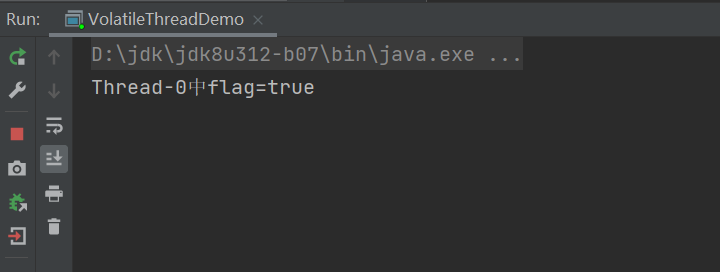
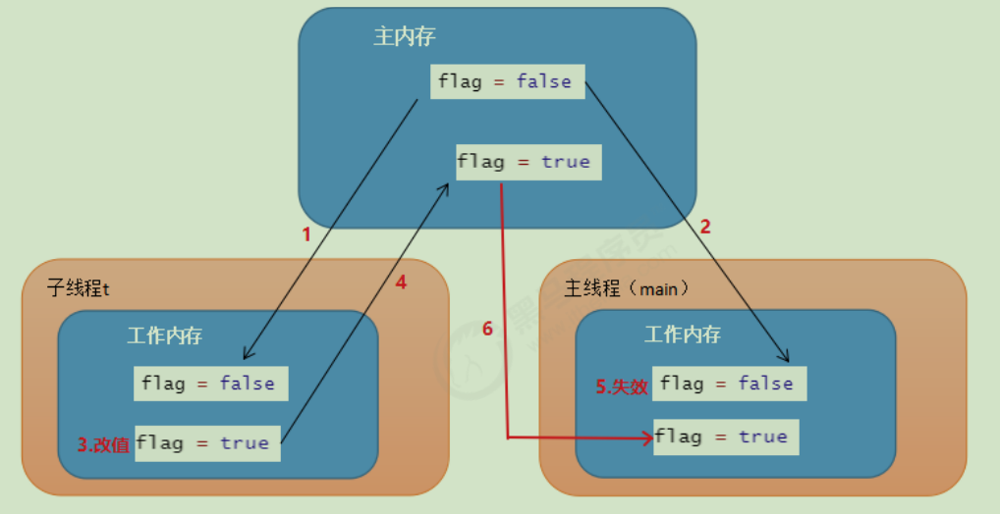

## 多线程下共享变量的不可见性

### 概括

在多线程并发执行下，多个线程修改共享的成员变量，会出现一个线程修改了共享变量的值后，另一个线程不能直接看到该线程修改后的变量的最新值。

### 案例演示

```java
public class MyThread extends Thread {

    // 定义成员变量
    private boolean flag = false;

    @Override
    public void run() {
        try {
            Thread.sleep(2000);
            // 2s后将flag值进行改变
            flag = true;
            System.out.println(Thread.currentThread().getName()+"中flag="+flag);
        } catch (InterruptedException e) {
            e.printStackTrace();
        }
    }

    public boolean getFlag(){
        return flag;
    }
}

// 测试类
public class VolatileThreadDemo {

    public static void main(String[] args)  {
        MyThread myThread = new MyThread();
        myThread.start();
        
        while (true){
            if (myThread.getFlag()){
                System.out.println(Thread.currentThread().getName()+"执行...");
            }
        }
    }
}
```



结果发现。子线程中已经将 flag设置为true，但main()方法中始终没有读到修改后的最新值，从而循环没有能进入到

fi语句中执行，所以没有任何打印。


### 小结

多线程下修改共享变量会出现变量修改值后的不可见性。


## 变量不可见性

### Java内存模型关于共享变量的存储

Java内存模型有以下规定：

- 所有的共享变量都存储在主内存。这里所说的变量指的是实例变量和类变量。不包含局部变量，因为局部变量是线程私有的，因此不存在竞争问题。
- 每一个线程还存在自己的工作内存，线程的工作内存，保留了被线程使用的变量的工作副本。
- 线程对变量的所有的操作 (读，取)都必须在工作内存中完成，而不能直接读写主内存中的变量。
- 不同线程之间也不能直接访问对方工作内存中的变量，线程间变量的值的传递需要通过主内存中转来完成。


**本地内存和主内存的关系**


**问题分析**


1. 子线程t从主内存中读取数据放入到工作内存中flag = false；
2. 在子线程t的工作内存中，将flag的值修改为true，此时，还没有将flag的值回写到主内存；（此时main方法读取到的值是false）
3. 当子线程t将flag的值写回去。但是main函数里面的while(true)调用的是系统比较底层的代码，速度快，快到没有时间再去读取主存中的值；


所以while(true)读取到的值一直是false。(如果有一个时刻main线程从主内存中读取到了主内存中flag的最新

值，那么if语句就可以执行，main线程何时从主内存中读取最新的值，我们无法控制)


### 小结

可见性问题产生的原因：所有共享变量存在于主内存中，每个线程由自己的工作内存，而且线程读写共享数据也是通过工作内存交换的，所以才导致了可见性问题。


## 使用volatile关键字解决变量不可见性

### 使用volatile关键字修饰共享变量

private volatile boolean flag = false;


修改后测试代码：

```java
public class MyThread extends Thread {

    private volatile boolean flag = false;

    @Override
    public void run() {
        try {
            Thread.sleep(2000);
            flag = true;
            System.out.println(Thread.currentThread().getName()+"中flag="+flag);
        } catch (InterruptedException e) {
            e.printStackTrace();
        }
    }

    public boolean getFlag(){
        return flag;
    }
}

public class VolatileThreadDemo {
    public static void main(String[] args)  {
        MyThread myThread = new MyThread();
        myThread.start();

        while (true){
            if (myThread.getFlag()){
                System.out.println(Thread.currentThread().getName()+"执行...");
            }
        }
    }
}
```


测试效果：


**工作原理**



1. 子线程t从主内存中读取到数据放入到其对应的工作内存中，flag的值为false；
2. main线程从主内存中读取的数据放入其对应的工作内容中，flag的值为false；
3. 子线程t中将flag的值修改为true,但是这个时候flag的值还没有写回主内存；
4. 子线程t中的flag值回写到主内存中；
5. **失效其他线程对flag变量副本，比如main线程中flag值；**
6. **main线程再次读取flag变量时需要从主内存中读取最新的值，放入到工作内存中；**

### 小结

volatile保证不同线程对共享变量操作的可见性，也就是说一个线程修改了volatile修饰的变量，当修改

写回主内存时，另外一个线程立即看到最新的值。


## volatile不具有原子性，不具备同步性

volatile关键字虽然增加了共享变量的可见性，但不具备同步性，不具有原子性。

所谓的原子性是指在一次操作或者多次操作中，要么所有的操作全部都得到了执行并且不会受到任何因素的干扰而中断，要么所有的操作都不执行。volatile不保证原子性。

代码测试：

```java
public class VolatileAtomicThread implements Runnable {

    private volatile int count = 0;

    @Override
    public void run() {
        for (int i=0;i<100;i++){
            count++;
            System.out.println("count="+count);
        }
    }
}
public class VolatileAtomicThreadDemo {

    public static void main(String[] args) {

        // // 创建VolatileAtomicThread对象
        VolatileAtomicThread thread = new VolatileAtomicThread();

        // 创建100个线程执行count++
        for (int i=0;i<100;i++){
            new Thread(thread).start();
        }

    }
}
```

执行结果：不保证一定是10000


以上问题主要是发生在count++操作上：

count++操作包含3个步骤：

1. 从主内存中读取数据到工作内存
2. 对工作内存中的数据进行 ++操作
3. 将工作内存中的数据写回到主内存


count++操作不是一个原子性操作，也就是说在某一个时刻对某一个操作的执行，有可能被其他的线程打断。


1. 假设此时x的值是100，线程A需要对改变量进行自增1的操作，首先它需要从主内存中读取变量x的值。由于CPU的切换关系，此时CPU的执行权被切换到了B线程。A线程就处于就绪状态，B线程处于运行状态；
2. 线程B也需要从主内存中读取x变量的值,由于线程A没有对x值做任何修改因此此时B读取到的数据还是100；
3. 线程B工作内存中x执行了+1操作，但是未刷新之主内存中；
4. 此时CPU的执行权切换到了A线程上，由于此时线程B没有将工作内存中的数据刷新到主内存，因此A线程工作内存中的变量值还是100，没有失效。A线程对工作内存中的数据进行了+1操作
5. 线程B将101写入到主内存；
6. 线程A将101写入到主内存；

虽然计算了2次，但是只对A进行了1次修改。

在多线程环境下，volatile关键字可以保证共享数据的可见性，但是并不能保证对数据操作的原子性（在多线程环境下volatile修饰的变量也是线程不安全的）。

在多线程环境下，要保证数据的安全性，我们还需要使用锁机制。

我们可以给count++操作添加锁，那么count++操作就是临界区的代码，临界区只能有一个线程去执行，所以

count++就变成了原子操作。

```java
public class VolatileAtomicThread implements Runnable {

    private volatile int count = 0;

    @Override
    public void run() {
        for (int i=0;i<100;i++){
            synchronized (this) {
                count++;
                System.out.println("count=" + count);
            }
        }
    }
}
```


**原子类**

概述：java从JDK1.5开始提供了java.util.concurrent.atomic包(简称Atomic包)，这个包中的原子操作类提供了一种用法简单，性能高效，线程安全地更新一个变量的方式。

**AtomicInteger**

原子型Integer，可以实现原子更新操作

```java
public AtomicInteger()：  初始化一个默认值为0的原子型Integer
public AtomicInteger(int initialValue)： 初始化一个指定值的原子型Integer
int get():  获取值
int getAndIncrement():   以原子方式将当前值加1，注意，这里返回的是自增前的值。
int incrementAndGet():   以原子方式将当前值加1，注意，这里返回的是自增后的值。
int addAndGet(int data): 以原子方式将输入的数值与实例中的值（AtomicInteger里的
value）相加，并返回结果。
int getAndSet(int value):  以原子方式设置为newValue的值，并返回旧值。
```

演示基本使用:

```java
public class VolatileAtomicThread implements Runnable {

    private volatile int count = 0;

    @Override
    public void run() {
        for (int i=0;i<100;i++){
            synchronized (this) {
                count++;
                System.out.println("count=" + count);
            }
        }
    }
}
```