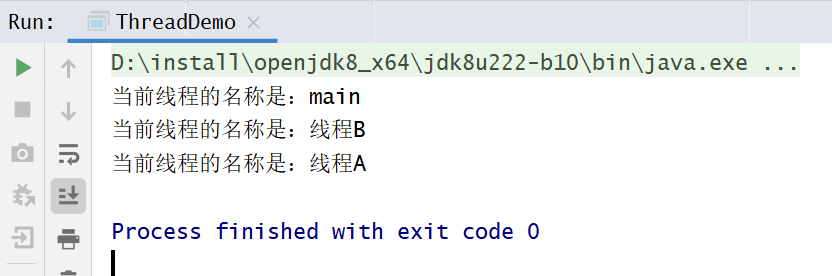
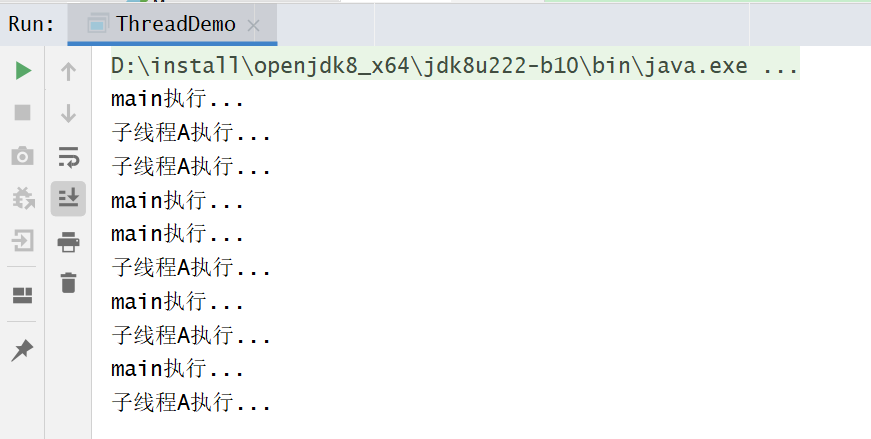

## 线程的命名与获取


多线程的运行状态是不确定的，那么在程序开发之中为了可以获取到一些需要使用的线程就只能依靠线程的名字来进行操作。

### 线程命名

所以线程的名字是一个至关重要的概念，这样在 Thread 类之中就提供有线程名称的处理：

```java
//构造方法
public Thread(Runnable target,String name);
//设置名字
public final void setName(String name);
//取得名字
public final String getName()；
```

对于线程对象的获得是不可能只靠一个 this 来完成的，因为线程的状态不可控，但是有一点是明确的，所有的线程对象都一定要执行 run() 方法，那么这个时候可以考虑获取当前线程，在 Thread 类里面提供有获取当前线程的一个方法。

```java
// 获取当前线程
public static Thread current Thread():
```

范例测试：观察线程的命名操作

```java
class MyThread implements Runnable{
    @Override
    public void run() {
        // 获取当前线程对象
        Thread thread = Thread.currentThread();

        // 获取线程名称
        String threadName = thread.getName();
        System.out.println("当前线程的名称是："+ threadName);
    }
}


public class ThreadDemo {

    public static void main(String[] args) {

        // 构造函数命名线程名称
        Thread threadA = new Thread(new MyThread(), "线程A");
        threadA.start();

        Thread threadB = new Thread(new MyThread());
        threadB.setName("线程B");
        threadB.start();

        System.out.println("当前线程的名称是："+Thread.currentThread().getName());
    }
}
```

执行效果：



主方法也是一个线程，线程名称是：main


### 默认线程名称

当开发者为线程设置名字的时候，而如果没有设置名字，则会自动生成一个不重复的名字，这种自动的属性命名主要是依靠了 static 属性完成的，在 Thread 类里面定义了如下操作：

```java
private static int threadInitNumber;

private static synchronized int nextThreadNum(){
    Return threadInitNumber++;
}

public Thread(Runnable target) {
    init(null, target, "Thread-" + nextThreadNum(), 0);
}
```

测试：

```java
class MyThread implements Runnable{
    @Override
    public void run() {
        // 获取当前线程对象
        Thread thread = Thread.currentThread();

        // 获取线程名称
        String threadName = thread.getName();
        System.out.println("当前线程的名称是："+ threadName);
    }
}


public class ThreadDemo {

    public static void main(String[] args) {

        // 循环创建10个线程，观察其名称
        for (int i = 0; i < 10; i++) {
            new Thread(new MyThread()).start();
        }
    }
}
```


## 线程的休眠


如果现在希望某一个线程可以暂缓执行，那么可以使用休眠的处理。在 Thread 类之中定义的休眠的方法如下：

```java
// 休眠毫秒
public static void sleep(long millis)throws InterruptedException;

// 休眠毫秒+纳秒
public static void sleep(long mills,int nanos）throwsInterruptedException;
```

在进行休眠的时候有可能会产生中断异常 “InterruptedException”, 中断异常属于 Exception 的子类，所以证明该异常必须进行休眠处理。


范例：观察休眠处理

```java
public class ThreadDemo{

public static void main(String[]args)throws Exception{

    new thread(()->{
        for(int x=0;x<10;x++){
            // 休眠1s
            Thread.sleep(1000);
            System.out.println(Thread.currentThread.currentThread());
        }
    },"线程对象A").start();
}
```

暂缓执行之后执行慢了，休眠时间一到程序马上回复继续执行。


休眠的主要特点是可以自动实现线程的唤醒，以继续进行后续的处理。但是需要注意的是，如果现在你有多个线程对象，那么休眠也是有先后顺序的。


## 线程的中断

在之前发现线程的休眠里面提供有一个中断异常，实际上就证明线程的休眠是可以被打断的，而这种打断肯定是由其他线程完成的，在 Thread 类里面提供有这种中断执行的处理方法：

```java
// 判断线程是否被中断
public boolean isInterrupted();

//中断线程执行
public void interrupt();
```

范例：观察线程中断操作


```java
package com.hanliukui.example;


class MyThread implements Runnable {
    @Override
    public void run() {
        try {
            for (int i = 0; i < 100; i++) {
                Thread.sleep(1000);
                System.out.println(Thread.currentThread().getName()+"线程执行中...");
            }
        } catch (InterruptedException e) {
            e.printStackTrace();
        }
    }
}


public class ThreadDemo {

    public static void main(String[] args) {
        Thread thread = new Thread(new MyThread(),"a");
        // 开启线程a
        thread.start();

        // 执行3s后中断线程a
        try {
            Thread.sleep(3000);
        } catch (InterruptedException e) {
            e.printStackTrace();
        }

        if (!thread.isInterrupted()){
            System.out.println("线程a不是中断状态...");
            thread.interrupt();
            System.out.println(thread.isInterrupted());
        }

    }
}
```


所有正在执行的线程都是可以被中断的中断线程必须进行异常的处理。


## 线程强制执行

所谓的线程的强制执行指的是当满足于某些条件之后，某一个线程对象可以一直独占资源一直到该线程的程序执行结束。


范例：观察一个没有强制执行的程序

```java
package com.hanliukui.example;


class MyThread implements Runnable {
    @Override
    public void run() {
        try {
            for (int i = 0; i < 5; i++) {
                Thread.sleep(1000);
                System.out.println(Thread.currentThread().getName()+"执行...");
            }
        } catch (InterruptedException e) {
            e.printStackTrace();
        }
    }
}


public class ThreadDemo {

    public static void main(String[] args) {
        new Thread(new MyThread(),"子线程A").start();
        try {
            for (int i = 0; i < 5; i++) {
                Thread.sleep(1000);
                System.out.println(Thread.currentThread().getName()+"执行...");
            }
        } catch (InterruptedException e) {
            e.printStackTrace();
        }
    }
}
```



这个时候的主线程和子线程都在基本交替执行着，但是如果说现在你希望主线程独占执行。


那么就可以利用 Thread 类中的方法

```java
// 强制执行，直至线程执行结束
public final void join() throws InterruptedException;

// 强制线程执行时长
public final synchronized void join(long millis)
    throws InterruptedException;

// 强制线程执行时长
public final synchronized void join(long millis, int nanos)
    throws InterruptedException;
package com.hanliukui.example;


class MyThread implements Runnable {
    @Override
    public void run() {
        try {
            for (int i = 0; i < 5; i++) {
                Thread.sleep(1000);
                System.out.println(Thread.currentThread().getName()+"执行...");
            }
        } catch (InterruptedException e) {
            e.printStackTrace();
        }
    }
}


public class ThreadDemo {

    public static void main(String[] args) {
        Thread threadA = new Thread(new MyThread(), "子线程A");
        threadA.start();

        try {
            for (int i = 0; i < 5; i++) {
                if (i==1){
                    // 让子线程A强制执行
                    threadA.join();
                }
                Thread.sleep(1000);
                System.out.println(Thread.currentThread().getName()+"执行...");
            }
        } catch (InterruptedException e) {
            e.printStackTrace();
        }
    }
}
```


在进行线程强制执行的时候一定要获取强制执行对象之后才可以执行 jion()调用。


## 线程的礼让


在多线程里面有各种各样的方法，其中有一个礼让的方法很有意思，现实生活中所谓的礼让，就是“委屈自己方便他人”。线程的礼让指的是将资源让出去让别的线程先执行。


线程的礼让可以使用 Thread 中提供的方法：

```java
// 礼让
public static void yield()
```

特点：

- 礼让线程，让当前正在执行的线程暂停，但不阻塞。
- 将线程从运行状态转为就绪状态
- 通过Thread.yield()函数实现；
- 每一次调用 yield() 方法都只会礼让一次当前的资源；
- 礼让不一定成功，要看CPU的调度，不如A礼让B，A可能会再次抢到CPU的资源


范例：使用礼让操作

```java
package com.hanliukui.example;

class MyThread implements Runnable {

    @Override
    public void run() {
        for (int i = 0; i < 50; i++) {

            try {
                if (i % 3==0) {
                    Thread.yield();
                    System.out.println("线程A礼让..."+i);
                }
                Thread.sleep(1000);
                System.out.println("执行的是" + Thread.currentThread().getName()+i);
            } catch (InterruptedException e) {
                e.printStackTrace();
            }
        }

    }

}

public class ThreadDemo {

    public static void main(String[] args) {
        MyThread demo = new MyThread();
        Thread threadA = new Thread(demo, "线程A");
        threadA.start();

        try {
            for (int i = 0; i < 100; i++) {
                System.out.println("执行的是" + Thread.currentThread().getName());
                Thread.sleep(1000);
            }
        } catch (InterruptedException e) {
            e.printStackTrace();
        }

    }
}
```


## 线程的优先级

### 什么是线程的优先级

在操作系统中，线程可以划分优先级，线程优先级越高，获得 CPU 时间片的概率就越大，但线程优先级的高低与线程的执行顺序并没有必然联系，优先级低的线程也有可能比优先级高的线程先执行。


### 设置线程的优先级

在Thread类里面针对于优先级的操作提供有如下的两个处理方法：

```java
//设置优先级
public finial void setPriority(int newPriority);

//获取优先级
public final int getPriority（）
```

线程的优先级分为 1-10 共10个等级，所有线程默认优先级为 5，如果优先级小于 1 或大于 10，则会抛出 java.lang.IllegalArgumentException 异常。


Java 提供了 3 个常量值可以用来定义优先级，源码如下：

```java
public final static int MIN_PRIORITY = 1;
public final static int NORM_PRIORITY = 5;
public final static int MAX_PRIORITY = 10;
```

### 线程优先级的继承特性

在 Java 中，线程的优先级具有继承性，如果线程 A 启动了线程 B，则线程 B 的优先级与线程 A 的优先级是一样的。

我们可以来举例说明，代码如下：

```java
public class ThreadDemo {
    public static void main(String[] args) {
        System.out.println("线程 main 的优先级（改变前）：" + Thread.currentThread().getPriority());
//        Thread.currentThread().setPriority(9);
//        System.out.println("线程 main 的优先级（改变后）：" + Thread.currentThread().getPriority());
        Thread thread = new Thread("A") {
            @Override
            public void run() {
                System.out.println("线程 A 的优先级：" + this.getPriority());
            }
        };
        thread.start();
    }
}
```

控制台输出：

```java
线程 main 的优先级（改变前）：5
线程 A 的优先级：5
```

我们把注释去掉，再次运行代码，控制台输出如下：

```java
线程 main 的优先级（改变前）：5
线程 main 的优先级（改变后）：9
线程 A 的优先级：9
```