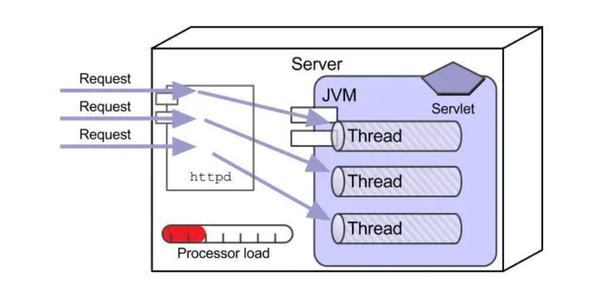
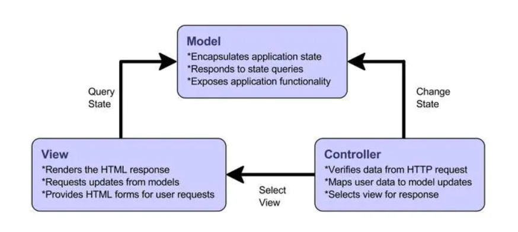
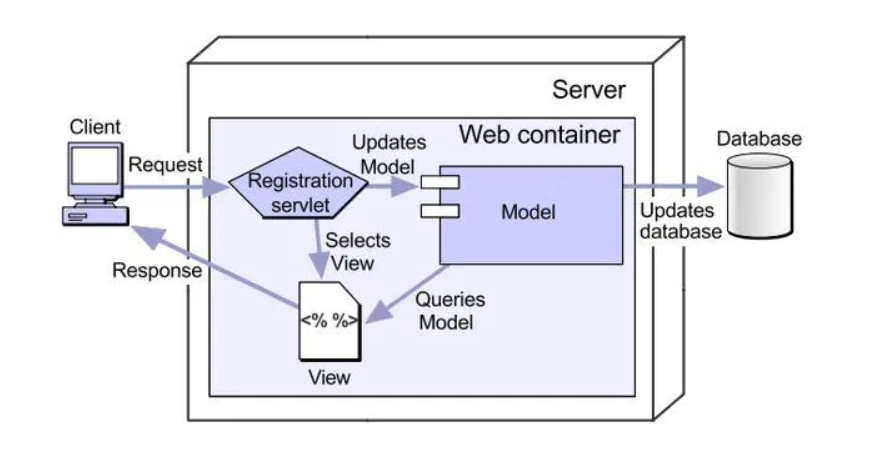

# Java Web 开发的历史

Java 语言能长期霸占语言排行榜一个重要的原因就是强大的 web 开发能力，web 开发是 java 的基石（在 EJB 推出的时候当时的 Sun 用基石来描述 EJB），所以了解 java web 开发原理是非常重要的。

## web site

web 开发的历史其实并不久远，要搞清楚 java web 开发的特点（主要是优点），首先要了解 web 开发的历史（简单的回归一下）。早期的 web 是非常简单的结构，用户发出请求（request），服务器给出回应（response），这个时期的 web 应用，我们称为 web site（网站），特点是一些列静态内容的集合。看一个图示：

图中的服务器保持了一系列 html 脚本来响应用户的请求，可以说这个时期的 web 应用还是比较简单的，但是却确立了两个重要的对象：一个 request（代表请求），另一个是 response（代表回应）。如果把 web 开发的历史比喻成一部美国大片的话，那么 request 和 response 绝对是这部大片的那女主角，而且每一部都是不可或缺的主角（简单的说就是死不了）。

## applet

在 web 发展过程中，有一个小插曲，就是在 web site 向 web application 发展的过程中，出现了一个小 “玩意儿”，就是 applet，很多人了解 java 都是从使用 java applet 开始的（70，80 后那一批程序员）。当时风靡校园（我当时在读大一）的网易聊天室，哎呀那个火啊（大家回忆一下你在学校机房上网时的兴奋），这个聊天室就是采用了 applet 构建的，当时 applet 给静态页面一个动态交互的可能，着实火了一段时间。

## Java Web开发技术体系

过了这个插曲，真正的三层 web 开发来了，一个里程碑式的 web 处理方式 CGI，看一张图：

CGI 的推出，使得 web 开发正式进入了动态处理时代，服务器能与客户有真正意义上的交流了，有能存储数据的数据库了，虽然 CGI 的使用周期并不长，但是一定要纪念一下它，毕竟它是里程碑式的变革。java web 技术正是踩着 CGI 的肩膀来到了广大程序员的面前，java web 解决了 CGI 的性能问题。CGI 是以进程为单位管理请求的，而 java web 则是以线程为单位，处理能力更强，占用的资源更少，这个核心的组件就是 Servlet。看一组资源占用图，先看 CGI 的：

再看一下 java web 中的 servlet 资源图：

孰优孰劣一目了然，Servlet 解决相同数量的请求，却占用较少的系统资源，这就是为什么广大程序员抛弃了 CGI 转向 java web 的原因。

另外，开发一个 Servlet 并不复杂，看一个 Servlet 编写的 HelloWorld 应用：

这个代码结构是不是很亲切，是不是很有 Coding 的感觉，其实 Servlet 就是个 java 类而已，只不过增加了几个限制而已，所以开发一个 Servlet 并不复杂。然后就是把它部署到 web 服务器上（Tomcat 这个老人家现在身体依然硬朗！），然后就等待客户的请求就可以了。这是 Servlet 的三层部署图：

java web 开发的技术体系还包括 javabean 和 jsp，采用 MVC 结构来组合这三个技术是 java web 开发的基础内容，先看一下 MVC 的功能图：

再看一下组合使用 Servlet+javaBean+JSP 的 Model2 开发结构：

这个结构是标准的 Java web 开发结构，现在是不是很少能看到这么 “干净” 的描述图了？以上就是标准的 java web 开发的历史描述，当然这并不是说这些内容已经过时了，反而它一直是官方的标准解决方案。只不过 web 发展迎来了另一个阶段，繁荣的开源架构时代来了

## 开源框架时代

这个时代的典型代表就是 Struts、Spring 和 Hibernate，简称 SSH。

严格的说，这部分内容并不是官方解决方案，但是这些方案却得到了广大程序员的拥护，一方面原因是 EJB 的方案太重了，另一方面开源架构使用起来非常方便和灵活，所以从 03 年以后这些开源框架得到了普通的使用。

简单描述一下这三个框架：

- Struts 基于 MVC 结构的解决方案，分为 struts1（已经淘汰了，用过 Struts1 的程序员已经老了）和 struts2 两个版本，和 Python 一样，这两个版本不兼容，目前 Struts2 的最新版本是 2.5.14.1，简单的说 Struts 就是构建了现成的 MVC 框架，程序员往这个框架里加代码就可以了，使用起来非常方便。

- Hibernate 框架完成了面向对象与面向关系的映射，让 java 程序以面向对象的方式操作面向关系的数据库。整体结构基于 DAO 进行扩展，很多操作只需要配置一下就可以了，极其方便。

- Spring 提供了 javaBean 的容器，池化了 javabean，提高了性能，而且核心代码不到 2M，小巧且强大。