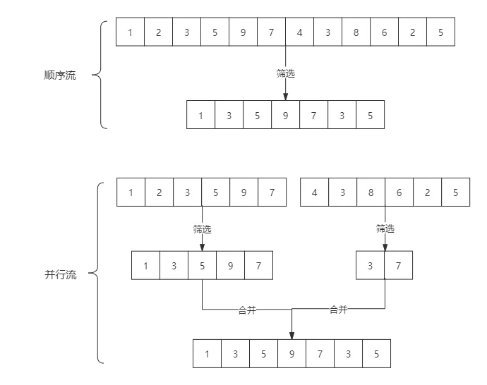

# Stream

Stream 将要处理的元素集合看作一种流，在流的过程中，借助 Stream API 对流中的元素进行操作，比如：筛选、排序、聚合等。

## Stream 的分类

Stream 可以由数组或集合创建，对流的操作分为两种：

- 中间操作，每次返回一个新的流，可以有多个。
- 终端操作，每个流只能进行一次终端操作，终端操作结束后流无法再次使用。终端操作会产生一个新的集合或值。

中间操作又可以分为：

无状态（Stateless）操作，元素的处理不受之前元素的影响。
有状态（Stateful）操作，指该操作只有拿到所有元素之后才能继续下去。

比如 map 或者 filter 会从输入流中获取每一个元素，并且在输出流中得到一个结果，这些操作没有内部状态，称为无状态操作。

但是像 reduce、sum、max 这些操作都需要内部状态来累计计算结果，所以称为有状态操作。

这里需要单独解释一下：
有一些操作 sort、distinct、limit、skip 看上去和 filter、map 差不多，他们接收一个流，再生成一个流，但是区别在于排序和去重复项需要知道先前的历史。比如排序就需要将所有元素放入缓存区后才能给输出流加入一个项目，这个操作对缓存的要求是无上限的，流有多大就需要多大的缓存才能进行运算。这些操作也是有状态操作。

终结操作又可以分为：

短路（Short-circuiting）操作，指遇到某些符合条件的元素就可以得到最终结果
非短路（Unshort-circuiting）操作，指必须处理完所有元素才能得到最终结果。

- Stream 操作分类

  - 中间操作

    - 无状态

      - unordered、filter、map、mapToInt、mapToLong、mapToDouble、flatMap、flatMapToInt、flatMapToLong、flatMapToDouble、peek

    - 有状态

      - distinct、sorted、limit、skip

  - 终端操作

    - 短路

      - anyMtach、allMatch、nonoMatch、findFirst、findAny

    - 非短路

      - forEach、forEachOrdered、toArray、iterator、reduce、collect、max、min、count

## Stream 的使用

1. 创建 Stream

2. Stream 中间操作

3. 终止 Stream


## 创建 Stream

主要负责新建一个 Stream 流，或者基于现有的数组、List、Set、Map 等集合类型对象创建出新的 Stream 流。

### 由数组创建流，Arrays.stream(T[] array)

```java
Integer[] nums = new Integer[10];
Stream<Integer> stream = Arrays.stream(nums);
```

### 由集合创建流，通过 java.util.Collection 下的 stream() 方法和 parallelStream() 用集合创建流

```java
List<String> list = new ArrayList<>();
Stream<String> stream = list.stream(); //获取一个顺序流
Stream<String> parallelStream = list.parallelStream(); //获取一个并行流

```

### 使用 Stream 的静态方法：of()、iterate()、generate()

```java
Stream<Integer> stream = Stream.of(1,2,3,4,5,6);

Stream<Integer> stream2 = Stream.iterate(0, (x) -> x + 2).limit(6);
stream2.forEach(System.out::println); // 0 2 4 6 8 10

Stream<Double> stream3 = Stream.generate(Math::random).limit(2);
stream3.forEach(System.out::println);

```

### stream 和 parallelStream 的区分

stream 和 parallelStream 的简单区分：

stream 是顺序流，由主线程按顺序对流执行操作，而 parallelStream 是并行流，内部以多线程并行执行的方式对流进行操作，但前提是流中的数据处理没有顺序要求。
例如筛选集合中的奇数，两者的处理不同之处：


如果流中的数据量足够大，并行流可以加快处速度。
除了直接创建并行流，还可以通过 parallel()把顺序流转换成并行流：

```java
Optional<Integer> findFirst = list.stream()
    .parallel()
    .filter(x->x>6)
    .findFirst();
```

## Stream 中间操作

### 筛选 filter

### 映射 map、mapToInt、mapToLong、mapToDouble、flatMap、flatMapToInt、flatMapToLong、flatMapToDouble

### 归约 reduce

### 排序 sorted

### concat


### distinct 去重

### skip 跳过

### limit 限制


## 终止 Stream

### 遍历 forEach、forEachOrdered、

### 匹配查找 anyMtach、allMatch、nonoMatch、findFirst、findAny

### 聚合 max、min、count

### 收集 collect

- toList
- toSet
- toMap
- count/averaging
  ● 计数：count
  ● 平均值：averagingInt、averagingLong、averagingDouble
  ● 最值：maxBy、minBy
  ● 求和：summingInt、summingLong、summingDouble
  ● 统计以上所有：summarizingInt、summarizingLong、summarizingDouble
- partitioningBy/groupingBy
- reducing