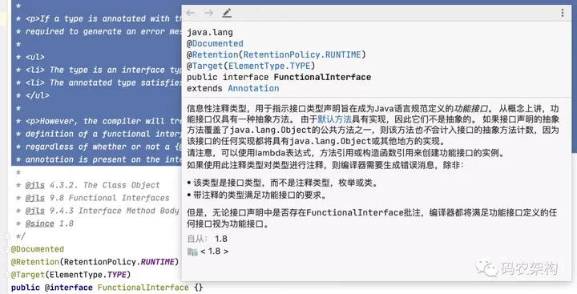
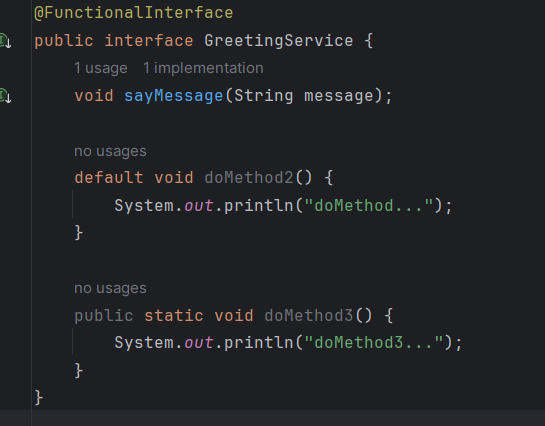

## 函数式接口



**函数式接口(Functional Interface)** 就是一个有且仅有一个抽象方法，但是可以有多个非抽象方法的接口。

概括：

- 首先是一个接口
- 只能有一个抽象接口

这种类型的接口也称为SAM接口，即Single Abstract Method interfaces。

它们主要用在Lambda表达式和方法引用（实际上也可认为是Lambda表达式）上，如定义了一个函数式接口如下：

```java
@FunctionalInterface
interface GreetingService 
{
    void sayMessage(String message);
}
```

那么就可以使用Lambda表达式来表示该接口的一个实现(注：JAVA 8 之前一般是用匿名类实现的)：

```java
GreetingService greetService1 = message -> System.out.println("Hello " + message);
```

```java
// 匿名类实现
GreetingService greetingService = new GreetingService() {

    @Override
    public void sayMessage(String message) {
        System.out.println("Hello " + message);
    }
};
```

**错误例子**，接口中包含了两个抽象方法，违反了函数式接口的定义，idea报错提示其不是函数式接口:


> *提醒：加不加@FunctionalInterface对于接口是不是函数式接口没有影响，该注解知识提醒编译器去检查该接口是否仅包含一个抽象方法*


**函数式接口里允许定义默认方法**

函数式接口里是可以包含默认方法，因为默认方法不是抽象方法，其有一个默认实现，所以是符合函数式接口的定义的；


**函数式接口里允许定义静态方法**

函数式接口里是可以包含静态方法，因为静态方法不能是抽象方法，是一个已经实现了的方法，所以是符合函数式接口的定义的；



**函数式接口里允许定义 `java.lang.Object` 里的 `public` 方法**

函数式接口里是可以包含Object里的public方法，这些方法对于函数式接口来说，不被当成是抽象方法（虽然它们是抽象方法）；因为任何一个函数式接口的实现，默认都继承了Object类，包含了来自 `java.lang.Object` 里对这些抽象方法的实现；


[怎样正确使用函数式接口@FunctionalInterface，让你的代码更优雅！ - 知乎 (zhihu.com)](https://zhuanlan.zhihu.com/p/369014583)


## java.util.function

Jdk8之后新增的一个重要的包 : `java.util.function`

该包下所有的接口都是函数式接口, 按分类主要分为四大接口类型: `Function`、`Consumer`、`Predicate`、`Supplier`。


[java代码之美（15）---Java8 Function、Consumer、Supplier - 雨点的名字 - 博客园 (cnblogs.com)](https://www.cnblogs.com/qdhxhz/p/12050701.html)

[【JAVA8】快速理解Consumer、Supplier、Predicate与Function_java consumer-CSDN博客](https://blog.csdn.net/qq_33591903/article/details/102948344)

[Java 8 函数式接口 | 菜鸟教程 (runoob.com)](https://www.runoob.com/java/java8-functional-interfaces.html)

[怎样正确使用函数式接口@FunctionalInterface，让你的代码更优雅！ - 知乎 (zhihu.com)](https://zhuanlan.zhihu.com/p/369014583)

